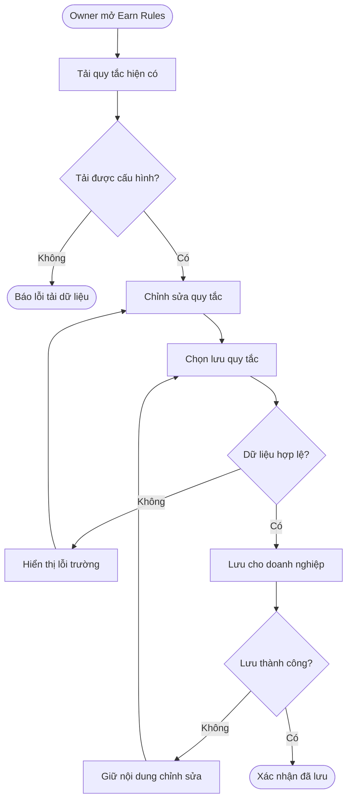
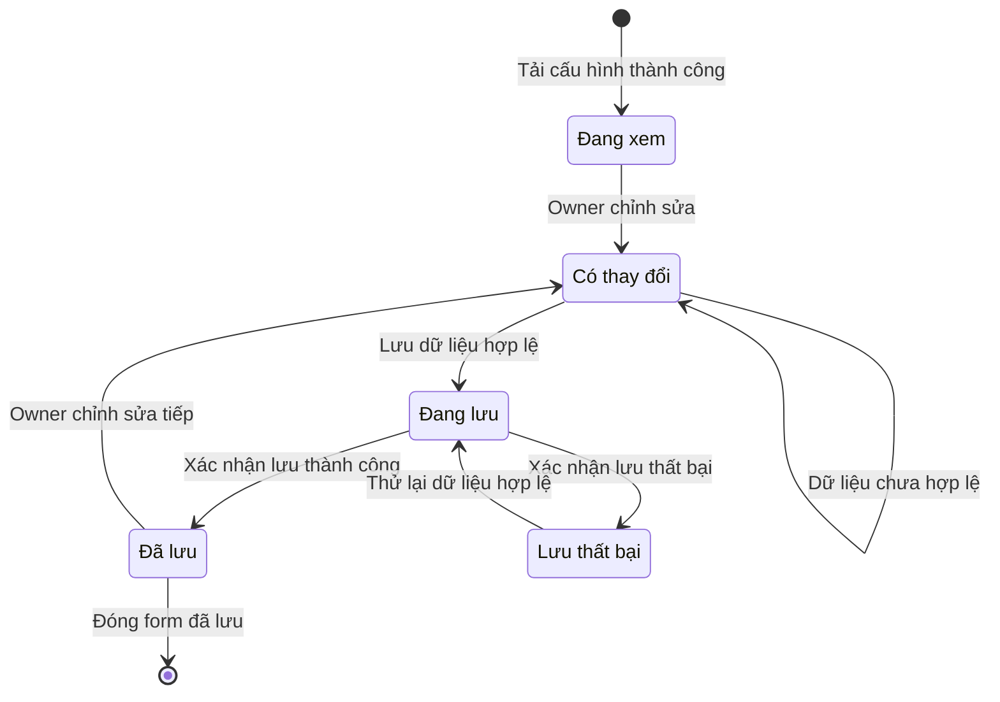

## Earn Rules — Cấu hình quy tắc tích điểm

**Cập nhật lần cuối:** 24 tháng 9 năm 2026

**Đối tượng đọc:** Chủ doanh nghiệp (Business Owner), quản lý, người phụ trách sản phẩm, BA, QA, bộ phận hỗ trợ

**Trạng thái:** Đang rà soát

### Tổng quan

Earn Rules giúp doanh nghiệp xác định cách khách tích điểm Loyalty bằng một bộ quy tắc chung cho chi tiêu và sự kiện thưởng. Form tại **Loyalty & Rewards → Earn Rules** cho phép xem, chỉnh sửa và lưu tỷ lệ tích điểm, khoản chi đủ điều kiện, điểm thưởng, thời điểm điểm khả dụng và chính sách hết hạn. Business Owner cấu hình quy tắc; Manager được nhắc tới trong yêu cầu cấp quyền điều chỉnh điểm thủ công, là nghiệp vụ ngoài phạm vi form này.

**Phạm vi:** chỉ xem, chỉnh sửa và lưu cấu hình. Cộng điểm, hoàn tiền, hết hạn điểm, gửi nhắc hạn và điều chỉnh điểm thực tế thuộc nghiệp vụ tích hợp riêng. Tài liệu mô tả yêu cầu, chưa xác nhận chức năng lưu đã được triển khai.

### Khái niệm chính

| Thuật ngữ | Ý nghĩa |
| :--- | :--- |
| Earn Rules | Bộ quy tắc cấu hình cách tích điểm của doanh nghiệp. |
| Base earning | Tỷ lệ giữa số tiền đủ điều kiện và số điểm được tính. |
| Eligible amounts | Các loại khoản chi được lựa chọn để tính điểm. |
| Bonus events | Sự kiện được cấu hình số điểm thưởng riêng. |
| Points become available | Thời điểm điểm có thể sử dụng theo lựa chọn cấu hình. |
| Expiration | Chính sách hết hạn điểm theo thời gian không hoạt động hoặc không hết hạn. |
| Reminder | Khoảng thời gian nhắc khách trước khi điểm hết hạn. |

### Vai trò người dùng

| Vai trò | Trách nhiệm trong tính năng |
| :--- | :--- |
| Chủ doanh nghiệp (Business Owner) | Xem và lưu quy tắc cho doanh nghiệp đang quản lý. |
| Quản lý (Manager) | Có quyền điều chỉnh điểm thủ công theo ghi chú mẫu; không suy ra quyền sửa Earn Rules. |
| Bộ phận hỗ trợ (Support) | Hỗ trợ tra cứu lỗi lưu hoặc dữ liệu không khớp; không tự đổi chính sách. |

### Luồng nghiệp vụ đầu cuối

#### Luồng: Xem, chỉnh sửa và lưu Earn Rules

**Người thực hiện chính:** Business Owner.  
**Điểm bắt đầu:** Mở tab Earn Rules trong Loyalty & Rewards.  
**Kết quả:** Quy tắc hợp lệ được lưu cho đúng doanh nghiệp và tải lại đúng giá trị đã lưu.

**Nhu cầu người dùng:**

- **Là** Business Owner, **tôi muốn** xem và chỉnh sửa toàn bộ quy tắc trên một form, **để** thiết lập chương trình Loyalty nhất quán.
- **Là** Business Owner, **tôi muốn** thấy lỗi ngay tại trường nhập, **để** sửa dữ liệu trước khi lưu.
- **Là** Business Owner, **tôi muốn** giữ nội dung đang nhập khi lưu thất bại, **để** thử lại mà không nhập lại từ đầu.

| Bước | Người thực hiện | Hành động | Phản hồi hệ thống | Ghi chú |
| :--- | :--- | :--- | :--- | :--- |
| 1 | Owner | Mở Earn Rules. | Tải quy tắc đã lưu của doanh nghiệp hiện tại. | Khi tải lỗi, không trình bày dữ liệu mẫu như cấu hình thật. |
| 2 | Owner | Sửa tỷ lệ, khoản chi, bonus và chính sách thời gian. | Hiển thị các giá trị đang chỉnh sửa. | Danh mục trường ở phần cấu hình. |
| 3 | Owner | Chọn Save rules. | Kiểm tra các trường và báo lỗi nếu không hợp lệ. | Quy tắc kiểm tra số hiện là đề xuất cần chốt. |
| 4 | Hệ thống | Lưu bộ quy tắc hợp lệ. | Ngăn gửi lặp trong lúc lưu. | Không trực tiếp cộng hoặc trừ điểm. |
| 5 | Hệ thống | Nhận kết quả lưu. | Thành công: thông báo đã lưu; thất bại: báo lỗi và giữ nội dung. | Chỉ báo thành công khi có xác nhận lưu. |
| 6 | Owner | Mở lại form. | Hiển thị đúng giá trị đã lưu. | Chưa xác minh kết nối lưu thực tế. |

### Cấu hình và quản trị

- **Là** Business Owner, **tôi muốn** cấu hình khoản chi và sự kiện đủ điều kiện, **để** chương trình tích điểm phù hợp chính sách doanh nghiệp.

| Nhóm | Trường | Nội dung theo tài liệu mẫu đã ghi nhận |
| :--- | :--- | :--- |
| Base earning | Eligible spend / Points earned | Số tiền và điểm tương ứng; mẫu **$1.00 = 1 point**. |
| Eligible amounts | Các khoản được tính điểm | Services, Retail products, Tips and tax, Gift card purchases; mẫu chọn Services và Retail products. |
| Bonus events | Điểm theo sự kiện | Verified review (50), Successful referral (200), First completed visit (100), Birthday bonus (150). |
| Point lifecycle | Points become available | After payment completes hoặc After 24 hours. |
| Point lifecycle | Expiration | 12 months without activity, 6 months without activity hoặc Never. |
| Point lifecycle | Reminder | 30 days before expiration hoặc 14 days before expiration. |

Giữ ghi chú **“Manual adjustments require Manager permission and a reason.”** Các số tiền, số điểm và lựa chọn điền sẵn ở trên là dữ liệu mẫu, chưa phải mặc định nghiệp vụ đã xác nhận.

### Vòng đời trạng thái

Phạm vi này chưa xác lập vòng đời nghiệp vụ của điểm Loyalty. Bảng và sơ đồ dưới đây mô tả trạng thái thao tác lưu cấu hình, không bổ sung quy trình duyệt hay trạng thái điểm mới.

| Trạng thái hiện tại | Sự kiện chuyển trạng thái | Trạng thái mới | Ghi chú |
| :--- | :--- | :--- | :--- |
| Đang xem | Owner sửa trường | Có thay đổi | Chưa thay cấu hình đã lưu. |
| Có thay đổi | Chọn lưu với dữ liệu hợp lệ | Đang lưu | Ngăn gửi lặp. |
| Có thay đổi | Chọn lưu với dữ liệu không hợp lệ | Có thay đổi | Báo lỗi tại trường. |
| Đang lưu | Xác nhận lưu thành công | Đã lưu | Mở lại thấy giá trị đã lưu. |
| Đang lưu | Nhận kết quả thất bại | Lưu thất bại | Giữ nội dung để thử lại. |
| Lưu thất bại | Owner thử lưu lại dữ liệu hợp lệ | Đang lưu | Kiểm tra dữ liệu trước khi gửi lại. |

### Quy tắc nghiệp vụ

- **Rule 1:** Lưu toàn bộ quy tắc cho đúng doanh nghiệp hiện tại; dữ liệu mẫu không thay thế cấu hình đã lưu.
- **Rule 2 — đề xuất:** Eligible spend và Points earned lớn hơn 0; điểm là số nguyên; điểm bonus không âm. Báo lỗi tại trường và chặn lưu khi không hợp lệ.
- **Rule 3:** Chỉ báo đã lưu khi hệ thống xác nhận; lỗi lưu phải giữ nội dung để Owner thử lại.
- **Rule 4:** Không tự suy ra cách cộng dồn bonus, hồi tố điểm cũ, định nghĩa “không hoạt động” hoặc xử lý hoàn tiền từ các trường cấu hình.
- **Rule 5:** Quan hệ giữa Never và Reminder cần được chốt khi tích hợp; không khẳng định hệ thống đang gửi nhắc cho điểm không hết hạn.

> 💡 **Important:** Lưu Earn Rules không phải thao tác điều chỉnh số dư điểm. Điều chỉnh thủ công yêu cầu quyền Manager và lý do theo ghi chú mẫu; luồng thực hiện thuộc phạm vi riêng.

#### Tiêu chí nghiệm thu

1. Tab Earn Rules hiển thị đầy đủ các trường trên và nút Save rules; tải đúng cấu hình đã lưu nếu có.
2. Owner sửa được ô nhập, checkbox và dropdown; thông báo lỗi rõ tại trường theo quy tắc được chốt.
3. Lưu toàn bộ cấu hình đúng doanh nghiệp; ngăn gửi lặp khi đang lưu.
4. Thành công: thông báo và tải lại đúng giá trị; thất bại: báo lỗi, giữ nội dung để thử lại.

### Tình huống ngoại lệ và cách xử lý

| Tình huống | Cách xử lý | Người giải quyết |
| :--- | :--- | :--- |
| Tải cấu hình thất bại | Báo lỗi tải, không coi mẫu là cấu hình thật. | Owner / Support. |
| Giá trị không hợp lệ | Báo tại trường, chưa cho lưu theo quy tắc được chốt. | Owner. |
| Nhấn lưu nhiều lần | Chỉ cho một yêu cầu lưu đang xử lý. | Hệ thống. |
| Lưu thất bại | Giữ nội dung form và cho thử lại. | Owner / Support. |
| Chưa có cấu hình | Cần xác nhận giá trị khởi tạo, không tự dùng con số mẫu. | Product Owner. |
| Chọn Never cùng nhắc hết hạn | Cần xác nhận hành vi Reminder trước triển khai. | Product Owner. |

### Câu hỏi thường gặp

**Các mức 50, 200, 100 và 150 điểm đã được chốt chưa?**  
Chưa. Đây là dữ liệu mẫu được ghi trong tài liệu gốc.

**Nhấn Save rules có cộng điểm ngay cho khách không?**  
Không thuộc phạm vi này. Form chỉ lưu cấu hình; xử lý điểm thực tế là phần tích hợp riêng.

**API lưu đã được xác minh chưa?**  
Chưa. Tài liệu gốc ghi nút Save rules trong mẫu chỉ hiện thông báo; phiên rà soát này chưa xác minh API lưu.

### Tính năng liên quan

Các tính năng dưới đây chưa có tài liệu riêng trong bộ chia sẻ này; bảng mô tả mối liên hệ để người đọc nắm được phạm vi.

| Tính năng | Mối liên hệ với tài liệu này |
| :--- | :--- |
| Loyalty & Rewards — tích và sử dụng điểm | Sử dụng quy tắc đã lưu để xử lý điểm theo nghiệp vụ tương ứng. Tài liệu Earn Rules chỉ mô tả xem, chỉnh sửa và lưu cấu hình. |
| Hoàn giao dịch và điều chỉnh điểm | Cần quy tắc riêng về ảnh hưởng lên điểm đã cộng hoặc đã dùng; không suy ra cách xử lý chỉ từ cấu hình Earn Rules. |
| Hết hạn điểm và nhắc hạn | Liên quan đến cấu hình thời hạn và số ngày nhắc. Việc xác định điểm hết hạn và gửi thông báo thuộc luồng tích hợp riêng. |
| Điều chỉnh điểm thủ công | Yêu cầu quyền Manager và lý do theo thông báo trên giao diện; không nằm trong luồng lưu Earn Rules. |

#### Nguồn và mức độ xác minh

Nguồn ban đầu: phần Earn Rules trong `salon-setup-reward.html` do người dùng cung cấp, theo ghi nhận của bản tài liệu trước. Không tìm thấy file nguồn trong workspace ở lần rà soát này; các trường trên được bảo toàn từ tài liệu gốc, không coi là đã kiểm chứng lại HTML.
