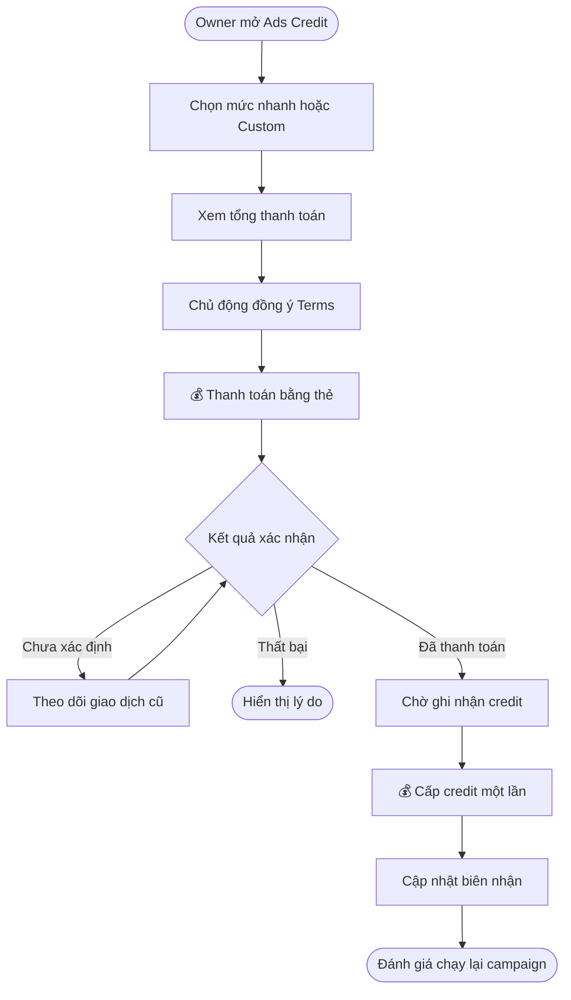
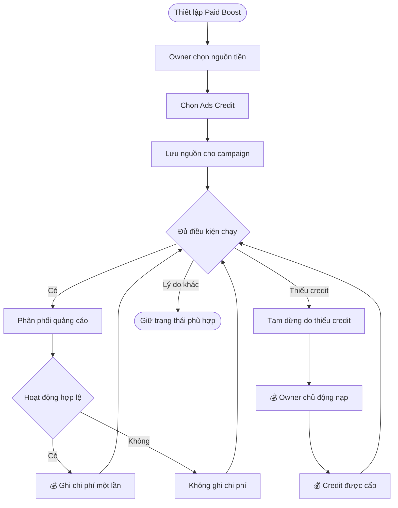
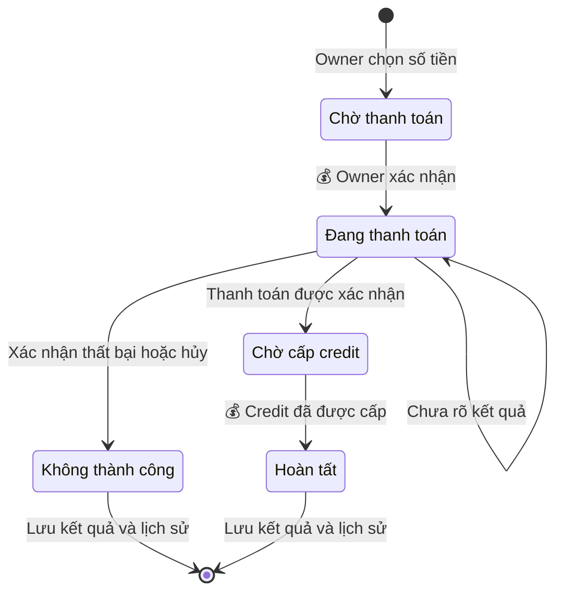
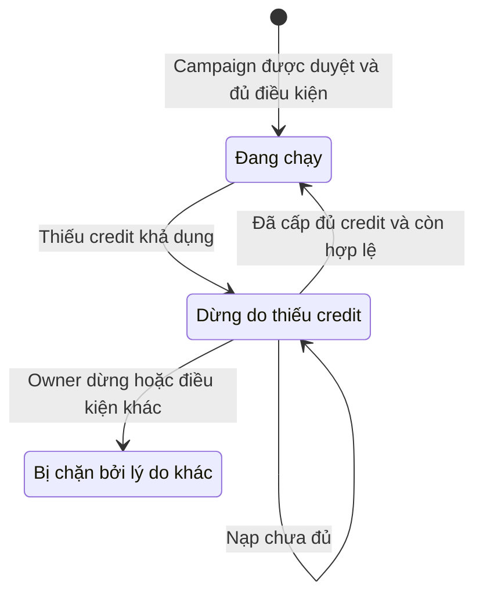

## Ads Credit — Phạm vi triển khai nạp và sử dụng

**Cập nhật lần cuối:** 24 tháng 9 năm 2026

**Đối tượng đọc:** Chủ doanh nghiệp (Merchant Owner), người phụ trách sản phẩm, BA, QA, bộ phận hỗ trợ

**Trạng thái:** Đang rà soát

### Tổng quan

Ads Credit giúp Owner kiểm soát chi phí quảng bá Promotion bằng số dư trả trước dùng cho quảng cáo Nexora. Tại **Quản lý gói → Ads Credit**, Owner nạp bằng thẻ, xem số dư, lịch sử và biên nhận; trong campaign, Owner chọn credit làm nguồn thanh toán. Hệ thống xác nhận thanh toán, cấp credit và ghi chi phí hợp lệ; bộ phận vận hành giải quyết ngoại lệ theo quyền. Đây là bản phạm vi triển khai rút gọn của tài liệu Ads Credit chi tiết, chưa xác nhận tính năng đã triển khai.

**Mức độ chốt:** bản rút gọn kế thừa quyết định và các điểm còn đề xuất trong [tài liệu Ads Credit chi tiết](./merchant-ads-credit.md). Phạm vi số dư theo từng doanh nghiệp, tiền tệ/quy đổi, phí/thuế, mệnh giá nhanh, giới hạn Custom và cơ chế giữ credit cần được thống nhất trước triển khai; việc nhắc lại trong luồng không biến các đề xuất này thành quyết định mới.

### Khái niệm chính

| Thuật ngữ | Ý nghĩa |
| :--- | :--- |
| Ads Credit | Số dư trả trước chỉ dùng cho quảng cáo Nexora, không hết hạn. |
| Promotion | Nội dung ưu đãi dùng để xuất bản hoặc quảng bá. |
| Paid Boost / Campaign | Chiến dịch quảng bá có lịch, ngân sách và mô hình phí được Owner chấp thuận. |
| Số dư khả dụng | Credit có thể dùng cho nghĩa vụ quảng cáo mới; phần giữ nếu có được thể hiện riêng. |
| Nạp tiền / cấp credit | Thanh toán thẻ và ghi tăng số dư là hai kết quả riêng cần được xác nhận. |

### Vai trò người dùng

| Vai trò | Trách nhiệm trong tính năng |
| :--- | :--- |
| Chủ doanh nghiệp (Owner) | Nạp thẻ, đồng ý điều khoản, chọn nguồn thanh toán và theo dõi số dư, chi phí, biên nhận. |
| Nhân viên (Staff) | Không được nạp hoặc chọn nguồn Ads Credit trong phạm vi này. |
| Bộ phận hỗ trợ / tài chính | Giải quyết chậm cấp credit, khiếu nại và điều chỉnh theo quyền. |
| Hệ thống campaign | Kiểm tra điều kiện chạy, ghi chi phí và đánh giá khôi phục sau nạp. |

### Luồng nghiệp vụ đầu cuối

#### Luồng: Nạp Ads Credit bằng thẻ

**Người thực hiện chính:** Merchant Owner.  
**Điểm bắt đầu:** Chọn **Add Ads Credit** trong Quản lý gói.  
**Kết quả:** Thanh toán và cấp credit được xác nhận; số dư và biên nhận cập nhật đúng một lần.

**Nhu cầu người dùng:**

- **Là** Owner, **tôi muốn** biết tổng tiền phải trả và credit nhận được trước khi nạp, **để** xác nhận đúng ngân sách.
- **Là** Owner, **tôi muốn** tra cứu lại giao dịch đang xử lý khi mất mạng hoặc quay lại trang, **để** không trả tiền lần thứ hai cho cùng lần nạp.

| Bước | Người thực hiện | Hành động | Phản hồi hệ thống | Ghi chú |
| :--- | :--- | :--- | :--- | :--- |
| 1 | Owner | Mở Quản lý gói → Ads Credit. | Hiển thị số dư, thông tin không hết hạn, lịch sử và CTA nạp. | Không yêu cầu thiết lập Voice hoặc monetization. |
| 2 | Owner | Chọn một trong bốn mức nhanh hoặc Custom rồi nhập thông tin thẻ. | Kiểm tra số tiền, hiển thị credit, phí/thuế nếu có và tổng thanh toán từ BE. | Custom tuân thủ min/max được cấu hình; dùng chung luồng thanh toán thẻ. |
| 3 | Owner | Đọc Terms và chủ động chọn đồng ý. | Gắn consent với đúng Owner, business, giao dịch và phiên bản Terms. | Checkbox mặc định chưa chọn. |
| 4 | Owner | Xác nhận 💰 thanh toán thẻ. | Khởi tạo/xử lý thanh toán; khóa submit lặp. | Hoàn thành xác thực thẻ nếu processor yêu cầu. |
| 5 | Hệ thống | Xác nhận kết quả payment. | Chờ nếu chưa xác định; báo thất bại nếu có kết quả cuối cùng tương ứng. | FE callback không đủ để xác nhận đã cấp credit. |
| 6 | Hệ thống | 💰 Cấp Ads Credit sau thanh toán hợp lệ. | Cập nhật số dư, lịch sử, biên nhận; gửi tín hiệu cho campaign đánh giá chạy lại. | Payment thành công nhưng chưa cấp credit vẫn là đang xử lý. |
| 7 | Owner | Xem kết quả. | Hiển thị credit đã cấp và trạng thái khôi phục campaign nếu có. | Nếu chưa lấy được kết quả campaign, không khẳng định campaign đã chạy lại. |

#### Luồng: Chọn Ads Credit cho campaign và sử dụng ngân sách

**Người thực hiện chính:** Merchant Owner.  
**Điểm bắt đầu:** Chọn nguồn thanh toán khi thiết lập Paid Boost/campaign quảng bá Promotion ở ticket liên quan.  
**Kết quả:** Campaign dùng đúng số dư Ads Credit; chi phí hợp lệ có lịch sử đối soát.

**Ngữ cảnh từ ticket campaign:** Owner đã tạo/chọn Promotion và thiết lập kênh Public/Paid Boost, placement, lịch chạy, ngân sách và mô hình tính phí. Đây là các bước của ticket campaign, không tạo thêm campaign builder trong story này; khi lưu nguồn thanh toán, campaign vẫn có thể đang nháp hoặc chờ duyệt.

**Nhu cầu người dùng:**

- **Là** Owner, **tôi muốn** chọn Ads Credit tại bước ngân sách/nguồn thanh toán của Paid Boost, **để** quảng bá Promotion qua các placement đủ điều kiện theo CPC, CPL, CPA hoặc Sponsored Placement.
- **Là** Owner, **tôi muốn** campaign dừng do thiếu credit được tự chạy lại sau khi nạp đủ, **để** tiếp tục quảng cáo trong ngân sách và lịch chạy đã chọn.

| Bước | Người thực hiện | Hành động | Phản hồi hệ thống | Ghi chú |
| :--- | :--- | :--- | :--- | :--- |
| 1 | Owner | Mở phần ngân sách/nguồn thanh toán của Paid Boost/campaign quảng bá Promotion. | Hiển thị Ads Credit và số dư khả dụng của đúng business. | Internal hoặc chỉ bật Public không tự tạo bước trả phí. |
| 2 | Owner | Chọn Ads Credit. | Lưu nguồn tiền và kiểm tra điều kiện với BE. | Chọn nguồn không tự bắt đầu một campaign nháp hoặc tự tạo spend. |
| 3 | Hệ thống campaign | Chạy campaign đã được duyệt theo điều kiện Owner xác nhận. | Phân phối banner/card tài trợ tại placement phù hợp, kiểm soát ngân sách và nghĩa vụ đang chờ nếu có. | Giữ điều kiện Public, bộ lọc đối thủ, lịch chạy và quy tắc event của campaign contract. |
| 4 | Hệ thống campaign | Xác nhận hoạt động đủ điều kiện. | 💰 Ghi spend đúng một lần; cập nhật số dư và tham chiếu campaign/event/delivery. | Nếu đã giữ credit thì tất toán phần giữ, không trừ hai lần. |
| 5 | Hệ thống | Phát hiện không đủ credit cho nghĩa vụ tiếp theo. | Dừng phân phối cần credit, thể hiện lý do và CTA nạp. | Không tự charge thẻ; không cần đợi số dư về đúng 0 mới dừng. |
| 6 | Owner | 💰 Chủ động nạp thêm bằng thẻ. | Chỉ sau khi credit được cấp, BE đánh giá lại campaign. | Không phụ thuộc Owner còn mở trang hay không. |
| 7 | Hệ thống campaign | Khôi phục campaign đủ điều kiện. | Chạy lại, giữ nguyên ngân sách và lịch chạy; ghi nhận kết quả. | Không hồi sinh campaign hết hạn, bị từ chối hoặc do Owner dừng. |

### Cấu hình và quản trị

- **Là** người vận hành được phân quyền, **tôi muốn** quản lý mệnh giá, giới hạn và tổng giá nạp, **để** Owner biết rõ khoản phải trả trước khi xác nhận.
- **Là** người vận hành được phân quyền, **tôi muốn** quản lý phiên bản điều khoản và quyền xử lý ngoại lệ, **để** truy vết được căn cứ của giao dịch và điều chỉnh.

| Cấu hình | Phạm vi |
| :--- | :--- |
| Chọn số tiền | Bốn mức nhanh và Custom amount. $50 / $100 / $250 / $500 là đề xuất, chưa phải giá bán đã chốt. |
| Custom amount | Giới hạn tối thiểu/tối đa do hệ thống cung cấp; đề xuất tối đa hai chữ số thập phân với USD. |
| Giá nạp | Hiển thị credit nhận được, phí/thuế nếu có và tổng thanh toán trước khi xác nhận. |
| Điều khoản | Checkbox mặc định chưa chọn; lưu xác nhận của Owner gắn với giao dịch và phiên bản điều khoản. |
| Mô hình phí | CPC: click hợp lệ; CPL: lead/claim/booking hợp lệ; CPA: giao dịch đủ điều kiện; Sponsored Placement: phân phối theo vị trí/thời gian/gói cam kết. |

Chỉ bổ sung dữ liệu và điểm tích hợp cần thiết; xây màn hình quản trị giá, refund hoặc campaign thuộc phạm vi riêng. Phí, mệnh giá, giới hạn và kết nối hệ thống cần chốt trước triển khai.

### Vòng đời trạng thái

Đây là **trạng thái nghiệp vụ đề xuất**, không phải enum API đã tồn tại.

#### Giao dịch nạp

| Trạng thái hiện tại | Sự kiện chuyển trạng thái | Trạng thái mới | Ghi chú |
| :--- | :--- | :--- | :--- |
| Chờ thanh toán | Owner xác nhận và processor bắt đầu xử lý. | Đang thanh toán | Chống submit trùng. |
| Đang thanh toán | Chưa có kết quả, mất mạng hoặc đóng trang. | Đang thanh toán | Đóng modal không tự hủy giao dịch. |
| Đang thanh toán | Xác nhận thanh toán thất bại/hủy trước khi thu tiền. | Không thành công | Không cộng credit. |
| Đang thanh toán | BE xác nhận tiền đã được thanh toán. | Chờ cấp credit | Chưa báo credit sẵn sàng. |
| Chờ cấp credit | 💰 Ghi nhận tăng credit thành công. | Hoàn tất | Chỉ cấp một lần; đánh giá chạy lại campaign. |
| Hoàn tất | Có chargeback hoặc điều chỉnh được duyệt. | Giữ giao dịch gốc và thêm điều chỉnh | Không sửa lịch sử hoàn tất thành chưa từng xảy ra. |

#### Campaign — phần giao tiếp với Ads Credit

| Trạng thái hiện tại | Sự kiện chuyển trạng thái | Trạng thái mới | Ghi chú |
| :--- | :--- | :--- | :--- |
| Đang chạy | Không đủ credit cho nghĩa vụ tiếp theo. | Dừng do thiếu credit | Không tự charge thẻ. |
| Dừng do thiếu credit | Credit đã cấp; mọi điều kiện chạy còn hợp lệ. | Đang chạy | Giữ ngân sách, lịch và cấu hình đã có. |
| Dừng do thiếu credit | Nạp chưa đủ. | Dừng do thiếu credit | Thông báo lý do. |
| Dừng do thiếu credit | Owner dừng, hết lịch/ngân sách, bị hold hoặc từ chối. | Trạng thái chặn tương ứng | Nạp tiền không xóa các nguyên nhân này. |

### Quy tắc nghiệp vụ

- **Rule 1 — 💰:** Chỉ thông báo nạp hoàn tất khi thanh toán và cấp credit đều được xác nhận; không thu tiền hoặc cộng credit trùng.
- **Rule 2:** Credit không hết hạn, không tự động nạp hoặc tự thu thêm tiền từ thẻ.
- **Rule 3:** Credit chỉ dùng cho quảng cáo Nexora; không sinh lãi, không rút tiền hoặc chuyển nhượng. Không hoàn tiền mặt mặc định, trừ khi luật yêu cầu hoặc Nexora chấp thuận theo chính sách trong điều khoản nguồn.
- **Rule 4:** Promotion trên POS/OneQR của chính tiệm không tính phí quảng cáo network. Bật Public hoặc mở Nearby/Search không tự làm mất credit.
- **Rule 5 — 💰:** Chỉ trừ credit cho hoạt động đủ điều kiện theo mô hình đã chấp thuận, không tính phí trùng hoặc tự cộng tất cả mô hình lên một hoạt động.
- **Rule 6:** Ngân sách là hạn mức chi tiêu; không trừ toàn bộ khi tạo campaign. Dừng/hủy campaign không tự hoàn tiền; credit chưa dùng vẫn còn.
- **Rule 7:** Chỉ tự chạy lại campaign dừng vì thiếu credit khi vẫn còn lịch, ngân sách, phê duyệt và không có hạn chế khác. Campaign do Owner dừng không tự bật lại.

> 💡 **Important:** Nạp credit không tự xuất bản Promotion, duyệt campaign hoặc cho phép vượt ngân sách. Thanh toán thành công nhưng chờ cấp credit vẫn chưa có thêm số dư khả dụng.

#### Tiêu chí nghiệm thu

- [ ] Checkbox đồng ý điều khoản mặc định chưa chọn; hệ thống lưu xác nhận của Owner.
- [ ] Chỉ thông báo đã nạp thành công khi BE xác nhận thanh toán và cấp credit. Không thu tiền hoặc cộng credit trùng.
- [ ] Phân biệt rõ giao dịch đang xử lý, thất bại và đã thanh toán nhưng chờ cấp credit. Khi mất mạng hoặc tải lại trang, kiểm tra giao dịch cũ, không tự thanh toán lại.
- [ ] Chỉ trừ credit cho chi phí hợp lệ, không trừ trùng hoặc vượt ngân sách được phép. Mỗi khoản trừ truy được campaign và lý do tính phí.
- [ ] Khi thiếu credit, campaign tạm dừng. Sau khi nạp đủ, campaign **tự chạy lại** nếu còn lịch, ngân sách, phê duyệt và không có hạn chế khác. Campaign do Owner chủ động dừng không tự bật lại.
- [ ] Số dư, lịch sử nạp/sử dụng/điều chỉnh và biên nhận khớp dữ liệu BE; chỉ người có quyền được truy cập.
- [ ] Giao diện hỗ trợ mobile/desktop và EN/VI.

### Tình huống ngoại lệ và cách xử lý

| Tình huống | Cách xử lý | Người giải quyết |
| :--- | :--- | :--- |
| Thanh toán bị từ chối | Báo kết quả, không cấp credit. | Owner / đơn vị thanh toán. |
| Mất mạng hoặc chưa rõ kết quả | Tra cứu giao dịch cũ; không tự tạo thanh toán mới. | Hệ thống / Support. |
| Đã thanh toán nhưng chờ cấp credit | Hiển thị đang chờ và đối soát để cấp đúng một lần. | Hệ thống / Support. |
| Nạp xong nhưng campaign còn bị chặn | Giữ kết quả nạp, hiển thị lý do chưa chạy; không thu hoặc cấp thêm credit. | Owner / hệ thống campaign. |
| Custom không hợp lệ | Báo lỗi tại trường và chặn xác nhận theo giới hạn được cung cấp. | Owner. |
| Chi phí bị xác định sai | 💰 Tạo điều chỉnh liên kết khoản gốc theo quyết định có thẩm quyền. | Vận hành / Finance. |

### Câu hỏi thường gặp

**Có phải tạo lại Promotion trong Ads Credit không?**  
Không. Owner chọn nguồn Ads Credit cho campaign sử dụng Promotion đã chuẩn bị.

**Dừng quảng cáo có mất credit chưa dùng không?**  
Không. Credit chưa dùng không hết hạn; dừng quảng cáo cũng không tự tạo hoàn tiền về thẻ.

**Nạp xong campaign có luôn chạy không?**  
Không. Chỉ campaign dừng vì thiếu credit và vẫn đáp ứng các điều kiện khác mới được tự khôi phục.

### Tính năng liên quan

| Tính năng | Mối liên hệ với tài liệu này |
| :--- | :--- |
| [Ads Credit — nghiệp vụ chi tiết](./merchant-ads-credit.md) | Quy định nạp thẻ, cấp credit, số dư, lịch sử, biên nhận và các điểm thương mại còn cần chốt; bản này chỉ tóm tắt phạm vi triển khai. |
| [Promotion và quảng cáo](./promotion-publishing-ads.md) | Quản lý nội dung, kiểm duyệt, lịch, ngân sách và phân phối campaign. Campaign sử dụng Ads Credit để ghi chi phí hợp lệ và xét chạy lại sau nạp. |
| [Business OneQR Earnings](./business-oneqr-earnings.md) | Quản lý thu nhập trực tiếp và chi trả cho doanh nghiệp giới thiệu; số dư thu nhập tách khỏi Ads Credit. |
| [Sponsor Override](./oneqr-sponsor-override.md) | Quản lý quyền hưởng theo quan hệ giới thiệu, cấp Sponsor và chi trả; tiền nạp quảng cáo chưa sử dụng không tự tạo thu nhập Sponsor. |

#### Phụ thuộc cần xác nhận

**Phụ thuộc:** tài liệu gốc ghi yêu cầu mới chưa có kết nối Ads Credit được xác nhận. Lần rà soát này không kiểm chứng API đang chạy; cần xác nhận kết nối thật, mệnh giá, giới hạn Custom và phí/thuế trước triển khai. Giao diện cần hỗ trợ điện thoại, desktop và EN/VI.
