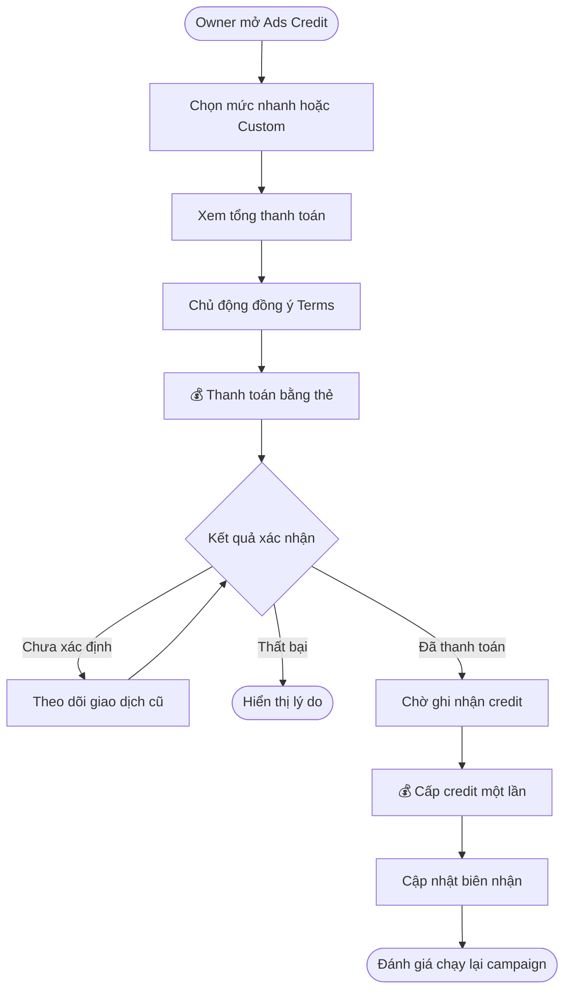
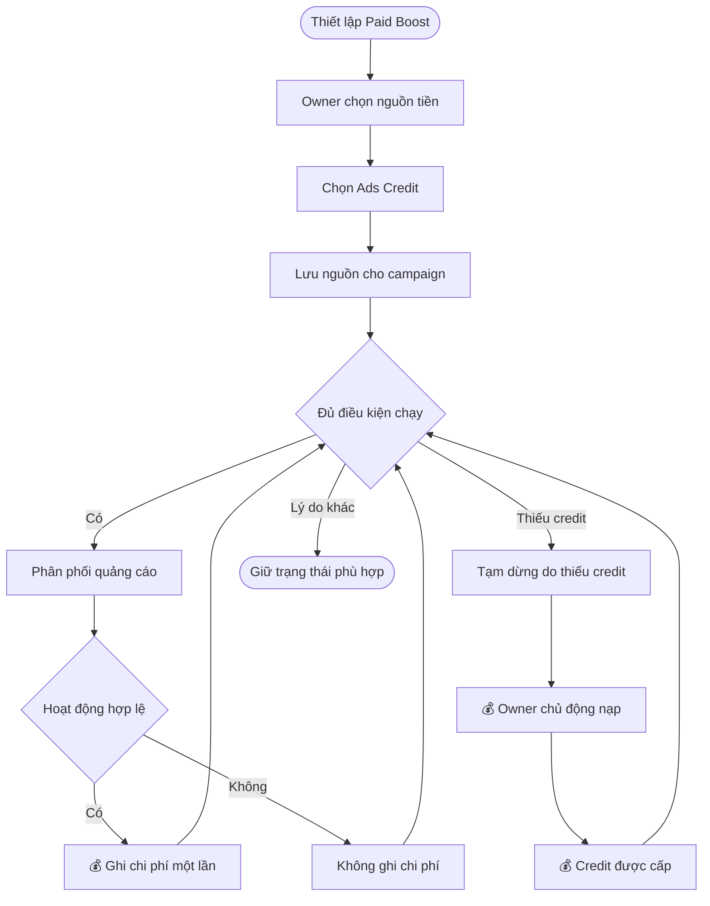
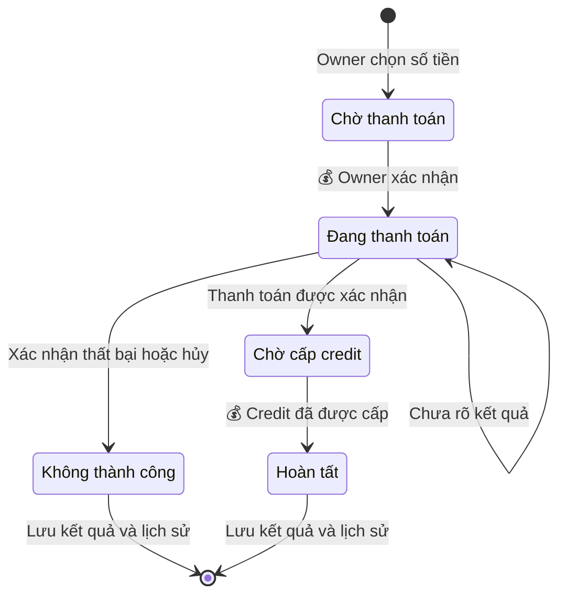
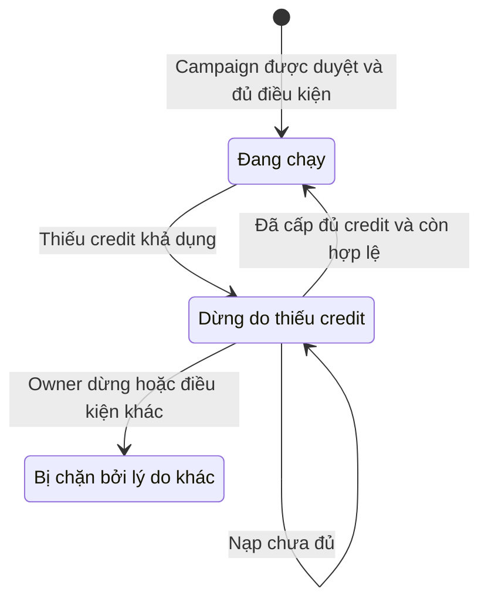

## Ads Credit — Nạp và sử dụng cho quảng cáo

**Cập nhật lần cuối:** 24 tháng 9 năm 2026

**Đối tượng đọc:** Người phụ trách sản phẩm, BA, đội phát triển giao diện, đội phát triển máy chủ, QA, bộ phận hỗ trợ

**Trạng thái:** Đang rà soát

### Tổng quan

Ads Credit giúp tiệm chủ động kiểm soát chi phí quảng bá Promotion trên mạng Nexora bằng khoản trả trước dùng cho Paid Boost/campaign. Hệ thống cho phép nạp bằng thẻ tại **Quản lý gói (Package Management)**, chọn Ads Credit làm nguồn thanh toán trong campaign và theo dõi số dư, chi phí, lịch sử cùng biên nhận. Merchant Owner chủ động nạp và chọn nguồn tiền; hệ thống ghi nhận chi phí hợp lệ và đánh giá chạy lại campaign dừng do thiếu credit khi các điều kiện khác vẫn đáp ứng. Credit không hết hạn và không tự động nạp; thiết lập nội dung, ngân sách và quản lý campaign được mô tả trong tài liệu Promotion.

**Phạm vi và mức độ chốt:** Phạm vi đã được người dùng xác nhận; cấu hình thương mại và dữ liệu và kết quả tích hợp phía máy chủ còn cần thống nhất trước triển khai.

**Nhu cầu chính:** Là Merchant Owner, tôi muốn nạp Ads Credit bằng thẻ trong Quản lý gói và chọn credit làm nguồn thanh toán cho Paid Boost/campaign quảng bá Promotion, để tiếp cận khách hàng trên mạng lưới Nexora và kiểm soát rõ ngân sách đã nạp, đã sử dụng và còn lại.

**Tổng quan xuyên suốt:** xem [Promotion Studio → Ads Credit → chạy quảng cáo](./promotion-studio-ads-credit-overview.md) để theo dõi hành trình tiệm tạo ưu đãi, xuất bản, nạp khi cần và sử dụng credit cho campaign.

#### Ads Credit được dùng ở đâu?

| Chế độ Promotion | Nơi khách nhìn thấy | Quan hệ với Ads Credit |
| :--- | :--- | :--- |
| **Internal** | Website, OneQR, banner/menu hoặc trang Promotion của chính doanh nghiệp. | Không tính phí quảng cáo network; không yêu cầu nạp Ads Credit chỉ để hiển thị nội dung của chính tiệm. Phí SaaS/POS là nghiệp vụ khác. |
| **Public** | Danh sách tự nhiên trong Deal Nearby/Explore, Search Deals và các mục discovery phù hợp sau duyệt. | Không tự trở thành quảng cáo trả phí. Click organic miễn phí trong chính sách pilot; chỉ có performance fee khi giao dịch đủ điều kiện theo mô hình merchant đã chấp thuận. Không tự trừ Ads Credit chỉ vì bật Public. |
| **Paid Boost** | Banner/card tài trợ được phân phối theo khu vực, lịch chạy, placement và ngân sách. | Đây là điểm sử dụng chính: Owner chọn Ads Credit làm nguồn thanh toán campaign. Chỉ ghi spend theo hoạt động/delivery đủ điều kiện của mô hình đã chọn. |

**Các placement của quảng bá trả phí:** Sponsored Banner trong vùng OneQR/Explore đủ điều kiện; Sponsored Card trong Deal Nearby/Explore và Search Deals. Sponsored Pin trên bản đồ là khả năng được tài liệu đề cập cho lúc bản đồ được triển khai, không phải hạng mục cần xây trong ticket nạp credit.

**Placement khác billing model:** Banner/Nearby/Explore/Search Deals là nơi hiển thị; CPC/CPL/CPA/Sponsored Placement là cách tính phí. Nguồn Ads Credit phải phục vụ cả bốn mô hình theo quyết định của user; không hiểu việc hỗ trợ bốn mô hình là phải xây tất cả placement trong ticket này.

**Luồng liên kết với ticket campaign:** tạo Promotion → chọn Public và Paid Boost → thiết lập placement/khu vực/lịch/ngân sách/mô hình → chọn Ads Credit → nếu thiếu, nạp ở Quản lý gói rồi quay lại campaign → campaign được duyệt và đủ điều kiện mới chạy → hoạt động hợp lệ tạo spend → đối soát số dư và chi phí theo campaign.

Tạo Promotion, chọn Public/Paid Boost, kiểm duyệt và phân phối thuộc ticket campaign. Paid Boost cần Public và không được vượt bộ lọc đối thủ trong phiên OneQR của doanh nghiệp. Việc nạp hoặc chọn Ads Credit không tự bật Public, tự duyệt Promotion hoặc bỏ qua bộ lọc này. Performance fee cho Public chỉ được nối với Ads Credit nếu campaign contract xác nhận nguồn thanh toán và Owner đã đồng ý mô hình tương ứng; không suy diễn rằng mọi giao dịch Public đều phải trừ credit.

**Bổ sung ranh giới theo bản PO ngày 24 tháng 9 năm 2026:** Promotion Studio mở rộng social kit, Meta/Google handoff, CRM SMS/email/push, Partner Network và AI creative. Các phần này không mặc định sử dụng Ads Credit: nguồn phí AI/gửi tin/quảng cáo bên ngoài và phương án Partner Credit exchange phải được chốt riêng. Giữ nguyên luồng nạp và các quyết định Ads Credit dưới đây; xem [tài liệu Promotion tích hợp](./promotion-publishing-ads.md) để biết luồng bổ sung.

#### Quyết định đã xác nhận

| Nội dung | Quyết định của user |
| :--- | :--- |
| Phạm vi campaign | Chọn Ads Credit làm nguồn thanh toán cho Paid Boost/campaign quảng bá Promotion; tạo, chỉnh sửa và quản lý campaign thuộc ticket khác. |
| Vị trí | Trong Quản lý gói. |
| Phương thức nạp | Thanh toán thẻ theo trải nghiệm nạp SMS/Voice. |
| Hình thức chọn số tiền | Bốn mức nạp nhanh và **Custom amount** để Owner tự nhập; user đã yêu cầu kết hợp cả hai. |
| Mô hình quảng cáo | Hỗ trợ cả CPC, CPL, CPA và Sponsored Placement. |
| Auto top-up | Không có. Mỗi lần nạp do Owner chủ động thực hiện. |
| Sau khi nạp | Cho campaign tự chạy khi đủ điều kiện. |
| Quyền | Owner. Không mở quyền nạp/chọn nguồn tiền cho Staff trong phạm vi này. |
| Hết hạn | Ads Credit không hết hạn. |
| Backend | Yêu cầu mới, chưa có contract BE theo xác nhận của user. |
| Phạm vi tài liệu | Mô tả yêu cầu nghiệp vụ; không xác nhận ứng dụng đã triển khai hoặc cho phép sửa backend. |

#### Đề xuất tối ưu cho bản đầu

Các nội dung dưới đây là **đề xuất**, không phải quyết định đã được user xác nhận hoặc cấu hình đang tồn tại.

| Hạng mục | Đề xuất | Lý do |
| :--- | :--- | :--- |
| Cách nạp | Bốn mức nạp nhanh do BE cung cấp, kèm **Custom amount** trong cùng form thanh toán thẻ. Hình thức này đã được user chốt; cấu hình chi tiết bên dưới là đề xuất. | Owner chọn nhanh hoặc nhập đúng ngân sách cần nạp; dùng chung một bước xác nhận thanh toán. |
| Mệnh giá | Tham khảo $50 / $100 / $250 / $500. Đây là các giá trị minh họa; giá bán và giới hạn thực tế phải được cấu hình trước phát hành. | Có lựa chọn từ thử nghiệm đến ngân sách lớn hơn mà không cần nhiều gói. |
| Đơn vị | USD; hiển thị giá trị tiền tệ như `$100.00 Ads Credit`, không dùng điểm quy đổi ẩn. Đề xuất $100 giá trị nạp cấp $100 Ads Credit, trước ảnh hưởng phí/thuế được công bố. | Owner dễ đối chiếu ngân sách và chi phí campaign. |
| Phí và thuế | Tách rõ giá trị credit, phí nếu có, thuế nếu có và tổng charge. Không âm thầm trừ phí xử lý thẻ khỏi credit đã cam kết. | Tổng tiền trả có thể khác giá trị credit; không được mặc định thuế hoặc phí bằng 0. Chính sách cụ thể do đơn vị phụ trách chốt. |
| Promo | Chưa phát hành promo/bonus trong bản đầu; không tự tạo ưu đãi cho gói lớn. | Tránh thêm quy tắc tiêu credit và hoàn/đảo credit khi chưa có chính sách. |
| Phạm vi số dư | Mỗi business có số dư riêng, dùng chung cho các campaign của business đó; không gộp nhiều business cùng Owner. | Dễ phân quyền và đối soát. User mới chốt Owner, chưa xác nhận phạm vi số dư này. |
| Điểm vào | Tab **Ads Credit** riêng trong Quản lý gói, có số dư, nút nạp và lịch sử. | Không phụ thuộc thiết lập Voice của mục Credits hiện tại. |
| Cách tiêu | Chỉ ghi spend khi hoạt động đủ điều kiện được duyệt. Không trừ toàn bộ ngân sách ngay lúc chọn nguồn thanh toán. | Phù hợp Terms; phân biệt đặt ngân sách với chi phí thực tế. |
| Ngăn vượt số dư | BE giữ phần nghĩa vụ đang chờ duyệt khi cần; hiển thị riêng số dư khả dụng, phần giữ và chi phí đã ghi nhận. | CPC/CPL/CPA có thể có độ trễ; kiểm tra số dư ở FE không đủ để ngăn nhiều campaign tiêu vượt mức. Cơ chế giữ cụ thể là dependency của campaign/BE. |

**Trải nghiệm chọn số tiền:** hiển thị bốn lựa chọn nhanh **$50 / $100 / $250 / $500** và lựa chọn **Custom amount**. Các mệnh giá là gợi ý cấu hình, không hardcode thành giá bán mặc định khi BE chưa cung cấp. Chỉ một lựa chọn có hiệu lực tại một thời điểm; Custom hiển thị ô nhập giá trị Ads Credit muốn nhận, không phải tổng charge sau phí/thuế.

**Quy tắc Custom đề xuất:** số tiền dương, tối đa hai chữ số thập phân với USD, nằm trong min/max và giới hạn thanh toán do BE cung cấp. Hiển thị giới hạn ngay cạnh ô nhập; không tự làm tròn, tự nâng lên mức tối thiểu hoặc tự hạ xuống tối đa. Bỏ trống, nhập sai hoặc vượt giới hạn thì báo lỗi tại ô và khóa thanh toán. Min/max cụ thể cần được cấu hình trước phát hành; không tự coi các mức nhanh là giới hạn Custom.

**Giá và xác nhận:** cả mức nhanh lẫn Custom đều lấy báo giá từ BE trước thanh toán. Đổi lựa chọn/số tiền phải tải lại credit nhận, phí/thuế và tổng charge; khóa xác nhận khi báo giá chưa xong và yêu cầu đồng ý lại nếu nội dung giao dịch đã thay đổi. Không tạo subscription hoặc auto top-up từ Custom.

#### Ranh giới ticket

- **Trong ticket:** quản lý số dư Ads Credit, nạp thẻ và consent, trạng thái cấp credit, lịch sử/biên nhận; giao diện và contract chọn Ads Credit làm nguồn thanh toán cho campaign; phản ánh kết quả tiêu credit và tự chạy lại sau nạp.
- **Ticket campaign:** tạo/chỉnh sửa Promotion và campaign, chọn Internal/Public/Paid Boost, nội dung quảng cáo, placement, targeting/khu vực, lịch chạy, đơn giá, ngân sách, duyệt nội dung/campaign, bộ lọc đối thủ, thu thập/duyệt sự kiện và điều phối chạy/dừng campaign. Ads Dashboard/performance analytics đầy đủ cũng thuộc phạm vi riêng; ticket credit chỉ cung cấp số dư, lịch sử và liên kết đối soát.
- **Dependency liên ticket:** xác định đủ credit, giữ/giải phóng ngân sách nếu cần, ghi spend, dừng do thiếu credit, tự chạy lại. Phải nối được luồng này để nghiệm thu sử dụng credit; màn hình lịch sử giả không thay thế được.
- **Ngoài phạm vi:** auto top-up, chuyển/rút credit, màn hình quản trị refund/chargeback, đăng ký kiếm tiền, earnings, payout QR Host/Sponsor, công cụ kế toán và treasury.

### Khái niệm chính

| Thuật ngữ | Ý nghĩa |
| :--- | :--- |
| Ads Credit | Giá trị trả trước chỉ dùng cho quảng cáo Nexora; không phải tiền gửi, không sinh lãi, không chuyển nhượng hoặc rút tiền mặt. |
| Promotion | Nội dung ưu đãi của doanh nghiệp, có thể hiển thị Internal, được duyệt Public hoặc được quảng bá bằng Paid Boost. |
| Paid Boost | Quảng bá trả phí cho Promotion bằng campaign có ngân sách, lịch chạy, placement và điều kiện tính phí được xác nhận. |
| Placement | Vị trí phân phối quảng cáo tới khách; độc lập với cách tính tiền CPC/CPL/CPA/Sponsored Placement. |
| Số dư khả dụng | Phần credit có thể dùng cho nghĩa vụ quảng cáo mới; BE là nguồn xác nhận. |
| Credit đang giữ | Phần tạm dành cho nghĩa vụ quảng cáo đang xử lý nếu cơ chế campaign yêu cầu; chưa phải chi phí đã tiêu. |
| Spend | Chi phí quảng cáo được duyệt và đã ghi vào lịch sử credit. |
| Top-up | Một lần Owner chủ động thanh toán thẻ để mua credit. |
| Adjustment / reversal | Bản ghi điều chỉnh hoặc đảo một khoản trước đó, giữ nguyên bản ghi gốc. |
| Tự chạy lại | Khôi phục campaign đủ điều kiện sau khi hết nguyên nhân thiếu credit; không phải tự động charge thẻ. |

### Vai trò người dùng

| Vai trò | Trách nhiệm trong tính năng |
| :--- | :--- |
| Chủ doanh nghiệp (Merchant Owner) | Xem số dư/lịch sử/biên nhận, chủ động nạp, đồng ý Terms và chọn Ads Credit cho campaign thuộc quyền quản lý. |
| Nhân viên (Staff) | Không được nạp hoặc chọn nguồn Ads Credit trong phạm vi ticket. Đề xuất giới hạn cả dữ liệu số dư và biên nhận cho Owner. |
| Hệ thống thanh toán và Ads Credit | Xác nhận payment, cấp credit đúng một lần, ghi lịch sử, kiểm tra quyền và cung cấp trạng thái giao dịch. |
| Hệ thống campaign | Xác nhận hoạt động tính phí, kiểm soát ngân sách và phối hợp chạy/dừng/tự chạy lại. |
| Bộ phận hỗ trợ / tài chính | Xử lý ngoại lệ theo chính sách được duyệt; công cụ vận hành thuộc phạm vi riêng. |

### Luồng nghiệp vụ đầu cuối

#### Luồng: Nạp Ads Credit bằng thẻ

**Người thực hiện chính:** Merchant Owner.  
**Điểm bắt đầu:** Chọn **Add Ads Credit** trong Quản lý gói.  
**Kết quả:** Thanh toán và cấp credit được xác nhận; số dư và biên nhận cập nhật đúng một lần.

**Nhu cầu người dùng:**

- **Là** Owner, **tôi muốn** biết tổng tiền phải trả và credit nhận được trước khi nạp, **để** xác nhận đúng ngân sách.
- **Là** Owner, **tôi muốn** tra cứu lại giao dịch đang xử lý khi mất mạng hoặc quay lại trang, **để** không trả tiền lần thứ hai cho cùng lần nạp.

| Bước | Người thực hiện | Hành động | Phản hồi hệ thống | Ghi chú |
| :--- | :--- | :--- | :--- | :--- |
| 1 | Owner | Mở Quản lý gói → Ads Credit. | Hiển thị số dư, thông tin không hết hạn, lịch sử và CTA nạp. | Không yêu cầu thiết lập Voice hoặc monetization. |
| 2 | Owner | Chọn một trong bốn mức nhanh hoặc Custom rồi nhập thông tin thẻ. | Kiểm tra số tiền, hiển thị credit, phí/thuế nếu có và tổng thanh toán từ BE. | Custom tuân thủ min/max được cấu hình; dùng chung luồng thanh toán thẻ. |
| 3 | Owner | Đọc Terms và chủ động chọn đồng ý. | Gắn consent với đúng Owner, business, giao dịch và phiên bản Terms. | Checkbox mặc định chưa chọn. |
| 4 | Owner | Xác nhận 💰 thanh toán thẻ. | Khởi tạo/xử lý thanh toán; khóa submit lặp. | Hoàn thành xác thực thẻ nếu processor yêu cầu. |
| 5 | Hệ thống | Xác nhận kết quả payment. | Chờ nếu chưa xác định; báo thất bại nếu có kết quả cuối cùng tương ứng. | FE callback không đủ để xác nhận đã cấp credit. |
| 6 | Hệ thống | 💰 Cấp Ads Credit sau thanh toán hợp lệ. | Cập nhật số dư, lịch sử, biên nhận; gửi tín hiệu cho campaign đánh giá chạy lại. | Payment thành công nhưng chưa cấp credit vẫn là đang xử lý. |
| 7 | Owner | Xem kết quả. | Hiển thị credit đã cấp và trạng thái khôi phục campaign nếu có. | Nếu chưa lấy được kết quả campaign, không khẳng định campaign đã chạy lại. |

#### Luồng: Chọn Ads Credit cho campaign và sử dụng ngân sách

**Người thực hiện chính:** Merchant Owner.  
**Điểm bắt đầu:** Chọn nguồn thanh toán khi thiết lập Paid Boost/campaign quảng bá Promotion ở ticket liên quan.  
**Kết quả:** Campaign dùng đúng số dư Ads Credit; chi phí hợp lệ có lịch sử đối soát.

**Ngữ cảnh từ ticket campaign:** Owner đã tạo/chọn Promotion và thiết lập kênh Public/Paid Boost, placement, lịch chạy, ngân sách và mô hình tính phí. Đây là các bước của ticket campaign, không tạo thêm campaign builder trong story này; khi lưu nguồn thanh toán, campaign vẫn có thể đang nháp hoặc chờ duyệt.

**Nhu cầu người dùng:**

- **Là** Owner, **tôi muốn** chọn Ads Credit tại bước ngân sách/nguồn thanh toán của Paid Boost, **để** quảng bá Promotion qua các placement đủ điều kiện theo CPC, CPL, CPA hoặc Sponsored Placement.
- **Là** Owner, **tôi muốn** campaign dừng do thiếu credit được tự chạy lại sau khi nạp đủ, **để** tiếp tục quảng cáo trong ngân sách và lịch chạy đã chọn.

| Bước | Người thực hiện | Hành động | Phản hồi hệ thống | Ghi chú |
| :--- | :--- | :--- | :--- | :--- |
| 1 | Owner | Mở phần ngân sách/nguồn thanh toán của Paid Boost/campaign quảng bá Promotion. | Hiển thị Ads Credit và số dư khả dụng của đúng business. | Internal hoặc chỉ bật Public không tự tạo bước trả phí. |
| 2 | Owner | Chọn Ads Credit. | Lưu nguồn tiền và kiểm tra điều kiện với BE. | Chọn nguồn không tự bắt đầu một campaign nháp hoặc tự tạo spend. |
| 3 | Hệ thống campaign | Chạy campaign đã được duyệt theo điều kiện Owner xác nhận. | Phân phối banner/card tài trợ tại placement phù hợp, kiểm soát ngân sách và nghĩa vụ đang chờ nếu có. | Giữ điều kiện Public, bộ lọc đối thủ, lịch chạy và quy tắc event của campaign contract. |
| 4 | Hệ thống campaign | Xác nhận hoạt động đủ điều kiện. | 💰 Ghi spend đúng một lần; cập nhật số dư và tham chiếu campaign/event/delivery. | Nếu đã giữ credit thì tất toán phần giữ, không trừ hai lần. |
| 5 | Hệ thống | Phát hiện không đủ credit cho nghĩa vụ tiếp theo. | Dừng phân phối cần credit, thể hiện lý do và CTA nạp. | Không tự charge thẻ; không cần đợi số dư về đúng 0 mới dừng. |
| 6 | Owner | 💰 Chủ động nạp thêm bằng thẻ. | Chỉ sau khi credit được cấp, BE đánh giá lại campaign. | Không phụ thuộc Owner còn mở trang hay không. |
| 7 | Hệ thống campaign | Khôi phục campaign đủ điều kiện. | Chạy lại, giữ nguyên ngân sách và lịch chạy; ghi nhận kết quả. | Không hồi sinh campaign hết hạn, bị từ chối hoặc do Owner dừng. |

#### Tiêu chí nghiệm thu

Các AC kết hợp quyết định đã xác nhận với yêu cầu đề xuất về tính nhất quán và UX. Giá gói, phí/thuế, phạm vi số dư và cơ chế giữ credit vẫn mang trạng thái đề xuất như bảng phía trên.

| ID | Given / When | Then |
| :--- | :--- | :--- |
| AC-01 | Owner mở Ads Credit trong Quản lý gói. | Thấy số dư, CTA nạp, thông tin không hết hạn và lịch sử. Không bị chặn vì chưa có Voice tenant, gói SMS/Voice hoặc setup kiếm tiền OneQR. |
| AC-02 | Tải số dư đang chờ, lỗi hoặc chưa có giao dịch. | Có các trạng thái riêng; lỗi không biến thành số dư 0, empty history không biến thành lỗi. |
| AC-03 | Owner mở form và chọn số tiền nạp. | Có bốn mức nhanh từ cấu hình và Custom amount; chỉ một lựa chọn có hiệu lực. Custom nhập số tiền dương, tối đa hai chữ số thập phân với USD, trong min/max từ BE; lỗi tại ô nhập chặn thanh toán, không âm thầm làm tròn hoặc đổi giá trị. Cả hai hình thức hiển thị credit, tiền tệ, phí/thuế nếu có và tổng charge do BE xác nhận. Đổi số tiền phải lấy báo giá mới và xác nhận lại; giá cũ hoặc gói ngừng bán không được dùng để thanh toán. |
| AC-04 | Mở form nạp mới. | Checkbox Terms chưa chọn; có link đọc đầy đủ, nêu không chuyển/rút, không hết hạn và ngoại lệ refund. Chỉ cho xác nhận khi thông tin hợp lệ và consent đã được chọn; BE lưu bằng chứng consent. |
| AC-05 | Xác nhận thanh toán thẻ, có double-click, retry hoặc callback trùng. | Một lần nạp chỉ thu tiền và cấp credit đúng một lần; BE hỗ trợ chống trùng. Không báo đã cấp credit chỉ vì SDK trả thành công. |
| AC-06 | Payment pending, timeout, reload hoặc đã trả tiền nhưng chưa cấp credit. | Tra cứu giao dịch cũ, hiển thị trạng thái tương ứng; không tự charge lại. Có thao tác kiểm tra lại và hướng hỗ trợ khi xử lý kéo dài. |
| AC-07 | BE xác nhận payment và credit đã được ghi nhận. | Số dư, lịch sử và biên nhận cập nhật; refresh vẫn thấy kết quả. Không tự gia hạn, tự nạp hoặc bật thanh toán định kỳ. |
| AC-08 | Owner chọn Ads Credit tại bước ngân sách/nguồn thanh toán của Paid Boost/campaign quảng bá Promotion. | Nguồn thanh toán được lưu cho campaign đúng business; hiển thị số dư khả dụng. Chỉ chọn nguồn không tự trừ toàn bộ ngân sách, bật Public, duyệt nội dung hoặc chạy campaign nháp. Khi cần nạp, dẫn đến Ads Credit trong Quản lý gói với khả năng quay về đúng campaign; không mất cấu hình đã lưu. |
| AC-09 | Campaign dùng CPC, CPL, CPA hoặc Sponsored Placement. | Cả bốn mô hình dùng được nguồn Ads Credit. Giá và quy tắc tính phí đến từ campaign contract; spend có đúng mô hình, số tiền và tham chiếu, không suy từ số scan OneQR. |
| AC-10 | Hoạt động tính phí được duyệt, có event gửi trùng hoặc nhiều campaign đồng thời. | Ghi spend đúng một lần, không vượt ngân sách/số dư được phép. Phần giữ nếu có được tất toán hoặc giải phóng đúng quy tắc, không trừ lại khi kết thúc campaign. |
| AC-11 | Số dư khả dụng không đủ cho nghĩa vụ tiếp theo. | Hệ thống dừng phân phối cần credit và hiển thị lý do thiếu credit, không charge thẻ tự động. Nghĩa vụ đã phát sinh được xử lý theo cơ chế giữ/duyệt của BE, không xóa dấu vết. |
| AC-12 | Nạp thành công cho campaign đã dừng do thiếu credit. | Tự chạy lại khi còn được duyệt, trong lịch chạy, còn ngân sách và không có hold khác; vẫn giữ giới hạn ngân sách cũ. Campaign nháp, kết thúc, Owner dừng, bị từ chối hoặc fraud/chargeback hold không tự chạy. Nạp chưa đủ thì tiếp tục dừng và giải thích rõ. |
| AC-13 | Có nhiều campaign đang dừng do thiếu credit. | BE phân bổ/giữ khả năng chi tiêu nhất quán; không cho từng campaign coi toàn bộ cùng một số dư là phần riêng của nó. Chỉ campaign đủ điều kiện thực sự được khôi phục; FE hiển thị kết quả từng campaign từ BE. |
| AC-14 | Owner xem lịch sử hoặc chi tiết. | Thấy loại giao dịch, giá trị tăng/giảm, thời gian, trạng thái, số dư sau ghi nhận và tham chiếu. Top-up có biên nhận, spend có campaign/event hoặc delivery, adjustment liên kết giao dịch gốc. Lịch sử có phân trang và lọc nạp/sử dụng/điều chỉnh. |
| AC-15 | Event bị từ chối hoặc spend đã ghi cần đảo. | Chưa tính phí thì không trừ; đã tính thì tạo reversal/adjustment riêng theo quyết định hợp lệ. Không sửa/xóa giao dịch gốc hoặc mô tả hoàn credit thành hoàn tiền về thẻ. |
| AC-16 | Staff hoặc tài khoản không có quyền truy cập trực tiếp màn hình/API/biên nhận. | Bị từ chối ở BE và FE không làm lộ dữ liệu. Đổi business/session không thấy số dư hoặc receipt của business trước. |
| AC-17 | Credit còn dư qua thời gian hoặc campaign bị dừng/hủy/kết thúc. | Credit không hết hạn. Phần chưa tiêu còn dùng được, phần giữ được giải phóng khi nghĩa vụ tương ứng kết thúc; chi phí hợp lệ đã tiêu không tự được hoàn. |
| AC-18 | Dùng điện thoại, desktop, bàn phím hoặc EN/VI. | Form/Terms/lịch sử đọc được, focus và lỗi rõ ràng, CTA không bị che. Tiếng Việt viết đầy đủ “tháng”; định dạng theo locale và timezone business. Dropdown nếu có dùng một chevron 16px cách phải 12px, chừa tối thiểu 36px cho text. |
| AC-19 | Owner hiển thị Promotion Internal hoặc khách chỉ mở OneQR/Nearby/Search Deals. | Không phát sinh spend quảng cáo hoặc yêu cầu nạp chỉ từ các thao tác này. Bật Public và click organic theo chính sách pilot không tự trừ CPC. Performance fee chỉ phát sinh theo mô hình/nguồn tiền được xác nhận và merchant đã chấp thuận. |
| AC-20 | Owner xem spend của Paid Boost/campaign trong lịch sử Ads Credit. | Mỗi dòng có campaign, billing model, placement nếu áp dụng, số tiền và event/delivery reference; có thể đối chiếu vì sao bị trừ. Không hiển thị việc nạp tiền là doanh thu hay kết quả quảng cáo, không cần xây Ads Dashboard đầy đủ trong ticket này. |
| AC-21 | Credit vừa được cấp cho campaign chưa được duyệt Public/quảng cáo hoặc bị hạn chế phân phối. | Nạp thành công không bỏ qua điều kiện Public, kiểm duyệt, targeting hoặc bộ lọc đối thủ. Chỉ chạy lại khi các điều kiện campaign đều thỏa; không áp thêm CPC và performance fee cho cùng campaign nếu Owner chưa chấp thuận cách tính kết hợp đó. |

### Cấu hình và quản trị

- **Là** người vận hành được phân quyền, **tôi muốn** quản lý mệnh giá, giới hạn Custom và tổng giá nạp, **để** Owner xác nhận khoản thanh toán dựa trên thông tin đầy đủ.
- **Là** người vận hành được phân quyền, **tôi muốn** quản lý phiên bản điều khoản và quyền xử lý ngoại lệ, **để** truy vết căn cứ của giao dịch và điều chỉnh.

Story này không thêm màn hình quản trị. Dữ liệu nạp và chi phí cần được cung cấp qua cấu hình/contract của BE, tránh đưa giá hoặc quy tắc thu phí vào FE.

- Bốn mức nạp nhanh: trạng thái bán, tiền tệ, giá trị credit nhận, phí/thuế áp dụng và tổng thanh toán. Custom dùng cùng chính sách giá, có min/max và độ chính xác theo tiền tệ do BE kiểm tra; không chỉ kiểm tra ở FE.
- Điều khoản: nội dung/phiên bản, bằng chứng Owner đồng ý và liên kết với giao dịch.
- Campaign: đơn giá, điều kiện billable, lịch chạy, daily/total budget và quy tắc phần nghĩa vụ đang chờ.
- Nhiều campaign dùng chung credit: quy tắc ưu tiên/điều phối phải do campaign/BE xác định nhất quán trước tích hợp; không để FE tự quyết định.
- Ngoại lệ: người có thẩm quyền duyệt adjustment/refund, cách hiển thị chargeback/fraud restriction và hướng hỗ trợ. Công cụ xử lý thuộc ticket vận hành riêng.

### Vòng đời trạng thái

Đây là **trạng thái nghiệp vụ đề xuất**, không phải enum API đã tồn tại.

#### Giao dịch nạp

| Trạng thái hiện tại | Sự kiện chuyển trạng thái | Trạng thái mới | Ghi chú |
| :--- | :--- | :--- | :--- |
| Chờ thanh toán | Owner xác nhận và processor bắt đầu xử lý. | Đang thanh toán | Chống submit trùng. |
| Đang thanh toán | Chưa có kết quả, mất mạng hoặc đóng trang. | Đang thanh toán | Đóng modal không tự hủy giao dịch. |
| Đang thanh toán | Xác nhận thanh toán thất bại/hủy trước khi thu tiền. | Không thành công | Không cộng credit. |
| Đang thanh toán | BE xác nhận tiền đã được thanh toán. | Chờ cấp credit | Chưa báo credit sẵn sàng. |
| Chờ cấp credit | 💰 Ghi nhận tăng credit thành công. | Hoàn tất | Chỉ cấp một lần; đánh giá chạy lại campaign. |
| Hoàn tất | Có chargeback hoặc điều chỉnh được duyệt. | Giữ giao dịch gốc và thêm điều chỉnh | Không sửa lịch sử hoàn tất thành chưa từng xảy ra. |

#### Campaign — phần giao tiếp với Ads Credit

| Trạng thái hiện tại | Sự kiện chuyển trạng thái | Trạng thái mới | Ghi chú |
| :--- | :--- | :--- | :--- |
| Đang chạy | Không đủ credit cho nghĩa vụ tiếp theo. | Dừng do thiếu credit | Không tự charge thẻ. |
| Dừng do thiếu credit | Credit đã cấp; mọi điều kiện chạy còn hợp lệ. | Đang chạy | Giữ ngân sách, lịch và cấu hình đã có. |
| Dừng do thiếu credit | Nạp chưa đủ. | Dừng do thiếu credit | Thông báo lý do. |
| Dừng do thiếu credit | Owner dừng, hết lịch/ngân sách, bị hold hoặc từ chối. | Trạng thái chặn tương ứng | Nạp tiền không xóa các nguyên nhân này. |

### Quy tắc nghiệp vụ

1. **💰 Nạp và cấp credit là hai kết quả cần phân biệt.** BE xác nhận cả hai; FE không tự cộng số dư từ giá trị form hoặc callback SDK.
2. **Không auto top-up.** Tự chạy lại campaign không cho phép hệ thống tự thu tiền từ thẻ, kể cả thẻ từng dùng thành công.
3. **Credit không hết hạn.** Không giảm số dư theo thời gian hoặc theo thời hạn subscription; hết lịch campaign không làm hết hạn credit.
4. **Owner sử dụng đúng phạm vi được cấp quyền.** Đề xuất số dư riêng theo business, không chuyển sang business khác.
5. **Không rút/chuyển, không dùng ngoài quảng cáo Nexora.** Theo Terms, không hoàn tiền mặt mặc định; vẫn giữ ngoại lệ luật yêu cầu hoặc Nexora chấp thuận theo chính sách. Dừng/hủy campaign không tự tạo refund.
6. **💰 Ghi spend theo hoạt động đủ điều kiện.** CPC: click hợp lệ; CPL: lead/claim offer/booking hợp lệ; CPA: sale/giao dịch đủ điều kiện và hold/refund rule nếu áp dụng; Sponsored Placement: delivery theo vị trí/thời gian/gói cam kết. Giá cụ thể và tiêu chí duyệt thuộc ticket campaign/BE.
7. **Ngân sách không đồng nghĩa đã tiêu.** Nếu có phần giữ thì số dư khả dụng phải trừ phần giữ; khi duyệt chi phí phải tất toán đúng phần này, không ghi giảm hai lần.
8. **Chạy lại có điều kiện.** Chỉ khôi phục campaign đã được phép chạy và đang dừng vì thiếu credit. Không mở rộng ngân sách/ngày kết thúc, bỏ qua duyệt hoặc bỏ hold do nạp thêm.
9. **Sổ giao dịch giữ lịch sử.** Top-up, spend và adjustment phải truy vết được; event hoặc payment lặp không sinh thêm charge/spend/credit.
10. **Kế toán là nghiệp vụ liên quan.** Theo tài liệu Accounting, tiền nạp là nghĩa vụ cung cấp quảng cáo, việc ghi doanh thu gắn với dịch vụ hợp lệ. Cách gross/net và chia QR Host/Sponsor do Finance xác định ở phạm vi khác; FE không tự ghi doanh thu từ top-up.
11. **Không áp dụng expiration/breakage vào credit của story này.** Dù tài liệu Accounting đề cập khả năng hết hạn theo chính sách, user đã chốt credit không hết hạn.
12. **Promo chưa thuộc đề xuất bản đầu.** Nếu bổ sung về sau cần chính sách riêng; Terms nêu bonus/promo không có giá trị tiền mặt và không được refund. Không tự tạo ngày hết hạn trái quyết định hiện tại.
13. **Internal/Public/Paid Boost có điều kiện tính phí khác nhau.** Internal không tạo phí quảng cáo network; Public không tự trở thành Paid Boost. Chỉ mở menu hoặc xem danh sách không phải billable event. Không dùng một bộ đếm click chung để trừ credit cho cả organic lẫn sponsored traffic.
14. **Nạp tiền không mua quyền bỏ qua kiểm duyệt.** Paid Boost cần Public và tuân thủ bộ lọc đối thủ. Điều kiện này do campaign/BE thực thi, kể cả khi tự chạy lại sau nạp.
15. **Không tự cộng chồng mô hình phí.** Hỗ trợ cả bốn mô hình không đồng nghĩa một click/lead/sale tự bị tính tất cả các loại phí. Áp dụng đúng mô hình hoặc tổ hợp phí merchant đã được thông báo và chấp thuận cho campaign.

### Tình huống ngoại lệ và cách xử lý

| Tình huống | Cách xử lý | Người giải quyết |
| :--- | :--- | :--- |
| Thanh toán bị từ chối hoặc xác thực thẻ không hoàn tất. | Hiển thị kết quả processor/BE; không cấp credit khi chưa thu tiền thành công. | Owner thử lại sau kết quả cuối cùng. |
| Đã thu tiền nhưng cấp credit chậm. | Giữ giao dịch ở chờ cấp credit, đối soát và cấp đúng một lần; không yêu cầu thanh toán lại. | BE / Support. |
| Credit đã cấp nhưng điều phối campaign gặp lỗi. | Giữ nguyên top-up thành công; hiển thị campaign chưa khôi phục, BE retry tác vụ chạy lại không cấp/charge thêm. | Hệ thống campaign / Support. |
| Campaign đã bị Owner dừng trong lúc nạp. | Không tự chạy lại sau nạp. | Hệ thống campaign. |
| Daily/total budget hết hoặc campaign hết lịch. | Nạp thêm không khôi phục vượt ngân sách/lịch chạy. | Owner điều chỉnh tại ticket campaign nếu được phép. |
| Nhiều campaign cùng xin sử dụng số dư còn ít. | Xử lý nguyên tử và áp dụng quy tắc điều phối chung; không vượt số dư. | BE / hệ thống campaign. |
| Event đang chờ duyệt đến sau lúc campaign dừng. | Xử lý nghĩa vụ đã phát sinh theo quy tắc giữ/duyệt; không dùng trạng thái dừng để xóa chi phí hợp lệ hoặc trừ ngoài ngân sách cho phép. | BE / hệ thống campaign. |
| Invalid traffic sau khi đã ghi spend. | 💰 Tạo adjustment/reversal liên kết bản ghi gốc theo quyết định được duyệt. | BE / vận hành. |
| Chargeback khi một phần credit đã dùng. | Hiển thị trạng thái và hạn chế từ BE; có thể giữ campaign theo Terms. Chính sách xử lý phần đã tiêu phải được vận hành/BE xác định, FE không tự tạo số dư âm hoặc thu bù thẻ. | Support / Finance / BE. |
| Không tải được Terms hoặc giá. | Không cho hoàn tất lần nạp thiếu thông tin xác nhận; có thử lại. | Owner / hệ thống. |
| Custom bỏ trống, không hợp lệ, dưới min, trên max hoặc quá hai số thập phân USD. | Báo lỗi tại ô nhập và chặn xác nhận; không tự thay số tiền. | Owner sửa giá trị. |
| Đổi mức nhanh sang Custom hoặc sửa Custom trong lúc tải giá. | Chỉ dùng báo giá khớp lựa chọn/số tiền hiện tại; kết quả cũ đến muộn không được ghi đè tổng thanh toán mới. | FE / BE. |

### Câu hỏi thường gặp

**Nạp Ads Credit xong dùng ở màn nào?**  
Chọn Ads Credit tại bước ngân sách/nguồn thanh toán của Paid Boost/campaign quảng bá Promotion. Quản lý gói phục vụ nạp, xem số dư và lịch sử; xây dựng/quản lý campaign thuộc ticket khác.

**Đăng Promotion lên OneQR của chính tiệm có cần credit không?**  
Không tính phí quảng cáo network cho Internal. Public organic cũng không tự tạo CPC theo chính sách pilot; Paid Boost và performance event đã thỏa thuận mới có điều kiện tính phí tương ứng.

**Nạp xong có tự trừ thẻ ở các lần sau không?**  
Không. Mỗi lần nạp do Owner chủ động thanh toán. Chỉ việc chạy lại campaign đủ điều kiện là tự động.

**Chọn Ads Credit có tự tạo hoặc chạy campaign mới không?**  
Không. Đây là lựa chọn nguồn thanh toán; tạo và duyệt chạy campaign thuộc ticket campaign.

**Có cần mua hoặc setup SMS/Voice trước không?**  
Không. Chỉ tham khảo trải nghiệm checkout thẻ; Ads Credit có nghiệp vụ và số dư riêng.

**Dừng campaign có mất credit chưa dùng hoặc được hoàn tiền về thẻ không?**  
Credit chưa dùng không hết hạn; phần giữ được giải phóng khi nghĩa vụ tương ứng kết thúc. Không tự hoàn tiền về thẻ; ngoại lệ theo Terms và quyết định hợp lệ.

### Tính năng liên quan

| Tính năng | Mối liên hệ với tài liệu này |
| :--- | :--- |
| Quản lý gói | Là nơi Owner mở Ads Credit để nạp bằng thẻ, xem số dư, lịch sử giao dịch và biên nhận. |
| [Promotion Studio và campaign quảng cáo](./promotion-publishing-ads.md) | Chuẩn bị ưu đãi, duyệt quảng cáo, chọn lịch, ngân sách và nguồn thanh toán. Chỉ hoạt động đủ điều kiện mới ghi chi phí vào Ads Credit. |
| [Business OneQR Earnings](./business-oneqr-earnings.md) | Nhận sự kiện có căn cứ để xét thu nhập của doanh nghiệp giới thiệu. Thu nhập này không dùng chung số dư với Ads Credit. |
| [Sponsor Override](./oneqr-sponsor-override.md) | Xét quyền hưởng và chi trả theo chương trình Sponsor. Khoản nạp chưa tiêu không tự tạo thu nhập giới thiệu. |
| SMS, Voice và quảng cáo ngoài Nexora | Có phạm vi tích hợp và nguồn phí riêng. Không mặc định dùng số dư Ads Credit cho gửi tin, Voice hoặc quảng cáo Meta/Google. |

#### Tài liệu nguồn và mức độ xác minh

Các bản HTML nguồn có liên kết dưới đây được đính kèm trong thư mục references. Mã nguồn kỹ thuật và bằng chứng kiểm tra vẫn là tham chiếu nội bộ, không nằm trong bộ tài liệu chia sẻ. Các quyết định và giới hạn nghiệp vụ đã được nêu trong nội dung phía trên.

- [Ads Credit Terms](./references/NEXORA-OneQR-Ads-Credit-Terms.html).
- [Ads Credit Accounting](./references/NEXORA-OneQR-Ads-Credit-Accounting.html).
- [Ads / Referral / Revenue Policy](./references/NEXORA-OneQR-Ads-Referral-Revenue-Policy.html): phân biệt Internal/Public/Paid Boost, vị trí sponsored, billable event và ngân sách.
- [Promotion Studio](./references/NEXORA-Promotion-Studio.html): chọn nơi hiển thị, Public và quảng cáo trả phí; đây là prototype.
- [Advertiser Ads Dashboard](./references/NEXORA-OneQR-Advertiser-Ads-Dashboard.html): bước thiết lập campaign, số dư available/reserved và chi tiết billable event.
- [Five-Part Pilot](./references/NEXORA-OneQR-Five-Part-Pilot.html): hướng thử CPC, chưa thu tiền thật hoặc triển khai mua voucher.
- Các bản HTML đính kèm được giữ nguyên từ tài liệu người dùng cung cấp. Chúng là nguồn nghiệp vụ/bản mẫu, không phải hợp đồng API đã triển khai.
- **Khác biệt phiên bản:** dashboard tổng thể gợi ý auto top-up, tài liệu policy cũ có nhắc trạng thái expired/closed, còn Pilot thu hẹp thử CPC. Story này giữ các quyết định trực tiếp của user: **không auto top-up, credit không hết hạn, hỗ trợ cả bốn mô hình**. Không áp đơn giá/tỷ lệ chia demo thành cấu hình production và không suy rằng toàn bộ chức năng prototype đã tồn tại.
- Tài liệu này phản ánh các câu trả lời mới nhất của user. Bản nháp cũ tại `user-story/US-051-merchant-ads-credit-top-up-and-usage.md` và README archive có các câu hỏi/phạm vi cũ; được giữ nguyên, không dùng để thay thế quyết định trong tài liệu này.
- Đối chiếu mã giao diện trên nhánh `staging` tại mã phiên bản `58c41d9352b604209d375ab8dfab7c24763b8def` ngày 24 tháng 9 năm 2026: danh mục loại nạp trong `subscriptionPayments.ts` có TipPlatform, VoiceAI, VoiceSms, VoiceCallMinutes, chưa có Ads Credit. Kết luận chỉ áp dụng cho danh mục đã đọc; không suy ra trạng thái triển khai của toàn bộ backend. Không sử dụng `creditApplied` của subscription làm số dư Ads Credit.
- User xác nhận chưa có BE cho yêu cầu mới. Phiên soạn này không kiểm thử API live, không thực hiện thanh toán và không xác nhận tính sẵn sàng của môi trường triển khai.

#### Điểm tích hợp FE hiện có — tham chiếu nội bộ

Các tên tệp dưới đây dùng để định vị mã nguồn nội bộ; mô tả dựa trên nhánh `staging` tại mã phiên bản nêu trên, không phải kiểm thử API đang chạy.

| Khu vực chức năng | Tệp tham chiếu | Hướng tích hợp đề xuất |
| :--- | :--- | :--- |
| Quản lý gói | PackageManagementView (tệp `src/components/dashboard/views/packageManagement/PackageManagementView.tsx`, tham chiếu nội bộ), tab constants (tệp `src/components/dashboard/views/packageManagement/constants.ts`, tham chiếu nội bộ) | Thêm tab Ads Credit độc lập, giữ vị trí trong Quản lý gói. |
| Credits hiện tại | PackageCreditsPanel (tệp `src/components/dashboard/views/packageManagement/PackageCreditsPanel.tsx`, tham chiếu nội bộ) | Đang phụ thuộc Voice tenant; không đặt Ads Credit sau điều kiện này. |
| Checkout dùng chung | CreditTopUpModal (tệp `src/components/dashboard/views/creditCheckout/CreditTopUpModal.tsx`, tham chiếu nội bộ), checkout hook (tệp `src/components/dashboard/views/creditCheckout/useCreditTopUpCheckout.ts`, tham chiếu nội bộ) | Tái sử dụng phần UI/thanh toán thẻ phù hợp sau khi có contract Ads Credit; bổ sung consent và trạng thái cấp credit. |
| Payment hiện tại | subscriptionPayments (tệp `src/data/repositories/subscriptionPayments.ts`, tham chiếu nội bộ), payment hooks (tệp `src/data/hooks/useSubscriptionPayments.ts`, tham chiếu nội bộ) | Tham khảo cơ chế payment; không gửi Ads Credit vào API subscription chưa hỗ trợ loại này. |
| Promotion hiện tại | posPromotions (tệp `src/data/repositories/posPromotions.ts`, tham chiếu nội bộ) | Phần gửi dữ liệu trên nhánh tham chiếu đã có nội dung, mẫu, nhiều banner, giảm giá, thứ/giờ, trạng thái, lựa chọn OneQR hero và gửi Search Deals. Chưa có ngân sách campaign hoặc nguồn Ads Credit trong phần gửi dữ liệu này. Ticket campaign cần cung cấp điểm sử dụng credit; lựa chọn nơi hiển thị Promotion không chứng minh Paid Boost đã hoàn thành. |
| Dữ liệu và cache | queryKeys (tệp `src/data/queryKeys.ts`, tham chiếu nội bộ), httpClient (tệp `src/lib/httpClient.ts`, tham chiếu nội bộ) | Dữ liệu Ads Credit riêng, theo business; refresh balance/history/status và trạng thái campaign sau kết quả BE. |
| Ngôn ngữ | English (tệp `src/locales/en.json`, tham chiếu nội bộ), Vietnamese (tệp `src/locales/vi.json`, tham chiếu nội bộ) | Copy en-US và VI; dùng Ads Credit như tên loại số dư, không tự thêm “s”. |

#### Dữ liệu và kết quả tích hợp cần có trước triển khai

**Chưa có method/endpoint Ads Credit được xác nhận.** Không đặt tên endpoint hoặc DTO giả. BE cần cung cấp contract cho nạp thẻ, cấp/tra cứu credit, ledger/receipt và phối hợp campaign; hiện user xác nhận đây là yêu cầu mới chưa có BE. Danh sách dưới đây là phạm vi đầu vào để FE và ticket campaign thống nhất, không phải báo cáo API lỗi đang tồn tại.

| Năng lực | Kết quả FE cần nhận |
| :--- | :--- |
| Số dư và giá nạp | Phạm vi business, currency, số dư khả dụng/phần giữ nếu có, bốn mức nhanh, giới hạn Custom và báo giá hợp lệ cho số tiền đang chọn. |
| Terms và consent | Nội dung, phiên bản và cách ràng buộc consent với Owner/giao dịch. |
| Thanh toán thẻ và trạng thái nạp | Tham chiếu giao dịch, dữ liệu checkout thẻ, kết quả payment riêng với kết quả cấp credit, cơ chế khôi phục giao dịch và chống trùng. |
| Lịch sử và biên nhận | Dữ liệu phân trang, loại/status, số tiền, thời gian, số dư sau giao dịch, receipt; spend có campaign, billing model, placement nếu áp dụng và tham chiếu event/delivery/adjustment. |
| Nguồn thanh toán campaign | Xác nhận Ads Credit được chọn cho Paid Boost/campaign đúng quyền/business; giá và điều kiện đủ credit theo mô hình; không tính phí cho Internal hoặc mặc định cho Public. |
| Tự chạy lại | Kết quả chạy lại hoặc lý do còn dừng theo campaign, độc lập với top-up thành công. |

#### Nội dung giao diện đề xuất (en-US)

| Vị trí | en-US |
| :--- | :--- |
| Tab | Ads Credit |
| Mô tả mục đích | Add Ads Credit to fund paid promotion campaigns across Nexora. |
| Số dư | Available Ads Credit |
| CTA nạp | Add Ads Credit |
| Nhập số tiền khác | Custom amount |
| Nhãn ô Custom | Ads Credit amount (USD) |
| Gợi ý ô Custom | Enter an amount |
| Thời hạn | Your Ads Credit does not expire. |
| Checkbox | I agree to the Ads Credit Terms. |
| Disclosure | Ads Credit is only for advertising in Nexora. It cannot be withdrawn or transferred. Purchases are non-refundable unless required by law or approved by Nexora under its policy. |
| Thông báo chạy lại trước nạp | Campaigns paused for insufficient Ads Credit will resume automatically once enough credit is available, provided their schedules, budgets, and approvals still allow them to run. |
| Chờ cấp | Payment received. Your Ads Credit is being added. |
| Đã cấp | Ads Credit added. |
| Thiếu credit | Paused — insufficient Ads Credit. |

Nội dung đầy đủ của Terms vẫn phải nêu rõ credit không phải tài khoản ngân hàng, không sinh lãi, chỉ dùng quảng cáo và bị trừ theo mô hình đã chọn; disclosure ngắn không thay thế Terms.

#### Điều kiện hoàn tất khi triển khai

- Các cấu hình còn là đề xuất được xác lập trước phát hành: bốn mệnh giá nhanh, min/max Custom, tiền tệ/quy đổi, phí/thuế, scope số dư, promo và cơ chế phần giữ/điều phối nhiều campaign.
- Có contract BE thật và ticket campaign cung cấp điểm tích hợp nguồn thanh toán; không triển khai theo DTO giả.
- Đạt các AC trên, đặc biệt nạp không trùng, bốn mô hình dùng được Ads Credit, số dư/lịch sử khớp BE, phân biệt Internal/Public/Paid Boost và chỉ tự chạy lại campaign đủ điều kiện.
- Không thay đổi hành vi SMS/Voice ngoài phần dùng chung cần thiết; kiểm tra hồi quy tương ứng khi thực sự triển khai.
- Công việc hiện tại chỉ hoàn tất tài liệu yêu cầu; không ngụ ý ứng dụng đã hỗ trợ Ads Credit hoặc đã được kiểm thử thanh toán.
