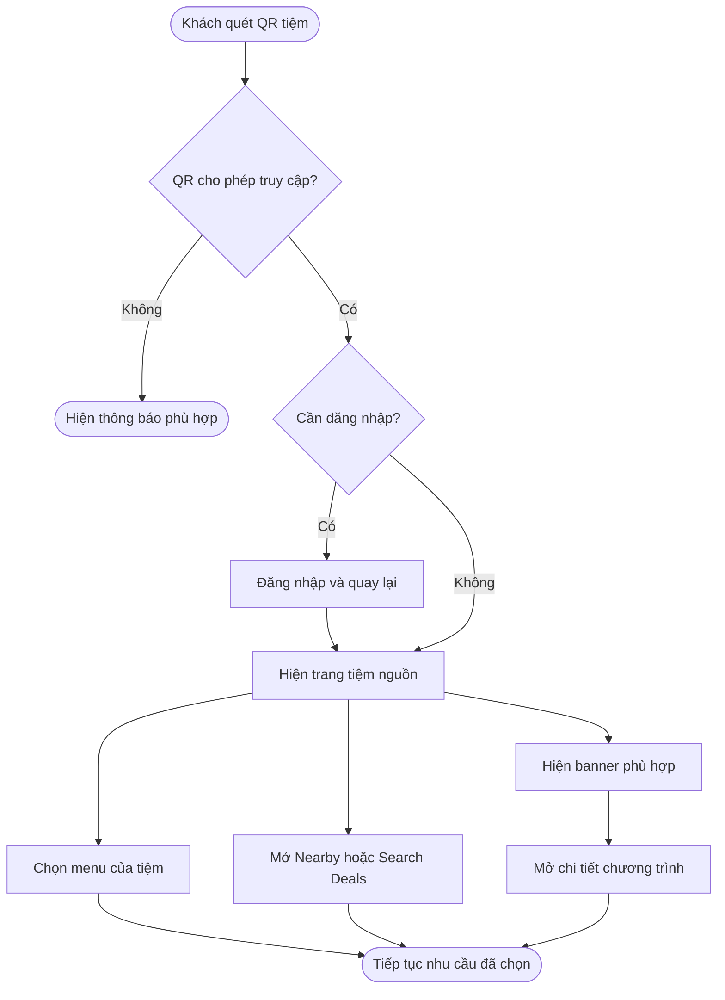
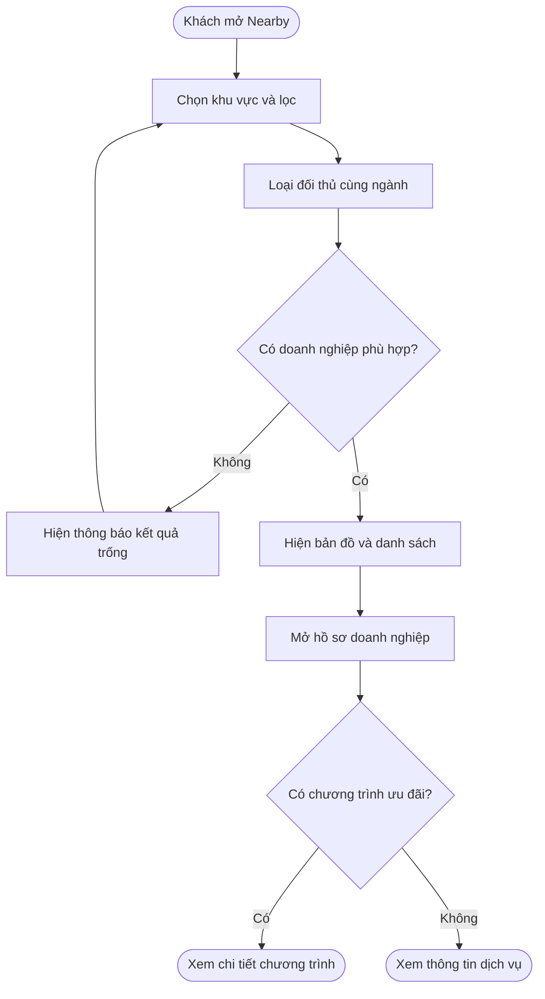
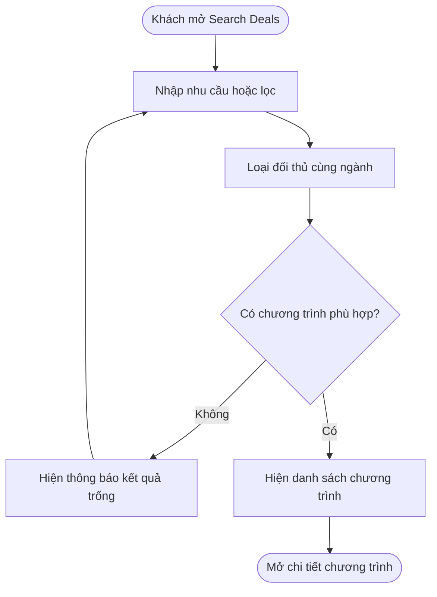
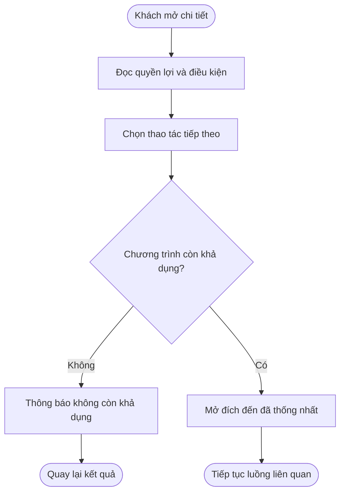
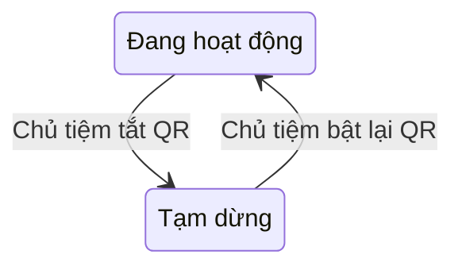

## One QR Customer — Promotion, Nearby / Explore và Search Deals

**Cập nhật lần cuối:** 9 tháng 10 năm 2026

**Đối tượng đọc:** Khách hàng, chủ tiệm, Product Owner, BA, QA và bộ phận hỗ trợ

**Trạng thái:** Đang rà soát
**Bản chia sẻ:** [Tài liệu trên GitHub](https://github.com/vlink-group/VlinkPay/blob/docs/promotion-code-skill-audit/nexora/docs/business/oneqr-customer-discovery.md)

**Ticket:** [#1600](https://github.com/vlink-group/vlink-nexora/issues/1600)

### Tổng quan

One QR Customer giúp khách hàng truy cập các chức năng của tiệm sau khi quét QR, đồng thời khám phá doanh nghiệp và ưu đãi phù hợp trong khu vực. Hệ thống cung cấp banner giới thiệu chương trình, **Nearby / Explore** để tìm doanh nghiệp và **Search Deals** để tìm ưu đãi. Khách hàng lựa chọn và xem thông tin; nội dung giới thiệu doanh nghiệp khác phải loại đối thủ cùng ngành với tiệm có QR được quét.

**Trong phạm vi:** Hiển thị và điều hướng trên One QR Customer; bản đồ và danh sách doanh nghiệp; tìm kiếm ưu đãi; hồ sơ doanh nghiệp và chi tiết chương trình; giữ ngữ cảnh tiệm nguồn QR khi khám phá.

**Ngoài phạm vi:** Tạo/sửa và duyệt Promotion, nạp Ads Credit, thiết lập và tính phí chiến dịch quảng cáo, thực hiện booking, mua hàng hoặc thanh toán. Các chức năng này thuộc luồng liên quan; mở banner hoặc chi tiết ưu đãi không tự thực hiện giao dịch.

Tài liệu giữ yêu cầu đã xác nhận trong mô tả #1600: doanh nghiệp khác cùng ngành bị loại khỏi bản đồ, danh sách, banner quảng cáo, deal tài trợ và gợi ý liên quan, kể cả quảng cáo trả phí. Ví dụ: quét QR của tiệm nail thì nội dung khám phá và quảng cáo không hiển thị tiệm nail khác. Khách vẫn sử dụng menu của tiệm đã quét.

#### Hiện trạng và căn cứ tham chiếu

Đối chiếu chỉ đọc với `origin/staging` frontend tại commit **`84dc1bd625922648cee0fdeb7808797325399718`** đang có trong local, ngày 9 tháng 10 năm 2026. Không fetch trong lần này; chưa xác minh đây là đầu nhánh remote mới nhất và chưa kiểm thử hành trình trên môi trường triển khai.

| Nội dung | Căn cứ đã đọc | Giới hạn kết luận |
| :--- | :--- | :--- |
| Trang One QR | Hiển thị nhận diện tiệm, menu theo nhóm người dùng và trạng thái QR. | Không dùng phần menu để kết luận Nearby, Search Deals hay phân phối banner đã hoàn tất. |
| Truy cập QR | Có xử lý tạm dừng, không tìm thấy và yêu cầu đăng nhập; sau đăng nhập quay lại trang One QR. | Chính sách truy cập hiện có được kế thừa, không tự đổi thành luôn yêu cầu đăng nhập. |
| Bật/tắt QR | Có thao tác bật/tắt và phản hồi trạng thái sau thao tác. | Đây là trạng thái QR hiện có, không phải vòng đời Promotion hoặc campaign mới. |
| Discovery và lọc đối thủ | Yêu cầu lấy từ nội dung #1600 và tài liệu mẫu được gắn trong ticket. | Các luồng dưới đây mô tả hành vi cần có, không phải xác nhận đã triển khai đầy đủ. |

### Khái niệm chính

| Thuật ngữ | Ý nghĩa |
| :--- | :--- |
| Tiệm nguồn QR | Tiệm sở hữu QR mà khách quét để bắt đầu hành trình. |
| Promotion / Deal | Chương trình ưu đãi có quyền lợi, giá và điều kiện áp dụng. |
| Banner | Vị trí giới thiệu chương trình trên trang One QR; chọn banner để mở nội dung tương ứng. |
| Nearby / Explore | Khám phá doanh nghiệp trong khu vực; doanh nghiệp không bắt buộc phải có ưu đãi. |
| Search Deals | Tìm chương trình ưu đãi theo nhu cầu; kết quả là chương trình, không phải mọi doanh nghiệp. |
| Đối thủ cùng ngành | Doanh nghiệp khác có ngành kinh doanh trùng với tiệm nguồn QR theo cách phân loại cần thống nhất. |
| Ngữ cảnh tiệm nguồn | Thông tin tiệm và điểm bắt đầu hành trình, dùng khi khám phá và quay về menu tiệm. |

Tên nghiệp vụ được dùng làm nhãn chính. Đã tham khảo glossary của workspace; không đổi tên các chức năng One QR, Promotion, Nearby / Explore và Search Deals thành tên nội bộ.

### Vai trò người dùng

| Vai trò | Trách nhiệm trong tính năng |
| :--- | :--- |
| Khách hàng | Quét QR, chọn nhu cầu, tìm địa điểm/ưu đãi và xem chi tiết. |
| Chủ tiệm nguồn QR | Sử dụng One QR để phục vụ khách; bật/tắt QR theo quyền hiện có và yêu cầu nội dung đối tác loại đối thủ cùng ngành. |

### Luồng nghiệp vụ đầu cuối

Các luồng là yêu cầu mục tiêu của #1600. Các bước quản trị hoặc giao dịch ở chức năng khác không được coi là đã hoàn thành trong ticket này.

#### Luồng: Quét QR, xem banner và chọn nhu cầu

**Người thực hiện chính:** Khách hàng.  
**Điểm bắt đầu:** Khách quét One QR của tiệm A.  
**Kết quả:** Nhận biết tiệm A và mở chức năng hoặc chương trình phù hợp.

**Nhu cầu người dùng:**

- **Là** khách hàng, **tôi muốn** nhận biết tiệm có QR vừa quét và chọn nhanh chức năng, **để** tiếp tục đúng nhu cầu.
- **Là** khách hàng, **tôi muốn** biết khi QR tạm dừng hoặc cần đăng nhập, **để** hiểu cách tiếp tục truy cập.
- **Là** chủ tiệm, **tôi muốn** banner giới thiệu đối tác loại đối thủ cùng ngành, **để** bảo vệ nguồn khách của tiệm.

| Bước | Ai | Thao tác | Phản hồi hệ thống | Ghi chú |
| :--- | :--- | :--- | :--- | :--- |
| 1 | Khách hàng | Quét QR. | Xác định tiệm nguồn và điều kiện truy cập. | Giữ chính sách truy cập hiện có. |
| 2 | Hệ thống | Kiểm tra QR và điều kiện đăng nhập. | Hiển thị thông báo khi không tìm thấy/tạm dừng; yêu cầu đăng nhập nếu chính sách yêu cầu. | Sau đăng nhập trở lại trang One QR. |
| 3 | Hệ thống | Hiển thị One QR Customer khi truy cập hợp lệ. | Có nhận diện tiệm, menu tiệm, banner, Nearby / Explore và Search Deals. | Banner giới thiệu đối tác phải loại đối thủ cùng ngành. |
| 4 | Khách hàng | Chọn chức năng hoặc banner. | Mở menu tiệm, màn hình khám phá, tìm ưu đãi hoặc chi tiết chương trình. | Cho phép quay lại menu tiệm nguồn. |

#### Luồng: Khám phá doanh nghiệp qua Nearby / Explore

**Người thực hiện chính:** Khách hàng.  
**Điểm bắt đầu:** Chọn Nearby / Explore — Chỗ hay quanh bạn.  
**Kết quả:** Xem doanh nghiệp phù hợp trên bản đồ và danh sách.

**Nhu cầu người dùng:**

- **Là** khách hàng, **tôi muốn** xem doanh nghiệp quanh khu vực, kể cả nơi chưa có ưu đãi, **để** chọn địa điểm muốn tìm hiểu.
- **Là** khách hàng, **tôi muốn** tìm theo khu vực khi không cung cấp vị trí thiết bị, **để** vẫn tiếp tục khám phá.
- **Là** khách hàng, **tôi muốn** biết khi không có kết quả và điều chỉnh tìm kiếm, **để** lựa chọn khu vực hoặc nhu cầu khác.

| Bước | Ai | Thao tác | Phản hồi hệ thống | Ghi chú |
| :--- | :--- | :--- | :--- | :--- |
| 1 | Khách hàng | Mở Nearby / Explore và xác định khu vực. | Cho phép tìm theo khu vực, kể cả khi không cung cấp vị trí thiết bị. | Cách chọn khu vực cần thống nhất. |
| 2 | Khách hàng | Áp dụng bộ lọc. | Loại doanh nghiệp khác cùng ngành với tiệm nguồn QR. | Giữ ngữ cảnh tiệm nguồn khi đổi bộ lọc. |
| 3 | Hệ thống | Hiển thị kết quả. | Có bản đồ và danh sách doanh nghiệp phù hợp; không có kết quả thì thông báo để khách điều chỉnh. | Doanh nghiệp không bắt buộc có ưu đãi. |
| 4 | Khách hàng | Chọn doanh nghiệp. | Mở hồ sơ và thông tin dịch vụ; có chương trình thì cho phép xem chi tiết. | Không có ưu đãi vẫn xem được hồ sơ. |

#### Luồng: Tìm ưu đãi qua Search Deals

**Người thực hiện chính:** Khách hàng.  
**Điểm bắt đầu:** Chọn Search Deals.  
**Kết quả:** Tìm và đọc chương trình phù hợp với nhu cầu.

**Nhu cầu người dùng:**

- **Là** khách hàng, **tôi muốn** tìm ưu đãi theo nhu cầu như coffee hoặc facial, **để** xem chương trình liên quan.
- **Là** khách hàng, **tôi muốn** đọc giá và điều kiện trước khi tiếp tục, **để** hiểu quyền lợi thực tế.
- **Là** khách hàng, **tôi muốn** biết khi không có ưu đãi phù hợp, **để** thay đổi từ khóa hoặc bộ lọc.

| Bước | Ai | Thao tác | Phản hồi hệ thống | Ghi chú |
| :--- | :--- | :--- | :--- | :--- |
| 1 | Khách hàng | Nhập nhu cầu hoặc chọn bộ lọc. | Tìm chương trình phù hợp, loại ưu đãi của doanh nghiệp khác cùng ngành với tiệm nguồn QR. | Áp dụng cả kết quả tài trợ và gợi ý liên quan. |
| 2 | Hệ thống | Hiển thị kết quả. | Có danh sách chương trình; bản đồ là lựa chọn theo thiết kế. Không có kết quả thì thông báo để khách điều chỉnh. | Phân biệt với danh sách doanh nghiệp của Nearby. |
| 3 | Khách hàng | Chọn chương trình. | Mở chi tiết để đọc đơn vị cung cấp, quyền lợi, giá và điều kiện. | Không tự tạo giao dịch khi mở chi tiết. |

#### Luồng: Xem chi tiết chương trình và tiếp tục

**Người thực hiện chính:** Khách hàng.  
**Điểm bắt đầu:** Mở chương trình từ banner, hồ sơ doanh nghiệp hoặc Search Deals.  
**Kết quả:** Hiểu chương trình và chuyển đến chức năng tiếp theo đã thống nhất.

**Nhu cầu người dùng:**

- **Là** khách hàng, **tôi muốn** xem đơn vị cung cấp, quyền lợi, giá và điều kiện trước khi chọn đặt/mua, **để** quyết định dựa trên thông tin rõ ràng.
- **Là** khách hàng, **tôi muốn** được thông báo nếu chương trình không còn khả dụng và quay lại kết quả, **để** chọn chương trình khác.
- **Là** chủ tiệm nguồn QR, **tôi muốn** khách xem tiệm khác vẫn giữ được thông tin nơi bắt đầu hành trình, **để** có thể quay lại menu tiệm nguồn.

| Bước | Ai | Thao tác | Phản hồi hệ thống | Ghi chú |
| :--- | :--- | :--- | :--- | :--- |
| 1 | Khách hàng | Xem chi tiết. | Hiển thị doanh nghiệp cung cấp, quyền lợi, giá và điều kiện của chương trình. | Giữ thông tin tiệm nguồn QR. |
| 2 | Khách hàng | Chọn thao tác tiếp theo. | Nếu còn khả dụng, mở đích đến đã thống nhất; nếu không, thông báo và cho quay lại kết quả. | Tên nút và đích đến cần chốt trước triển khai. |
| 3 | Khách hàng | Tiếp tục ở chức năng được mở. | Chuyển sang luồng liên quan. | Xem chương trình không tự tạo booking, đơn mua hoặc thanh toán. |

### Cấu hình và quản trị

- **Là** chủ tiệm, **tôi muốn** trạng thái và điều kiện truy cập QR hiện có được giữ khi bổ sung khám phá, **để** trải nghiệm mới không thay đổi quyền truy cập của khách.

Ticket tập trung vào trải nghiệm khách hàng. Tạo/sửa chương trình, duyệt nội dung và cấu hình quảng cáo thuộc các tính năng liên quan; tài liệu này không bổ sung một quy trình quản trị riêng.

**Cần làm rõ trước triển khai:** Cách đối chiếu ngành khi tiệm kinh doanh nhiều ngành; bán kính và cách xác định/chọn khu vực khi không có vị trí thiết bị; nguồn chương trình được phép hiển thị; tên nút và đích đến của thao tác đặt/mua. Giữ yêu cầu loại đối thủ đã xác nhận trong #1600 khi làm rõ các điểm này.

### Vòng đời trạng thái

Đây là vòng đời bật/tắt One QR đã có trong mã tham chiếu. Ticket #1600 kế thừa việc khách chỉ tiếp tục khi QR cho phép truy cập; không bổ sung vòng đời Promotion, booking, đơn mua hoặc campaign.

| Trạng thái hiện tại | Sự kiện chuyển trạng thái | Trạng thái mới | Ghi chú |
| :--- | :--- | :--- | :--- |
| Đang hoạt động | Chủ tiệm tắt QR theo quyền hiện có | Tạm dừng | Khách quét QR thấy thông báo tạm dừng. |
| Tạm dừng | Chủ tiệm bật lại QR theo quyền hiện có | Đang hoạt động | Khách tiếp tục theo chính sách truy cập đã cấu hình. |

Không vẽ trạng thái khởi tạo hoặc kết thúc QR vì ticket không thay đổi việc tạo/xóa QR. Không tìm thấy QR, đang tải và yêu cầu đăng nhập là phản hồi truy cập, không phải các trạng thái mới của QR. Với Promotion, tài liệu chỉ yêu cầu thông báo khi không còn khả dụng; vòng đời quản lý thuộc tính năng Promotion.

### Quy tắc nghiệp vụ

- **Quy tắc 1:** Tiệm nguồn QR là tiệm khách đã quét, không tự đổi thành doanh nghiệp khách đang xem trong Nearby hoặc Search Deals.
- **Quy tắc 2:** Loại doanh nghiệp khác cùng ngành khỏi bản đồ, danh sách, banner quảng cáo, deal tài trợ và gợi ý liên quan. Không có ngoại lệ chỉ vì quảng cáo trả phí trong phạm vi đã xác nhận của #1600.
- **Quy tắc 3:** Nearby / Explore tìm doanh nghiệp, kể cả nơi chưa có ưu đãi; Search Deals tìm chương trình ưu đãi.
- **Quy tắc 4:** Khách vẫn có cách tìm theo khu vực khi không cung cấp vị trí thiết bị; phương án chọn khu vực cần chốt.
- **Quy tắc 5:** Trang chi tiết phải làm rõ đơn vị cung cấp, quyền lợi, giá và điều kiện trước thao tác tiếp theo.
- **Quy tắc 6:** Chọn banner hoặc mở chi tiết không tự tạo booking, đơn mua hay thanh toán. Việc tính phí quảng cáo thuộc luồng liên quan, không được suy ra từ việc hiển thị banner.
- **Quy tắc 7:** Giữ chính sách đăng nhập, trạng thái QR và khả năng quay lại menu tiệm nguồn hiện có.

### Tình huống ngoại lệ và cách xử lý

| Tình huống | Cách xử lý | Người giải quyết |
| :--- | :--- | :--- |
| QR không tìm thấy hoặc tạm dừng | Hiển thị phản hồi truy cập phù hợp; không hiển thị như một hành trình khám phá hợp lệ. | Hệ thống; chủ tiệm xử lý trạng thái QR khi cần. |
| Chính sách QR yêu cầu đăng nhập | Khách đăng nhập rồi quay lại trang One QR. | Khách hàng. |
| Khách không cung cấp vị trí thiết bị | Cho phép tìm theo khu vực; không tự coi khách đã cấp quyền vị trí. | Khách hàng; PO chốt phương án chọn khu vực. |
| Không có doanh nghiệp hoặc ưu đãi phù hợp | Hiển thị thông báo không có kết quả và cho điều chỉnh từ khóa/khu vực/bộ lọc. | Khách hàng. |
| Doanh nghiệp chưa có ưu đãi | Vẫn mở hồ sơ và thông tin dịch vụ trong Nearby / Explore. | Hệ thống. |
| Chương trình không còn khả dụng khi khách tiếp tục | Thông báo rõ và cho quay lại kết quả. | Hệ thống / khách hàng. |
| Tiệm kinh doanh nhiều ngành hoặc chưa đủ dữ liệu phân loại | Chưa tự quyết cách đối chiếu ngành; cần thống nhất cách xác định trước triển khai. | PO / BA. |
| Chưa chốt nút đặt/mua hoặc đích đến | Không mặc định một luồng giao dịch; thống nhất chức năng được mở. | PO / BA. |

### Câu hỏi thường gặp

**Nearby / Explore và Search Deals khác nhau thế nào?**  
Nearby tìm doanh nghiệp, kể cả nơi chưa có ưu đãi. Search Deals tìm chương trình ưu đãi.

**Chọn banner có đồng nghĩa đặt dịch vụ hoặc mua chương trình không?**  
Không. Banner mở nội dung tương ứng; bước đặt/mua thực hiện ở luồng tiếp theo khi đã xác định đích đến.

**Quảng cáo trả phí có được hiển thị đối thủ cùng ngành không?**  
Không theo yêu cầu đã xác nhận trong #1600. Nếu có chính sách khác ở tính năng liên quan, cần quyết định rõ phạm vi áp dụng trước khi thay đổi yêu cầu này.

**Các luồng này đã hoạt động đầy đủ trên staging chưa?**  
Chưa có kết luận đó trong lần tài liệu này. Phần hiện trạng chỉ ghi nội dung đã đọc từ commit tham chiếu; các luồng discovery là yêu cầu mục tiêu.

### Tính năng liên quan

- **[Promotion Studio](https://github.com/vlink-group/VlinkPay/blob/docs/promotion-code-skill-audit/nexora/docs/business/promotion-studio-ads-credit-overview.md):** Cung cấp nội dung ưu đãi và lựa chọn kênh hiển thị; #1600 mô tả trải nghiệm xem ở phía khách. Ticket cha: [Promotion #1685](https://github.com/vlink-group/vlink-nexora/issues/1685).
- **[Ads Credit và chạy quảng cáo](https://github.com/vlink-group/VlinkPay/blob/docs/promotion-code-skill-audit/nexora/docs/business/promotion-studio-ads-credit-overview.md):** Cung cấp nguồn tiền và luồng quảng bá riêng; không chuyển các bước nạp hoặc tính phí vào hành trình khách của #1600. Ticket liên quan: [#1778](https://github.com/vlink-group/vlink-nexora/issues/1778).

#### Căn cứ mã nguồn

- [Trang One QR](https://github.com/vlink-group/vlink-nexora-fe/blob/84dc1bd625922648cee0fdeb7808797325399718/src/components/public/oneqr/OneQrLandingPage.tsx): nhận diện tiệm, menu và các phản hồi truy cập.
- [Bật/tắt One QR](https://github.com/vlink-group/vlink-nexora-fe/blob/84dc1bd625922648cee0fdeb7808797325399718/src/data/repositories/merchantOneQr.ts): thao tác bật/tắt và phản hồi trạng thái QR.

### Tài liệu và hình ảnh tham khảo

**Tài liệu mẫu từ PO / Chủ tịch:** [NEXORA-OneQR-Master-Ba-Dev-QR.html](https://github.com/user-attachments/files/32267174/NEXORA-OneQR-Master-Ba-Dev-QR.html)

Giữ chín ảnh tham khảo từ #1600. Các ảnh là nguồn thiết kế, không phải bằng chứng chức năng đã triển khai.

