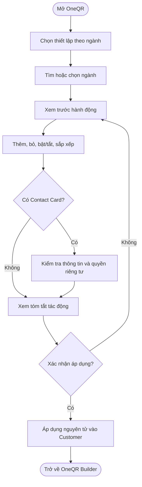
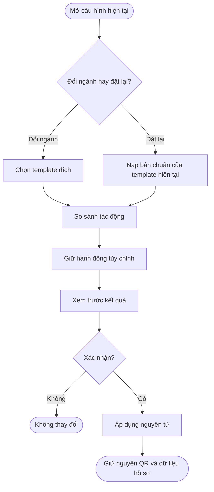
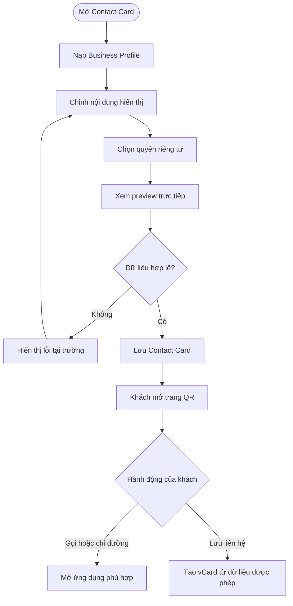
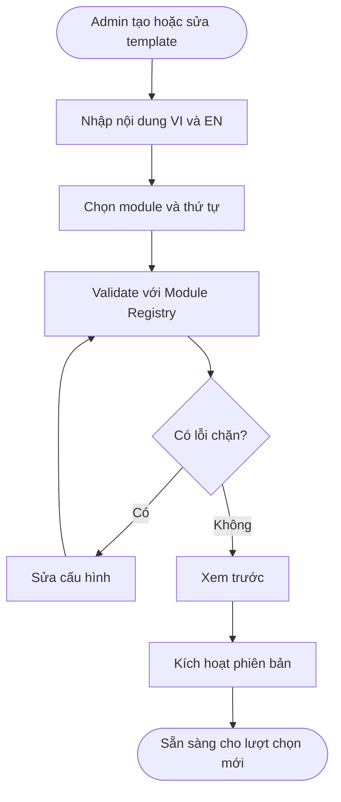
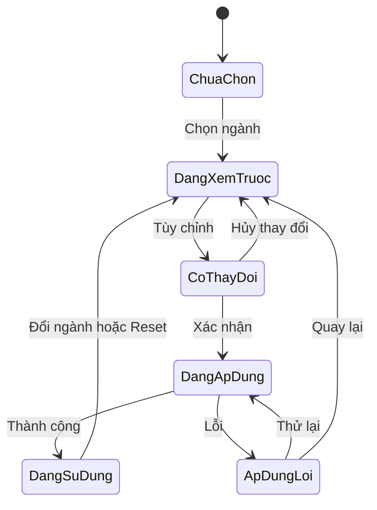
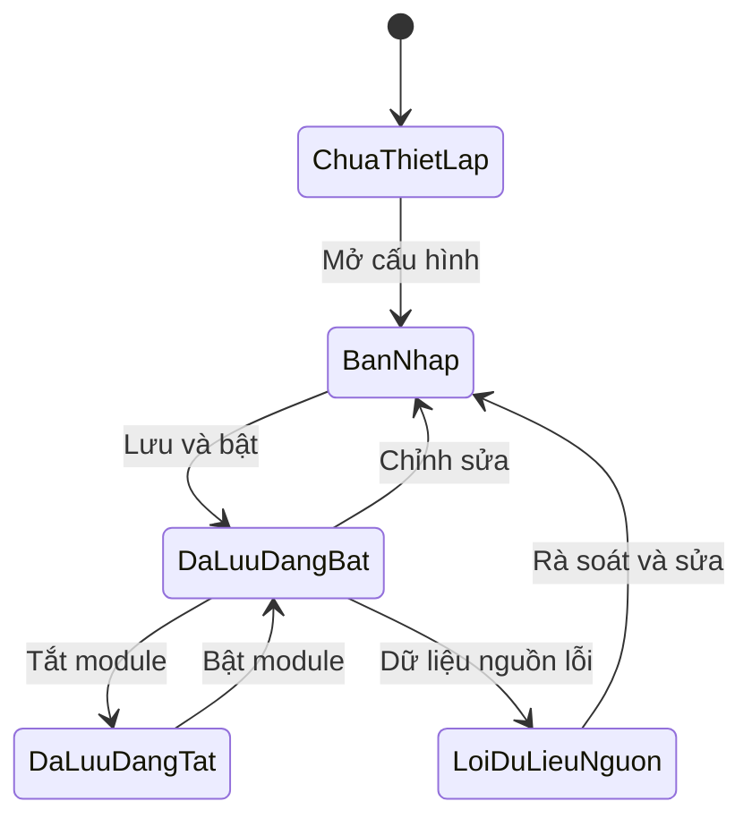

## OneQR — Mở rộng mẫu theo nhiều ngành nghề

**Cập nhật lần cuối:** 28 tháng 9, 2026

**Đối tượng đọc:** Product Owner, BA, Business Owner, Admin vận hành, UX/UI, đội phát triển giao diện, đội phát triển máy chủ, QA và bộ phận hỗ trợ

**Trạng thái:** Bản nháp — cần chốt các mục “Cần làm rõ” trước khi phát triển

**Bản chia sẻ:** [Tài liệu trên GitHub](https://github.com/vlink-group/VlinkPay/blob/docs/nexora-business-references/nexora/docs/business/oneqr-multi-industry-templates.md)

**HTML thiết kế:** [OneQR — Mẫu theo ngành nghề](https://taxiq-nexora-touch.vercel.app/html/pages/oneqr-industry-templates.html)

### Tổng quan

Nâng cấp này giúp OneQR phục vụ nhiều loại hình kinh doanh thay vì phụ thuộc vào cấu hình thiên về salon. Khi bắt đầu thiết lập, chủ doanh nghiệp chọn ngành nghề; hệ thống dùng một mẫu dữ liệu để đề xuất sẵn các hành động phù hợp cho khách, ví dụ đặt lịch, xem thực đơn, yêu cầu báo giá, gọi điện, chỉ đường hoặc lưu danh thiếp. Mẫu chỉ là điểm khởi đầu: chủ doanh nghiệp vẫn được thêm, bỏ, bật/tắt và sắp xếp hành động trước khi áp dụng.

Phạm vi nghiệp vụ của tài liệu gồm:

- Danh mục 115 ngành nghề thuộc 14 nhóm.
- Mẫu hành động dành cho đối tượng **Customer** theo từng ngành.
- Luồng chọn, tìm kiếm, xem trước, tùy chỉnh, áp dụng, đổi và đặt lại mẫu.
- **Danh thiếp · Contact Card** dùng chung dữ liệu hồ sơ doanh nghiệp và cung cấp tệp vCard.
- Quy tắc giữ nguyên mã QR, hồ sơ doanh nghiệp và hành động do người dùng tự thêm.
- Cấu hình quản trị để thêm ngành hoặc thay đổi mẫu bằng dữ liệu, không viết logic riêng cho từng ngành.

Nâng cấp không thay thế OneQR Builder đang có trên `staging`. Nó bổ sung một lớp khởi tạo nhanh và một module Contact Card vào luồng hiện hữu. Sau khi áp dụng, doanh nghiệp tiếp tục quản lý các hành động bằng cùng OneQR Builder.

#### Mục tiêu kinh doanh

| Mục tiêu | Kết quả mong đợi |
| :--- | :--- |
| Rút ngắn thời gian thiết lập | Doanh nghiệp có một bộ hành động phù hợp ngay sau khi chọn ngành, không phải hiểu toàn bộ kho module trước. |
| Mở rộng tệp khách hàng | OneQR dùng được cho bán lẻ, ăn uống, dịch vụ tại nhà, sức khỏe, giáo dục, tài chính, sự kiện, nghệ sĩ, cá nhân làm nghề tự do và các nhóm khác. |
| Giữ tính linh hoạt | Mẫu không khóa người dùng vào một ngành hoặc một bộ module cố định. |
| Giảm nhập dữ liệu lặp | Tên, logo, số điện thoại, email, website, địa chỉ và giờ mở cửa được dùng lại cho Contact Card và các hành động liên quan. |
| Bảo vệ tài sản đã in | URL và mã QR hiện hữu không đổi khi doanh nghiệp đổi ngành hoặc đổi mẫu. |
| Dễ vận hành | Thêm hoặc điều chỉnh ngành chủ yếu là thay đổi dữ liệu cấu hình có phiên bản. |

#### Trong phạm vi bản nâng cấp

- Điểm vào từ màn hình OneQR hiện tại sang bước chọn ngành.
- Tìm kiếm và lọc 115 ngành trong 14 nhóm.
- Xem trước các hành động được đề xuất trước khi áp dụng.
- Kéo thả, dùng tay nắm hoặc nút lên/xuống để đổi thứ tự.
- Thêm, xóa khỏi bản xem trước, bật/tắt và chỉnh nhãn hành động theo khả năng hiện có của Builder.
- Áp dụng mẫu vào danh sách hành động của Customer.
- Đổi ngành, đổi mẫu và đặt lại về đề xuất của mẫu.
- Giữ hành động tùy chỉnh do doanh nghiệp tự tạo.
- Cấu hình và hiển thị Contact Card của doanh nghiệp.
- Tải tệp `.vcf` chuẩn vCard từ trang khách quét.
- Hỗ trợ bản sao giao diện tiếng Anh và tiếng Việt cho tên nhóm, tên ngành và nội dung chính của luồng.

#### Ngoài phạm vi của bản đầu

- Thay đổi cấu hình cho Staff, Owner hoặc AIVoice theo ngành.
- Tạo danh thiếp cá nhân riêng cho từng nhân viên/thợ.
- Đồng bộ Google Business Profile thực tế; bản đầu chỉ chuẩn bị điểm mở rộng hoặc mô phỏng trên prototype.
- Apple Wallet, Google Wallet, trao đổi liên hệ hai chiều và đồng bộ CRM.
- Auto-sync nội dung từ YouTube, TikTok, Instagram, Spotify hoặc nền tảng bên ngoài.
- Publish/rollback theo phiên bản riêng nếu sản phẩm tiếp tục dùng cơ chế lưu trực tiếp hiện có trên `staging`.
- Các hạng mục vận hành FR-15 đến FR-24 như hẹn giờ nút, kiểm tra link sống/chết, file in PDF và báo cáo nâng cao, trừ phần giờ mở cửa được dùng lại trong Contact Card.
- Recruitment, Supply Network, AI Catalog Import, AI Sales and Promotion, Gift Card Center và CryptoMap360 Listing trong bộ handoff tổng.

> **Nguyên tắc phạm vi:** các khả năng xuất hiện trong prototype hoặc tài liệu nguồn nhưng nằm ngoài danh sách “Trong phạm vi” không tự động trở thành yêu cầu của bản đầu.

#### Hiện trạng `staging` và khoảng cách cần nâng cấp

| Khu vực | Hiện trạng đã xác minh trên `staging` | Nâng cấp cần bổ sung |
| :--- | :--- | :--- |
| OneQR Builder | Có bốn đối tượng Customer, Staff, Owner và AIVoice; hỗ trợ thêm, sửa, xóa, bật/tắt và sắp xếp module. | Thêm điểm vào “Chọn ngành” và áp dụng mẫu cho Customer. |
| Kho module | Có catalog module và khả năng thêm Custom URL. | Bổ sung metadata để map module vào 115 mẫu ngành; xử lý module chưa được hỗ trợ trên môi trường chạy. |
| Xem trước | Có xem trước OneQR theo đối tượng. | Có bước xem trước tác động của mẫu trước khi ghi vào cấu hình live. |
| Lưu cấu hình | Lưu danh sách module/role configuration vào OneQR hiện tại. | Áp dụng mẫu nguyên tử, không làm mất hành động tùy chỉnh. |
| QR và URL | Đã có mã QR, trang public và tải mã. | Giữ nguyên slug/URL khi đổi ngành hoặc mẫu. |
| Analytics | Đã có dữ liệu phân tích OneQR. | Giữ lịch sử; không tạo OneQR mới chỉ vì đổi mẫu. |
| Contact Card | Chưa có cấu hình Contact Card riêng và trang public chưa trả đủ dữ liệu liên hệ. | Thêm module, cấu hình, quy tắc riêng tư, preview và tải vCard. |
| Quản trị mẫu ngành | Chưa có domain/API quản lý mẫu ngành. | Thêm danh mục nhóm ngành, template, mapping module, trạng thái và phiên bản. |

### Khái niệm chính

| Thuật ngữ | Ý nghĩa nghiệp vụ |
| :--- | :--- |
| OneQR | Một mã QR ổn định dẫn tới trang hành động của doanh nghiệp. Nội dung phía sau mã có thể thay đổi nhưng mã và URL không đổi. |
| Nhóm ngành | Cấp phân loại dùng để tổ chức danh sách ngành, ví dụ Ăn uống, Nhà & xe hoặc Sức khỏe & y tế. |
| Mẫu ngành | Bộ cấu hình dữ liệu gồm ngành, nội dung song ngữ và các module Customer được đề xuất theo thứ tự. |
| Hành động mẫu | Module được hệ thống thêm hoặc quản lý từ mẫu ngành. |
| Hành động tùy chỉnh | Module do doanh nghiệp tự thêm ngoài mẫu, bao gồm Custom URL hoặc module lấy từ kho chức năng. |
| Module | Một hành động trên trang OneQR, ví dụ Call, Directions, Booking, Menu hoặc Contact Card. |
| Customer configuration | Danh sách module hiển thị cho khách quét QR. Đây là phạm vi duy nhất bị tác động bởi mẫu ngành ở bản đầu. |
| Contact Card | Danh thiếp doanh nghiệp hiển thị thông tin liên hệ, quyền riêng tư và hành động lưu vCard. Đây là một module riêng, không phải Custom URL. |
| Business Profile | Nguồn dữ liệu doanh nghiệp có sẵn như tên, logo, điện thoại, email, website, địa chỉ và giờ mở cửa. |
| Áp dụng mẫu | Xác nhận ghi bộ module đề xuất vào cấu hình Customer hiện tại theo quy tắc hợp nhất. |
| Đặt lại mẫu | Khôi phục phần module do mẫu quản lý về cấu hình chuẩn của mẫu đang chọn, đồng thời giữ hành động tùy chỉnh. |
| Phiên bản mẫu | Dấu mốc cấu hình giúp xác định doanh nghiệp đã áp dụng bộ đề xuất nào và hỗ trợ audit/thay đổi về sau. |

### Vai trò người dùng

| Vai trò | Trách nhiệm và quyền chính |
| :--- | :--- |
| Chủ doanh nghiệp / người quản lý được phân quyền | Chọn ngành, xem trước, tùy chỉnh, áp dụng hoặc đổi mẫu; cấu hình Contact Card; quản lý module sau khi áp dụng. |
| Khách quét QR | Xem các hành động Customer, xem Contact Card, gọi/nhắn/chỉ đường theo dữ liệu được phép hiển thị và lưu vCard. |
| Admin vận hành | Quản lý nhóm ngành, ngành, template, mapping module, nội dung song ngữ, trạng thái và phiên bản; xem lịch sử thay đổi. |
| Bộ phận hỗ trợ | Tra cứu mẫu đã áp dụng và giải thích hành vi; không tự thay đổi cấu hình doanh nghiệp nếu không có quyền. |
| Hệ thống | Hợp nhất mẫu với cấu hình hiện tại, bảo toàn dữ liệu, kiểm tra module hợp lệ, ghi audit và phục vụ trang public. |

### Luồng nghiệp vụ đầu cuối

#### Luồng 1: Chọn và áp dụng mẫu ngành lần đầu

**Người thực hiện chính:** Chủ doanh nghiệp hoặc người quản lý được phân quyền.  
**Điểm bắt đầu:** Từ `QR Stations > OneQR`, người dùng chọn thiết lập theo ngành; hoặc hệ thống đề nghị chọn ngành khi Customer chưa có cấu hình.  
**Kết quả:** Bộ hành động Customer phù hợp được áp dụng vào OneQR hiện tại mà không đổi QR/URL.

**Nhu cầu người dùng:**

- **Là** chủ doanh nghiệp, **tôi muốn** tìm ngành bằng tên tiếng Việt hoặc tiếng Anh **để** không phải duyệt toàn bộ danh mục.
- **Là** chủ doanh nghiệp, **tôi muốn** xem trước và sắp xếp các hành động được đề xuất **để** biết khách sẽ thấy gì trước khi áp dụng.
- **Là** chủ doanh nghiệp, **tôi muốn** áp dụng mẫu vào OneQR đang có **để** giữ nguyên mã QR đã in.

| Bước | Người thực hiện | Hành động | Phản hồi hệ thống | Quy tắc |
| :--- | :--- | :--- | :--- | :--- |
| 1 | Người dùng | Mở thiết lập theo ngành từ OneQR. | Hiển thị ô tìm kiếm, 14 nhóm và các ngành đang hoạt động. | Không tạo OneQR mới. |
| 2 | Người dùng | Tìm hoặc chọn một ngành. | Hiển thị tên ngành, mô tả ngắn và bộ hành động được đề xuất. | Tìm theo tên VI/EN và từ khóa được cấu hình. |
| 3 | Hệ thống | So sánh mẫu với cấu hình Customer hiện tại. | Phân loại hành động sẽ thêm, giữ, cập nhật, không hỗ trợ hoặc cần người dùng xác nhận. | Không ghi dữ liệu ở bước này. |
| 4 | Người dùng | Bật/tắt, thêm/bỏ và kéo thả để sắp xếp. | Preview cập nhật ngay theo thứ tự và trạng thái mới. | Phải có thao tác bàn phím/nút thay thế kéo thả. |
| 5 | Người dùng | Mở Contact Card nếu mẫu có đề xuất. | Dùng trước dữ liệu Business Profile và cho phép chỉnh phần hiển thị. | Không hỏi lại dữ liệu đã có nếu không cần override. |
| 6 | Người dùng | Chọn **Apply template**. | Hiển thị tóm tắt tác động và yêu cầu xác nhận. | Không dùng nút **Edit** riêng ở phần đầu luồng. |
| 7 | Hệ thống | Kiểm tra quyền và module hợp lệ, rồi áp dụng nguyên tử. | Toàn bộ thay đổi thành công hoặc giữ nguyên cấu hình cũ nếu có lỗi. | Chỉ tác động Customer. |
| 8 | Hệ thống | Trả người dùng về Builder. | Hiển thị template đang dùng, thời điểm áp dụng và cấu hình live mới. | Lần quét tiếp theo dùng cấu hình mới theo cơ chế cache hiện hành. |

#### Luồng 2: Đổi ngành hoặc đặt lại mẫu

**Người thực hiện chính:** Chủ doanh nghiệp hoặc người quản lý được phân quyền.  
**Điểm bắt đầu:** OneQR đã có template hoặc đã có module Customer.  
**Kết quả:** Template mới được áp dụng hoặc template hiện tại được đặt lại; dữ liệu cần bảo toàn không bị mất.

**Nhu cầu người dùng:**

- **Là** chủ doanh nghiệp, **tôi muốn** biết thay đổi nào sẽ xảy ra trước khi đổi ngành **để** tránh mất hành động đang dùng.
- **Là** chủ doanh nghiệp, **tôi muốn** giữ các hành động tự thêm **để** không phải cấu hình lại sau khi đổi mẫu.
- **Là** chủ doanh nghiệp, **tôi muốn** đặt lại đề xuất của mẫu **để** khôi phục thứ tự chuẩn mà vẫn giữ dữ liệu riêng của mình.

| Bước | Người thực hiện | Hành động | Phản hồi hệ thống | Quy tắc |
| :--- | :--- | :--- | :--- | :--- |
| 1 | Người dùng | Chọn **Change industry** hoặc **Reset template**. | Nạp cấu hình hiện tại và phiên bản mẫu đã áp dụng. | Chưa thay đổi trang live. |
| 2 | Hệ thống | So sánh cấu hình hiện tại với template đích. | Hiển thị danh sách thêm, bỏ, giữ, chuyển thứ tự và mục không hỗ trợ. | Phân biệt module do mẫu quản lý với module do người dùng thêm. |
| 3 | Người dùng | Rà soát và tùy chỉnh kết quả hợp nhất. | Preview phản ánh kết quả dự kiến. | Không tự bật lại module người dùng đã chủ động tắt nếu chưa chọn Reset. |
| 4 | Người dùng | Xác nhận. | Hệ thống lưu thay đổi, template ID/version và audit. | Giữ Business Profile, Contact Card override, slug, QR và analytics. |
| 5 | Hệ thống | Hoàn tất hoặc báo lỗi. | Thành công: trang live đổi; lỗi: cấu hình cũ còn nguyên và có hướng dẫn thử lại. | Không để cấu hình ở trạng thái áp dụng dở dang. |

#### Luồng 3: Thiết lập Danh thiếp · Contact Card

**Người thực hiện chính:** Chủ doanh nghiệp hoặc người quản lý được phân quyền.  
**Điểm bắt đầu:** Người dùng mở Contact Card từ bước review template hoặc từ OneQR Builder.  
**Kết quả:** Thông tin được lưu, preview cập nhật và khách có thể tải vCard theo đúng quyền riêng tư.

**Nhu cầu người dùng:**

- **Là** chủ doanh nghiệp, **tôi muốn** dùng lại thông tin doanh nghiệp đã có **để** không nhập cùng dữ liệu nhiều lần.
- **Là** chủ doanh nghiệp, **tôi muốn** chọn mức hiển thị số điện thoại và địa chỉ **để** bảo vệ thông tin nhạy cảm.
- **Là** khách, **tôi muốn** lưu danh thiếp vào điện thoại **để** liên hệ lại mà không phải nhập thủ công.

| Bước | Người thực hiện | Hành động | Phản hồi hệ thống | Quy tắc |
| :--- | :--- | :--- | :--- | :--- |
| 1 | Người dùng | Mở Contact Card. | Điền sẵn tên, logo, điện thoại, email, website, địa chỉ và giờ mở cửa từ Business Profile. | Dữ liệu nguồn không được sao chép thành nhiều bản không đồng bộ. |
| 2 | Người dùng | Chỉnh tên hiển thị, chức danh/giới thiệu ngắn và tiểu sử. | Preview trên cùng cập nhật theo từng thay đổi. | Preview phải hoạt động ở desktop và mobile. |
| 3 | Người dùng | Chọn hiển thị số điện thoại. | `Show`: hiện số và hành động gọi/nhắn; `Hide`: không lộ số và không hiện hành động tương ứng. | Dữ liệu ẩn không được đưa vào HTML public hoặc vCard. |
| 4 | Người dùng | Chọn hiển thị địa chỉ. | `Full`: hiện địa chỉ và Directions; `Area`: chỉ hiện khu vực; `Hidden`: không hiện địa chỉ. | vCard chỉ có ADR đầy đủ khi chọn Full. |
| 5 | Người dùng | Kiểm tra giờ mở cửa và giao diện thẻ. | Preview hiển thị thông tin đã cho phép. | Múi giờ theo doanh nghiệp. |
| 6 | Người dùng | Lưu. | Ghi Contact Card và cập nhật preview OneQR. | Nếu lưu lỗi, giữ bản đã lưu trước đó. |
| 7 | Khách | Mở Contact Card trên trang QR. | Thấy các trường/hành động được phép. | Mobile-first, hỗ trợ bàn phím và trình đọc màn hình. |
| 8 | Khách | Chọn **Save contact**. | Tải/mở tệp `.vcf` vCard 3.0 với dữ liệu đã cho phép. | Tên file an toàn; không chứa trường bị ẩn. |

#### Luồng 4: Admin quản lý danh mục ngành và template

**Người thực hiện chính:** Admin được phân quyền.  
**Điểm bắt đầu:** Cần thêm ngành, thay đổi nội dung hoặc cập nhật bộ module đề xuất.  
**Kết quả:** Có phiên bản template hợp lệ, truy vết được và sẵn sàng cho doanh nghiệp chọn.

**Nhu cầu người dùng:**

- **Là** Admin, **tôi muốn** thêm ngành bằng cấu hình **để** không cần phát hành code riêng cho từng ngành.
- **Là** Admin, **tôi muốn** xem trước template **để** kiểm tra nội dung song ngữ và module trước khi kích hoạt.
- **Là** Admin, **tôi muốn** phiên bản hóa thay đổi **để** không âm thầm làm đổi cấu hình của doanh nghiệp đã áp dụng.

| Bước | Người thực hiện | Hành động | Phản hồi hệ thống | Quy tắc |
| :--- | :--- | :--- | :--- | :--- |
| 1 | Admin | Tạo/sửa nhóm ngành hoặc ngành. | Kiểm tra slug duy nhất và nội dung VI/EN. | Không dùng emoji làm định danh. |
| 2 | Admin | Chọn module, nhãn, trạng thái mặc định và thứ tự. | Chỉ cho chọn module hợp lệ trong registry. | Module Contact Card phải dùng loại riêng. |
| 3 | Admin | Xem trước desktop/mobile. | Hiển thị cảnh báo module thiếu, nhãn trùng, liên kết mẫu không hợp lệ. | Không kích hoạt khi có lỗi chặn. |
| 4 | Admin | Kích hoạt phiên bản. | Template mới xuất hiện cho lượt chọn mới; lưu audit. | Không tự ghi đè cấu hình doanh nghiệp đã dùng template cũ. |
| 5 | Admin | Ngừng hoạt động template/ngành. | Không cho chọn mới; doanh nghiệp hiện hữu vẫn sử dụng cấu hình đã lưu. | Không làm hỏng trang QR hiện tại. |

### Cấu hình hệ thống và quản trị

#### Cấu trúc template nghiệp vụ tối thiểu

| Nhóm dữ liệu | Trường nghiệp vụ | Yêu cầu |
| :--- | :--- | :--- |
| Nhận diện | ID/slug, tên VI, tên EN, nhóm ngành, icon | Slug duy nhất, ổn định; icon theo cùng thư viện và ngữ nghĩa. |
| Tìm kiếm | Từ khóa VI/EN, thứ tự, trạng thái | Tìm không phân biệt hoa/thường; ngành ngừng hoạt động không xuất hiện cho lượt chọn mới. |
| Trình bày | Mô tả ngắn, tên doanh nghiệp mẫu, preview | Dữ liệu mẫu phải được đánh dấu là mẫu. |
| Mapping | Module key, nhãn VI/EN, thứ tự, bật/tắt mặc định | Module key phải tồn tại trong registry hoặc có chính sách fallback rõ ràng. |
| Quản trị | Phiên bản, người sửa, thời điểm, ghi chú | Có lịch sử và khả năng xác định phiên bản doanh nghiệp đã áp dụng. |

#### Danh mục 14 nhóm ngành

| Nhóm | Số ngành theo tài liệu nguồn | Ví dụ |
| :--- | ---: | :--- |
| Làm đẹp & chăm sóc | 5 | Nail, tóc/barber, massage, mi, xăm |
| Ăn uống | 3 | Nhà hàng, cà phê, xe đồ ăn |
| Cá nhân / làm riêng | 7 | Thợ riêng, PT, MUA, coach, KOL, freelance, chụp ảnh |
| Nghệ sĩ & giải trí | 6 | Ca sĩ, nhạc sĩ, ban nhạc, người mẫu, diễn viên, MC |
| Dịch vụ & lớp học | 5 | Gym, gia sư, xe đưa đón, dịch vụ tận nhà, shop online |
| Cửa hàng & sản phẩm | 20 | Tạp hóa, mỹ phẩm, supply, tiệm vàng, hoa, pet shop |
| Nhà & xe | 28 | Sửa xe, dealer, xây dựng, điện, máy lạnh, dọn nhà |
| Sức khỏe & y tế | 9 | Phòng khám, nha khoa, nhà thuốc, thú y, medspa |
| Gia đình & giáo dục | 6 | Giữ trẻ, trường học, dạy lái xe, nhạc, võ, múa |
| Sự kiện & cưới hỏi | 5 | Cưới hỏi, venue, photobooth, catering |
| Tài chính & giấy tờ | 5 | Chuyển tiền, notary, dịch thuật, mortgage, tuyển dụng |
| Chuyên môn | 9 | Luật, địa ốc, bảo hiểm, thuế, du lịch, IT, agency |
| Cộng đồng & giải trí | 6 | Nhà thờ/chùa, thiện nguyện, karaoke, pet grooming, tang lễ |
| Khác | 1 | Mẫu trắng |

Tổng số ngành theo bảng trên là **115**.

#### Quyền quản trị

| Hành động | Chủ doanh nghiệp | Admin nội dung | Admin hệ thống |
| :--- | :---: | :---: | :---: |
| Chọn/đổi/reset template cho OneQR của mình | Có | Không mặc định | Có khi được ủy quyền hỗ trợ |
| Tùy chỉnh module sau khi áp dụng | Có | Không | Có khi được ủy quyền hỗ trợ |
| Cấu hình Contact Card của doanh nghiệp | Có | Không | Có khi được ủy quyền hỗ trợ |
| Tạo/sửa bản nháp nhóm ngành và template | Không | Có | Có |
| Kích hoạt/ngừng hoạt động phiên bản | Không | Theo quyền | Có |
| Sửa Module Registry | Không | Không | Có |
| Xem audit | Dữ liệu của doanh nghiệp | Phần nội dung | Toàn hệ thống theo phạm vi quyền |

#### Định hướng tích hợp cần đội kỹ thuật chốt

Để giữ trọng tâm nghiệp vụ, tài liệu không khóa cứng tên endpoint. Hệ thống cần tối thiểu các khả năng sau:

- Lấy danh sách/tìm kiếm nhóm ngành và template đang hoạt động.
- Lấy chi tiết template và kết quả so sánh với cấu hình OneQR hiện tại.
- Áp dụng/đặt lại template theo một thao tác nguyên tử và quy tắc giữ module tùy chỉnh.
- Lấy/lưu Contact Card và tạo vCard public từ dữ liệu đã cho phép.
- Quản trị template có phiên bản, trạng thái và audit.

Backend `staging` hiện chưa có domain/API cho template ngành và Contact Card. Việc bổ sung backend cần được chốt thành phạm vi kỹ thuật riêng trước khi triển khai; tài liệu này không ủy quyền thay đổi backend.

### Vòng đời trạng thái

#### Trạng thái áp dụng template của doanh nghiệp

| Trạng thái | Ý nghĩa | Chuyển tiếp hợp lệ |
| :--- | :--- | :--- |
| Chưa chọn | OneQR chưa gắn template ngành. | Chọn ngành → Đang xem trước. |
| Đang xem trước | Người dùng đang rà soát template, chưa tác động trang live. | Chỉnh sửa → Có thay đổi chưa áp dụng; thoát → Chưa chọn/Đang sử dụng. |
| Có thay đổi chưa áp dụng | Preview khác cấu hình live. | Xác nhận → Đang áp dụng; hủy → quay về cấu hình trước. |
| Đang áp dụng | Hệ thống đang validate và lưu nguyên tử. | Thành công → Đang sử dụng; lỗi → Áp dụng lỗi. |
| Đang sử dụng | Template/version đã được ghi nhận; trang live dùng cấu hình mới. | Đổi ngành/Reset → Đang xem trước. |
| Áp dụng lỗi | Cấu hình live cũ vẫn được giữ. | Thử lại → Đang áp dụng; quay lại → Đang xem trước. |

#### Trạng thái Contact Card

| Trạng thái | Ý nghĩa | Hành vi public |
| :--- | :--- | :--- |
| Chưa thiết lập | Chưa có cấu hình Contact Card hợp lệ. | Module không hiển thị hoặc yêu cầu Owner hoàn tất trước khi bật. |
| Bản nháp trong phiên | Người dùng đang sửa nhưng chưa lưu. | Trang public tiếp tục dùng bản đã lưu trước đó. |
| Đã lưu và đang bật | Cấu hình hợp lệ, module được bật trong Customer. | Hiển thị trường/hành động theo quyền riêng tư. |
| Đã lưu nhưng đang tắt | Dữ liệu còn lưu, module tắt. | Khách không thấy module; có thể bật lại mà không nhập lại. |
| Lỗi dữ liệu nguồn | Một dữ liệu tham chiếu không còn hợp lệ. | Ẩn hành động bị ảnh hưởng; không lộ dữ liệu cũ ngoài quyền cho phép. |

### Quy tắc nghiệp vụ

#### Quy tắc template và module

1. Template ngành chỉ tác động cấu hình **Customer** trong bản đầu; Staff, Owner và AIVoice giữ nguyên.
2. Chọn hoặc đổi ngành không tạo OneQR mới, không đổi slug, URL hoặc mã QR.
3. Template là cấu hình khởi tạo, không phải giới hạn. Người dùng được thêm module ngoài ngành.
4. Hành động tùy chỉnh do người dùng thêm phải được giữ khi đổi hoặc reset template, trừ khi người dùng chủ động xóa.
5. Module do mẫu quản lý cần có dấu vết nguồn để hệ thống phân biệt với module tùy chỉnh.
6. Nếu template chứa module chưa tồn tại hoặc đang bị vô hiệu hóa trong Module Registry, hệ thống phải cảnh báo và bỏ qua có kiểm soát; không được làm hỏng toàn bộ trang.
7. Một module không được nhân đôi chỉ vì cả cấu hình hiện tại và template cùng tham chiếu. Quy tắc nhận diện trùng cần dựa trên loại/module key và định danh cấu hình phù hợp.
8. Trước khi đổi ngành hoặc reset, hệ thống phải hiển thị tóm tắt tác động.
9. Áp dụng template phải nguyên tử: hoặc lưu toàn bộ kết quả hợp lệ, hoặc giữ nguyên cấu hình live trước đó.
10. Sau khi áp dụng thành công, cấu hình có hiệu lực theo cơ chế lưu/live hiện tại của OneQR `staging`; không thêm bước Publish riêng trong phạm vi này.
11. Lịch sử scan/click không bị xóa hoặc đặt lại khi đổi template. Báo cáo lịch sử cần tiếp tục đối chiếu được với module đã tồn tại.
12. Nội dung tên nhóm, ngành và nhãn mặc định phải có en-US và vi-VN. en-US là nguồn copy tiếng Anh chính.

#### Quy tắc kéo thả và điều khiển item

1. Desktop hỗ trợ kéo thả bằng chuột; mobile có tay nắm rõ ràng.
2. Phải có nút hoặc bàn phím thay thế thao tác kéo thả để đáp ứng accessibility.
3. Các nút lên, xuống và xóa dùng cùng kích thước vùng bấm, icon 16px, căn giữa và có nhãn hỗ trợ đọc màn hình.
4. Nút lên bị vô hiệu hóa ở item đầu; nút xuống bị vô hiệu hóa ở item cuối.
5. Không dùng icon cây kéo. Icon mỗi hành động phải đúng ngữ nghĩa và không tái sử dụng tùy tiện cho các chức năng khác nhau.

#### Quy tắc Contact Card

1. Contact Card là module riêng, không triển khai dưới dạng Custom URL.
2. Business Profile là nguồn dữ liệu chuẩn. Contact Card chỉ lưu override cần thiết, thiết lập hiển thị, theme và nội dung mở rộng.
3. Bản đầu chỉ hỗ trợ danh thiếp doanh nghiệp. Danh thiếp cá nhân/nhân viên thuộc giai đoạn sau.
4. `phone_mode = show` cho phép hiển thị số và hành động Call/Text; `hide` phải loại số khỏi giao diện public và vCard.
5. `address_mode = full` hiển thị địa chỉ đầy đủ, Directions và ADR trong vCard.
6. `address_mode = area` chỉ hiển thị khu vực phục vụ; không có số nhà, Directions tới địa chỉ cụ thể hoặc ADR đầy đủ.
7. `address_mode = hidden` không hiển thị địa chỉ ở bất kỳ đầu ra public nào.
8. Tệp vCard dùng phiên bản 3.0, UTF-8, có ít nhất FN và TEL khi số điện thoại được phép; các trường khác chỉ thêm khi có dữ liệu và được phép.
9. Preview Contact Card phải cập nhật trực tiếp và nằm trong vùng nhìn thấy trên mobile, không phụ thuộc hoàn toàn vào cột preview desktop.
10. Theme chỉ thay đổi trình bày, không thay đổi dữ liệu hoặc quyền riêng tư.
11. Giờ mở cửa đọc từ dữ liệu doanh nghiệp theo múi giờ của doanh nghiệp; không yêu cầu nhập lại nếu đã có.
12. Nếu Contact Card được mẫu đề xuất nhưng chưa đủ dữ liệu bắt buộc, người dùng có thể tiếp tục áp dụng các module khác; Contact Card ở trạng thái chưa hoàn tất và không hiển thị public cho tới khi hợp lệ.

#### Quy tắc quản trị và phiên bản

1. Thêm ngành mới bằng dữ liệu cấu hình; chỉ cần thay code khi phát sinh loại module/hành vi hoàn toàn mới.
2. Slug ngành và module key ổn định, không tái sử dụng cho ý nghĩa khác.
3. Template mới hoặc thay đổi lớn tạo phiên bản mới; không âm thầm ghi đè cấu hình doanh nghiệp đã áp dụng.
4. Ngừng hoạt động ngành/template chỉ ngăn lượt chọn mới, không làm hỏng cấu hình hiện hữu.
5. Mọi thao tác kích hoạt, ngừng hoạt động hoặc đổi mapping phải có audit gồm người thực hiện, thời điểm, phiên bản trước/sau và lý do.

### Tiêu chí hoàn thành nghiệp vụ

| ID | Điều kiện chấp nhận |
| :--- | :--- |
| AC-01 | Từ OneQR hiện tại, người dùng mở được luồng chọn ngành mà không tạo mã QR mới. |
| AC-02 | Danh mục hiển thị đủ 115 ngành thuộc 14 nhóm theo nguồn dữ liệu đã chốt. |
| AC-03 | Tìm kiếm trả kết quả theo tên/từ khóa tiếng Việt và tiếng Anh, không phân biệt hoa thường. |
| AC-04 | Chọn một ngành hiển thị đúng module, nhãn, trạng thái mặc định và thứ tự của template. |
| AC-05 | Người dùng kéo thả và dùng nút lên/xuống để sắp xếp; item đầu/cuối có trạng thái nút đúng. |
| AC-06 | Người dùng thêm, bỏ hoặc bật/tắt hành động trong preview và thấy kết quả cập nhật ngay. |
| AC-07 | Apply chỉ thay đổi danh sách Customer; Staff, Owner và AIVoice không đổi. |
| AC-08 | Apply thành công không đổi QR, slug, Business Profile hoặc lịch sử analytics. |
| AC-09 | Đổi ngành và Reset giữ toàn bộ hành động tùy chỉnh, trừ mục người dùng chủ động xóa. |
| AC-10 | Khi apply lỗi, cấu hình live cũ vẫn nguyên vẹn và người dùng có thể thử lại. |
| AC-11 | Contact Card lấy sẵn thông tin doanh nghiệp và không yêu cầu nhập lại dữ liệu đã có. |
| AC-12 | Chế độ ẩn điện thoại loại số và Call/Text khỏi trang public lẫn vCard. |
| AC-13 | Ba chế độ địa chỉ Full/Area/Hidden cho kết quả đúng trên card, Directions và vCard. |
| AC-14 | Save contact tạo được `.vcf` vCard 3.0 mở được trên iOS và Android với dữ liệu cho phép. |
| AC-15 | Module không tồn tại/không hoạt động tạo cảnh báo rõ ràng và không làm hỏng quá trình với các module còn lại. |
| AC-16 | Template có phiên bản và audit; việc kích hoạt phiên bản mới không tự sửa OneQR hiện hữu. |
| AC-17 | Giao diện chính hoạt động ở desktop và phone; icon/nút cân đối, vùng bấm nhất quán và có nhãn accessibility. |

### Tình huống biên và cách xử lý

| Tình huống | Cách xử lý mong đợi |
| :--- | :--- |
| Không tìm thấy ngành | Cho phép chọn **Other/Khác** hoặc bắt đầu từ mẫu trắng; vẫn truy cập được toàn bộ kho module. |
| Template không có module | Hiển thị trạng thái trống có hướng dẫn thêm hành động; không chặn người dùng. |
| Một module đã tồn tại | Hợp nhất, không tạo bản sao; giữ cấu hình người dùng nếu xung đột chưa được xác nhận. |
| Template có module không hỗ trợ | Đánh dấu mục bị bỏ qua và cho phép tiếp tục với các mục hợp lệ. |
| Người dùng đóng luồng giữa chừng | Không thay đổi trang live; có thể giữ draft cục bộ theo phiên nếu sản phẩm chốt cần. |
| Mất mạng khi Apply | Hiển thị trạng thái chưa xác định, kiểm tra lại kết quả trước khi cho thử lại; tránh gửi trùng. |
| Hai người cùng sửa | Phát hiện phiên bản cấu hình cũ và yêu cầu tải lại/so sánh; không âm thầm ghi đè. |
| Đổi template nhiều lần | Chỉ lần Apply được xác nhận mới có hiệu lực; preview trước đó không tạo dữ liệu rác. |
| Contact Card thiếu tên hiển thị | Không bật public; chỉ rõ trường bắt buộc. |
| Email/website/số điện thoại sai | Báo lỗi tại trường; không sinh vCard hoặc hành động lỗi. |
| Địa chỉ Area nhưng còn dữ liệu số nhà | Không đưa số nhà ra public/vCard; dữ liệu nguồn vẫn được giữ nội bộ. |
| Business Profile thay đổi | Contact Card dùng giá trị mới ở trường không có override; trường override cần được đánh dấu rõ. |
| Template bị ngừng hoạt động | Người đã áp dụng vẫn dùng cấu hình lưu; không được chọn template đó cho lượt mới. |
| Xóa module từng có analytics | Ẩn khỏi cấu hình hiện tại nhưng giữ lịch sử sự kiện để báo cáo quá khứ. |

### Cần làm rõ trước khi phát triển

| ID | Câu hỏi cần chốt | Đề xuất mặc định |
| :--- | :--- | :--- |
| CLR-01 | Nguồn tài liệu ghi **57 khối chức năng**, nhưng dữ liệu prototype được kiểm tra có **88 định nghĩa** và **68 module key duy nhất được 115 template tham chiếu**. Con số nào là nguồn chuẩn? | Dùng dữ liệu template thực tế làm nguồn; chuẩn hóa và loại alias/trùng trước khi chốt migration và nghiệm thu. |
| CLR-02 | Khi đổi template, module mẫu cũ mà người dùng đã chỉnh nhãn có được xem là tùy chỉnh để giữ lại không? | Giữ lại và đánh dấu là user-modified; chỉ xóa khi người dùng xác nhận. |
| CLR-03 | Có cần draft/publish/undo riêng hay tiếp tục lưu live như OneQR `staging`? | Bản đầu tiếp tục cơ chế live hiện tại; mọi thay đổi chỉ ghi khi người dùng xác nhận Apply. |
| CLR-04 | Contact Card bản đầu là Business-only hay gồm Personal/Staff? | Business-only; Personal/Staff là phase sau. |
| CLR-05 | Có làm Google Business Profile import trong bản đầu? | Không; chỉ dùng Business Profile đã có và chuẩn bị khả năng mở rộng. |
| CLR-06 | Module nào là bắt buộc/không cho xóa theo template? | Không khóa module trong bản đầu; chỉ cảnh báo với module quan trọng. |
| CLR-07 | Template mới có tự gợi ý cho doanh nghiệp đang dùng phiên bản cũ không? | Có badge/update notice, nhưng không tự áp dụng. |
| CLR-08 | Ngôn ngữ trang khách theo doanh nghiệp hay thiết bị khách? | Giữ hành vi `staging`; thiết kế dữ liệu VI/EN để mở rộng sau. |

### FAQ

#### Đổi ngành có làm đổi mã QR không?

Không. Mã QR, slug và URL là tài sản ổn định. Đổi ngành chỉ thay cấu hình hành động phía sau mã.

#### Mẫu ngành có giới hạn doanh nghiệp chỉ dùng module của ngành đó không?

Không. Mẫu chỉ là điểm bắt đầu. Doanh nghiệp có thể thêm mọi module hợp lệ từ kho chức năng.

#### Áp dụng mẫu có thay Staff, Owner hoặc AIVoice không?

Không trong bản đầu. Chỉ danh sách Customer được cập nhật.

#### Vì sao Contact Card không dùng Custom URL?

Contact Card có dữ liệu có cấu trúc, quyền riêng tư, preview và vCard. Custom URL không đủ để đảm bảo các quy tắc này.

#### Reset template có xóa hành động tự thêm không?

Không. Reset chỉ phục hồi phần do template quản lý. Hành động tùy chỉnh được giữ cho tới khi người dùng chủ động xóa.

#### Template được cập nhật có tự đổi trang của doanh nghiệp không?

Không. Phiên bản mới áp dụng cho lượt chọn mới hoặc khi doanh nghiệp chủ động review và xác nhận cập nhật.

#### Contact Card có Wallet và trao đổi liên hệ hai chiều không?

Không trong bản đầu. Hai khả năng này được giữ làm hướng mở rộng sau khi luồng business card và vCard ổn định.

### Tính năng liên quan

- **OneQR Builder hiện hữu:** nơi doanh nghiệp tiếp tục thêm, sửa, xóa, bật/tắt và sắp xếp module sau khi áp dụng template.
- **Trang OneQR công khai:** nơi khách xem module Customer và Contact Card theo cấu hình đã lưu.
- **Business Profile:** nguồn chuẩn cho tên, logo, thông tin liên hệ, địa chỉ và giờ mở cửa dùng trong Contact Card.
- **OneQR Analytics:** giữ lịch sử scan/click khi doanh nghiệp đổi template; bản nâng cấp này không định nghĩa lại mô hình analytics.

### Nguồn tham chiếu

- Mã nguồn frontend và backend trên nhánh `staging`, kiểm tra ngày 28 tháng 9, 2026.
- `OneQR-ban-giao-BA-Dev-QC (2).docx` — nguồn yêu cầu 115 ngành, 14 nhóm, Contact Card và các nguyên tắc OneQR.
- `OneQR-Nexora-Handoff-Dev-BA-QC (2).docx` — dùng để xác định các epic rộng hơn nằm ngoài phạm vi nâng cấp này.
- [Prototype HTML OneQR — Mẫu theo ngành nghề](https://taxiq-nexora-touch.vercel.app/html/pages/oneqr-industry-templates.html).
