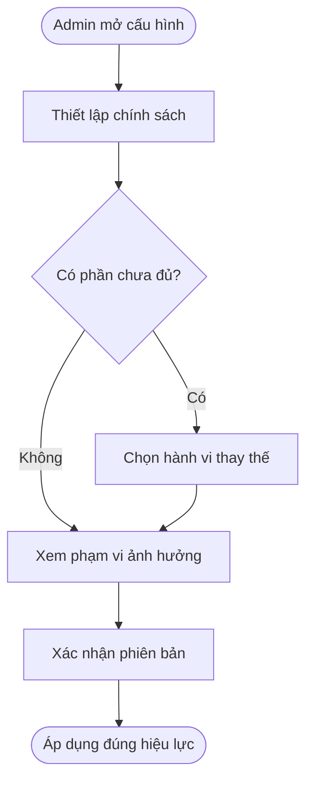
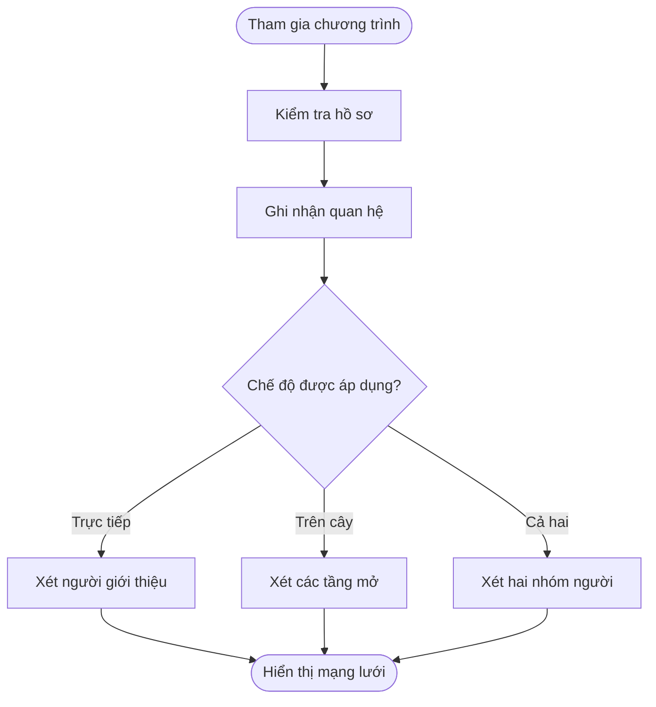
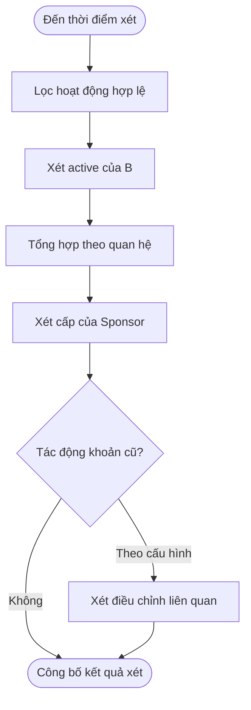
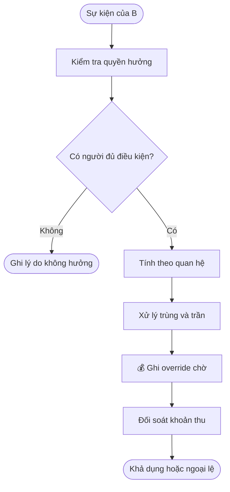
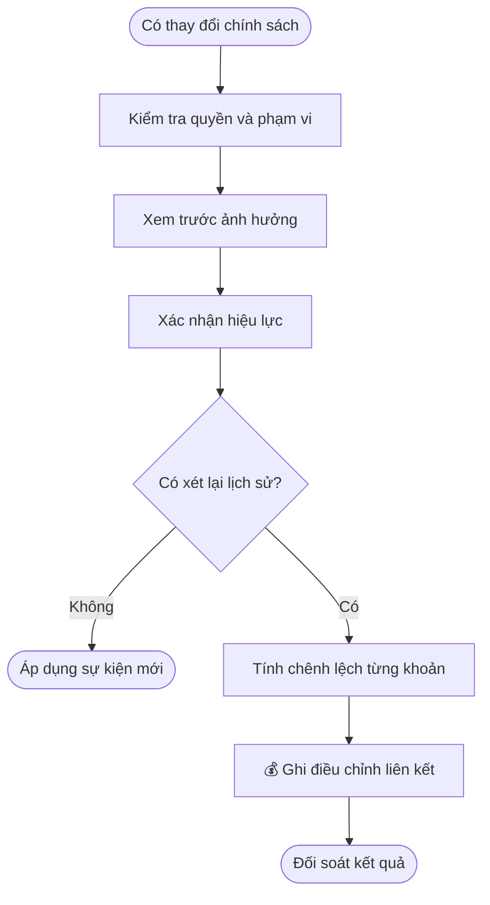
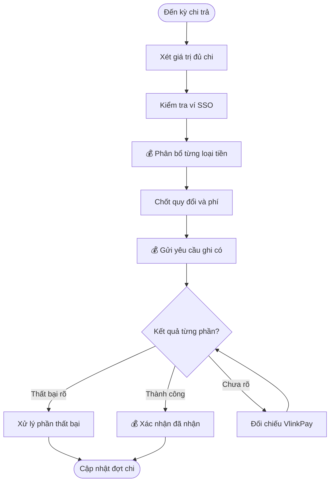
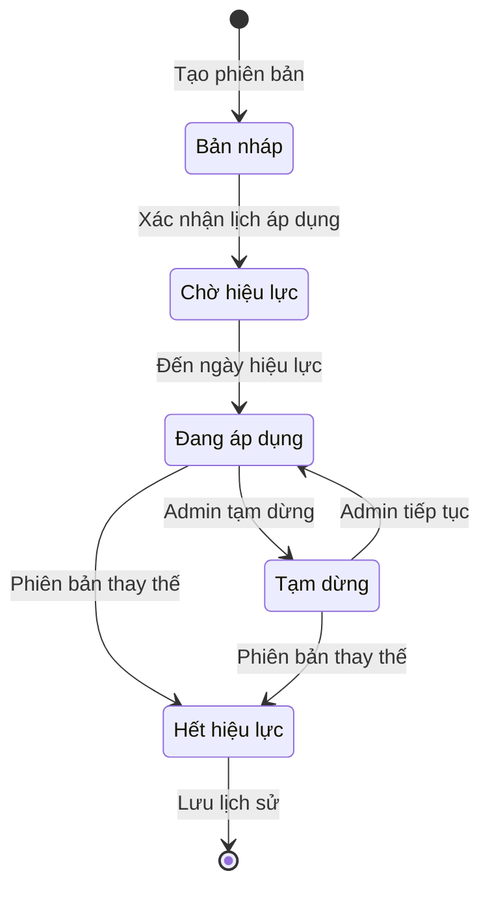
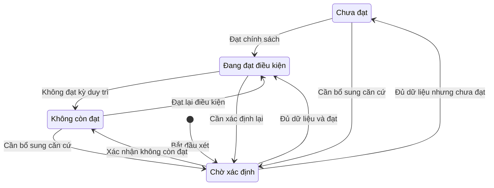
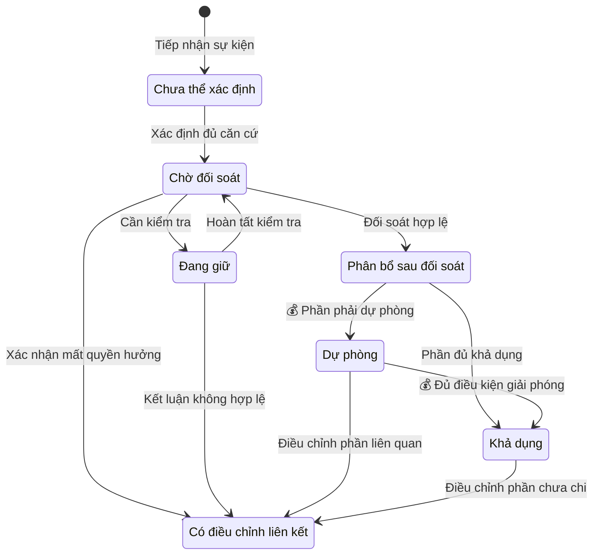
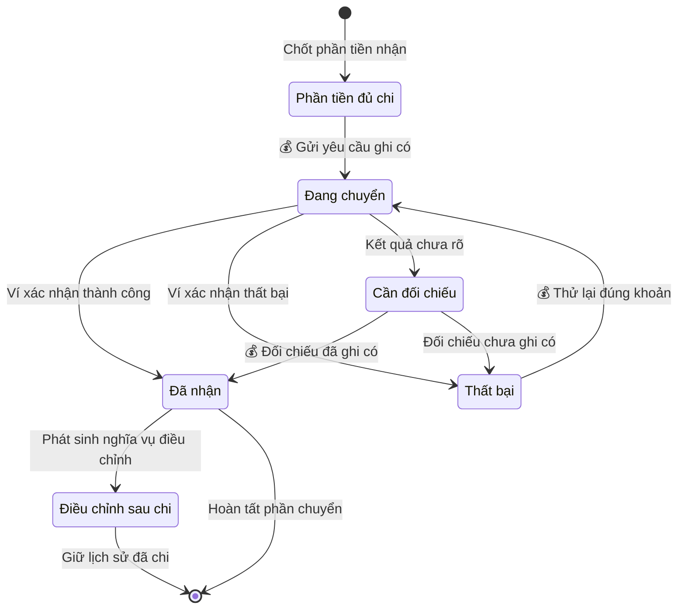

## OneQR Sponsor — Quan hệ hưởng, cấp Sponsor và chi trả override

**Cập nhật lần cuối:** 24 tháng 9 năm 2026

**Đối tượng đọc:** Sponsor, chủ doanh nghiệp (Business Owner), người dùng cá nhân, nhân viên/đối tác, người phụ trách sản phẩm, BA, quản trị viên vận hành, đội phát triển giao diện, đội phát triển máy chủ, QA, bộ phận hỗ trợ

**Trạng thái:** Đang rà soát

### Tổng quan

OneQR Sponsor nhằm khuyến khích người tham gia phát triển mạng lưới sử dụng OneQR thực tế bằng cách chia thu nhập override từ hoạt động đủ điều kiện của tài khoản B. Hệ thống cho phép cấu hình quyền hưởng theo người giới thiệu trực tiếp, người phía trên cây affiliate hoặc cả hai; xét B active và cấp Sponsor; tính, đối soát và chi trả thu nhập vào **ví VlinkPay liên kết SSO của đúng tài khoản Sponsor**. Admin thiết lập và điều chỉnh chính sách, gồm loại tiền nhận và tỷ lệ phân bổ cho mỗi loại; Sponsor thuộc mọi loại tài khoản theo dõi mạng lưới, điều kiện hưởng, khoản thu và lịch sử nhận tiền. Nexora ghi nhận, đối soát và điều phối chi trả; VlinkPay xác nhận kết quả ghi có vào ví. Người giới thiệu đã xác lập với B được giữ cố định, không có chức năng đổi Sponsor.

**Phạm vi và mức độ chốt:** Đã ghi nhận các quyết định nghiệp vụ của người dùng; giá trị chính sách do Admin cấu hình, các phụ thuộc tích hợp cần xác nhận trước triển khai.

**Nhu cầu chính:** Là Sponsor, tôi muốn biết tài khoản nào mang lại quyền hưởng cho mình, điều kiện và cách tính từng khoản override, rồi theo dõi tiền nhận qua ví VlinkPay SSO, để hiểu thu nhập và đối chiếu được mọi thay đổi.

**Trong phạm vi:** tham gia Sponsor; sử dụng quan hệ giới thiệu/cây affiliate; cấu hình B active, cấp và quyền hưởng; xử lý trùng người hưởng; tính override; thay đổi chính sách và hồi tố; đối soát, dự phòng, điều chỉnh; phân bổ nhiều loại tiền và chi trả qua ví SSO; màn hình Sponsor và cấu hình Admin liên quan.

**Ngoài phạm vi:** đổi Sponsor đã xác lập với B, bao gồm màn hình yêu cầu đổi, duyệt đổi và cấu hình cho phép đổi; nạp Ads Credit; xây Campaign Manager, Discovery hoặc bộ lọc ngành; xây trang doanh nghiệp theo template; loyalty của khách; xây lại hệ thống affiliate/KYC/KYB hoặc ví VlinkPay; rút từ VlinkPay về ngân hàng. Thu nhập trực tiếp của QR Host thuộc tài liệu Business OneQR Earnings; nhóm này chỉ bổ sung phần Sponsor và các điểm tích hợp cần thiết.

#### Quyết định đã chốt

| Nội dung | Quyết định áp dụng |
| :--- | :--- |
| Đối tượng tham gia | Tất cả loại tài khoản, bao gồm Personal, Business, Staff/Partner. Điều kiện hồ sơ, quyền hưởng và nhận tiền vẫn áp dụng theo chính sách tương ứng. |
| Quan hệ được hưởng | Admin chọn người giới thiệu trực tiếp, người phía trên cây affiliate hoặc cả hai. Quyết định này thay giới hạn chỉ người trực tiếp giới thiệu B. |
| Trùng người hưởng | Admin cấu hình cộng các khoản, ưu tiên một loại quan hệ hoặc lấy khoản cao hơn. |
| B active | Admin cấu hình loại sự kiện, ngưỡng số lượng/doanh thu/phí, kỳ xét, active một lần hoặc duy trì định kỳ, điều kiện inactive và kích hoạt lại. Không mặc định 90 ngày. |
| Cấp và phạm vi hưởng | Admin cấu hình điều kiện cấp, phạm vi/tầng hưởng, tỷ lệ, căn cứ tính và giới hạn. Không cố định số cấp, số tầng hoặc tỷ lệ theo demo. |
| Hiệu lực và hồi tố | Admin cấu hình ngày hiệu lực, có/không hồi tố và phạm vi áp dụng. |
| Xuống cấp/B inactive | Admin cấu hình tác động lên sự kiện mới và khoản đã phát sinh. |
| Quan hệ Sponsor cố định | Người giới thiệu đã xác lập với B không thay đổi. Không có chức năng đổi Sponsor hoặc cấu hình Admin bật chức năng này. Cấu hình trực tiếp/trên cây/cả hai chỉ quyết định quyền hưởng trên quan hệ affiliate, không gán lại người giới thiệu. |
| Khi cấu hình chưa đủ | **Admin quyết định hành vi và trạng thái chương trình.** Không đặt quy tắc cố định “chưa cấu hình thì chưa kích hoạt”. |
| Đối soát và dự phòng | Admin cấu hình theo loại tài khoản/phạm vi áp dụng; không tự kế thừa các con số của Business OneQR Earnings. |
| Nơi nhận tiền | Cố định là ví VlinkPay liên kết SSO của tài khoản Sponsor. Đây không còn là lựa chọn phương thức nhận tiền của Admin. |
| Loại tiền và tỷ lệ nhận | Admin chọn một hoặc nhiều loại tiền VlinkPay hỗ trợ và tỷ lệ phân bổ; tổng tỷ lệ bằng 100% khoản giá trị được phân bổ để chi. |
| Phân biệt hai tỷ lệ | Tỷ lệ tính Sponsor Override quyết định giá trị được hưởng. Tỷ lệ phân bổ tiền nhận quyết định chia giá trị được chi sang các loại tiền. |

**Thứ tự áp dụng:** quyết định của user ở bảng trên → cấu hình Admin đã có hiệu lực theo đúng phạm vi → các nguyên tắc còn phù hợp từ bộ HTML. Dùng chính sách Ads/Referral ngày 21/09 làm bối cảnh sự kiện và chia tiền, không biến tỷ lệ đề xuất của HTML thành cấu hình mặc định. Các ví dụ trong tài liệu này chỉ giải thích cách hoạt động.

### Khái niệm chính

| Thuật ngữ | Ý nghĩa |
| :--- | :--- |
| B / Tài khoản nguồn | Tài khoản có hoạt động OneQR được xét tạo quyền hưởng Sponsor. “ALL được làm Sponsor” không có nghĩa mọi loại tài khoản đã có đầy đủ chức năng QR Host; việc B tạo sự kiện vẫn phụ thuộc chức năng thực tế và chính sách. |
| Sponsor / Người hưởng | Tài khoản A được xét hưởng từ B theo quan hệ trực tiếp, vị trí trên cây hoặc cả hai. |
| Người giới thiệu trực tiếp | Người được hệ thống ghi nhận đã giới thiệu B; quan hệ này cố định sau khi xác lập, có thể khác người ngay phía trên B trong cây. |
| Người phía trên cây | Người nằm trên B theo cây affiliate được chương trình sử dụng. Tầng 1 là nút cha trực tiếp trên cây đó; không mặc định đồng nghĩa người giới thiệu. |
| B active | Trạng thái B đạt chính sách hoạt động của chương trình Sponsor; khác trạng thái đăng nhập hoặc tài khoản đang sử dụng được. |
| Cấp Sponsor | Kết quả xét điều kiện của A, mở phạm vi/quyền hưởng theo chính sách. Khác tầng của A so với B trên cây. |
| Sponsor Override | Phần thu nhập của Sponsor từ sự kiện đủ điều kiện; tách với Publisher Share của B và thu nhập trực tiếp của A. |
| Căn cứ tính | Giá trị chính sách chọn để tính override, ví dụ phí sự kiện hợp lệ; không mặc định là toàn bộ hóa đơn hoặc Publisher Share của B. |
| Kỳ xét | Khoảng thời gian dùng đánh giá hoạt động hoặc cấp. Admin cấu hình; không đồng nhất với thời gian chờ đối soát. |
| Chính sách được lưu theo khoản | Bản ghi quan hệ, cấp, điều kiện, căn cứ tính, tỷ lệ và phiên bản đã dùng cho khoản thu; dùng để giải thích và tính điều chỉnh sau này. |
| Hồi tố | Xét lại sự kiện thuộc khoảng thời gian trước ngày áp dụng theo phạm vi Admin cho phép; không phải tự sửa mất lịch sử cũ. |
| Ví VlinkPay SSO | Ví được hệ thống xác nhận thuộc đúng tài khoản Sponsor đã liên kết. Đăng nhập SSO thành công chưa chứng minh ví hỗ trợ mọi loại tiền được cấu hình. |
| Phân bổ tiền nhận | Chia giá trị đủ chi theo tỷ lệ từng loại tiền, sau đó xác định số đơn vị nhận bằng quy tắc quy đổi đã công bố. |
| Hold / Dự phòng | Hold là giữ khoản cần kiểm tra; dự phòng là phần trích giữ theo chính sách. Cả hai chưa phải tiền được ghi có vào VlinkPay. |

### Vai trò người dùng

| Vai trò | Trách nhiệm |
| :--- | :--- |
| Sponsor | Xem chính sách, tham gia, hoàn thiện hồ sơ, chia sẻ link nếu là người giới thiệu, theo dõi mạng lưới/cấp/override và tiền nhận. |
| B | Hoàn thiện các điều kiện phù hợp, sử dụng OneQR và tạo hoạt động thực tế; không tự đánh dấu mình active hoặc tự xác nhận tiền cho Sponsor. |
| Chủ doanh nghiệp (Business Owner) | Đại diện Business tham gia và xem dữ liệu đúng quyền. Staff thuộc Business không tự được xem thu nhập Sponsor của Business; tư cách Sponsor riêng của Staff được xét trên tài khoản của họ. |
| Admin được phân quyền | Thiết lập và phát hành chính sách; tra cứu quan hệ, xử lý hồi tố, ngoại lệ, đối soát và chi trả trong phạm vi quyền; không đổi Sponsor. |
| Bộ phận hỗ trợ (Support) | Giải thích trạng thái và hỗ trợ tra cứu; không đổi Sponsor, không tự sửa tỷ lệ hoặc số tiền khi không có quyền. |
| Nexora | Xác định người hưởng, ghi sổ, áp dụng phiên bản chính sách, đối soát và điều phối chi trả. |
| VlinkPay | Xác nhận liên kết ví, loại tiền hỗ trợ và kết quả ghi có từng khoản chuyển. |

### Luồng nghiệp vụ đầu cuối

#### Luồng: Cấu hình và áp dụng chương trình Sponsor

**Người thực hiện chính:** Admin.  
**Điểm bắt đầu:** Tạo chương trình hoặc thay đổi chính sách.  
**Kết quả:** Chính sách đúng phạm vi và ngày hiệu lực, có cách xử lý cấu hình thiếu và lịch sử thay đổi.

**Nhu cầu người dùng:**

- **Là** Admin, **tôi muốn** cấu hình quan hệ, điều kiện và cách tính thưởng **để** vận hành chương trình theo từng giai đoạn.
- **Là** Admin, **tôi muốn** xem các phần còn thiếu và chọn cách chương trình vận hành trong trường hợp đó **để** không bị buộc vào một trạng thái cố định.
- **Là** Admin, **tôi muốn** xem phạm vi ảnh hưởng trước khi áp dụng hồi tố **để** kiểm soát khoản điều chỉnh.

| Bước | Người thực hiện | Hành động | Phản hồi hệ thống | Ghi chú |
| :--- | :--- | :--- | :--- | :--- |
| 1 | Admin | Chọn phạm vi tài khoản, chương trình và quan hệ hưởng. | Tách người giới thiệu với người trên cây; hiển thị các tầng có thể cấu hình. | — |
| 2 | Admin | Thiết lập active, cấp, công thức, giới hạn và xử lý trùng. | Kiểm tra dữ liệu mâu thuẫn, tỷ lệ và tổng nguồn tiền phân bổ. | — |
| 3 | Admin | Thiết lập đối soát, dự phòng, nhận tiền, loại tiền và tỷ lệ. | Nơi nhận luôn là ví VlinkPay SSO; tổng tỷ lệ tiền nhận bằng 100%. | — |
| 4 | Admin | Chọn hành vi khi thiếu cấu hình, ngày hiệu lực và hồi tố nếu có. | Chỉ rõ phần nào được tiếp tục, phần nào chờ xử lý và cấu hình thay thế được dùng nếu có. | — |
| 5 | Admin | Xem trước tác động và xác nhận phát hành. | Lưu người thao tác, thay đổi, phiên bản, phạm vi và thời điểm hiệu lực. | — |
| 6 | Hệ thống | Áp dụng khi đến thời điểm đã chọn. | Sự kiện được tính theo chính sách có thể xác định; khoản cũ chỉ xét lại nếu có phạm vi hồi tố. | — |

#### Luồng: Tham gia và xác lập quan hệ được hưởng

**Người thực hiện chính:** Sponsor, B và Admin theo quyền.  
**Điểm bắt đầu:** Sponsor tham gia; B đăng ký qua link/QR hoặc xuất hiện trong cây affiliate.  
**Kết quả:** Có quan hệ đúng nguồn để xét hưởng, chưa tự phát sinh override chỉ vì có quan hệ.

**Nhu cầu người dùng:**

- **Là** Sponsor thuộc bất kỳ loại tài khoản nào, **tôi muốn** biết điều kiện tham gia và điều kiện ví/hồ sơ còn thiếu, **để** hoàn thiện đúng yêu cầu trước khi nhận tiền.
- **Là** người giới thiệu, **tôi muốn** chia sẻ link/QR và thấy B được ghi nhận đúng người mời, **để** kiểm tra căn cứ xét quyền hưởng.
- **Là** Sponsor trên cây, **tôi muốn** biết B thuộc tầng nào và vì sao mình được hoặc chưa được xét hưởng, **để** hiểu phạm vi quyền lợi trên cây.

| Bước | Người thực hiện | Hành động | Phản hồi hệ thống | Ghi chú |
| :--- | :--- | :--- | :--- | :--- |
| 1 | Sponsor | Mở chương trình, xem chính sách và chấp thuận điều khoản. | Kế thừa thông tin xác minh và SSO có sẵn; ghi thời điểm và phiên bản chấp thuận. | — |
| 2 | A / B | A chia sẻ link/QR; B đăng ký qua nguồn hợp lệ. | Ghi nhận người giới thiệu qua hệ thống hiện có, không suy từ tên nhập tự do hoặc lời nói. | — |
| 3 | Hệ thống | Lấy quan hệ trực tiếp và đường dẫn phía trên cây của B. | Kiểm tra đúng cây/tài khoản, trạng thái quan hệ và hiệu lực. | — |
| 4 | Hệ thống | Áp dụng chế độ Admin chọn. | Chỉ trực tiếp: xét người giới thiệu; chỉ cây: xét các tầng được mở; cả hai: lập cả hai nhóm ứng viên. | — |
| 5 | Sponsor | Xem danh sách B và điều kiện đang thiếu. | Hiển thị loại quan hệ, tầng nếu có, ngày hiệu lực và trạng thái; không gọi “đã có thưởng” khi chưa có sự kiện đủ điều kiện. | — |

#### Luồng: Xét B active và cấp Sponsor

**Người thực hiện chính:** Hệ thống; Sponsor theo dõi, Admin quản lý chính sách.  
**Điểm bắt đầu:** Có hoạt động mới, đến kỳ xét hoặc chính sách/điều kiện thay đổi.  
**Kết quả:** B và A có kết quả xét rõ ràng theo chính sách; biết phần đã đạt, còn thiếu và ngày xét.

**Nhu cầu người dùng:**

- **Là** Sponsor, **tôi muốn** biết B nào được tính active và B nào chưa đạt, cùng lý do cụ thể, **để** theo dõi điều kiện tạo quyền hưởng.
- **Là** Sponsor, **tôi muốn** xem cấp hiện tại và tiến độ theo từng tiêu chí, **để** biết điều kiện còn thiếu cho cấp tiếp theo.
- **Là** Admin, **tôi muốn** cấu hình cách duy trì active, lên/xuống cấp và tác động của trạng thái mới, **để** áp dụng quyền hưởng nhất quán theo chính sách.

| Bước | Người thực hiện | Hành động | Phản hồi hệ thống | Ghi chú |
| :--- | :--- | :--- | :--- | :--- |
| 1 | Hệ thống | Thu thập hoạt động hợp lệ trong kỳ Admin chọn. | Loại hoạt động không đủ điều kiện; chỉ đăng ký/nạp credit không chứng minh giá trị hoạt động OneQR. | — |
| 2 | Hệ thống | Xét từng tiêu chí active của B. | Hiển thị loại sự kiện, số lượng/giá trị đạt được, ngưỡng yêu cầu và kỳ xét. | — |
| 3 | Hệ thống | Tổng hợp B theo quan hệ/phạm vi được cấu hình. | Không tự đếm cùng một B hai lần chỉ vì xuất hiện ở cả hai loại quan hệ; cách đếm phải rõ trong cấu hình. | — |
| 4 | Hệ thống | Xét cấp và quyền hưởng của A. | Ghi cấp, thời điểm hiệu lực, phạm vi hưởng và lý do tăng/giảm/giữ cấp. | — |
| 5 | Sponsor | Xem kết quả và tiến độ. | Phân biệt B active, cấp Sponsor và khoản override thực tế; không dùng các chỉ số này thay cho nhau. | — |
| 6 | Hệ thống | B inactive hoặc A xuống cấp. | Áp dụng tác động cấu hình; nếu xét lại khoản cũ thì chuyển sang quy trình điều chỉnh. | — |

#### Luồng: Tính và theo dõi Sponsor Override

**Người thực hiện chính:** Hệ thống; Sponsor xem kết quả.  
**Điểm bắt đầu:** Hoạt động của B được xác định là sự kiện có thể tạo override.  
**Kết quả:** Ghi nhận đúng người, đúng quan hệ, đúng số tiền; truy được lý do hưởng hoặc không hưởng.

**Nhu cầu người dùng:**

- **Là** Sponsor, **tôi muốn** biết mỗi khoản đến từ B nào, theo quan hệ nào và tính như thế nào, **để** đối chiếu thu nhập với hoạt động tạo quyền hưởng.
- **Là** Sponsor đồng thời thuộc hai nhóm quan hệ, **tôi muốn** thấy hệ thống đã áp dụng quy tắc trùng ra sao, **để** kiểm tra đúng phần quyền lợi được cộng hoặc ưu tiên.
- **Là** Sponsor, **tôi muốn** phân biệt khoản chờ, giữ, dự phòng, khả dụng và đã nhận **để** không hiểu sai số dư.

| Bước | Người thực hiện | Hành động | Phản hồi hệ thống | Ghi chú |
| :--- | :--- | :--- | :--- | :--- |
| 1 | Hệ thống | Xác nhận sự kiện, nguồn B, phí/căn cứ thực tế và điều kiện campaign. | Scan/menu view hoặc số click analytics không tự được xem là sự kiện tạo tiền. | — |
| 2 | Hệ thống | Xác định các Sponsor ứng viên và quyền hưởng tại thời điểm chính sách quy định. | Lưu quan hệ, tầng, active và cấp đã dùng; không chỉ đọc cây hiện tại khi xem lại lịch sử. | — |
| 3 | Hệ thống | Tính khoản theo từng quan hệ/tầng và xử lý người bị trùng. | Cộng, ưu tiên hoặc lấy cao hơn theo cấu hình; lưu phần được chọn và lý do loại phần còn lại. | — |
| 4 | Hệ thống | Kiểm tra giới hạn và nguồn chi. | Áp dụng trần/quy tắc phân bổ theo cấu hình; không tự giảm Publisher Share của B để bù cấu hình vượt nguồn. | — |
| 5 | Hệ thống | 💰 Ghi khoản override chờ đối soát. | Có mã tham chiếu sự kiện, B, người nhận, căn cứ, tỷ lệ, phiên bản và giá trị. Chưa ghi có ví VlinkPay. | — |
| 6 | Hệ thống / vận hành | Đối soát và xử lý ngoại lệ. | Hợp lệ: phân bổ dự phòng/khả dụng theo cấu hình; cần kiểm tra: hold; không hợp lệ: điều chỉnh có liên kết. | — |
| 7 | Sponsor | Xem tổng quan và chi tiết. | Phân tách override với thu nhập QR trực tiếp; không lộ toàn bộ hóa đơn hoặc hồ sơ khách của B. | — |

#### Luồng: Thay đổi chính sách và hồi tố

**Người thực hiện chính:** Admin; Sponsor theo dõi kết quả.  
**Điểm bắt đầu:** Lên/xuống cấp, B inactive hoặc phát hành chính sách có hồi tố.  
**Kết quả:** Thay đổi có hiệu lực rõ ràng; phần lịch sử cần xét lại được điều chỉnh đúng chênh lệch.

**Nhu cầu người dùng:**

- **Là** Admin, **tôi muốn** xem phạm vi ảnh hưởng trước khi thay đổi chính sách hoặc áp dụng hồi tố, **để** đối soát được các khoản điều chỉnh.
- **Là** Sponsor, **tôi muốn** biết khoản cũ có bị xét lại khi chính sách hoặc cấp thay đổi hay không, **để** đối chiếu điều chỉnh trong khi quan hệ người giới thiệu đã xác lập được giữ nguyên.
- **Là** Admin, **tôi muốn** chạy lại một đợt xét mà không tạo trùng khoản cộng/trừ, **để** khôi phục xử lý mà giữ đúng quyền lợi đã ghi nhận.

| Bước | Người thực hiện | Hành động | Phản hồi hệ thống | Ghi chú |
| :--- | :--- | :--- | :--- | :--- |
| 1 | Admin | Đề nghị thay đổi chính sách kèm lý do. | Kiểm tra phạm vi quyền; không có thao tác gán lại Sponsor hoặc sửa cây affiliate trong luồng này. | — |
| 2 | Admin / hệ thống | Chọn ngày hiệu lực và tác động khoản cũ. | Tách áp dụng chính sách cho sự kiện mới khỏi hồi tố lịch sử; hiển thị phạm vi sự kiện/người nhận bị ảnh hưởng. | — |
| 3 | Admin | Xem trước và xác nhận theo quyền. | Lưu chính sách trước và sau, người thao tác, lý do và thời điểm; giữ nguyên người giới thiệu đã xác lập. | — |
| 4 | Hệ thống | Áp dụng cho sự kiện mới và xét lại phạm vi được cho phép. | Sự kiện ngoài phạm vi giữ kết quả cũ; không mặc định lên cấp được hồi tố hoặc xuống cấp bị thu hồi. | — |
| 5 | Hệ thống | 💰 Ghi chênh lệch theo từng người nhận. | Liên kết sự kiện và khoản gốc nếu có; giữ lịch sử và chỉ ghi phần chênh lệch theo chính sách, không trả lại toàn bộ khoản đã tính. Hồi tố không sửa quan hệ người giới thiệu. | — |
| 6 | Sponsor / vận hành | Xem điều chỉnh, đối soát hoặc xử lý khoản đã chi. | Khoản đã nhận được xử lý theo chính sách thu hồi; không tự coi việc điều chỉnh Nexora là đã trừ ví VlinkPay. | — |

#### Luồng: Chi trả qua ví VlinkPay SSO với nhiều loại tiền

**Người thực hiện chính:** Hệ thống; Sponsor theo dõi, Admin/vận hành xử lý ngoại lệ.  
**Điểm bắt đầu:** Đến kỳ hoặc điều kiện chi trả được cấu hình.  
**Kết quả:** Sponsor nhận đúng số đơn vị của từng loại tiền, hoặc thấy rõ phần đang chờ/thất bại/đã nhận.

**Nhu cầu người dùng:**

- **Là** Sponsor, **tôi muốn** biết số tiền đủ chi, loại tiền nhận, tỷ lệ phân bổ, quy đổi và khoản thực nhận trong ví, **để** đối chiếu đầy đủ từng phần chi trả.
- **Là** Admin, **tôi muốn** cấu hình loại tiền và tỷ lệ nhận mà không thay đổi công thức tính override, **để** quản lý hình thức chi trả đúng giá trị được hưởng.
- **Là** Sponsor, **tôi muốn** thấy kết quả từng phần khi mới chuyển tiền thành công một phần, **để** theo dõi số còn chờ mà không nhận trùng.

| Bước | Người thực hiện | Hành động | Phản hồi hệ thống | Ghi chú |
| :--- | :--- | :--- | :--- | :--- |
| 1 | Hệ thống | Xét điều kiện chi, hold, dự phòng, nghĩa vụ khấu trừ và ngưỡng. | Tính phần đủ chi theo chính sách Sponsor, không tự lấy ngưỡng/kỳ chi của Business. | — |
| 2 | Hệ thống | Xác nhận ví SSO thuộc Sponsor và khả năng nhận các loại tiền. | Không cho nhập tùy ý ví của người khác; nếu chưa đủ thì hiển thị phần cần bổ sung/xử lý. | — |
| 3 | Hệ thống | Phân bổ giá trị đủ chi theo cấu hình tiền nhận. | Lưu phiên bản phân bổ, tỷ lệ từng loại, giá trị trước quy đổi, tỷ giá và phí nếu có. | — |
| 4 | Hệ thống | Chốt số đơn vị mỗi loại tiền theo quy tắc quy đổi/làm tròn. | Tổng giá trị đối chiếu được; phần lẻ được xử lý rõ, không mất âm thầm. | — |
| 5 | Hệ thống | 💰 Tạo yêu cầu ghi có từng phần vào VlinkPay. | Mỗi phần có tham chiếu riêng; đánh dấu đang chuyển, chưa báo đã nhận khi mới gửi yêu cầu. | — |
| 6 | VlinkPay / hệ thống | Xác nhận kết quả từng phần. | Chỉ phần được xác nhận ghi có mới là đã nhận; kết quả không rõ phải đối chiếu trước khi thử lại. | — |
| 7 | Sponsor | Xem lịch sử chi trả. | Hiển thị tổng đợt, từng loại tiền, số đơn vị, tỷ lệ, quy đổi/phí, thời điểm và trạng thái; đợt chỉ hoàn tất khi các phần đã được xử lý đầy đủ. | — |

### Cấu hình và quản trị

- **Là** Admin, **tôi muốn** cấu hình chính sách theo phạm vi và ngày hiệu lực **để** các nhóm tài khoản nhận đúng quyền lợi.
- **Là** Admin, **tôi muốn** xem trước kết quả trên dữ liệu minh họa và phạm vi tác động trước khi thay đổi chính sách tiền, **để** kiểm tra thay đổi trước khi phát hành.
- **Là** Sponsor, **tôi muốn** xem bản chính sách áp dụng cho mình, **để** giải thích quyền lợi đúng phạm vi và thời điểm phát sinh.

#### Danh mục cấu hình

| Nhóm cấu hình | Nội dung Admin thiết lập | Quy tắc diễn giải |
| :--- | :--- | :--- |
| Phạm vi và điều kiện tham gia | Chương trình, loại tài khoản, nhóm áp dụng, điều kiện xác minh/thuế và trạng thái tham gia. | Tất cả loại tài khoản được tham gia; cấu hình điều kiện không có nghĩa mọi tài khoản tự động đủ quyền nhận tiền. |
| Quan hệ hưởng | Trực tiếp / trên cây / cả hai; cây được dùng; các tầng được xét. | Không đồng nhất người giới thiệu với người ở trên cây hoặc nhánh trái/phải. |
| Trùng người hưởng | Cộng, ưu tiên một quan hệ hoặc lấy khoản cao hơn; thứ tự ưu tiên và xử lý bằng nhau. | Khi cộng, là hai quyền hưởng được chính sách cho phép; không nhầm với ghi trùng cùng quyền hưởng. |
| B active | Loại sự kiện được tính; số sự kiện; ngưỡng doanh thu/phí và căn cứ của ngưỡng; kết hợp điều kiện tất cả/bất kỳ. | Không lấy số liệu mẫu gán sẵn trong prototype làm công thức. |
| Kỳ active | Active một lần hoặc duy trì; kỳ lịch/khoảng thời gian gần nhất; lịch xét, múi giờ, điều kiện inactive/kích hoạt lại. | Không mặc định 90 ngày hoặc mặc định một sự kiện là đủ. |
| Cấp Sponsor | Số/tên cấp, điều kiện B active trực tiếp/trên cây, số sự kiện/giá trị, kỳ xét, lên/xuống cấp, quyền từng cấp. | Cách đếm B và phạm vi tổng hợp phải rõ để tránh đếm trùng. |
| Công thức override | Loại sự kiện, căn cứ tính, tỷ lệ từng quan hệ/cấp/tầng, nguồn chi và giới hạn theo sự kiện/kỳ/tài khoản. | Không mặc định 10%; không tự lấy toàn bộ hóa đơn, thuế, tip hoặc tiền nạp chưa tiêu làm căn cứ. |
| Phân bổ nguồn chi | Tổng phần Sponsor, giới hạn nhiều tầng, xử lý phần không có người đủ điều kiện và thứ tự áp dụng trần. | Tổng phân bổ phải đối chiếu nguồn chi; không tự chuyển phần dư sang người khác. |
| Thời điểm xét quyền | Thời điểm lưu quan hệ, cấp, active và phiên bản để xác định quyền của một sự kiện. | Sự kiện đến muộn phải dùng mốc được cấu hình, không mặc định thời điểm hệ thống nhận dữ liệu. |
| Hiệu lực/hồi tố | Ngày hiệu lực, cho hồi tố hay không, khoảng thời gian, sự kiện và trạng thái khoản áp dụng. | Tách hồi tố lên cấp, xuống cấp, B inactive và sửa công thức; không thay người giới thiệu đã xác lập. |
| Đối soát/chi trả | Thời gian chờ, hold, kỳ chi, ngưỡng, điều kiện hồ sơ, cách xử lý tiền chưa đủ ngưỡng. | Giá trị của nhóm 3 không tự trở thành mặc định cho Sponsor. |
| Dự phòng/thu hồi | Có áp dụng dự phòng, tỷ lệ/thời hạn, thứ tự bù trừ, chuyển nghĩa vụ còn thiếu, điều kiện giải phóng. | Phân biệt hold với dự phòng; không thu hồi hai lần cùng một phần đã trả. |
| Tiền nhận | Loại tiền VlinkPay hỗ trợ và tỷ lệ từng loại, phạm vi/ngày hiệu lực của phân bổ. | Tổng tỷ lệ 100%; nơi nhận cố định là ví SSO, không cấu hình chuyển ra ngân hàng hoặc ví nhập tự do. |
| Cấu hình chưa đủ | Trạng thái chương trình và hành vi từng bước; có giữ chính sách trước đó, dùng chính sách thay thế hay chờ bổ sung. | Admin quyết định, không cố định chương trình phải tắt. Không dùng giá trị tiền tự suy đoán để bù trường còn thiếu. |

**Cấu hình thiếu khác cấu hình sai.** Admin có thể cho chương trình tiếp tục theo một chính sách thay thế đã xác định, hoặc cho tiếp nhận quan hệ/hoạt động trong lúc một bước còn chờ. Điều đó không làm tỷ lệ sai tổng, loại tiền không được hỗ trợ hoặc công thức không xác định trở thành dữ liệu hợp lệ. Nếu không có căn cứ để xác định một khoản tiền, khoản đó cần trạng thái/lý do chưa thể tính hoặc chi; không tự coi bằng 0 hoặc đã thanh toán. Cách khởi tạo lựa chọn hành vi khi chính sách đầu tiên chưa tồn tại là chi tiết cần xác định trong thiết kế tích hợp, không tự áp đặt “toàn chương trình tắt”.

**Quản lý phiên bản:** cấu hình cần phạm vi, hiệu lực và thứ tự ưu tiên rõ khi nhiều chính sách cùng phù hợp. Chỉnh chính sách không sửa lịch sử khoản đã ghi. Admin thấy bản trước/sau và tác động; việc xác lập quan hệ, thay đổi chính sách tiền, hồi tố và xác nhận tài khoản nhận có lịch sử người thao tác, thời điểm, lý do. Lịch sử này không mở quyền đổi người giới thiệu đã xác lập.

#### Màn hình cần có

| Người dùng | Màn hình/chức năng | Nội dung chính |
| :--- | :--- | :--- |
| Sponsor | Tổng quan Sponsor | Trạng thái tham gia, cấp, B đủ điều kiện, override theo trạng thái, chính sách áp dụng và việc cần hoàn thiện. |
| Sponsor | Mạng lưới của tôi | B, loại quan hệ, tầng, ngày hiệu lực, active/chưa đạt/inactive và lý do; không dùng số tài khoản đăng ký thay số B active. |
| Sponsor | Cấp và quyền lợi | Tiến độ từng tiêu chí, kỳ xét, ngày xét tiếp, quyền/tầng hưởng và ảnh hưởng nếu thay đổi cấp. |
| Sponsor | Chi tiết override | B nguồn, sự kiện, quan hệ/tầng, căn cứ/tỷ lệ, xử lý trùng, giới hạn, trạng thái và điều chỉnh liên quan. |
| Sponsor | Lịch sử nhận tiền | Ví SSO xác nhận, giá trị đủ chi, từng loại tiền/tỷ lệ/số đơn vị, quy đổi/phí và kết quả từng phần. |
| Admin | Chính sách Sponsor | Các nhóm cấu hình trên, kiểm tra tính hợp lệ, xem trước, ngày hiệu lực, phiên bản và phạm vi. |
| Admin | Quan hệ và ngoại lệ | Tra cứu nguồn giới thiệu/cây, lý do chưa active, hold, hồi tố, đối soát và chi trả cần xử lý; không có yêu cầu hoặc duyệt đổi Sponsor. |

Vị trí menu cụ thể sẽ bám cấu trúc sản phẩm khi triển khai; tên màn hình ở đây là tên nghiệp vụ đề xuất, không xác nhận route/API đã tồn tại.

### Vòng đời trạng thái

Các trạng thái dưới đây là trạng thái nghiệp vụ cần thể hiện; tên kỹ thuật sẽ theo contract thực tế. Không dùng trạng thái “active” của giao diện hoặc tài khoản đăng nhập thay cho active trong chương trình Sponsor.

#### Chính sách chương trình

| Trạng thái hiện tại | Sự kiện | Trạng thái tiếp theo | Ghi chú |
| :--- | :--- | :--- | :--- |
| Bản nháp | Admin xác nhận ngày áp dụng | Chờ hiệu lực | Có thể áp dụng ngay nếu ngày hiệu lực là hiện tại. |
| Chờ hiệu lực | Đến ngày và đáp ứng hành vi cấu hình | Đang áp dụng | Phần chưa đủ xử lý theo lựa chọn Admin. |
| Đang áp dụng | Admin tạm dừng | Tạm dừng | Tác động khoản cũ theo cấu hình. |
| Tạm dừng | Admin tiếp tục | Đang áp dụng | Không tự cộng hồi tố nếu chưa được cấu hình. |
| Đang áp dụng/Tạm dừng | Phiên bản thay thế có hiệu lực | Hết hiệu lực | Vẫn được tham chiếu bởi các khoản lịch sử. |

#### Điều kiện hoạt động của B

| Trạng thái hiện tại | Sự kiện | Trạng thái tiếp theo | Ghi chú |
| :--- | :--- | :--- | :--- |
| Chưa đạt | Đạt điều kiện Admin cấu hình | Đang đạt điều kiện (Active) | Lưu ngày và phiên bản xét. |
| Đang đạt điều kiện (Active) | Không còn đạt yêu cầu duy trì | Không còn đạt (Inactive) | Chỉ áp dụng nếu chính sách yêu cầu duy trì. |
| Không còn đạt (Inactive) | Đạt điều kiện kích hoạt lại | Đang đạt điều kiện (Active) | Không tự hồi tố quyền cũ. |
| Bất kỳ trạng thái | Chưa đủ dữ liệu/chính sách để xét | Chờ xác định | Hiển thị lý do, không tự gán active. |

#### Khoản override và phân bổ sau đối soát

Khoản chưa thể xác định còn thiếu căn cứ và chưa phải tiền chắc chắn được hưởng. Một khoản có thể được chia thành dự phòng và khả dụng; đây là trạng thái theo từng phần, không phải hai lần ghi nhận cùng giá trị.

| Trạng thái hiện tại | Sự kiện chuyển trạng thái | Trạng thái mới | Ghi chú |
| :--- | :--- | :--- | :--- |
| Chưa thể xác định | Xác định đủ căn cứ | Chờ đối soát | Đã có căn cứ tính override, chưa phải tiền đã nhận. |
| Chờ đối soát | Cần kiểm tra | Đang giữ | Giữ khoản cần kiểm tra; khác dự phòng theo chính sách. |
| Đang giữ | Hoàn tất kiểm tra | Chờ đối soát | Đã có căn cứ tính override, chưa phải tiền đã nhận. |
| Chờ đối soát | Đối soát hợp lệ | Phân bổ sau đối soát | Một khoản có thể tách thành phần dự phòng và phần khả dụng. |
| Phân bổ sau đối soát | 💰 Phần phải dự phòng | Dự phòng | Chỉ phần phải dự phòng, có thời hạn và điều kiện giải phóng. |
| Phân bổ sau đối soát | Phần đủ khả dụng | Khả dụng | Chỉ phần đủ điều kiện xét chi sau giữ, dự phòng và khấu trừ. |
| Dự phòng | 💰 Đủ điều kiện giải phóng | Khả dụng | Chỉ phần đủ điều kiện xét chi sau giữ, dự phòng và khấu trừ. |
| Chờ đối soát | Xác nhận mất quyền hưởng | Có điều chỉnh liên kết | Ghi bút toán liên kết khoản gốc; không xóa lịch sử. |
| Đang giữ | Kết luận không hợp lệ | Có điều chỉnh liên kết | Ghi bút toán liên kết khoản gốc; không xóa lịch sử. |
| Dự phòng | Điều chỉnh phần liên quan | Có điều chỉnh liên kết | Ghi bút toán liên kết khoản gốc; không xóa lịch sử. |
| Khả dụng | Điều chỉnh phần chưa chi | Có điều chỉnh liên kết | Ghi bút toán liên kết khoản gốc; không xóa lịch sử. |

#### Từng phần chuyển tiền theo loại tiền

Phần khả dụng có thể chia thành nhiều loại tiền. Theo dõi trạng thái và giá trị từng phần; không gắn “đã nhận” cho toàn bộ đợt chi khi mới một phần thành công.

| Trạng thái hiện tại | Sự kiện chuyển trạng thái | Trạng thái mới | Ghi chú |
| :--- | :--- | :--- | :--- |
| Phần tiền đủ chi | 💰 Gửi yêu cầu ghi có | Đang chuyển | Đã gửi yêu cầu ghi có; chưa xác nhận đã nhận. |
| Đang chuyển | Ví xác nhận thành công | Đã nhận | Chỉ phần được VlinkPay xác nhận ghi có. |
| Đang chuyển | Ví xác nhận thất bại | Thất bại | Xác nhận chưa ghi có; thử lại đúng phần và quyền. |
| Đang chuyển | Kết quả chưa rõ | Cần đối chiếu | Chưa rõ kết quả; không gửi như một khoản mới. |
| Cần đối chiếu | 💰 Đối chiếu đã ghi có | Đã nhận | Chỉ phần được VlinkPay xác nhận ghi có. |
| Cần đối chiếu | Đối chiếu chưa ghi có | Thất bại | Xác nhận chưa ghi có; thử lại đúng phần và quyền. |
| Thất bại | 💰 Thử lại đúng khoản | Đang chuyển | Đã gửi yêu cầu ghi có; chưa xác nhận đã nhận. |
| Đã nhận | Phát sinh nghĩa vụ điều chỉnh | Điều chỉnh sau chi | Giữ lịch sử đã chi, liên kết nghĩa vụ thu hồi theo chính sách. |

### Quy tắc nghiệp vụ

1. **Tách quan hệ, cấp và tiền.** Có B trong mạng lưới, B active hoặc đạt cấp không tự tạo tiền. Mỗi override phải có sự kiện và quyền hưởng theo chính sách.
2. **Tất cả loại tài khoản có thể làm Sponsor.** Hồ sơ, consent, quyền truy cập và điều kiện nhận tiền áp dụng cho đúng tài khoản; không dùng ví Business để chi cho Staff chỉ vì Staff làm tại Business đó.
3. **Nguồn quan hệ được xác nhận.** Dùng người giới thiệu và cây từ hệ thống affiliate; không suy người hưởng từ tên, email hoặc vị trí hiển thị trên FE. Chống quan hệ tự giới thiệu/vòng lặp và hoạt động giả theo chính sách nguồn.
4. **B active do Admin định nghĩa.** Bộ HTML chỉ đặt nguyên tắc dùng OneQR thực tế và tạo hoạt động hợp lệ. Mốc 90 ngày trong chính sách nguồn nói về khách quay lại dùng dịch vụ, không phải thời hạn active của B.
5. **Không lấy prototype làm bảng giá.** Số cấp, ngưỡng và tỷ lệ trong Sponsor Level Flow là minh họa. Quyền của các tầng sâu và phần nguồn chi phải được cấu hình rõ; không tự nhân một tỷ lệ cho mọi người phía trên cây.
6. **Khác loại quan hệ không đồng nghĩa trả trùng.** Admin quyết định xử lý người nằm ở cả hai nhóm. Việc nhận lại cùng một thông báo sự kiện không được tạo thêm tiền dù chế độ đang là cộng hai quan hệ.
7. **Thu nhập trực tiếp của A độc lập với cấp Sponsor.** Điều kiện cấp Sponsor không tự khóa thu nhập QR trực tiếp của A. Publisher Share của B và Sponsor Override phải được đối soát thành các phần riêng.
8. **Cấu hình mới không viết lại lịch sử.** Lưu chính sách đã dùng cho khoản gốc. Hồi tố hoặc thay đổi active/cấp tạo khoản chênh lệch có liên kết theo lựa chọn Admin. Người giới thiệu đã xác lập với B được giữ cố định; thay chính sách, cấp hoặc trạng thái không gán lại Sponsor.
9. **💰 Nơi nhận luôn là ví VlinkPay SSO.** Chỉ kết quả ghi có được VlinkPay xác nhận mới là đã nhận tiền. Admin cấu hình loại tiền và tỷ lệ, không thay nơi nhận bằng tài khoản/địa chỉ nhập tùy ý.
10. **Hai bước tính tiền riêng.** Tính giá trị override theo căn cứ và tỷ lệ hưởng trước; sau đối soát, dự phòng và khấu trừ mới phân bổ phần được chi theo loại tiền. Thay tỷ lệ tiền nhận không tự thay tỷ lệ override.
11. **Phân bổ theo giá trị, không cộng số đơn vị khác loại tiền.** Tổng tỷ lệ tiền nhận bằng 100%. Số đơn vị của mỗi loại phụ thuộc tỷ giá/độ chính xác/phí được hệ thống xác nhận; không tự hiểu một đơn vị tiền này bằng một đơn vị tiền khác.
12. **Ví dụ minh họa:** phần đủ chi có giá trị 100 đơn vị tiền đối soát; cấu hình Loại A 70%, Loại B 30% tạo hai phần giá trị 70 và 30 trước quy đổi. Đây không có nghĩa nhận 70 đồng Loại A và 30 đồng Loại B. Nếu quy tắc quy đổi hoặc phí chưa xác định, không thể suy số đơn vị thực nhận.
13. **Không tự đổi tiền thay thế.** Loại tiền không được ví hỗ trợ hoặc chuyển thất bại phải được xử lý minh bạch. Không tự dồn tỷ lệ sang loại khác hay chuyển lại phần đã thành công. Thay phân bổ cho phần chưa chi phải theo chính sách có dấu vết.
14. **Hoàn/đảo theo phần quyền hưởng mất điều kiện.** Hoàn một phần không mặc định đảo toàn bộ override; tính theo chính sách và khoản gốc. Sau payout, lưu nghĩa vụ và bù trừ theo chính sách; không tuyên bố ví đã bị trừ nếu chưa có giao dịch ví xác nhận.
15. **Bảo vệ phạm vi dữ liệu.** Sponsor chỉ xem thông tin B và sự kiện cần thiết để hiểu quyền lợi. Không mở hồ sơ khách, toàn bộ hóa đơn, giấy tờ xác minh hoặc số dư ví của B.
16. **Không cố định hành vi thiếu cấu hình.** Áp dụng lựa chọn Admin; khi một phép tính/giao dịch thiếu dữ liệu bắt buộc, hiển thị lý do chưa xác định được kết quả, không tạo giá trị tài chính giả để giữ trạng thái chương trình.

#### Tiêu chí nghiệm thu

| Mã | Tiêu chí nghiệp vụ |
| :--- | :--- |
| AC-01 | Personal, Business, Staff/Partner đều có thể tham gia theo quyền tài khoản; kết quả xác minh có sẵn được kế thừa đúng chủ thể. |
| AC-02 | Ba chế độ quan hệ cho kết quả đúng khi người giới thiệu khác người phía trên cây; cấp Sponsor và tầng cây không bị đồng nhất. |
| AC-03 | Trường hợp cùng người thuộc cả hai nhóm tuân thủ chính xác lựa chọn cộng/ưu tiên/lấy cao hơn; thông báo sự kiện lặp không tạo thêm khoản. |
| AC-04 | B active được tính từ cấu hình sự kiện, ngưỡng và kỳ xét; có lý do chưa đạt/inactive/kích hoạt lại; không mặc định 90 ngày. |
| AC-05 | Cấp, tiến độ và quyền từng tầng phản ánh chính sách có hiệu lực; cách đếm B không bị trùng ngoài cấu hình. |
| AC-06 | Mỗi override truy được B, sự kiện, quan hệ/tầng, cấp, căn cứ, tỷ lệ, giới hạn và phiên bản; không tạo tiền chỉ từ đăng ký/nạp credit. |
| AC-07 | Thay đổi chính sách, cấp và active tuân theo ngày hiệu lực/phạm vi hồi tố; khoản điều chỉnh liên kết khoản gốc và không ghi trùng; người giới thiệu đã xác lập không thay đổi. |
| AC-08 | Tiền Sponsor tách với thu nhập trực tiếp của A và Publisher Share của B; tổng phân bổ khớp nguồn chi theo chính sách. |
| AC-09 | Thời gian đối soát, kỳ chi, ngưỡng, dự phòng và khấu trừ theo cấu hình Sponsor, không tự lấy giá trị từ nhóm Business. |
| AC-10 | Nơi nhận luôn là ví VlinkPay SSO đúng tài khoản; loại tiền/tỷ lệ do Admin cấu hình, tổng 100%; tỷ lệ nhận không bị dùng làm tỷ lệ override. |
| AC-11 | Hiển thị giá trị phân bổ và số đơn vị thực nhận từng loại cùng quy đổi/phí/làm tròn; dữ liệu đối chiếu được với giao dịch ví. |
| AC-12 | Chi nhiều loại tiền có kết quả từng phần; timeout được đối chiếu, retry không chuyển lại phần đã thành công; chỉ xác nhận đã nhận khi VlinkPay ghi có. |
| AC-13 | Refund toàn phần/một phần và thu hồi sau chi tạo điều chỉnh đúng phạm vi, không vừa giảm khoản chưa chi vừa thu hồi trùng phần đó. |
| AC-14 | Admin chọn được hành vi khi cấu hình chưa đủ; không cố định chưa cấu hình là chưa kích hoạt; bước chưa tính/chi được có lý do rõ. |
| AC-15 | Việc xác lập quan hệ, thay đổi chính sách và thao tác hồi tố có lịch sử; Sponsor chỉ xem dữ liệu đúng quyền. |
| AC-16 | Các màn hình dùng được trên điện thoại và desktop; hỗ trợ EN/VI, ngày giờ/tiền/trạng thái rõ ràng. Tiếng Việt viết đầy đủ “tháng”; không lộ mã kỹ thuật hoặc mô tả demo như kết quả thật. |
| AC-17 | Không có chức năng hoặc cấu hình cho phép đổi Sponsor. B mở link/QR của người khác hoặc inactive rồi active lại không thay người giới thiệu đã xác lập; cấu hình trực tiếp/trên cây/cả hai vẫn chỉ quyết định quyền hưởng. |

### Tình huống ngoại lệ và cách xử lý

| Tình huống | Xử lý nghiệp vụ | Bên xử lý |
| :--- | :--- | :--- |
| Người giới thiệu khác người cha trên cây | Xét đúng chế độ; hiển thị hai loại quan hệ riêng. | Hệ thống |
| A vừa là người giới thiệu vừa ở trên cây | Áp dụng cộng/ưu tiên/lấy cao hơn; lưu căn cứ và phần được chọn. | Hệ thống |
| Không có người giới thiệu nhưng có tuyến trên | Chế độ cây/cả hai xét tuyến trên; chế độ trực tiếp không tự chọn người thay thế. | Hệ thống |
| B đã có Sponsor rồi mở link/QR của A khác | Giữ Sponsor đã xác lập; không ghi đè khi đăng nhập, quét QR hoặc thực hiện lại bước đăng ký. | Hệ thống |
| B inactive rồi active lại | Giữ người giới thiệu đã xác lập; xét lại quyền hưởng theo cấu hình, không tạo lượt giới thiệu mới. | Hệ thống |
| Sponsor bị đình chỉ hoặc hồ sơ nhận tiền thiếu | Xét quyền mới và các khoản đang chờ theo cấu hình; hiển thị lý do; không tự gán phần tiền cho Sponsor khác. | Vận hành |
| Dữ liệu cây/hoạt động chưa đồng bộ | Phân biệt chưa biết với không đủ điều kiện; chờ đối chiếu hoặc dùng chính sách thay thế đã xác định. | Hệ thống / vận hành |
| B chỉ đăng ký, nạp credit hoặc có traffic giả | Không dùng các hành động này thay hoạt động OneQR hợp lệ để tạo thưởng. | Hệ thống / vận hành |
| Sự kiện đến muộn hoặc được xác nhận lại | Dùng mốc xét quyền theo chính sách; kiểm tra khoản cũ trước khi cộng/điều chỉnh. | Hệ thống |
| Refund làm B không còn đạt ngưỡng active | Xét lại active theo cấu hình; tách điều chỉnh sự kiện hoàn với tác động trạng thái lên khoản khác. | Hệ thống |
| A xuống cấp/B inactive trong lúc tiền chờ | Tác động theo cấu hình đã có hiệu lực; không mặc định xóa khoản đã ghi. | Hệ thống |
| Nhiều tầng làm tổng vượt nguồn chi | Báo cấu hình/phép phân bổ chưa hợp lệ hoặc áp dụng trần đã xác định; không âm thầm giảm phần của B. | Admin |
| Tỷ lệ tiền nhận không đủ 100% hoặc vượt 100% | Báo cấu hình phân bổ không hợp lệ; chương trình tổng thể xử lý theo hành vi thiếu/sai cấu hình được thiết kế. | Admin |
| Không có ví SSO đúng chủ thể hoặc ví thiếu loại tiền | Hiển thị lý do chưa thể chi phần liên quan; hoàn thiện liên kết/cấu hình hợp lệ. | Sponsor / VlinkPay / Admin |
| Tỷ giá thay đổi trước khi chuyển | Xử lý theo thời điểm chốt và hiệu lực báo giá; lưu tỷ giá thực áp dụng, không chỉ hiển thị tỷ giá hiện tại. | Nexora / VlinkPay |
| Một loại tiền thành công, loại khác thất bại | Ghi nhận đợt thành công một phần; chỉ xử lý lại phần chưa ghi có. | Vận hành |
| Gửi tiền timeout hoặc phản hồi đến lặp | Tra cứu theo tham chiếu; không tạo yêu cầu mới có thể ghi có trùng. | Nexora / VlinkPay |
| Refund sau khi đã nhận nhiều loại tiền | Liên kết nghĩa vụ với đợt/giá trị đã trả; quy tắc định giá và bù trừ phải xác định, không tự đảo theo tỷ giá mới. | Vận hành |
| Không có chính sách phù hợp hoặc thiếu trường | Áp dụng hành vi Admin đã chọn; hiển thị bước đang chờ và lý do, không tự mặc định 0%, 90 ngày hoặc tắt chương trình. | Admin / hệ thống |

### Câu hỏi thường gặp

**B đăng ký qua link của tôi thì tôi có tiền ngay không?**  
Không. Quan hệ chỉ là căn cứ xét hưởng. Cần B và sự kiện đạt điều kiện, đồng thời Sponsor có quyền hưởng theo chính sách áp dụng.

**Tôi có phải trực tiếp giới thiệu B mới được hưởng không?**  
Tùy chế độ Admin chọn: trực tiếp, người phía trên cây hoặc cả hai. Trên cây cần nằm trong các tầng được cấu hình.

**B active có nghĩa là phải có thu nhập trong 90 ngày không?**  
Không có mặc định đó. Admin cấu hình loại hoạt động, ngưỡng và thời gian xét, kể cả active một lần hoặc duy trì định kỳ.

**Tôi vừa giới thiệu B vừa ở trên cây thì được hai khoản không?**  
Theo cấu hình xử lý trùng: cộng cả hai, ưu tiên một loại hoặc lấy cao hơn. Chi tiết khoản thu phải giải thích kết quả đã áp dụng.

**Lên cấp có được tính lại tiền cũ không?**  
Chỉ khi cấu hình hồi tố cho phép và sự kiện nằm trong phạm vi. Xuống cấp hoặc B inactive cũng theo chính sách riêng, không tự tác động mọi khoản cũ và không thay người giới thiệu đã xác lập.

**Có thể đổi Sponsor sau khi đã xác lập với B không?**  
Không. Không có chức năng yêu cầu, duyệt hoặc cấu hình cho phép đổi Sponsor. Admin vẫn cấu hình người được hưởng theo quan hệ trực tiếp/trên cây/cả hai, cấp và chính sách tiền; các lựa chọn này không sửa người giới thiệu đã ghi nhận.

**Tôi nhận tiền ở đâu và bằng loại tiền nào?**  
Trong ví VlinkPay liên kết SSO của tài khoản Sponsor. Loại tiền và tỷ lệ phân bổ từng loại do Admin cấu hình; Sponsor xem được chính sách và kết quả thực nhận.

**Tỷ lệ phân bổ tiền nhận có phải tỷ lệ hoa hồng không?**  
Không. Tỷ lệ override dùng tính thu nhập; tỷ lệ tiền nhận dùng chia phần đủ chi sang các loại tiền sau đối soát và khấu trừ.

**Admin chưa cấu hình đủ thì chương trình có luôn bị tắt không?**  
Không. Trạng thái và hành vi do Admin thiết lập. Tuy nhiên, một khoản chưa đủ căn cứ tính hoặc chi phải hiển thị rõ đang chờ gì, không tự đoán số tiền.

### Tính năng liên quan

| Tính năng | Mối liên hệ với tài liệu này |
| :--- | :--- |
| Affiliate — quan hệ giới thiệu | Cung cấp người giới thiệu và cây quan hệ làm căn cứ xét quyền hưởng. Kế thừa quan hệ đã xác lập, không mở chức năng đổi Sponsor. |
| [Promotion và quảng cáo](./promotion-publishing-ads.md) | Cung cấp sự kiện đủ điều kiện và các điều chỉnh liên quan. Quyền hưởng và số tiền Sponsor được xét theo chính sách chương trình. |
| [Business OneQR Earnings](./business-oneqr-earnings.md) | Quản lý thu nhập QR trực tiếp của doanh nghiệp. Có thể tham khảo cách đối soát, dự phòng và tích hợp ví, nhưng không tự áp dụng ngưỡng hoặc kỳ chi của Business cho Sponsor. |
| [Ads Credit](./merchant-ads-credit.md) | Là nguồn tiền của bên chạy quảng cáo. Tiền nạp chưa sử dụng không tự tạo khoản Sponsor Override. |
| Ví VlinkPay liên kết SSO | Nhận tiền vào đúng tài khoản Sponsor, xác nhận kết quả từng loại tiền và hỗ trợ đối chiếu khi kết quả chuyển tiền chưa rõ. |

#### Tài liệu nguồn đi kèm

Các file HTML nguồn có nhắc đến `NEXORA-Promotion-Owner-Guide.html`, `NEXORA-Salon-Research-and-Template-Brief.md` hoặc `OneQR-2.2-Prototype.html`, nhưng các file này chưa có trong bộ nguồn được cung cấp. Không coi các liên kết đó là tài liệu đã xuất bản.

Các tài liệu nguồn có liên kết dưới đây được đính kèm trong thư mục references để đối chiếu. Đây là các bản mẫu, không phải bằng chứng chức năng đã triển khai. Nội dung nghiệp vụ và các quyết định áp dụng được trình bày trong tài liệu này; những nguồn chưa tìm thấy được ghi rõ riêng.

- [Ads/Referral Revenue Policy — 21/09](./references/NEXORA-OneQR-Ads-Referral-Revenue-Policy.html): bối cảnh sự kiện hợp lệ, các phần tiền và refund/reversal; quyết định Admin cấu hình của user thay các tỷ lệ/quan hệ minh họa cố định.
- [Sponsor Level Flow — bản mẫu nguồn](./references/NEXORA-OneQR-Sponsor-Level-Flow.html): nguyên tắc B hoạt động thật và quyền cấp; ngưỡng mẫu và bảng B gán sẵn không phải logic production.
- [Monetization & Sponsor Terms](./references/NEXORA-OneQR-Monetization-Sponsor-Terms.html): quyền hưởng, điều kiện và lịch sử thu nhập; không áp dụng tỷ lệ demo như mặc định.

#### Hiện trạng và phụ thuộc tích hợp — tham chiếu nội bộ

Đối chiếu mã giao diện trên nhánh `staging`, mã phiên bản `58c41d9352b604209d375ab8dfab7c24763b8def`, ngày 24 tháng 9 năm 2026: đã có QR/link affiliate (tệp `src/components/settings/AffiliateLinkPanel.tsx`, tham chiếu nội bộ), lưu mã và nhánh trái/phải (tệp `src/utils/affiliateReferral.ts`, tham chiếu nội bộ) và gửi thông tin giới thiệu khi đăng ký (tệp `src/auth/adapters/apiAuthAdapter.ts`, tham chiếu nội bộ). Tên tệp dùng để định vị mã nguồn nội bộ. Các phần nền đã đọc chưa chứng minh có màn hình quản lý B/cấp/override, API tính Sponsor hoặc chi trả nhiều loại tiền; cần xác nhận riêng khi tích hợp. Tài liệu này không xác nhận trạng thái triển khai trên staging hoặc toàn hệ sinh thái.

| Phụ thuộc | Cần xác nhận khi thiết kế/tích hợp |
| :--- | :--- |
| Affiliate | Nguồn xác nhận người giới thiệu, cây và lịch sử cây; cây nào được dùng; danh tính tài khoản/Business; thời điểm xác lập/khóa nguồn và cách xác định nguồn thắng trước khi khóa. Kế thừa quan hệ đã có của tài khoản hiện hữu, không cung cấp thao tác đổi Sponsor. Không suy toàn bộ cây chỉ từ tham số nhánh trái/phải của link. |
| Chương trình Sponsor | Contract tham gia, mạng lưới, active/cấp, cấu hình và phiên bản; mô hình trạng thái, phạm vi và ưu tiên khi chính sách chồng nhau. |
| Sự kiện và tiền | Nguồn sự kiện có phí hợp lệ, thời điểm xét quyền, tổng nguồn chi, chống trùng, điều chỉnh và lịch sử. Không lấy API tracking bấm menu làm API ghi tiền. |
| VlinkPay SSO | Ví đúng chủ thể cho từng loại tài khoản, danh mục tiền có thể nhận, khả năng ghi có nhiều loại, tham chiếu, phản hồi, tra cứu và chống ghi có trùng. Không mặc định VlinkPay đã hỗ trợ mọi loại tiền Admin muốn thêm. |
| Quy đổi và phí | Nguồn tỷ giá, thời điểm chốt, hiệu lực báo giá, phí, độ chính xác từng loại, xử lý phần lẻ và căn cứ khi thu hồi sau chi. Đây là quy tắc tích hợp cần công bố, không được lấy ví dụ phân bổ làm tỷ giá thật. |
| Dự phòng và thu hồi | Sổ dự phòng/nghĩa vụ theo chủ thể, nguồn bù trừ và cách định giá khi đã chi nhiều loại tiền; không suy đã có API trừ ví để thu hồi. |
| Thiếu cấu hình | Cách khởi tạo lựa chọn Admin đầu tiên, chính sách thay thế, phạm vi bước được tiếp tục và cách xử lý sự kiện chờ sau khi bổ sung cấu hình. |
| Quyền và vận hành | Chủ thể quản lý Business/Staff, phân quyền Admin/Support, lịch sử thay đổi, xử lý tranh chấp và phạm vi dữ liệu được xem. |

Phạm vi công việc là tài liệu nghiệp vụ; không sửa FE/BE, không thay chính sách đang chạy, không phát sinh giao dịch và không xác nhận API live. Các con số vận hành sẽ do Admin thiết lập; những phụ thuộc trên cần được xác nhận khi triển khai, không được tự điền bằng giả định.
