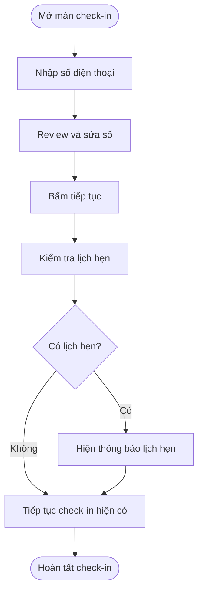
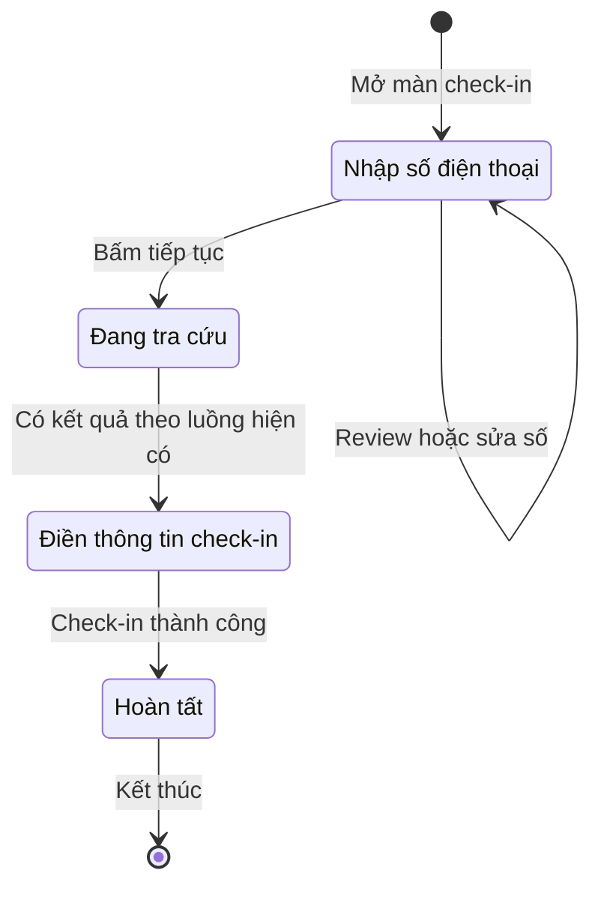

## POS — Review số điện thoại và hiển thị lịch hẹn khi check-in

**Cập nhật lần cuối:** 24 tháng 9 năm 2026  
**Đối tượng:** Khách hàng, lễ tân, đội sản phẩm và kiểm thử  
**Trạng thái:** Draft

**Nguồn đối chiếu hiện trạng:** Mã nguồn frontend trên nhánh `staging`, phiên bản `58c41d935`. Thuật ngữ đối chiếu theo glossary của workspace tại `vlinkpay-docs/docs/glossary.md`.

---

### Tổng quan

**Review số điện thoại và hiển thị lịch hẹn khi check-in** giúp giảm thao tác quay lại do nhập nhầm số và giúp người thao tác nhận biết booking của khách. Hệ thống cho phép **review và sửa số điện thoại** trước khi tiếp tục, đồng thời **hiển thị lịch hẹn nếu có** ngay trong luồng check-in hiện tại. Khách sử dụng khi tự check-in; lễ tân sử dụng trên màn Check-in tại POS khi check-in hộ khách.

Hiện tại, màn hình tự chuyển ngay khi nhập đủ số, khiến người thao tác chưa kịp xem lại. Thay đổi cần bổ sung là giữ màn nhập cho tới khi khách hoặc lễ tân bấm **Tiếp tục**.

### Khái niệm chính

| Thuật ngữ | Ý nghĩa |
| :--- | :--- |
| Review số điện thoại | Xem lại và sửa số đã nhập trước khi tiếp tục |
| Lịch hẹn (appointment/booking) | Lịch khách đã đặt với tiệm |

### Vai trò người dùng

| Vai trò | Thao tác |
| :--- | :--- |
| Khách hàng | Review, sửa số và xem lịch hẹn của mình khi tự check-in |
| Lễ tân | Review, sửa số và xem lịch hẹn của khách khi check-in hộ tại POS |

### Quy trình từ đầu đến cuối

#### Bổ sung vào luồng check-in hiện có

**Người thực hiện chính:** Khách hàng hoặc lễ tân.  
**Bắt đầu khi:** Nhập số điện thoại tại màn check-in.  
**Kết quả:** Người thao tác có thời gian xem lại số và thấy thông tin lịch hẹn nếu có trước khi hoàn tất check-in.

**Câu chuyện người dùng:**

- Là khách hàng hoặc lễ tân, tôi muốn nhập số xong vẫn được xem lại và sửa, để không phải quay về từ màn tiếp theo khi gõ nhầm.
- Là khách đã đặt lịch, tôi muốn thấy thông báo về lịch hẹn của mình, để biết tiệm đã nhận diện đúng booking.
- Là lễ tân, tôi muốn thấy lịch hẹn của khách sau khi nhập số điện thoại, để biết khách đã có booking.

| Bước | Ai | Hành động | Phản hồi hệ thống | Ghi chú |
| :--- | :--- | :--- | :--- | :--- |
| 1 | Khách / lễ tân | Nhập số điện thoại | Hiển thị số đã nhập và giữ nguyên màn hình | Không tự chuyển khi nhập đủ số |
| 2 | Khách / lễ tân | Xem lại số; sửa nếu nhập nhầm | Cập nhật số ngay tại màn nhập | Lễ tân có thể đọc lại số để đối chiếu với khách |
| 3 | Khách / lễ tân | Bấm **Tiếp tục** | Kiểm tra lịch hẹn theo số đã xác nhận bằng cơ chế hiện có | Dùng số sau khi đã sửa |
| 4 | Hệ thống | Hiển thị kết quả trong màn check-in hiện có | Nếu có lịch hẹn: hiển thị thông báo đã có booking và giờ hẹn | Áp dụng cả màn khách và màn lễ tân |
| 5 | Khách / lễ tân | Tiếp tục các thao tác check-in | Hoàn tất theo luồng hiện có | Không thêm bước xác nhận lịch hẹn |

### Cấu hình và quản trị hệ thống

Áp dụng trực tiếp tại màn check-in của khách và lễ tân; không cần cấu hình mới.

### Vòng đời trạng thái

**Đối tượng:** Phiên thao tác check-in. Bảng và sơ đồ dưới đây tóm tắt đường đi thành công của luồng hiện có; review và sửa số diễn ra ngay tại màn nhập. Trạng thái nghiệp vụ của lịch hẹn và lượt phục vụ giữ nguyên.

| Trạng thái hiện tại | Sự kiện | Trạng thái tiếp theo | Ghi chú |
| :--- | :--- | :--- | :--- |
| Nhập số điện thoại | Xem lại hoặc sửa số | Nhập số điện thoại | Giữ nguyên màn hình |
| Nhập số điện thoại | Bấm **Tiếp tục** | Đang tra cứu | Dùng số đã xác nhận |
| Đang tra cứu | Có kết quả và tiếp tục theo luồng hiện có | Điền thông tin check-in | Hiển thị lịch hẹn nếu có |
| Điền thông tin check-in | Check-in thành công | Hoàn tất | Theo cơ chế hiện tại |

### Quy tắc nghiệp vụ

1. **Review và sửa số:** Nhập đủ số vẫn giữ nguyên màn nhập. Người thao tác được xem lại, sửa số và chủ động bấm **Tiếp tục**.
2. **Hiển thị lịch hẹn:** Nếu tìm thấy booking theo số đã xác nhận, hiển thị thông báo cùng giờ hẹn ngay trong màn check-in hiện có.
3. **Áp dụng cho cả hai vai trò:** Khách tự check-in và lễ tân check-in hộ đều được review/sửa số và xem lịch hẹn.
4. **Đúng số đã xác nhận:** Khi sửa số, lịch hẹn hiển thị phải thuộc số mới, không giữ kết quả của số trước.
5. **Giữ luồng hiện có:** Các bước còn lại và cách xử lý booking tiếp tục như hiện tại; không thêm màn review riêng hoặc bước xác nhận booking mới.

### Trường hợp ngoại lệ và cách xử lý

| Tình huống | Cách xử lý | Người thao tác |
| :--- | :--- | :--- |
| Nhập nhầm số | Sửa ngay trên màn nhập rồi bấm **Tiếp tục** | Khách / lễ tân |
| Không có lịch hẹn | Tiếp tục luồng check-in hiện có | Khách / lễ tân |

### Câu hỏi thường gặp

**Hỏi: Lễ tân xem lịch hẹn của khách ở đâu?**  
Đáp: Ngay trên màn Check-in tại POS, sau khi nhập số điện thoại và bấm **Tiếp tục**. Nếu khách có booking, màn hình hiển thị thông báo và giờ hẹn.

**Hỏi: Khách phải quay về màn trước để sửa số nhập nhầm không?**  
Đáp: Khách được sửa ngay tại màn nhập trước khi bấm **Tiếp tục**, vì màn hình không còn tự chuyển khi vừa nhập đủ số.

### Tính năng liên quan

- [Check-in dùng chung cho kiosk và POS](https://github.com/vlink-group/VlinkPay/blob/c1d0825a7cc2b59bed32a4ecb41b46588aab661d/nexora/docs/business/references/POS-CheckIn-Single-Page-Spec.md): luồng nền để bổ sung review/sửa số và hiển thị lịch hẹn. Tài liệu tham chiếu giữ nội dung lịch sử; yêu cầu tại đây thay đổi phần tự chuyển màn sau khi nhập đủ số.
