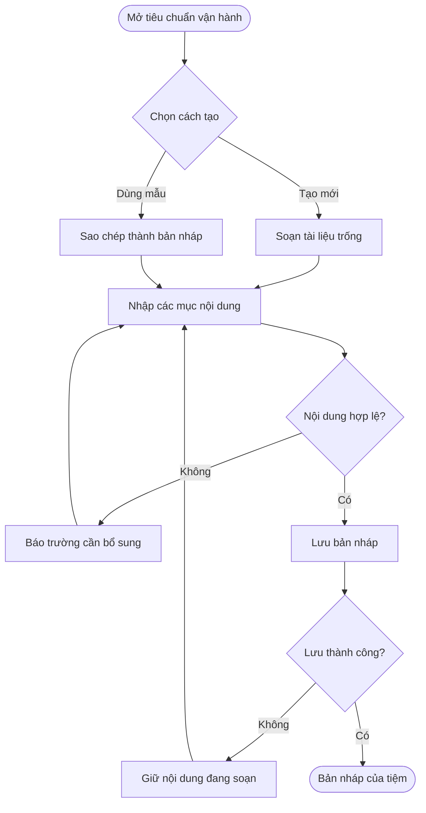
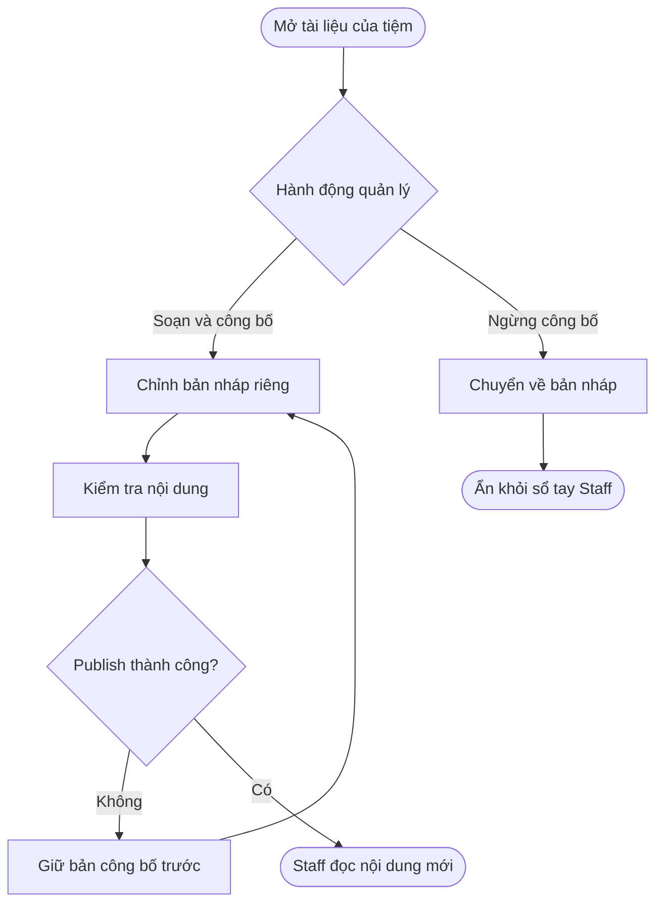
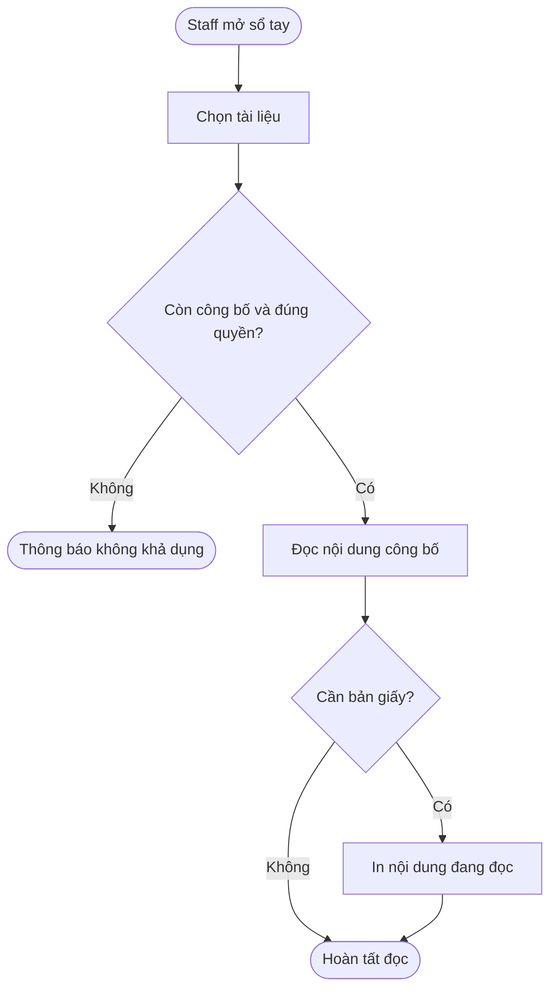
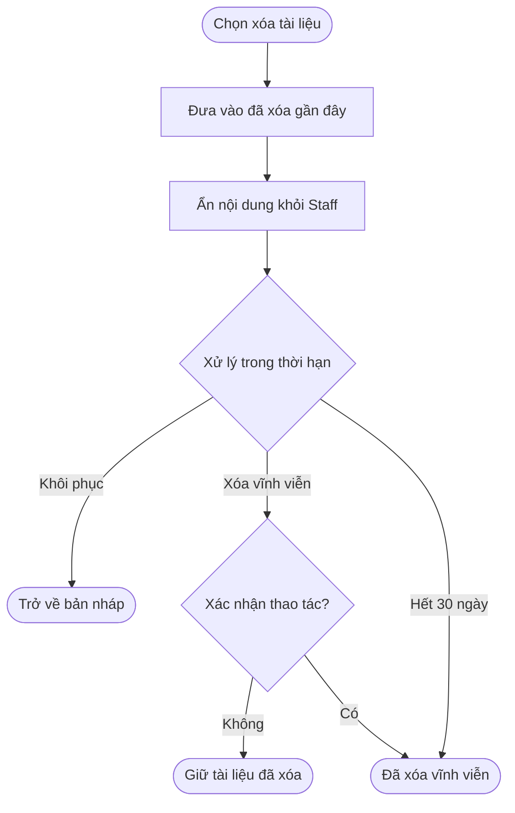
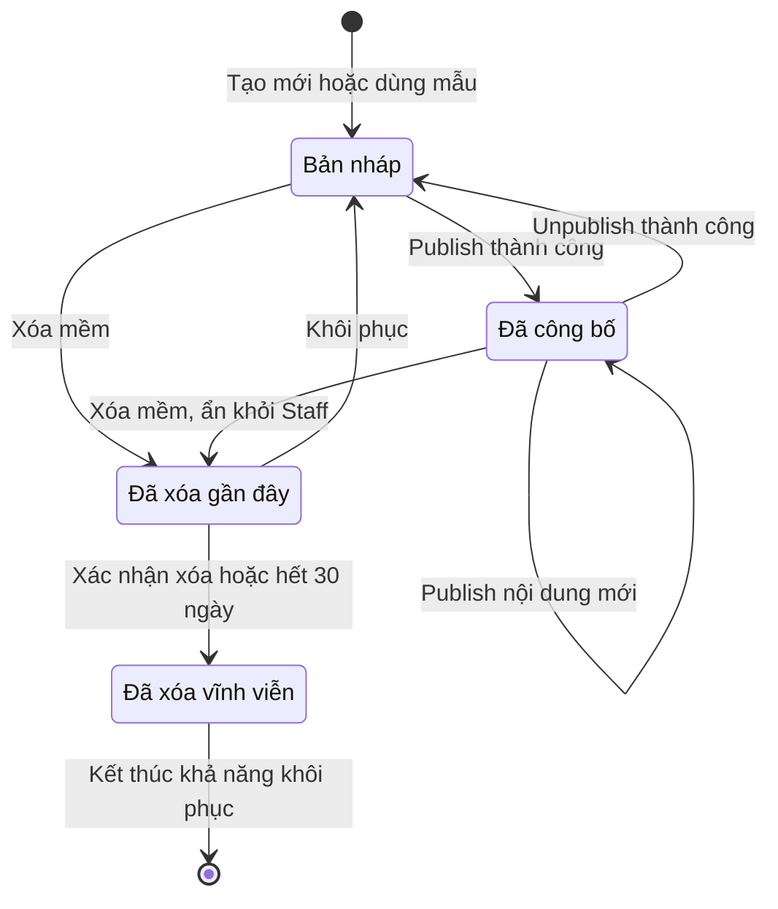

## POS — Bộ tiêu chuẩn vận hành và Sổ tay nhân viên

**Cập nhật lần cuối:** 5 tháng 10 năm 2026

**Đối tượng đọc:** Product Owner, BA, Owner, Manager, Staff, UX/UI, đội phát triển, QA và bộ phận hỗ trợ

**Trạng thái:** Define

**Bản chia sẻ:** [Tài liệu trên GitHub](https://github.com/vlink-group/VlinkPay/blob/docs/promotion-code-skill-audit/nexora/docs/business/pos-operating-standards-staff-handbook.md)

---

### Tổng quan

Bộ tiêu chuẩn vận hành và Sổ tay nhân viên giúp tiệm thống nhất nội quy và quy trình làm việc thông qua các tài liệu do tiệm quản lý. Tính năng cho phép tạo tài liệu mới hoặc từ mẫu hệ thống, soạn thảo, công bố, ngừng công bố, in và quản lý tài liệu đã xóa. Owner và Manager chuẩn bị, quản lý và công bố nội dung tại Salon Settings → Operating Standards; Staff đọc và in phần đã công bố tại Staff Handbook.

#### Phạm vi

- **Trong phạm vi:** Salon Documents, System Templates, editor, tìm kiếm/lọc theo trạng thái hoặc loại, publish/unpublish, in, xóa mềm, Recently Deleted, khôi phục và xóa vĩnh viễn; Staff Handbook theo đúng business.
- **Ngoài phạm vi:** Lịch sử phiên bản trên giao diện, ký điện tử, xác nhận đã đọc, theo dõi tiến độ checklist, AI tự sinh nội dung, đồng bộ tự động với cấu hình turn và trạng thái Archive.
- Nội dung do tiệm tự soạn được giữ nguyên ngôn ngữ, không tự dịch hoặc giới hạn ngôn ngữ. Giao diện cần dùng được trên điện thoại, máy tính bảng và desktop.

#### Hiện trạng code và giới hạn kiểm chứng

Đối chiếu `staging` vừa fetch lúc 18:33 ngày 5 tháng 10 năm 2026: FE tại [phiên bản `27c5ebc`](https://github.com/vlink-group/vlink-nexora-fe/tree/27c5ebcaa4d86b30bc2e965e7c3df8cfee06fc8e), BE tại [phiên bản `a7a46d3`](https://github.com/vlink-group/vlink-nexora/tree/a7a46d314036f9d83c910aead411182480249bea).

| Khu vực | Code hiện tại | Yêu cầu trong tài liệu |
| :--- | :--- | :--- |
| Salon Settings | Có các mục thông tin tiệm, nhân viên, dịch vụ, quyền/vai trò, cấp nhân viên và SMS; chưa có mục Operating Standards trong danh sách mục của giao diện được đọc. | Bổ sung nơi quản lý tài liệu, thư viện mẫu và Recently Deleted. |
| Sổ tay nhân viên | Chưa tìm thấy phần triển khai Staff Handbook trong FE được rà soát. | Chỉ đọc/in tài liệu Published thuộc business của Staff. |
| Dữ liệu và API | Chưa tìm thấy mô hình/lệnh/controller chuyên biệt cho Salon Document, System Template hoặc Staff Handbook trong BE được rà soát. | Cần thiết kế contract lưu bản nháp, nội dung công bố, quyền và vòng đời xóa/khôi phục. |
| Thiết kế HTML | Có màn hình Operating Standards, thư viện 9 mẫu, Draft/Published và Recently Deleted; mô tả tách bản nháp khỏi nội dung Staff đang đọc. | HTML và nội dung ticket là nguồn yêu cầu, không phải bằng chứng đã tích hợp API hoặc chạy đầy đủ trong ứng dụng. |

Toàn bộ luồng và quy tắc bên dưới là phạm vi cần triển khai theo ticket #1111. Lần rà soát chỉ đọc code/contract và bản thiết kế; không xác nhận đã lưu tài liệu, kiểm thử phân quyền hoặc chạy tác vụ xóa tự động trên hệ thống thật.

---

### Khái niệm chính

| Khái niệm | Ý nghĩa nghiệp vụ |
| :--- | :--- |
| Operating Standards | Khu vực Owner/Manager quản lý tiêu chuẩn vận hành và tài liệu của tiệm. |
| Salon Document | Tài liệu do tiệm tạo và quản lý, gồm tên, loại, mô tả, các mục và nội dung. |
| System Template | Mẫu hệ thống chỉ đọc, dùng làm điểm bắt đầu khi tạo một tài liệu của tiệm. |
| Draft — Bản nháp | Nội dung Owner/Manager đang chuẩn bị; Staff không đọc được. |
| Published — Đã công bố | Nội dung hiện được Staff đọc tại Staff Handbook. |
| Publish / Unpublish | Công bố nội dung đã kiểm tra / ngừng công bố và đưa tài liệu về bản nháp. |
| Staff Handbook | Nơi Staff đọc và in những tài liệu đã công bố của đúng business. |
| Recently Deleted | Nơi giữ tài liệu đã xóa mềm trong 30 ngày để khôi phục hoặc xóa vĩnh viễn. |

Các tên nút/mục tiếng Anh được giữ để đối chiếu HTML; phần diễn giải dùng tiếng Việt và tên nghiệp vụ.

### Vai trò người dùng

| Vai trò | Trách nhiệm và quyền yêu cầu |
| :--- | :--- |
| Owner | Tạo, soạn, lưu, publish/unpublish, in, xóa, khôi phục và xóa vĩnh viễn tài liệu của tiệm. |
| Manager | Quản lý tài liệu với các quyền tương tự Owner trong phạm vi business được cấp. |
| Staff | Đọc và in nội dung Published của đúng business; không sửa hoặc xem Draft, mẫu hệ thống, tài liệu đã xóa. |
| Hệ thống | Giới hạn dữ liệu đúng business/quyền, lưu bản nháp và nội dung công bố riêng, quản lý thời hạn xóa mềm. |

Đây là phân quyền yêu cầu của tính năng mới; không suy quyền từ việc người dùng nhìn thấy menu trên prototype.

---

### Luồng nghiệp vụ đầu cuối

#### Luồng 1: Tạo và soạn tài liệu của tiệm

**Người thực hiện chính:** Owner hoặc Manager.  
**Điểm bắt đầu:** Mở Salon Settings → Operating Standards và chọn tạo mới hoặc Use template.  
**Kết quả:** Có tài liệu Draft hợp lệ, chưa xuất hiện trong Staff Handbook.

**Nhu cầu người dùng:**

- **Là** Owner/Manager, **tôi muốn** tạo từ mẫu hệ thống hoặc bắt đầu từ tài liệu trống **để** chuẩn bị hướng dẫn phù hợp với tiệm.
- **Là** Owner/Manager, **tôi muốn** nhập tên, loại, mô tả và các mục nội dung **để** nhân viên hiểu nội quy và thao tác cần thực hiện.
- **Là** Owner/Manager, **tôi muốn** thấy trường bắt buộc còn thiếu và giữ phần đã nhập khi lưu lỗi **để** sửa tiếp mà không mất nội dung đang soạn.

| Bước | Người thực hiện | Hành động | Phản hồi yêu cầu | Ghi chú |
| :--- | :--- | :--- | :--- | :--- |
| 1 | Owner/Manager | Mở Operating Standards, tìm/lọc tài liệu hoặc chọn tạo mới. | Hiển thị tài liệu của đúng tiệm và điểm vào thư viện mẫu. | Staff không có quyền quản lý. |
| 2 | Owner/Manager | Tạo tài liệu trống hoặc đọc mẫu rồi chọn Use template. | Tạo bản soạn Salon Document ở Draft. | Không sửa bản mẫu hệ thống. |
| 3 | Owner/Manager | Nhập tên, loại, mô tả, tiêu đề mục và nội dung. | Giữ nguyên ngôn ngữ tiệm nhập. | Tên tài liệu, tiêu đề mục và nội dung là bắt buộc. |
| 4 | Owner/Manager | Lưu bản nháp. | Kiểm tra nội dung bắt buộc và quyền. | Lỗi dữ liệu: báo tại trường và cho sửa tiếp. |
| 5 | Hệ thống | Lưu thành công hoặc thông báo lỗi. | Thành công: có Draft để mở lại; lỗi: giữ phần đang soạn để thử lại. | Lưu Draft không công bố cho Staff. |

#### Luồng 2: Công bố, chỉnh sửa và ngừng công bố

**Người thực hiện chính:** Owner hoặc Manager.  
**Điểm bắt đầu:** Kiểm tra một Draft để publish hoặc mở tài liệu Published để chỉnh sửa/unpublish.  
**Kết quả:** Staff thấy đúng nội dung được công bố gần nhất, hoặc tài liệu được ẩn khi ngừng công bố.

**Nhu cầu người dùng:**

- **Là** Owner/Manager, **tôi muốn** kiểm tra và publish nội dung **để** đưa hướng dẫn chính thức tới nhân viên.
- **Là** Owner/Manager, **tôi muốn** sửa tài liệu đã công bố trong bản nháp riêng **để** Staff tiếp tục đọc bản hiện hành trước khi tôi công bố lại.
- **Là** Owner/Manager, **tôi muốn** unpublish khi nội dung chưa phù hợp **để** ngừng hiển thị ngay trong Staff Handbook.
- **Là** Owner/Manager, **tôi muốn** lần publish thất bại giữ nguyên nội dung đã công bố **để** không đưa bản soạn chưa hoàn tất tới nhân viên.

| Bước | Người thực hiện | Hành động | Phản hồi yêu cầu | Ghi chú |
| :--- | :--- | :--- | :--- | :--- |
| 1 | Owner/Manager | Mở Draft hoặc chọn sửa tài liệu Published. | Mở phần soạn thảo riêng. | Staff vẫn thấy nội dung Published hiện tại khi có bản sửa chưa công bố. |
| 2 | Owner/Manager | Kiểm tra và lưu nội dung soạn. | Kiểm tra trường bắt buộc. | Không cung cấp giao diện lịch sử phiên bản. |
| 3a | Owner/Manager | Publish nội dung đã kiểm tra. | Thành công: Staff đọc nội dung vừa công bố. | Publish lỗi: bản Published trước vẫn giữ nguyên. |
| 3b | Owner/Manager | Unpublish tài liệu đang công bố. | Chuyển về Draft và ẩn ngay khỏi Staff Handbook. | Không phải Archive hoặc xóa. |
| 4 | Staff | Mở lại Staff Handbook. | Chỉ thấy nội dung được phép công bố ở thời điểm truy cập. | Quyền và phạm vi business phải kiểm tra ở phía phục vụ dữ liệu. |

#### Luồng 3: Staff đọc và in Sổ tay nhân viên

**Người thực hiện chính:** Staff.  
**Điểm bắt đầu:** Staff mở Staff Handbook.  
**Kết quả:** Staff đọc hoặc in tài liệu Published của đúng business.

**Nhu cầu người dùng:**

- **Là** Staff, **tôi muốn** đọc hướng dẫn đã công bố của tiệm **để** làm việc theo nội quy và quy trình thống nhất.
- **Là** Staff, **tôi muốn** in nội dung đang đọc **để** sử dụng khi cần bản giấy.
- **Là** Staff, **tôi muốn** được thông báo khi tài liệu không còn được công bố **để** không tiếp tục dùng đường dẫn tới nội dung đã bị thu hồi.

| Bước | Người thực hiện | Hành động | Phản hồi yêu cầu | Ghi chú |
| :--- | :--- | :--- | :--- | :--- |
| 1 | Staff | Mở Staff Handbook. | Lấy tài liệu Published của business được phép truy cập. | Không trả Draft, System Templates hoặc Recently Deleted. |
| 2 | Staff | Chọn một tài liệu. | Hiển thị nội dung công bố hiện hành. | Không mở editor hoặc nút quản lý. |
| 3 | Staff | Đọc hoặc chọn in. | Hiển thị/in nội dung đã công bố bằng ngôn ngữ tiệm nhập. | Owner/Manager cũng có thể in tài liệu trong phần quản lý. |
| 4 | Hệ thống | Tài liệu không còn công bố hoặc không thuộc quyền truy cập. | Không trả nội dung; thông báo tài liệu không khả dụng. | Không dùng link trực tiếp để vượt quyền. |

#### Luồng 4: Xóa, khôi phục và xóa vĩnh viễn

**Người thực hiện chính:** Owner hoặc Manager; hệ thống xử lý hết thời hạn lưu.  
**Điểm bắt đầu:** Chọn Delete hoặc mở Recently Deleted.  
**Kết quả:** Tài liệu được giữ tạm để khôi phục về Draft, hoặc bị xóa vĩnh viễn theo xác nhận/thời hạn.

**Nhu cầu người dùng:**

- **Là** Owner/Manager, **tôi muốn** xóa tài liệu khỏi danh sách hoạt động **để** Staff không tiếp tục đọc nội dung đã bỏ.
- **Là** Owner/Manager, **tôi muốn** xem thời gian còn lại và khôi phục về Draft **để** kiểm tra lại trước khi công bố.
- **Là** Owner/Manager, **tôi muốn** thấy xác nhận rõ ràng trước khi xóa vĩnh viễn **để** hiểu thao tác không thể hoàn tác và có thể hủy.

| Bước | Người thực hiện | Hành động | Phản hồi yêu cầu | Ghi chú |
| :--- | :--- | :--- | :--- | :--- |
| 1 | Owner/Manager | Delete tài liệu Draft hoặc Published. | Xóa mềm và đưa vào Recently Deleted. | Nếu đang Published, Staff mất quyền đọc ngay. |
| 2 | Owner/Manager | Mở Recently Deleted. | Hiển thị tài liệu đã xóa và thời gian còn lại trước hạn 30 ngày. | Staff không truy cập khu vực này. |
| 3a | Owner/Manager | Restore tài liệu còn trong thời hạn. | Đưa về Draft trong danh sách tài liệu của tiệm. | Không tự công bố lại dù trước khi xóa là Published. |
| 3b | Owner/Manager | Chọn xóa vĩnh viễn. | Yêu cầu xác nhận rõ tính không thể hoàn tác. | Hủy xác nhận: giữ tài liệu trong Recently Deleted. |
| 4a | Owner/Manager | Xác nhận xóa vĩnh viễn. | Xóa tài liệu vĩnh viễn. | Kiểm tra quyền Owner/Manager của đúng business. |
| 4b | Hệ thống | Đủ 30 ngày kể từ lúc xóa mềm. | Tự động xóa vĩnh viễn. | Sau đó không còn Restore. |

---

### Cấu hình hệ thống và quản trị

- **Là** Owner/Manager, **tôi muốn** tìm kiếm và lọc theo trạng thái/loại **để** quản lý nhiều tài liệu của tiệm.
- **Là** Owner/Manager, **tôi muốn** kiểm soát nội dung được công bố tách khỏi phần đang soạn **để** thay đổi chưa hoàn tất không tới Staff.
- **Là** người quản lý sản phẩm, **tôi muốn** giữ thư viện mẫu hệ thống chỉ đọc **để** mỗi tiệm chỉnh bản sao của mình thay vì thay đổi mẫu dùng chung.

#### Thư viện 9 mẫu hệ thống

| STT | Tên mẫu |
| :--- | :--- |
| 1 | Nội quy lao động |
| 2 | Bản thỏa thuận làm việc |
| 3 | Quy ước khăn và vật dụng theo màu |
| 4 | Vệ sinh và khử trùng dụng cụ |
| 5 | Dọn bàn sau mỗi khách |
| 6 | Mở cửa và đóng cửa |
| 7 | Khu sinh hoạt chung |
| 8 | Xử lý khách phàn nàn |
| 9 | Thợ mới — 7 ngày đầu |

Thư viện cung cấp điểm bắt đầu cho nội dung của từng tiệm; không bổ sung quy trình ký điện tử.

#### Các điểm cần chốt khi tích hợp

| Điểm | Yêu cầu đã rõ / thông tin còn thiếu |
| :--- | :--- |
| Dữ liệu và contract | Cần lưu bản soạn và nội dung đang công bố riêng; chưa có contract chuyên biệt trong BE được rà soát. Không khóa tên endpoint trong tài liệu nghiệp vụ. |
| Quyền và business | Owner/Manager quản lý, Staff chỉ đọc/in Published đúng business; chưa kiểm chứng cơ chế thực thi cho tính năng mới. |
| Editor và in | Tên tài liệu, tiêu đề mục, nội dung bắt buộc. Giới hạn độ dài, định dạng được hỗ trợ và bố cục in cần chốt; không tự thêm upload ảnh/file. |
| Xóa tự động | Thời hạn đã chốt là 30 ngày. Mốc giờ/múi giờ, xử lý khôi phục đồng thời với tác vụ hết hạn cần chốt trong thiết kế tích hợp. |

### Vòng đời trạng thái

#### Tài liệu của tiệm

Đây là vòng đời yêu cầu, chưa phải enum/trạng thái đã có trong API hiện tại. Sửa một tài liệu Published tạo nội dung soạn riêng trong khi trạng thái công bố và nội dung Staff đang đọc vẫn giữ nguyên. Không bổ sung màn hình lịch sử phiên bản.

| Trạng thái hiện tại | Sự kiện | Trạng thái tiếp theo | Nội dung Staff được đọc |
| :--- | :--- | :--- | :--- |
| Chưa có tài liệu | Tạo mới hoặc Use template | Draft | Chưa được đọc. |
| Draft | Publish thành công | Published | Nội dung vừa công bố. |
| Published | Sửa/lưu bản soạn | Published, có nội dung soạn chưa công bố | Bản công bố hiện tại, chưa phải bản sửa. |
| Published | Publish bản soạn mới thành công | Published | Bản công bố mới. |
| Published | Unpublish thành công | Draft | Không được đọc. |
| Draft/Published | Delete thành công | Deleted — Recently Deleted | Không được đọc. |
| Deleted | Restore trước khi xóa vĩnh viễn | Draft | Không tự công bố lại. |
| Deleted | Xác nhận xóa vĩnh viễn hoặc đủ 30 ngày | Đã xóa vĩnh viễn | Không được đọc hoặc khôi phục. |

System Template chỉ đọc trong phạm vi này; không có luồng hoặc trạng thái quản trị mẫu mới được yêu cầu.

---

### Quy tắc nghiệp vụ

1. **Bản sao từ mẫu:** Use template tạo Salon Document Draft; không sửa mẫu hệ thống dùng chung.
2. **Nội dung và quyền:** Draft chỉ Owner/Manager nhìn thấy. Staff chỉ đọc/in Published của đúng business; không thấy mẫu hệ thống hoặc tài liệu đã xóa.
3. **Sửa nội dung công bố:** Staff tiếp tục đọc bản Published hiện tại cho đến khi bản soạn mới được publish thành công. Không hiển thị/quản lý lịch sử phiên bản.
4. **Ngừng công bố:** Unpublish đưa tài liệu về Draft và ẩn ngay khỏi Staff Handbook.
5. **Xóa mềm:** Delete chuyển Draft hoặc Published vào Recently Deleted; nội dung Published phải biến mất khỏi Staff Handbook ngay.
6. **Thời hạn khôi phục:** Giữ trong Recently Deleted 30 ngày, hiển thị thời gian còn lại; hết hạn tự động xóa vĩnh viễn.
7. **Khôi phục:** Restore luôn đưa về Draft, kể cả tài liệu đã từng Published.
8. **Xóa vĩnh viễn:** Owner và Manager đều có quyền trong đúng business; cần xác nhận rõ và không thể hoàn tác. Staff không có quyền này.
9. **Kiểm tra editor:** Tên tài liệu, tên mục và nội dung là bắt buộc; không tự áp đặt giới hạn chưa được yêu cầu.
10. **Ngôn ngữ và thiết bị:** Giữ nội dung tiệm nhập; UI dùng được trên phone/tablet/desktop. Nếu có ngày giờ tiếng Việt, viết đầy đủ “tháng”.
11. **Phạm vi:** Không tạo trạng thái Archive, xác nhận đã đọc, ký điện tử, checklist tiến độ hoặc đồng bộ cấu hình turn.

#### Tiêu chí nghiệm thu nghiệp vụ

| Mã | Kết quả cần đạt |
| :--- | :--- |
| AC-01 | Owner/Manager quản lý được Salon Documents, System Templates và Recently Deleted của đúng business. |
| AC-02 | Tạo mới/Use template cho Draft; mẫu hệ thống không bị chỉnh sửa. |
| AC-03 | Tìm kiếm/lọc theo trạng thái hoặc loại; editor kiểm tra tên, tên mục và nội dung bắt buộc. |
| AC-04 | Staff chỉ đọc/in Published; không truy cập được Draft/mẫu/tài liệu đã xóa qua đường dẫn trực tiếp. |
| AC-05 | Chỉnh tài liệu Published không đổi nội dung Staff đang đọc trước khi publish lại. |
| AC-06 | Publish/unpublish/delete cập nhật đúng nội dung và khả năng truy cập Staff. |
| AC-07 | Restore về Draft; Recently Deleted hiển thị thời gian còn lại của thời hạn 30 ngày. |
| AC-08 | Xóa vĩnh viễn đúng quyền, có xác nhận; hết hạn 30 ngày tự động xóa và không còn khôi phục. |
| AC-09 | Dùng được trên điện thoại, máy tính bảng, desktop; giữ nguyên ngôn ngữ do tiệm nhập. |

Các tiêu chí là yêu cầu cần nghiệm thu, chưa được đánh dấu đạt bằng lần đọc code này.

### Tình huống ngoại lệ và cách xử lý

| Tình huống | Cách xử lý yêu cầu | Bên xử lý |
| :--- | :--- | :--- |
| Thiếu tên, tiêu đề mục hoặc nội dung | Báo trường cần bổ sung, giữ phần đã soạn. | Owner/Manager |
| Lưu hoặc publish lỗi | Cho thử lại; không thay nội dung công bố trước đó bằng bản chưa lưu thành công. | Owner/Manager / hệ thống |
| Staff dùng link của tài liệu Draft, business khác hoặc đã xóa | Không trả nội dung ngoài quyền. | Hệ thống |
| Unpublish/delete khi Staff đang mở tài liệu | Các lượt lấy lại nội dung phải kiểm tra khả năng truy cập hiện tại. Cách làm mới tức thời phiên đang mở cần chốt khi tích hợp. | Hệ thống |
| Hủy xác nhận xóa vĩnh viễn | Giữ tài liệu trong Recently Deleted. | Owner/Manager |
| Tài liệu đã bị xóa vĩnh viễn | Không khôi phục; thông báo tài liệu không còn khả dụng. | Hệ thống |
| Khôi phục trùng thời điểm hết hạn | Cần chốt cách xử lý đồng thời; không báo khôi phục thành công nếu dữ liệu đã bị xóa vĩnh viễn. | Đội tích hợp / hệ thống |

### Câu hỏi thường gặp

**Staff có đọc nội dung tôi đang sửa không?**  
Không. Staff đọc bản Published hiện tại cho đến khi bản soạn mới được publish.

**Khôi phục có đưa tài liệu về Staff Handbook ngay không?**  
Không. Khôi phục về Draft; Owner/Manager kiểm tra và publish lại nếu cần.

**Mẫu hệ thống có sửa trực tiếp được không?**  
Không. Use template tạo bản sao thành tài liệu của tiệm để chỉnh sửa.

**Tính năng đã có trên `staging` chưa?**  
Chưa tìm thấy phần triển khai chuyên biệt trong FE/BE được rà soát. Tài liệu mô tả yêu cầu từ ticket và HTML, không xác nhận chức năng đã chạy.

### Tính năng liên quan

- **Salon Settings:** Là điểm vào quản lý tài liệu Operating Standards của tiệm. Chưa có tài liệu riêng đi kèm cho điểm vào này.
- **Quyền và vai trò POS:** Xác định Owner/Manager được quản lý và Staff chỉ được đọc/in trong đúng business. Chưa có tài liệu riêng đi kèm cho phân quyền của tính năng mới.
- **Staff Handbook:** Là giao diện đọc của cùng bộ tài liệu đã công bố; được mô tả trong tài liệu này, không phải một nguồn nội dung riêng.

### Nguồn tham chiếu

- [Ticket #1111](https://github.com/vlink-group/vlink-nexora/issues/1111): nguồn phạm vi, trạng thái Define, 9 mẫu, vòng đời và thời hạn 30 ngày.
- [Thiết kế Operating Standards](https://taxiq-nexora-touch.vercel.app/html/pages/pos-operating-standards.html) và [thiết kế Staff Handbook](https://taxiq-nexora-touch.vercel.app/html/pages/staff-handbook.html).
- Staff Handbook trong HTML có câu mẫu về tự đồng bộ luật turn và yêu cầu đọc/xác nhận trong 3 ngày. Hai hành vi này nằm ngoài phạm vi ticket đã xác định; không đưa chúng vào luồng triển khai của tài liệu này.
- [Mẫu PO Turn Board](https://github.com/user-attachments/files/31445416/TurnBoardBanMau.html): tham chiếu đã có trong ticket; không mở rộng phạm vi sang đồng bộ turn.
- [Danh sách mục Salon Settings trong FE](https://github.com/vlink-group/vlink-nexora-fe/blob/27c5ebcaa4d86b30bc2e965e7c3df8cfee06fc8e/src/constants/posSalonSettings.ts).
- [Hợp đồng API BE tại phiên bản được đọc](https://github.com/vlink-group/vlink-nexora/blob/a7a46d314036f9d83c910aead411182480249bea/backend/src/Web/wwwroot/api/specification.json).
