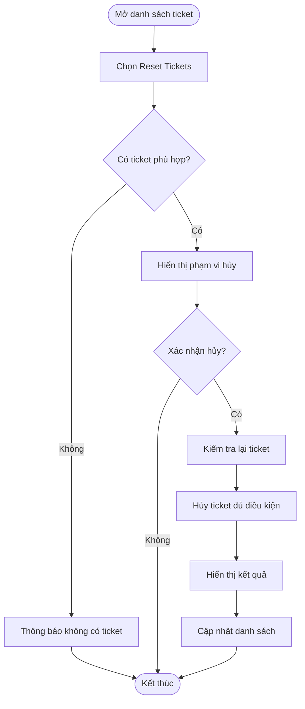
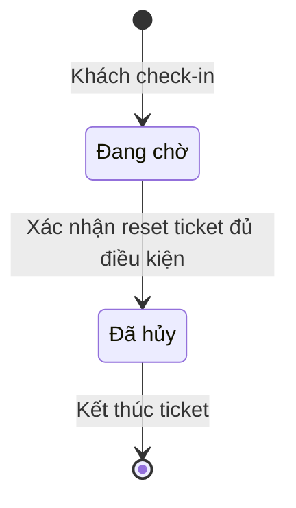

## POS — Reset ticket chưa tiến hành khi qua ngày

**Cập nhật:** 8 tháng 10 năm 2026

**Đối tượng:** Chủ tiệm và nhân sự được cấp quyền vận hành POS

**Trạng thái:** Bản nháp
**Bản chia sẻ:** [Tài liệu trên GitHub](https://github.com/vlink-group/VlinkPay/blob/enhance/1101-pos-reset-ticket-summary/nexora/docs/business/pos-reset-unstarted-tickets.md)

### Tổng quan

Reset ticket giúp tiệm dọn các ticket chưa được phục vụ còn tồn từ ngày trước, để danh sách vận hành ngày mới phản ánh đúng khách đang chờ. Bổ sung nút **Reset Tickets** tại màn hình **POS → Orders/Tickets** để người có quyền vận hành POS xác nhận hủy hàng loạt các ticket đủ điều kiện.

### Phạm vi

- Xử lý toàn bộ ticket **chưa tiến hành** thuộc tiệm đang thao tác và đã qua ngày; không phụ thuộc trang hiện tại hay bộ lọc danh sách.
- Ticket đủ điều kiện là ticket **Đang chờ (Waiting)**, chưa có dịch vụ bắt đầu hoặc hoàn thành.
- Giữ nguyên ticket đang phục vụ, đã hoàn thành, đã hủy, ticket của ngày hiện tại và lịch hẹn chưa check-in.
- Reset được thực hiện khi người dùng bấm nút và xác nhận. Ticket chuyển sang **Đã hủy** và vẫn giữ lịch sử để tra cứu.

**Cần làm rõ:** Đề xuất tính “qua ngày” từ **00:00 theo múi giờ của tiệm**, dựa trên ngày check-in. Nếu tiệm dùng giờ kết ca/ngày kinh doanh riêng, cần chốt mốc đó trước khi triển khai.

### Khái niệm chính

| Khái niệm | Ý nghĩa |
| :--- | :--- |
| Ticket chưa tiến hành | Khách đang chờ, chưa bắt đầu dịch vụ. |
| Reset ticket | Hủy hàng loạt ticket chưa tiến hành đã qua ngày. |
| Hủy ticket | Kết thúc ticket ở trạng thái Đã hủy; giữ dữ liệu lịch sử. |
| Void thanh toán | Xử lý giao dịch thanh toán; là thao tác riêng với hủy ticket. |

### Vai trò liên quan

| Vai trò | Trách nhiệm |
| :--- | :--- |
| Chủ tiệm / nhân sự có quyền vận hành POS | Kiểm tra phạm vi và xác nhận reset ticket của tiệm. |

### Luồng thực hiện

#### Luồng: Reset ticket tồn từ ngày trước

**Người thực hiện:** Nhân sự có quyền vận hành POS.

**Kích hoạt:** Mở màn hình Orders/Tickets và chọn Reset Tickets.

**Kết quả:** Ticket đủ điều kiện được hủy, danh sách ticket và bảng lượt được cập nhật.

**User story:**

- **Là** người vận hành POS, **tôi muốn** reset toàn bộ ticket chưa tiến hành đã qua ngày trong một lần thao tác, **để** bắt đầu ngày mới với danh sách chờ chính xác.
- **Là** người vận hành POS, **tôi muốn** xem số lượng và ngày của ticket trước khi xác nhận, **để** kiểm tra đúng phạm vi cần hủy.
- **Là** người vận hành POS, **tôi muốn** xem kết quả thực tế nếu có ticket không hủy được hoặc đã bắt đầu phục vụ, **để** biết phần nào cần kiểm tra lại.

| Bước | Người thực hiện | Thao tác | Phản hồi hệ thống | Ghi chú |
| :--- | :--- | :--- | :--- | :--- |
| 1 | Người dùng | Chọn Reset Tickets. | Tìm toàn bộ ticket đủ điều kiện của tiệm. | Xét toàn bộ danh sách, không chỉ trang hiện tại. |
| 2 | Hệ thống | Hiển thị xác nhận. | Hiển thị số ticket và phạm vi ngày; có lựa chọn Hủy bỏ và Xác nhận hủy. Nếu không có ticket phù hợp, thông báo và kết thúc. | Người dùng kiểm tra phạm vi trước khi hủy. |
| 3 | Người dùng | Xác nhận hoặc hủy bỏ. | Hủy bỏ thì giữ nguyên dữ liệu; xác nhận thì bắt đầu xử lý và khóa thao tác gửi lặp. | Thao tác do người dùng kích hoạt. |
| 4 | Hệ thống | Kiểm tra lại từng ticket. | Chỉ hủy ticket vẫn đủ điều kiện; bỏ qua ticket đã bắt đầu phục vụ hoặc đã đổi trạng thái. Ticket có thanh toán đã thu tiền phải đi theo luồng xử lý thanh toán hiện có. | Reset không tự hoàn tiền. |
| 5 | Hệ thống | Hoàn tất xử lý. | Hiển thị số ticket đã hủy, bị bỏ qua và xử lý thất bại; nêu lý do nếu có. | Giữ lịch sử ticket. |
| 6 | Người dùng | Xem danh sách cập nhật. | Làm mới danh sách ticket và bảng lượt theo kết quả thực tế; chỉ cho thử lại các ticket còn đủ điều kiện. | Không ghi nhận hủy nếu thao tác thất bại. |

### Cấu hình và quản trị

- **Là** chủ tiệm, **tôi muốn** thao tác reset tuân theo quyền vận hành POS và phạm vi tiệm hiện có, **để** nhân sự chỉ xử lý dữ liệu được phép truy cập.
- **Cần làm rõ:** Có giới hạn reset hàng loạt cho chủ tiệm/quản lý hay cho toàn bộ nhân sự có quyền vận hành POS.

### Vòng đời trong phạm vi reset

| Trạng thái hiện tại | Kích hoạt | Trạng thái sau xử lý | Ghi chú |
| :--- | :--- | :--- | :--- |
| Đang chờ, chưa tiến hành, đã qua ngày | Xác nhận reset và hủy thành công | Đã hủy | Giữ lịch sử ticket. |
| Đang chờ nhưng đã bắt đầu phục vụ / đã đổi trạng thái | Kiểm tra lại trước khi hủy | Giữ trạng thái thực tế | Không hủy ticket đã bắt đầu phục vụ. |

### Quy tắc nghiệp vụ

- Reset áp dụng cho tiệm đang thao tác, trên toàn bộ ticket đủ điều kiện đã qua ngày.
- Người dùng xác nhận trước khi hủy; hệ thống kiểm tra lại điều kiện tại thời điểm xử lý.
- Hủy ticket giữ dữ liệu lịch sử. Reset không tự void hay hoàn tiền các giao dịch đã thu tiền.

### Tình huống và xử lý ngoại lệ

| Tình huống | Cách xử lý | Người xử lý |
| :--- | :--- | :--- |
| Không có ticket đủ điều kiện | Thông báo và kết thúc thao tác. | Hệ thống |
| Người dùng hủy bỏ xác nhận | Giữ nguyên dữ liệu. | Người vận hành POS |
| Ticket đã bắt đầu phục vụ hoặc đổi trạng thái | Bỏ qua ticket và cập nhật kết quả thực tế. | Hệ thống |
| Ticket có khoản thanh toán đã thu tiền | Xử lý qua luồng thanh toán hiện có trước khi hủy. | Người vận hành POS |
| Một số ticket xử lý thất bại | Hiển thị kết quả; chỉ thử lại ticket còn đủ điều kiện. | Người vận hành POS |

### Câu hỏi thường gặp

**Reset có xóa lịch sử ticket không?**

Không. Ticket được hủy và giữ lại lịch sử.

**Reset có tự void các khoản thanh toán không?**

Không. Ticket có thanh toán đã thu tiền cần xử lý theo luồng thanh toán hiện có trước khi hủy; reset không tự hoàn tiền.

### Tính năng liên quan

- **Danh sách ticket và bảng lượt:** Cập nhật trạng thái sau khi hủy để khách không còn nằm trong danh sách chờ. Chưa có tài liệu đi kèm riêng cho luồng reset.
- **Hủy ticket và xử lý thanh toán:** Kế thừa luồng hủy hiện có và các kiểm tra thanh toán trước khi hủy. Chưa có tài liệu đi kèm riêng cho luồng reset.

---

**Nguồn đối chiếu:** Nội dung PO hiện tại của [ticket #1101](https://github.com/vlink-group/vlink-nexora/issues/1101) và code `origin/staging` có sẵn: frontend `41174dde4063`, backend `c1369e4a61bd`. Chưa xác minh đây là bản remote mới nhất.
