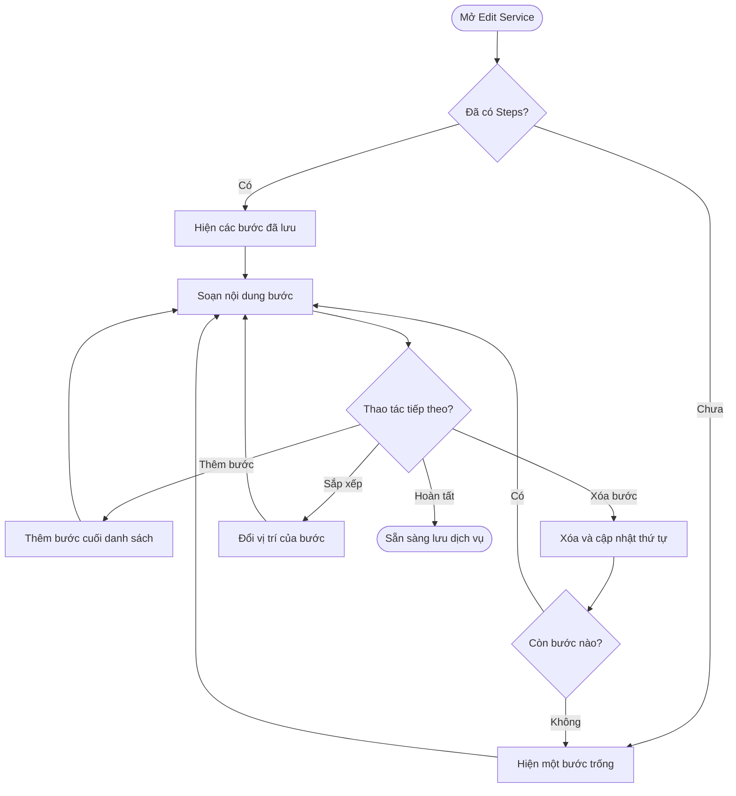
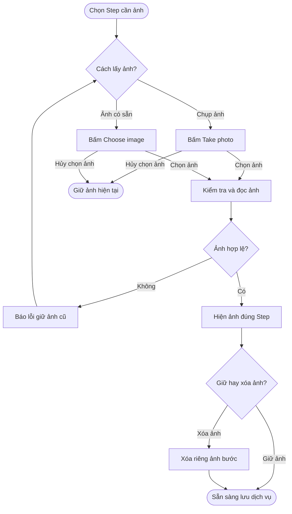
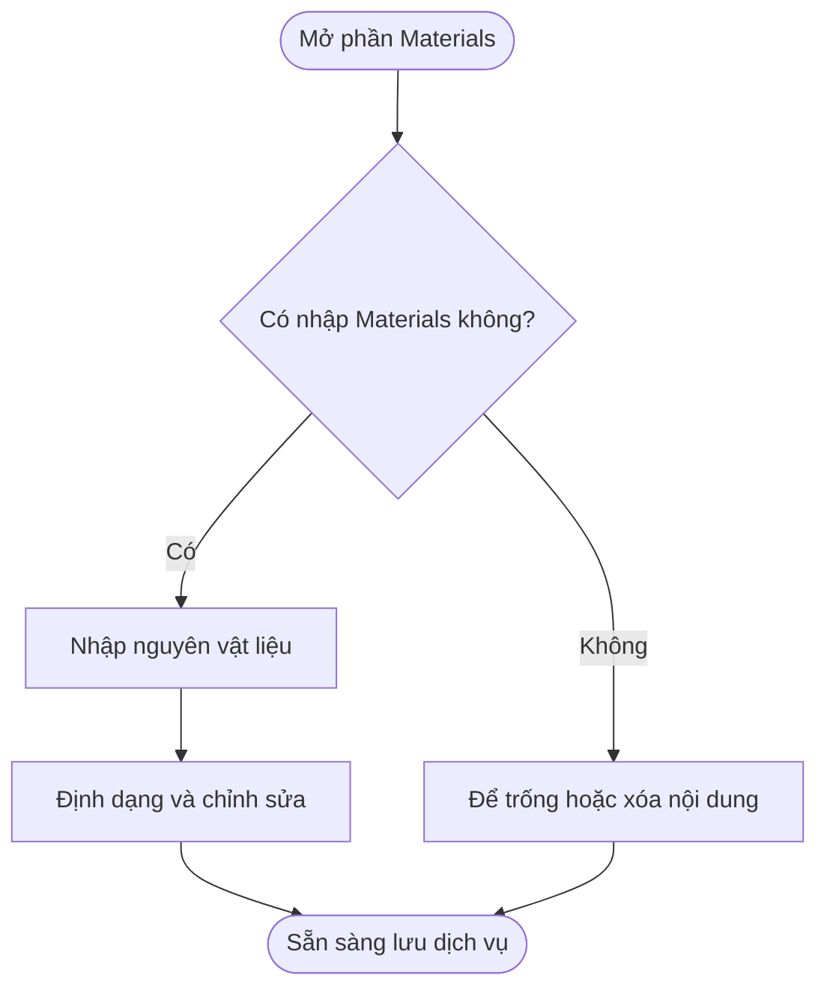
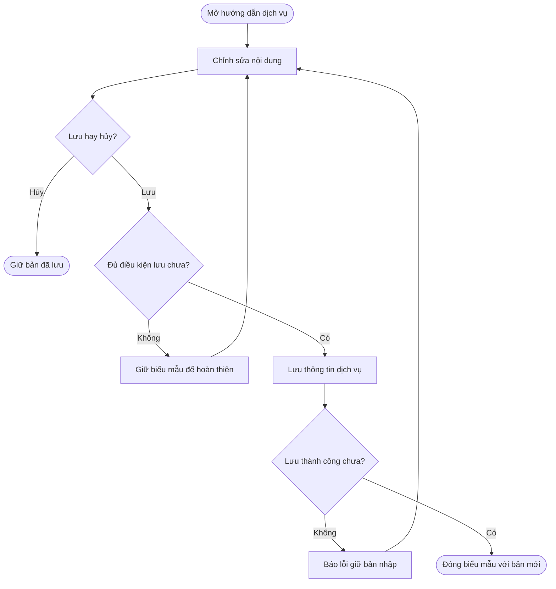

## POS — Cấu hình Steps và Materials cho dịch vụ

**Cập nhật lần cuối:** 24 tháng 9 năm 2026

**Đối tượng đọc:** Quản lý sản phẩm, BA, QA, quản lý salon, bộ phận hỗ trợ và đội phát triển

**Trạng thái:** Đang rà soát

---

### Tổng quan

**Steps và Materials** giúp salon chuẩn hóa hướng dẫn thực hiện dịch vụ bằng cách tách trình tự thao tác khỏi nội dung nguyên vật liệu cần chuẩn bị. Hệ thống cho phép soạn danh sách Steps với ảnh minh họa, tiêu đề và mô tả văn bản thường cho từng bước; thêm, xóa, sắp xếp các bước; và nhập Materials có định dạng dùng chung cho toàn bộ dịch vụ. Người quản lý cấu hình dịch vụ soạn, điều chỉnh và lưu các nội dung này trong Edit Service để duy trì hướng dẫn phù hợp với quy trình của salon.

#### Phạm vi tính năng

Tài liệu mô tả yêu cầu mới cho phần hướng dẫn dịch vụ trong Edit Service, dựa trên mô tả và bản HTML do người dùng cung cấp. Các tiêu chí dưới đây là yêu cầu nghiệm thu; phạm vi đã kiểm tra được ghi trong phần nguồn tham chiếu.

- Cấu hình hướng dẫn trong Edit Service của dịch vụ thông thường: nội dung từng bước, ảnh minh họa, thêm/xóa/sắp xếp bước và Materials chung.
- Lưu hoặc hủy toàn bộ thay đổi cùng thông tin dịch vụ; mở lại đúng nội dung đã lưu.
- Giữ nội dung hướng dẫn cũ để người quản lý phân chia lại; không tự suy đoán phần nào là nguyên vật liệu.
- Giữ hành vi khóa chỉnh sửa hướng dẫn đối với Custom service.

**Ngoài phạm vi:** Màn hình hướng dẫn riêng cho nhân viên/khách hàng; quản lý tồn kho, định mức hoặc tự tính Supply Fee từ Materials; quy trình phê duyệt hướng dẫn riêng. Đồng bộ máy chủ/thiết bị khác và hợp đồng API chưa được xác định trong mô tả nguồn.

---

### Khái niệm chính

| Thuật ngữ | Ý nghĩa |
| :--- | :--- |
| Steps | Danh sách bước thực hiện theo thứ tự từ trên xuống; dùng tay nắm kéo để đổi vị trí, không hiển thị nhãn số bước trên thẻ. |
| Step Image | Ảnh minh họa riêng của một bước, có thể chụp hoặc chọn từ thiết bị. |
| Step Title | Tiêu đề ngắn của bước, tối đa 120 ký tự. |
| Step Description | Mô tả thao tác bằng ô nhập nhiều dòng, chỉ nhập văn bản thường. |
| Materials | Nội dung nguyên vật liệu, số lượng và lưu ý chuẩn bị chung cho dịch vụ. |
| Service image | Ảnh đại diện dịch vụ, độc lập với ảnh từng Step. |
| Supply Fee | Khoản phí cấu hình riêng; không tự tính từ nội dung Materials. |
| Custom service | Dịch vụ có nhãn Custom service trên biểu mẫu; phần Steps, ảnh bước và Materials bị khóa chỉnh sửa trong bản HTML tham chiếu. |

Tên trường và nút như Steps, Materials, Save changes và Cancel được giữ theo giao diện để người đọc đối chiếu; phần mô tả và quy tắc dùng tiếng Việt.

#### Các trường trên biểu mẫu

| Thành phần | Kiểu nhập | Hành vi |
| :--- | :--- | :--- |
| Step Image | Ô ảnh với Take photo và Choose image | Một ảnh mỗi bước; có thể thay hoặc xóa riêng ảnh. |
| Step Title | Ô nhập một dòng | Tối đa 120 ký tự. |
| Step Description | Ô nhập nhiều dòng | Nhập văn bản thường, giữ xuống dòng; không có thanh định dạng hoặc chèn ảnh. |
| Materials | Trình soạn thảo có định dạng | Một nội dung chung cho dịch vụ, nằm dưới Add step. |

Biểu mẫu hiển thị sẵn một bước trống; Add step thêm bước cuối danh sách. Tất cả các trường trên đều tùy chọn.

---

### Vai trò người dùng

| Vai trò | Trách nhiệm |
| :--- | :--- |
| Người quản lý cấu hình dịch vụ | Thêm, sửa, xóa Steps; cập nhật ảnh và Materials; lưu hoặc hủy chỉnh sửa. |

Người quản lý cấu hình dịch vụ là người đang có quyền chỉnh sửa dịch vụ của salon. Theo mô tả nguồn, bản HTML chưa bổ sung cơ chế phân quyền riêng cho Steps và Materials; tài liệu không cấp thêm quyền cho nhân viên hoặc khách hàng.

---

### Luồng nghiệp vụ đầu cuối

#### Luồng 1: Soạn và quản lý Steps

**Người thực hiện chính:** Người quản lý cấu hình dịch vụ.

**Điểm bắt đầu:** Mở View / Edit của một dịch vụ thông thường và đến phần Steps trong Edit Service.

**Kết quả:** Danh sách Steps trong biểu mẫu phản ánh đúng nội dung và thứ tự thao tác quản lý muốn áp dụng, sẵn sàng lưu cùng dịch vụ theo luồng 4.

**Nhu cầu người dùng:**

- **US-ST-01 — Nhập bước đầu tiên:** Là quản lý salon, tôi muốn biểu mẫu hiển thị sẵn một bước trống khi chưa có hướng dẫn, để nhập nội dung ngay mà không phải bấm thêm bước.
- **US-ST-02 — Soạn nội dung bước:** Là quản lý salon, tôi muốn nhập Title và Description dạng văn bản thường cho từng Step, để diễn đạt rõ thao tác và lưu ý thực hiện.
- **US-ST-03 — Thêm bước:** Là quản lý salon, tôi muốn bấm Add step để thêm bước tiếp theo ở cuối danh sách, để mô tả đầy đủ trình tự dịch vụ.
- **US-ST-04 — Xóa bước:** Là quản lý salon, tôi muốn xóa bước không còn sử dụng và giữ nguyên nội dung các bước còn lại, để danh sách chỉ còn các thao tác cần thực hiện; nếu xóa bước cuối cùng, tôi muốn có sẵn một bước trống để soạn lại.
- **US-ST-05 — Sắp xếp bước:** Là quản lý salon, tôi muốn nắm kéo một bước đến vị trí mới, để điều chỉnh trình tự thực hiện mà không phải nhập lại ảnh, tiêu đề và mô tả.

| Bước | Người thực hiện | Thao tác | Phản hồi hệ thống | Ghi chú |
| :--- | :--- | :--- | :--- | :--- |
| 1 | Quản lý | Mở Edit Service | Hiện các bước đã lưu; nếu chưa có thì hiện một bước trống | Không bắt buộc nhập Steps. |
| 2 | Quản lý | Nhập Title và Description | Hiển thị nội dung trong đúng bước | Ảnh bên trái, Title và Description bên phải trên màn hình đủ rộng. |
| 3 | Quản lý | Nhập hoặc dán văn bản nhiều dòng vào Description | Giữ nội dung và xuống dòng trong ô nhập nhiều dòng | Không có thanh định dạng; không đổi Materials hoặc bước khác. |
| 4 | Quản lý | Bấm Add step | Thêm bước trống cuối danh sách, đặt con trỏ vào Title mới | Giữ nguyên nội dung bước trước. |
| 5 | Quản lý | Bấm Remove của một bước | Xóa cả bước cùng ảnh, tiêu đề và mô tả; cập nhật thứ tự | Xóa bước cuối cùng sẽ hiện một bước trống. |
| 6a | Quản lý | Nắm kéo thả bước đến vị trí mới | Hiện vạch trước/sau bước đích; di chuyển toàn bộ bước khi thả | Thứ tự mới chưa lưu cho đến khi Save changes. |
| 6b | Quản lý | Chọn tay nắm rồi bấm Alt + ↑/↓ | Di chuyển bước lên hoặc xuống một vị trí, giữ ảnh và nội dung đi cùng bước | Không vượt đầu hoặc cuối danh sách. |
| 7 | Quản lý | Tiếp tục chỉnh sửa hoặc lưu | Giữ danh sách trong biểu mẫu cho đến khi Save changes | Lưu/hủy theo luồng 4. |

**Tiêu chí nghiệm thu:**

| Mã | Nhu cầu liên quan | Điều kiện ban đầu | Thao tác | Kết quả mong đợi |
| :--- | :--- | :--- | :--- | :--- |
| AC-ST-01 | US-ST-01 | Dịch vụ chưa có Steps hoặc danh sách rỗng | Mở Edit Service | Hiện một bước với Image, Title, Description, tay nắm kéo và nút Remove; không có nhãn số bước; có Add step bên dưới. |
| AC-ST-02 | US-ST-02 | Đang sửa một Step | Nhập Title | Nhập được tối đa 120 ký tự; nội dung độc lập với tên dịch vụ. |
| AC-ST-03 | US-ST-02 | Đang nhập Description | Nhập văn bản nhiều dòng rồi lưu và mở lại | Giữ chữ và xuống dòng; ký tự giống thẻ HTML được hiển thị như văn bản. Không có thanh định dạng. |
| AC-ST-04 | US-ST-03 | Có nhiều bước đang nhập | Bấm Add step | Thêm một bước trống cuối danh sách; con trỏ ở Title mới; nội dung đã nhập giữ nguyên. |
| AC-ST-05 | US-ST-04 | Có ba bước | Xóa bước thứ hai | Bước cũ thứ ba lên vị trí thứ hai, giữ nguyên nội dung và ảnh của nó. |
| AC-ST-06 | US-ST-04 | Chỉ còn một bước | Bấm Remove | Hiện một bước trống để tiếp tục nhập. |
| AC-ST-07 | US-ST-01, US-ST-02 | Các trường bắt buộc của dịch vụ hợp lệ | Để trống toàn bộ Step hoặc chỉ nhập một phần rồi lưu | Không báo lỗi bắt buộc nhập ảnh, Title hoặc Description. |

**Tiêu chí nghiệm thu sắp xếp (US-ST-05):**

| Mã | Điều kiện / Thao tác | Kết quả |
| :--- | :--- | :--- |
| AC-ST-08 | Kéo bước đầu xuống cuối hoặc bước cuối lên đầu | Thứ tự đổi theo vị trí thả; ảnh, Title và Description đi cùng đúng bước; Materials giữ nguyên. |
| AC-ST-09 | Sắp xếp, Save changes rồi mở lại | Giữ thứ tự mới. |
| AC-ST-10 | Sắp xếp rồi Cancel và mở lại | Khôi phục thứ tự đã lưu trước đó. |
| AC-ST-11 | Chọn tay nắm, bấm Alt + ↑/↓ | Di chuyển một vị trí lên/xuống; không vượt đầu hoặc cuối danh sách. |
| AC-ST-12 | Thả ngoài bước đích hoặc kết thúc kéo mà không thả vào danh sách | Giữ nguyên thứ tự; bỏ hiệu ứng kéo. |

#### Luồng 2: Chụp, chọn và thay ảnh từng Step

**Người thực hiện chính:** Người quản lý cấu hình dịch vụ.

**Điểm bắt đầu:** Muốn minh họa một bước bằng ảnh.

**Kết quả:** Ảnh được gắn vào đúng Step và sẵn sàng lưu cùng dịch vụ.

**Nhu cầu người dùng:**

- **US-IM-01 — Chụp ảnh:** Là quản lý salon, tôi muốn bấm Take photo tại một Step, để chụp ảnh minh họa bằng thiết bị đang sử dụng.
- **US-IM-02 — Chọn hoặc thay ảnh:** Là quản lý salon, tôi muốn bấm Choose image và xem trước ảnh đã chọn, để sử dụng ảnh có sẵn hoặc thay ảnh chưa phù hợp.
- **US-IM-03 — Xóa ảnh:** Là quản lý salon, tôi muốn xóa riêng ảnh của Step, để giữ lại tiêu đề và mô tả khi không cần ảnh minh họa.
- **US-IM-04 — Giữ nội dung khi chọn ảnh không thành công:** Là quản lý salon, tôi muốn giữ ảnh và nội dung hiện tại nếu hủy chọn ảnh hoặc chọn ảnh lỗi, đồng thời được báo lỗi khi ảnh không hợp lệ, để tiếp tục chỉnh sửa mà không mất dữ liệu đã soạn.

| Bước | Người thực hiện | Thao tác | Phản hồi hệ thống | Ghi chú |
| :--- | :--- | :--- | :--- | :--- |
| 1 | Quản lý | Chọn Step cần thêm ảnh | Hiện Take photo và Choose image tại bước đó | Hai nút cùng cập nhật một ô ảnh. |
| 2 | Quản lý | Bấm Take photo hoặc Choose image | Mở chức năng chụp/chọn ảnh theo khả năng thiết bị và trình duyệt | Take photo ưu tiên camera sau khi được hỗ trợ. |
| 3a | Quản lý | Chọn một ảnh | Kiểm tra định dạng, dung lượng; hiện Adding image… khi đọc ảnh | JPG/JPEG, PNG, WebP; tối đa 10 MB mỗi ảnh. |
| 3b | Quản lý | Hủy bộ chọn ảnh | Giữ nguyên ảnh hiện tại, tiêu đề và mô tả | Không phát sinh ảnh thay thế. |
| 4a | Hệ thống | Đọc ảnh thành công | Hiện ảnh xem trước tại đúng Step; thay ảnh cũ nếu có | Không thay Service image. |
| 4b | Hệ thống | Phát hiện ảnh lỗi | Báo lỗi và giữ ảnh trước đó | Có thể chọn lại ảnh. |
| 5 | Quản lý | Bấm Remove image nếu cần | Xóa ảnh của bước; giữ Title và Description | Nút chỉ hiện khi bước có ảnh. |

**Tiêu chí nghiệm thu:**

| Mã | Nhu cầu liên quan | Điều kiện ban đầu | Thao tác | Kết quả mong đợi |
| :--- | :--- | :--- | :--- | :--- |
| AC-IM-01 | US-IM-01, US-IM-02 | Có một Step | Xem vùng Image | Có hai nút riêng Take photo và Choose image, vùng xem trước và hướng dẫn định dạng/dung lượng. |
| AC-IM-02 | US-IM-01 | Thiết bị hỗ trợ chụp ảnh qua trình duyệt | Bấm Take photo | Yêu cầu chức năng chụp ảnh; trên thiết bị không hỗ trợ, trình duyệt có thể mở bộ chọn file. |
| AC-IM-03 | US-IM-02 | Step đã có ảnh | Chọn ảnh mới hợp lệ | Thay đúng ảnh của Step đó; giữ Title, Description, Service image và các bước khác. |
| AC-IM-04 | US-IM-03 | Step có ảnh | Bấm Remove image | Vùng ảnh về trạng thái trống; tiêu đề và mô tả giữ nguyên. |
| AC-IM-05 | US-IM-04 | Step có hoặc chưa có ảnh | Chọn ảnh sai định dạng, quá 10 MB hoặc không đọc được | Báo lỗi; không thay ảnh hiện tại; giữ nội dung đang nhập. |
| AC-IM-06 | US-IM-02 | Đang đọc ảnh | Quan sát biểu mẫu | Hiện Adding image…; tạm khóa thao tác ảnh tại bước đó và Save changes đến khi xử lý xong. |
| AC-IM-07 | US-IM-02 | Đang nhập Description của Step | Muốn thêm ảnh minh họa | Dùng Take photo hoặc Choose image tại ô Image; ô nhập nhiều dòng không hỗ trợ chèn ảnh. |
| AC-IM-08 | US-IM-04 | Đang đọc ảnh | Xóa Step hoặc đóng biểu mẫu trước khi đọc xong | Bỏ kết quả đọc ảnh của bước hoặc biểu mẫu cũ, không gắn nhầm sang nơi khác. |

#### Luồng 3: Nhập Materials chung cho dịch vụ

**Người thực hiện chính:** Người quản lý cấu hình dịch vụ.

**Điểm bắt đầu:** Cần ghi nguyên vật liệu chuẩn bị cho dịch vụ.

**Kết quả:** Có nội dung Materials chung cho dịch vụ, độc lập với danh sách Steps và sẵn sàng lưu theo luồng 4.

**Nhu cầu người dùng:**

- **US-MA-01 — Nhập nguyên vật liệu:** Là quản lý salon, tôi muốn có một trình soạn thảo Materials riêng bên dưới Steps, để ghi nguyên vật liệu, số lượng và lưu ý chuẩn bị cho toàn bộ dịch vụ.
- **US-MA-02 — Định dạng danh sách:** Là quản lý salon, tôi muốn định dạng Materials thành danh sách và làm nổi bật lưu ý, để nội dung dễ đọc và kiểm tra.
- **US-MA-03 — Cập nhật độc lập:** Là quản lý salon, tôi muốn sửa hoặc xóa nội dung Materials mà không làm thay đổi Steps, để cập nhật phần chuẩn bị khi quy trình thực hiện vẫn giữ nguyên.

| Bước | Người thực hiện | Thao tác | Phản hồi hệ thống | Ghi chú |
| :--- | :--- | :--- | :--- | :--- |
| 1 | Quản lý | Đến Materials dưới Add step | Hiện một trình soạn thảo chung cho dịch vụ | Không tạo Materials riêng cho từng Step. |
| 2 | Quản lý | Nhập tên vật liệu, số lượng và lưu ý | Hiện nội dung tự do trong trình soạn thảo | Ví dụ: Bông cotton — 5 miếng; dung dịch làm sạch — 10 ml. |
| 3 | Quản lý | Định dạng hoặc chỉnh sửa nội dung | Cập nhật riêng Materials | Không làm thay đổi các Step. |
| 4 | Quản lý | Lưu cùng dịch vụ | Lưu nội dung và định dạng được hỗ trợ | Theo luồng 4. |

**Tiêu chí nghiệm thu:**

| Mã | Nhu cầu liên quan | Điều kiện ban đầu | Thao tác | Kết quả mong đợi |
| :--- | :--- | :--- | :--- | :--- |
| AC-MA-01 | US-MA-01 | Mở Edit Service | Đến cuối phần Steps | Materials có nhãn optional (không bắt buộc) và trình soạn thảo riêng bên dưới Add step. |
| AC-MA-02 | US-MA-01, US-MA-02 | Đang nhập Materials | Nhập và định dạng nội dung | Hỗ trợ đậm, nghiêng, gạch chân, danh sách đánh số/gạch đầu dòng và xóa định dạng chữ. |
| AC-MA-03 | US-MA-03 | Đã có Steps và Materials | Sửa hoặc xóa toàn bộ Materials | Steps giữ nguyên; Materials được phép để trống. |
| AC-MA-04 | US-MA-03 | Đã có Materials | Thêm/xóa Step | Materials giữ nguyên, không nhân bản theo số bước. |
| AC-MA-05 | US-MA-01 | Đã cấu hình Supply Fee | Nhập số lượng/chi phí trong Materials | Không tự thay Supply Fee, giá dịch vụ hoặc tồn kho. |

#### Luồng 4: Lưu, hủy và sử dụng lại hướng dẫn đã có

**Người thực hiện chính:** Người quản lý cấu hình dịch vụ.

**Điểm bắt đầu:** Hoàn tất chỉnh sửa hoặc mở lại dịch vụ có hướng dẫn.

**Kết quả:** Lưu đúng nội dung mới khi thành công; giữ dữ liệu đã lưu nếu hủy hoặc lưu thất bại.

**Nhu cầu người dùng:**

- **US-SV-01 — Lưu hướng dẫn:** Là quản lý salon, tôi muốn lưu Steps và Materials bằng Save changes cùng thông tin dịch vụ, để mở lại và tiếp tục cập nhật khi cần.
- **US-SV-02 — Hủy chỉnh sửa:** Là quản lý salon, tôi muốn Cancel hoặc đóng biểu mẫu để bỏ thay đổi chưa lưu, để giữ bản hướng dẫn trước đó.
- **US-SV-03 — Lưu thất bại:** Là quản lý salon, tôi muốn biểu mẫu giữ nội dung đang nhập khi lưu thất bại, để chỉnh sửa và thử lại.
- **US-SV-04 — Giữ nội dung cũ:** Là quản lý salon, tôi muốn giữ nội dung từ trình soạn thảo Steps / Materials chung trước đây, để tự phân chia lại mà không phải soạn từ đầu.

| Bước | Người thực hiện | Thao tác | Phản hồi hệ thống | Ghi chú |
| :--- | :--- | :--- | :--- | :--- |
| 1 | Quản lý | Mở dịch vụ đã có hướng dẫn | Nạp Steps và Materials đã lưu | Nếu chỉ có nội dung chung cũ, chuyển phần chữ vào ô nhập nhiều dòng Description của bước đầu tiên; Materials trống. |
| 2 | Quản lý | Chỉnh sửa nội dung | Giữ bản đang nhập trong biểu mẫu | Chưa tự lưu. |
| 3a | Quản lý | Bấm Save changes | Kiểm tra biểu mẫu và lưu cùng dịch vụ | Các trường bắt buộc khác phải hợp lệ; chờ ảnh xử lý xong. |
| 3b | Quản lý | Bấm Cancel hoặc đóng biểu mẫu | Bỏ thay đổi và đóng biểu mẫu | Không ghi đè bản đã lưu. |
| 4a | Hệ thống | Lưu thành công | Đóng biểu mẫu; lần mở sau hiện nội dung mới | Giữ thứ tự bước, ảnh, tiêu đề, xuống dòng của Description và định dạng Materials. |
| 4b | Hệ thống | Lưu thất bại | Báo lỗi, giữ biểu mẫu và nội dung đang nhập | Quản lý xử lý nguyên nhân rồi thử lại. |

**Tiêu chí nghiệm thu:**

| Mã | Nhu cầu liên quan | Điều kiện ban đầu | Thao tác | Kết quả mong đợi |
| :--- | :--- | :--- | :--- | :--- |
| AC-SV-01 | US-SV-01 | Biểu mẫu hợp lệ, nhiều bước có ảnh và Materials có định dạng | Save changes rồi mở lại | Giữ đúng thứ tự, Title, Description, ảnh và Materials của dịch vụ. |
| AC-SV-02 | US-SV-01 | Thiếu category hoặc trường bắt buộc khác không hợp lệ | Lưu | Chặn lưu theo quy tắc của Edit Service; không bắt nhập Steps/Materials. |
| AC-SV-03 | US-SV-02 | Đã thêm/xóa/sửa bước, ảnh hoặc Materials | Cancel hoặc đóng biểu mẫu rồi mở lại | Hiện dữ liệu đã lưu trước lần chỉnh sửa đó. |
| AC-SV-04 | US-SV-03 | Bộ nhớ lưu trữ không đủ | Save changes | Báo lỗi, giữ biểu mẫu và bản đang nhập; không ghi đè danh mục dịch vụ đã lưu. |
| AC-SV-05 | US-SV-04 | Dịch vụ chỉ có nội dung trình soạn thảo chung cũ | Mở Edit Service | Chuyển phần chữ vào ô nhập nhiều dòng Description của bước đầu tiên, giữ xuống dòng; Materials trống. Bản nội dung định dạng cũ được giữ trong dữ liệu để đối chiếu, không hiển thị trong ô nhập nhiều dòng. |
| AC-SV-06 | US-SV-04 | Đã chuyển và lưu theo cấu trúc mới | Xóa nội dung, lưu rồi mở lại | Nội dung chung cũ không tự xuất hiện trở lại. |
| AC-SV-07 | US-SV-01 | Một dịch vụ thuộc nhiều category | Lưu rồi mở từ category khác | Hiện cùng Steps và Materials của dịch vụ đó. |

---

### Cấu hình và quản trị

**Vị trí:** POS → Salon Settings → Services → View / Edit → Edit Service. Steps nằm gần cuối biểu mẫu, sau Require approval; Materials nằm dưới danh sách Steps và nút Add step.

**Nhu cầu người dùng:**

- **US-AD-01:** Là quản lý salon, tôi muốn hướng dẫn thuộc về dịch vụ và được dùng chung khi dịch vụ xuất hiện ở nhiều category, để không phải cập nhật nhiều bản nội dung.
- **US-AD-02:** Là quản lý salon, tôi muốn các trường hướng dẫn của Custom service được khóa theo cấu hình hiện có, để giữ hành vi riêng của dịch vụ này.

**Cấu hình áp dụng:**

- Theo mô tả nguồn, bản HTML lưu cấu hình theo salon trong bộ nhớ trình duyệt; chưa đồng bộ máy chủ hoặc thiết bị khác. Đây là giới hạn của bản HTML, chưa phải quyết định cơ chế lưu cho ứng dụng tích hợp API.
- Với Custom service, không cho thêm/xóa/sắp xếp Step, sửa Title, Description, Materials hoặc ảnh bước.

**Tiêu chí nghiệm thu:**

| Mã | Nhu cầu liên quan | Điều kiện ban đầu | Thao tác | Kết quả mong đợi |
| :--- | :--- | :--- | :--- | :--- |
| AC-AD-01 | US-AD-01 | Một dịch vụ thuộc nhiều category | Lưu hướng dẫn và mở lại dịch vụ từ category khác | Hiện cùng nội dung và thứ tự đã lưu; không tạo bản hướng dẫn riêng theo category. |
| AC-AD-02 | US-AD-02 | Đang mở Custom service | Xem và thử các thao tác cấu hình hướng dẫn | Không thể thêm/xóa/sắp xếp bước, sửa Title/Description/Materials hoặc chụp/chọn/thay/xóa ảnh bước; thao tác bàn phím cũng không thay đổi thứ tự. |

#### Các điểm cần xác định khi triển khai

| Nội dung | Yêu cầu đã có / điểm còn mở |
| :--- | :--- |
| Giới hạn nội dung | Title tối đa 120 ký tự; một ảnh mỗi bước, tối đa 10 MB mỗi ảnh. Mô tả nguồn chưa quy định số bước tối đa, độ dài Description/Materials hoặc tổng dung lượng ảnh của một dịch vụ. |
| Ảnh có sẵn trong Materials | Có thể giữ ảnh hợp lệ trong nội dung định dạng được hỗ trợ; tiêu chí xác định ảnh hợp lệ chưa được nêu cụ thể. Luồng thêm ảnh mới vẫn ở ô Image của từng bước. |
| Lưu trữ và dữ liệu cũ | Cần xác định cách lưu trên máy chủ và nguồn hướng dẫn cũ của ứng dụng khi triển khai. Việc giữ dữ liệu, lưu/hủy và không khôi phục nội dung đã xóa phải tuân theo luồng 4. |

---

### Vòng đời trạng thái

Steps và Materials không có vòng đời trạng thái nghiệp vụ hoặc quy trình phê duyệt riêng, vì vậy không áp dụng bảng chuyển trạng thái hay sơ đồ trạng thái. Nội dung đang chỉnh sửa chỉ được ghi nhận khi Save changes thành công. Adding image… là thông báo xử lý ảnh tạm thời; cách lưu, hủy và xử lý lỗi được mô tả trong luồng 4.

---

### Quy tắc nghiệp vụ

1. **Tùy chọn:** Steps và Materials không bắt buộc. Mỗi Step cũng không bắt buộc đủ ảnh, Title và Description.
2. **Bước mặc định:** Luôn hiển thị ít nhất một Step; xóa bước cuối sẽ tạo một bước trống.
3. **Thứ tự:** Add step thêm cuối danh sách. Nắm biểu tượng kéo ở đầu thẻ để thả trước/sau bước khác theo vạch chỉ vị trí. Cả ảnh, tiêu đề và mô tả di chuyển cùng bước. Có thể dùng Alt + ↑/↓ khi chọn tay nắm. Không hiển thị nhãn số bước Step 1, Step 2… trên thẻ; thứ tự đọc từ trên xuống. Save changes lưu thứ tự mới; Cancel bỏ thay đổi. Custom service không cho sắp xếp bước.
4. **Ảnh riêng:** Mỗi Step có một ô ảnh; ảnh mới thay ảnh cũ. Ảnh bước độc lập với Service image và ảnh bước khác.
5. **Giới hạn ảnh:** Nhận JPG/JPEG, PNG, WebP tối đa 10 MB mỗi ảnh. Kết quả chụp ảnh phụ thuộc khả năng thiết bị/trình duyệt.
6. **Ô nhập:** Step Description chỉ nhận văn bản thường và giữ xuống dòng; không có thanh định dạng hoặc chèn ảnh. Materials tiếp tục dùng trình soạn thảo có định dạng; nội dung dán vào Materials được lọc theo các định dạng được hỗ trợ.
7. **Ảnh trong Materials:** Materials hiện không có nút chụp/chọn ảnh; dán trực tiếp file ảnh vào Materials không thêm ảnh. Ảnh hợp lệ nằm trong nội dung định dạng được hỗ trợ có thể được giữ lại. Luồng nhập ảnh mới được thiết kế ở ô Image của từng Step.
8. **Lưu:** Lưu Steps và Materials cùng dịch vụ; không có nút lưu riêng từng bước và không tự lưu khi đang nhập. Save changes bị khóa trong lúc đọc ảnh bước hoặc ảnh dịch vụ.
9. **💡 Phí và tồn kho:** Materials chỉ là nội dung mô tả; không tự tính Supply Fee, giá dịch vụ, định mức hoặc trừ tồn kho.
10. **Dữ liệu cũ:** Chuyển phần chữ của mô tả có định dạng sang ô nhập nhiều dòng, giữ xuống dòng và bỏ định dạng khi hiển thị. Bản nội dung định dạng cũ cùng ảnh hợp lệ được giữ trong dữ liệu để đối chiếu, không hiển thị trong ô nhập nhiều dòng và không tự chuyển ảnh sang ô Image. Nội dung văn bản mới luôn được ưu tiên, kể cả khi người dùng đã xóa trống.

---

### Tình huống ngoại lệ và cách xử lý

| Tình huống | Xử lý | Người giải quyết |
| :--- | :--- | :--- |
| Hủy bộ chọn ảnh mà không chọn file | Giữ nguyên ảnh và nội dung hiện tại | Quản lý |
| Chọn ảnh sai định dạng, quá lớn hoặc bị lỗi | Báo lỗi, giữ ảnh trước đó; cho chọn lại | Quản lý |
| Xóa Step hoặc đóng biểu mẫu khi đang đọc ảnh | Không gắn kết quả vào bước hoặc biểu mẫu khác | Hệ thống |
| Xóa nhầm Step nhưng chưa lưu | Có thể Cancel để quay lại toàn bộ bản đã lưu; không có nút Undo riêng cho bước | Quản lý |
| Bộ nhớ trình duyệt không đủ khi lưu | Giữ bản đang nhập; có thể giảm số ảnh hoặc dung lượng ảnh rồi thử lại | Quản lý |
| Tải lại trang trước khi Save changes | Không bảo đảm giữ nội dung chưa lưu | Quản lý |
| Không xác định được nguyên vật liệu trong nội dung cũ | Giữ toàn bộ ở Description của bước đầu tiên, để người quản lý tự chuyển phần phù hợp sang Materials | Quản lý |
| Mở Custom service | Khóa chỉnh sửa Steps, ảnh bước và Materials | Hệ thống |

---

### Câu hỏi thường gặp

**Có phải bấm Add step để bắt đầu không?**

Không. Dịch vụ chưa có hướng dẫn sẽ hiện sẵn một bước trống.

**Có bắt buộc nhập ảnh và tiêu đề cho mỗi bước không?**

Không. Có thể chỉ nhập mô tả hoặc để trống, miễn các trường bắt buộc khác của dịch vụ hợp lệ.

**Materials có phải danh sách từng dòng với ô số lượng riêng không?**

Không. Materials hiện là một trình soạn thảo nhập tự do; quản lý ghi tên vật liệu, số lượng và lưu ý trong nội dung.

**Có nhập Materials cho từng Step không?**

Materials áp dụng chung cho toàn bộ dịch vụ. Lưu ý sử dụng vật liệu ở bước cụ thể có thể ghi trong Description của bước đó.

**Ảnh cũ trong trình soạn thảo chung có bị mất không?**

Bản nội dung cũ cùng ảnh hợp lệ được giữ trong dữ liệu để đối chiếu. Ô Description chỉ hiển thị phần chữ; ảnh cũ không hiển thị trong ô này và không tự chuyển sang ô Image. Có thể chọn lại ảnh minh họa bằng Choose image.

---

### Tính năng liên quan

Các mục dưới đây là những phần của cấu hình dịch vụ; chưa có tài liệu riêng đi kèm. Bản HTML tham chiếu của màn hình được liên kết ở phần nguồn bên dưới.

| Tính năng | Mối liên hệ với tài liệu này |
| :--- | :--- |
| Salon Settings / Services | Quản lý danh mục và thông tin dịch vụ; là nơi mở biểu mẫu để cấu hình Steps và Materials. |
| Edit Service | Chứa Steps và Materials; Save changes lưu cùng thông tin dịch vụ, Cancel bỏ các thay đổi chưa lưu. |
| Categories — nhóm dịch vụ | Một dịch vụ có thể thuộc nhiều nhóm nhưng dùng chung một bộ hướng dẫn. |
| Service image — ảnh dịch vụ | Là ảnh đại diện của dịch vụ, độc lập với ảnh minh họa của từng bước. |
| Supply Fee — phí vật tư | Là khoản phí được cấu hình riêng; nội dung Materials không tự tính hoặc thay đổi khoản phí này. |
| Require approval — yêu cầu phê duyệt | Là thiết lập sẵn có của dịch vụ; không tạo vòng phê duyệt riêng cho Steps và Materials. |

#### Nguồn tham chiếu

- [POS — Salon Settings / Services, bản HTML](https://taxiq-nexora-touch.vercel.app/html/pages/pos-salon-settings.html?section=services): Tham chiếu trực tiếp cho giao diện và thao tác trong Edit Service.

- **Yêu cầu nghiệp vụ:** Mô tả “POS — Cấu hình Steps và Materials cho dịch vụ” do người dùng cung cấp ngày 24 tháng 9 năm 2026.
- **Tham chiếu giao diện:** Bản HTML ở liên kết trên; mở View / Edit của một dịch vụ để xem phần Steps và Materials.
- **Hiện trạng ứng dụng:** Đối chiếu nhánh `staging` tại mã phiên bản `58c41d9352b604209d375ab8dfab7c24763b8def` ngày 24 tháng 9 năm 2026 cho thấy biểu mẫu và phần gửi dữ liệu lưu dịch vụ được kiểm tra chưa có Steps và Materials tách riêng. Tài liệu mô tả yêu cầu mới, không xác nhận khả năng hiện tại của backend.
- **Phạm vi đã đối chiếu:** Đội nội bộ xem ghi nhận kiểm tra HTML (bằng chứng lưu nội bộ, không đính kèm bản chia sẻ). Bằng chứng kiểm tra không nằm trong bộ tài liệu chia sẻ; những tiêu chí chưa kiểm thử tiếp tục là yêu cầu nghiệm thu.

---
