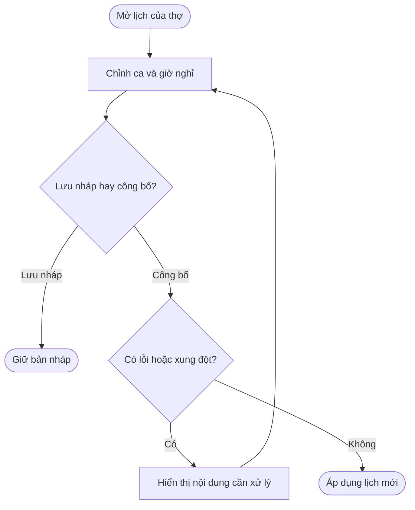
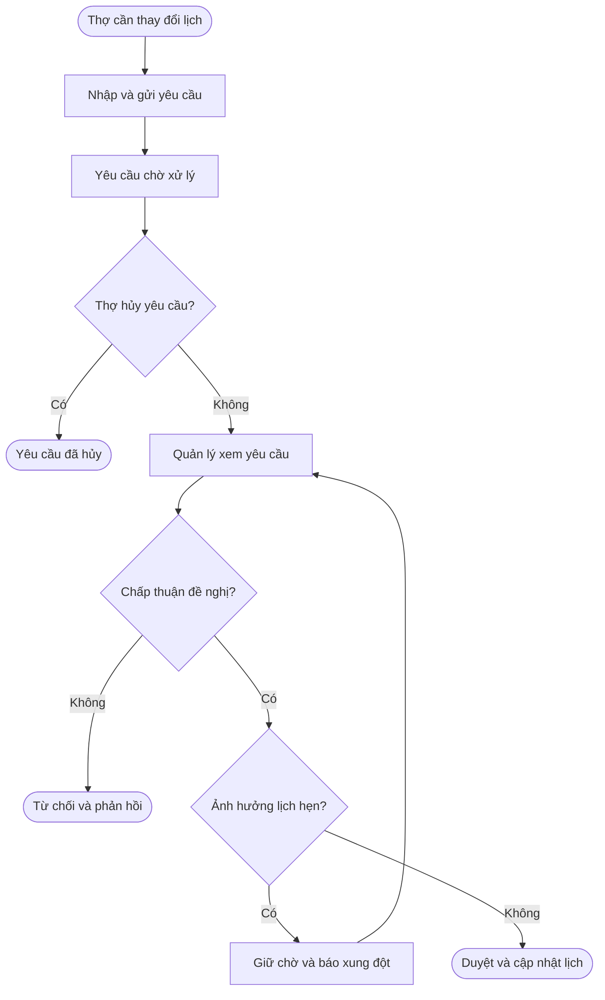
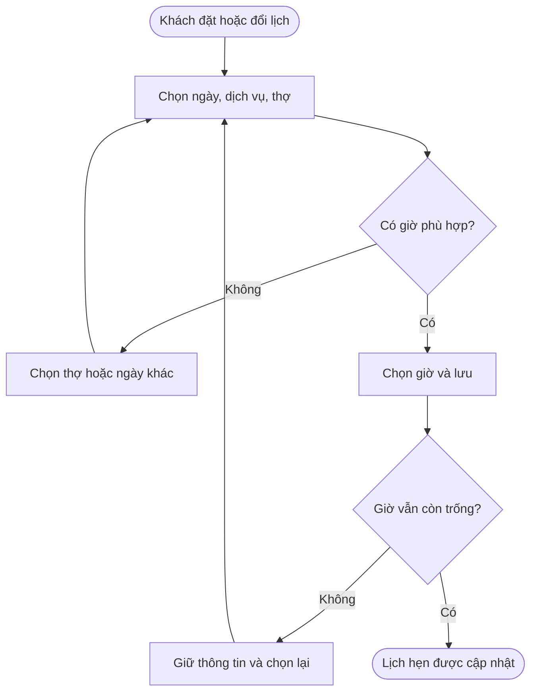
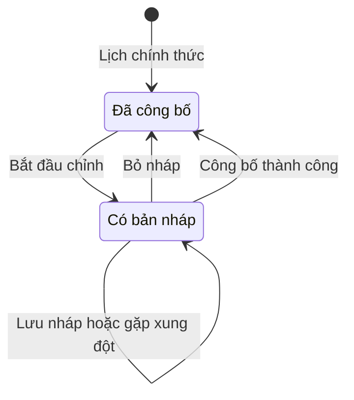
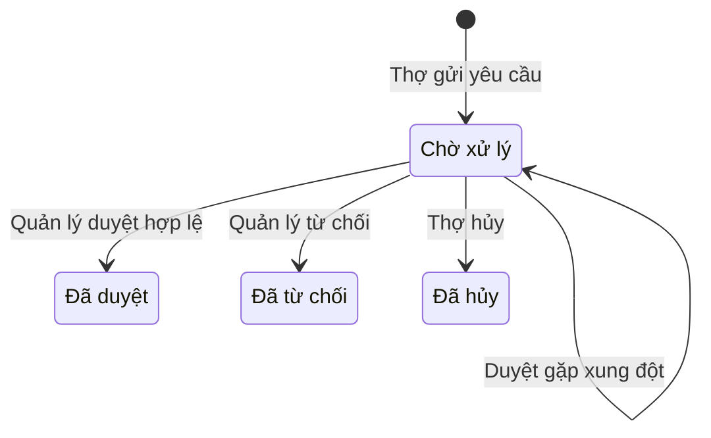

# POS — Nâng cấp lịch làm việc của thợ và Booking

**Cập nhật lần cuối:** 28 tháng 9 năm 2026  
**Đối tượng:** Product Owner, Business Analyst, Product Designer, Frontend, QA  
**Trạng thái:** Bản nháp  
**Ticket:** [vlink-nexora#1817](https://github.com/vlink-group/vlink-nexora/issues/1817)

## 1. Tổng quan nâng cấp

Bổ sung quản lý lịch làm việc tập trung cho tiệm, mở rộng lịch cá nhân của thợ và kết nối lịch làm việc với thao tác đặt lịch tại Front Desk. Quản lý chủ động sắp ca và xử lý yêu cầu thay đổi; thợ theo dõi lịch hẹn, giờ làm và giờ nghỉ; lễ tân biết thợ nào có thể nhận khách vào thời điểm cần đặt.

| Khu vực | Nội dung nâng cấp |
|---|---|
| Salon Settings | Thêm Staff Schedule để xem lịch toàn bộ thợ, chỉnh ca làm, giờ nghỉ và thay đổi theo ngày |
| Quản lý lịch | Bổ sung lưu nháp, bỏ nháp và công bố lịch; cảnh báo thay đổi ảnh hưởng lịch hẹn |
| Lịch cá nhân của thợ | Hiển thị lịch hẹn theo dòng thời gian; bổ sung Work Schedule và Requests |
| Yêu cầu thay đổi lịch | Thợ gửi yêu cầu; quản lý xem, điều chỉnh, duyệt hoặc từ chối |
| Front Desk | Hiển thị tình hình nhân sự và giờ trống; kiểm tra lịch làm việc khi đặt hoặc đổi lịch hẹn |

## 2. Khái niệm chính

| Khái niệm | Ý nghĩa |
|---|---|
| Weekly schedule — Lịch tuần | Giờ làm việc lặp lại theo từng thứ |
| Date changes — Thay đổi theo ngày | Ngoại lệ cho một ngày cụ thể, như nghỉ ngày hoặc đổi giờ làm |
| Break — Giờ nghỉ | Khoảng nghỉ trong ca làm, lặp theo thứ hoặc áp dụng cho một ngày |
| Availability — Thời gian có thể nhận khách | Thời gian làm việc còn lại sau khi tính lịch hẹn, giờ nghỉ và ngoại lệ theo ngày |
| Open slot — Giờ trống có thể đặt | Giờ bắt đầu có đủ thời gian để hoàn thành dịch vụ đã chọn |
| Draft — Bản nháp | Lịch đang chuẩn bị, chưa áp dụng cho việc nhận khách |
| Published — Đã công bố | Lịch chính thức dùng trên lịch của thợ và Front Desk |
| Request — Yêu cầu thay đổi lịch | Đề nghị nghỉ ngày, đổi giờ làm hoặc thêm giờ nghỉ do thợ gửi |

## 3. Vai trò người dùng

| Vai trò | Thao tác |
|---|---|
| Chủ tiệm hoặc quản lý được phân quyền | Xem lịch toàn bộ thợ, chỉnh lịch, công bố lịch và xử lý yêu cầu |
| Thợ | Xem lịch cá nhân, gửi yêu cầu thay đổi và hủy yêu cầu đang chờ |
| Lễ tân | Xem thợ đang làm việc, chọn giờ trống và tạo hoặc đổi lịch hẹn |

## 4. Nâng cấp tài khoản tiệm — Staff Schedule

### 4.1 Truy cập và xem lịch toàn bộ thợ

Thêm mục **Staff Schedule** trong Salon Settings. Danh sách thợ có thêm nút **Edit schedule** để mở nhanh phần chỉnh lịch của từng người.

Màn hình tổng quan hiển thị lịch từ thứ Hai đến Chủ nhật, với mỗi dòng tương ứng một thợ. Quản lý nhìn thấy giờ làm từng ngày, ngày nghỉ, số ngày làm trong tuần, giờ trống và cảnh báo xung đột.

Thanh điều hướng gồm tuần trước, tuần sau, chọn ngày và **This week**. Khi chuyển tuần, màn hình giữ salon đang chọn và hiển thị rõ phạm vi ngày.

### 4.2 Chỉnh lịch trong cửa sổ riêng

Chọn **Edit schedule** để mở cửa sổ chỉnh lịch với ba tab:

| Tab | Thao tác |
|---|---|
| Weekly schedule | Bật hoặc tắt ngày làm việc; đặt giờ bắt đầu, giờ kết thúc và giờ nghỉ cho từng thứ |
| Date changes | Chọn ngày cụ thể để nghỉ cả ngày, đổi giờ làm hoặc bổ sung giờ nghỉ |
| Staff permissions | Thiết lập quyền gửi yêu cầu thay đổi lịch của thợ |

Thay đổi theo ngày chỉ áp dụng cho ngày được chọn. Ví dụ, thợ thường làm thứ Hai từ 9:00 AM đến 6:00 PM nhưng được đổi sang 10:00 AM–4:00 PM vào ngày 28 tháng 9; các thứ Hai khác vẫn giữ lịch tuần.

Trong khi chỉnh, chuyển tab vẫn giữ nội dung đã nhập. Khi đóng cửa sổ với thay đổi chưa lưu, hiển thị lựa chọn tiếp tục chỉnh hoặc bỏ thay đổi.

### 4.3 Quản lý giờ nghỉ

Quản lý có thể thêm, sửa hoặc xóa nhiều khoảng nghỉ trong ca:

- Giờ nghỉ lặp lại theo thứ, ví dụ nghỉ trưa thứ Hai từ 12:00 PM đến 12:30 PM.
- Giờ nghỉ cho một ngày cụ thể, ví dụ thêm 30 phút nghỉ vào chiều ngày 28 tháng 9.

Giờ nghỉ hiển thị cùng ca làm để quản lý thấy ngay thời gian còn có thể nhận khách. Nếu khoảng nghỉ nằm ngoài ca, có giờ kết thúc không hợp lệ hoặc trùng khoảng nghỉ khác, thông báo lỗi xuất hiện ngay tại mục cần sửa.

### 4.4 Lưu nháp và công bố lịch

| Hành động | Kết quả |
|---|---|
| Save draft | Lưu lịch đang chuẩn bị; lịch chính thức vẫn giữ nguyên |
| Discard draft | Bỏ bản nháp và trở về lịch đã công bố |
| Publish schedule | Áp dụng thay đổi cho lịch của thợ và Front Desk sau khi kiểm tra xung đột |

Màn hình phân biệt bản nháp với lịch đã công bố bằng nhãn trạng thái rõ ràng. Nếu thay đổi ảnh hưởng lịch hẹn đã có, hiển thị thợ, ngày, giờ và lịch hẹn liên quan để quản lý xử lý trước khi công bố.

### 4.5 Xử lý yêu cầu của thợ

Quản lý xem danh sách yêu cầu với tên thợ, loại yêu cầu, ngày áp dụng, giờ đề nghị, lý do và trạng thái.

Quản lý có thể:

- Xem và điều chỉnh nội dung trước khi duyệt; phần điều chỉnh được hiển thị rõ trong kết quả.
- Duyệt yêu cầu hợp lệ để cập nhật lịch chính thức.
- Từ chối và gửi lý do phản hồi cho thợ.

Nếu yêu cầu ảnh hưởng lịch hẹn đã có, thao tác duyệt bị chặn và yêu cầu vẫn ở trạng thái chờ xử lý. Quản lý có thể điều chỉnh đề nghị, xử lý lịch hẹn liên quan hoặc từ chối yêu cầu.

## 5. Nâng cấp tài khoản thợ — My Calendar

### 5.1 Bố cục lịch mới

My Calendar có ba tab: **Appointments**, **Work Schedule** và **Requests**. Thợ chọn salon được phép truy cập và ngày muốn xem.

Trên máy tính, lịch hiển thị theo dòng thời gian cùng vùng chi tiết bên cạnh. Trên điện thoại, thông tin xếp dọc để thợ dễ xem lịch trong ngày và mở từng lịch hẹn.

### 5.2 Appointments — Lịch hẹn

Mỗi lịch hẹn hiển thị giờ bắt đầu, giờ kết thúc, thời lượng, khách hàng, dịch vụ, mã Work Order khi có và trạng thái. Chọn lịch hẹn để xem chi tiết.

Phần tổng quan ngày cho biết số lịch hẹn và tổng thời gian đã được đặt. Nếu ngày được chọn chưa có lịch hẹn, màn hình hiển thị thông báo chưa có lịch hẹn trong ngày đó.

### 5.3 Work Schedule — Lịch làm việc

Thợ xem được giờ vào ca, giờ kết thúc, các khoảng nghỉ và thay đổi riêng của ngày đang chọn. Lịch hẹn và khoảng trống được phân biệt rõ để thợ biết khi nào đang phục vụ khách, khi nào nghỉ và khi nào còn có thể nhận khách.

Lịch hiển thị theo bản đã công bố. Yêu cầu đang chờ duyệt được theo dõi trong Requests và chưa làm thay đổi giờ làm việc.

### 5.4 Requests — Yêu cầu thay đổi lịch

| Loại yêu cầu | Thông tin thợ nhập |
|---|---|
| Day off | Ngày muốn nghỉ và lý do |
| Change working hours | Ngày áp dụng, giờ bắt đầu, giờ kết thúc đề nghị và lý do |
| Add break | Ngày áp dụng, giờ bắt đầu, giờ kết thúc khoảng nghỉ và lý do |

Sau khi gửi, yêu cầu xuất hiện trong danh sách với trạng thái **Pending**. Thợ theo dõi kết quả **Approved**, **Rejected** hoặc **Canceled**, cùng phản hồi của quản lý nếu có.

Thợ có thể hủy yêu cầu đang chờ duyệt. Khi được duyệt, lịch làm việc cập nhật theo nội dung đã được quản lý chấp thuận.

## 6. Nâng cấp Front Desk — Đặt lịch theo thời gian làm việc

### 6.1 Tổng quan nhân sự trong ngày

Bổ sung ba chỉ số theo ngày đang xem:

| Chỉ số | Nội dung |
|---|---|
| Staff working today | Số thợ có lịch làm việc |
| Open booking slots | Số giờ trống theo quy tắc đặt lịch đang áp dụng |
| Schedule conflicts | Số xung đột lịch cần xử lý |

Người có quyền quản lý có thể chọn **Manage staff schedules** để mở phần quản lý lịch. Khi đổi salon hoặc ngày, các chỉ số cập nhật theo đúng lựa chọn.

### 6.2 Chọn giờ khi tạo lịch hẹn

Sau khi chọn ngày, dịch vụ và thợ, lễ tân thấy các giờ bắt đầu phù hợp với ca làm và thời lượng dịch vụ. Khoảng nghỉ, thời gian ngoài ca và thời gian đã có lịch hẹn không thể được chọn để đặt trùng.

Ví dụ: thợ còn trống từ 9:30 AM đến 10:30 AM thì dịch vụ 60 phút có thể bắt đầu lúc 9:30 AM. Các mốc bắt đầu theo khoảng cách giờ đặt lịch của salon; thời lượng dịch vụ quyết định khoảng trống cần có.

Nếu không còn giờ phù hợp, màn hình thông báo rõ và cho phép chọn thợ hoặc ngày khác.

### 6.3 Đổi lịch hẹn

Lễ tân có thể đổi giờ hoặc thợ và xem lại các lựa chọn phù hợp. Lịch hẹn đang sửa không bị tính là một lịch hẹn khác đang chiếm chính giờ của nó.

Nếu giờ vừa chọn không còn trống khi lưu, màn hình giữ thông tin khách và dịch vụ, thông báo lý do và yêu cầu chọn lại. Sau khi lưu thành công, lịch hẹn được cập nhật trên Front Desk và lịch của thợ.

## 7. Luồng sử dụng

### 7.1 Quản lý chỉnh và công bố lịch

**Người thực hiện:** Chủ tiệm hoặc quản lý.  
**Bắt đầu:** Cần sắp ca hoặc thay đổi lịch của thợ.  
**Kết quả:** Lịch mới được công bố và dùng để nhận khách.

**Nhu cầu người dùng:**

- Là quản lý, tôi muốn chuẩn bị lịch và lưu nháp để có thể hoàn thiện trước khi áp dụng.
- Là quản lý, tôi muốn biết lịch hẹn nào bị ảnh hưởng để xử lý trước khi công bố.

| Bước | Thao tác | Kết quả |
|---|---|---|
| 1 | Mở Staff Schedule, chọn tuần và thợ | Xem lịch làm việc của thợ |
| 2 | Chọn Edit schedule, chỉnh ca hoặc giờ nghỉ | Thấy nội dung thay đổi và lỗi cần sửa |
| 3 | Chọn Save draft nếu chưa muốn áp dụng | Giữ bản nháp để tiếp tục chỉnh |
| 4 | Chọn Publish schedule | Kiểm tra ảnh hưởng tới lịch hẹn |
| 5 | Hoàn tất công bố khi hợp lệ | Lịch của thợ và Front Desk cập nhật |

### 7.2 Thợ gửi yêu cầu và quản lý xử lý

**Người thực hiện:** Thợ và quản lý.  
**Bắt đầu:** Thợ cần nghỉ ngày, đổi giờ làm hoặc thêm giờ nghỉ.  
**Kết quả:** Thợ biết yêu cầu được duyệt, bị từ chối hoặc đã hủy.

**Nhu cầu người dùng:**

- Là thợ, tôi muốn gửi yêu cầu và theo dõi kết quả để chủ động sắp xếp công việc.
- Là thợ, tôi muốn hủy yêu cầu chưa được xử lý khi kế hoạch thay đổi.
- Là quản lý, tôi muốn xem ảnh hưởng đến lịch hẹn trước khi duyệt.

| Bước | Người thực hiện | Thao tác và kết quả |
|---|---|---|
| 1 | Thợ | Xem Work Schedule, mở Requests và chọn loại yêu cầu |
| 2 | Thợ | Nhập ngày, giờ và lý do; gửi yêu cầu Pending |
| 3 | Thợ | Có thể hủy nếu yêu cầu vẫn đang chờ |
| 4 | Quản lý | Xem đề nghị và các lịch hẹn bị ảnh hưởng; điều chỉnh nếu cần |
| 5 | Quản lý | Duyệt khi hợp lệ hoặc từ chối kèm phản hồi |
| 6 | Thợ | Xem kết quả; lịch làm việc cập nhật nếu được duyệt |

### 7.3 Lễ tân đặt hoặc đổi lịch hẹn

**Người thực hiện:** Lễ tân hoặc quản lý.  
**Bắt đầu:** Khách cần đặt mới hoặc đổi lịch hẹn.  
**Kết quả:** Lịch hẹn nằm trong thời gian thợ có thể phục vụ.

**Nhu cầu người dùng:**

- Là lễ tân, tôi muốn chọn được giờ phù hợp với dịch vụ và thợ để đặt lịch chính xác.
- Là lễ tân, tôi muốn giữ thông tin đã nhập khi giờ chọn không còn trống để chọn lại nhanh.

| Bước | Thao tác | Kết quả |
|---|---|---|
| 1 | Mở form tạo hoặc đổi lịch; chọn ngày, dịch vụ và thợ | Hiển thị các giờ phù hợp |
| 2 | Chọn giờ bắt đầu | Toàn bộ thời lượng dịch vụ nằm trong khoảng có thể nhận khách |
| 3 | Lưu lịch hẹn | Kiểm tra lại giờ đã chọn |
| 4 | Nếu giờ không còn phù hợp, chọn lại | Giữ thông tin khách và dịch vụ |
| 5 | Lưu thành công | Cập nhật Front Desk và lịch của thợ |

## 8. Quyền và thiết lập lịch

Là chủ tiệm, tôi muốn phân quyền quản lý lịch và gửi yêu cầu để mỗi người thao tác đúng vai trò.

| Thiết lập | Hành vi |
|---|---|
| Quyền quản lý lịch | Người được phân quyền có thể chỉnh, công bố và xử lý yêu cầu |
| Staff permissions | Thợ thấy các loại yêu cầu được phép gửi |
| Salon đang chọn | Lịch, thợ và lịch hẹn thuộc cùng salon |
| Múi giờ salon | Giờ làm và giờ hẹn thống nhất giữa tài khoản tiệm và tài khoản thợ |
| Khoảng cách giờ đặt lịch | Các mốc bắt đầu đặt lịch dùng quy tắc chung của salon |

## 9. Trạng thái lịch và yêu cầu

### 9.1 Bản nháp và lịch đã công bố

Bản nháp tồn tại song song với lịch chính thức. Trong lúc quản lý chỉnh nháp, thợ và lễ tân vẫn sử dụng lịch đã công bố gần nhất.

| Trạng thái | Thao tác | Kết quả |
|---|---|---|
| Đã công bố | Bắt đầu chỉnh | Có bản nháp |
| Có bản nháp | Save draft | Lưu nội dung, lịch chính thức giữ nguyên |
| Có bản nháp | Discard draft | Bỏ bản nháp |
| Có bản nháp | Publish schedule hợp lệ | Thay lịch chính thức bằng nội dung mới |
| Có bản nháp | Công bố gặp xung đột | Giữ bản nháp và hiển thị cảnh báo |

### 9.2 Yêu cầu của thợ

| Trạng thái | Ý nghĩa | Thao tác tiếp theo |
|---|---|---|
| Pending | Chờ quản lý xử lý | Thợ có thể hủy; quản lý có thể điều chỉnh, duyệt hoặc từ chối |
| Approved | Đã được duyệt và áp dụng | Xem kết quả và lịch cập nhật |
| Rejected | Bị từ chối | Xem phản hồi; gửi yêu cầu mới nếu cần |
| Canceled | Thợ đã hủy | Xem lịch sử |

Yêu cầu có xung đột vẫn là Pending cho đến khi được xử lý; cảnh báo xung đột không phải một trạng thái yêu cầu riêng.

## 10. Quy tắc áp dụng

1. Lịch tuần của tiệm hiển thị từ thứ Hai đến Chủ nhật.
2. Thay đổi theo ngày được ưu tiên so với lịch tuần vào đúng ngày áp dụng.
3. Giờ nghỉ nằm trong ca làm và không chồng nhau.
4. Bản nháp và yêu cầu đang chờ chưa làm thay đổi thời gian nhận khách.
5. Công bố lịch hoặc duyệt yêu cầu phải bảo vệ các lịch hẹn đã có; xung đột cần được xử lý trước khi áp dụng.
6. Giờ có thể đặt phải đủ cho toàn bộ dịch vụ và không chồng lịch hẹn hoặc giờ nghỉ.
7. Khi đổi lịch, lịch hẹn đang chỉnh không xung đột với chính nó.
8. Tổng quan nhân sự và giờ trống bám theo salon và ngày hoặc tuần đang xem.

## 11. Các tình huống cần xử lý

| Tình huống | Hiển thị và xử lý | Người thực hiện |
|---|---|---|
| Ngày chưa có lịch hẹn | Thông báo chưa có lịch hẹn; vẫn xem được ca làm và giờ nghỉ | Thợ |
| Không còn giờ phù hợp | Thông báo hết giờ trống; cho chọn ngày hoặc thợ khác | Lễ tân |
| Nghỉ ngày hoặc thêm break ảnh hưởng lịch hẹn | Hiển thị lịch hẹn liên quan, giữ thay đổi chưa áp dụng | Quản lý |
| Giờ nghỉ ngoài ca hoặc chồng nhau | Chỉ rõ khoảng nghỉ cần sửa | Quản lý hoặc thợ đang nhập yêu cầu |
| Đóng cửa sổ khi chưa lưu | Cho tiếp tục chỉnh hoặc bỏ thay đổi | Người đang chỉnh |
| Lưu lịch hoặc gửi yêu cầu thất bại | Giữ nội dung đã nhập và cho thử lại | Người thao tác |
| Lịch vừa thay đổi khi đang đặt hẹn | Thông báo giờ không còn phù hợp và giữ thông tin khách, dịch vụ | Lễ tân |

## 12. Câu hỏi thường gặp

**Lưu nháp có thay đổi lịch thợ đang xem không?**  
Không. Thợ tiếp tục xem lịch đã công bố cho đến khi lịch mới được áp dụng.

**Thợ có thể tự nghỉ ngày ngay sau khi gửi yêu cầu không?**  
Yêu cầu cần được quản lý duyệt. Trong thời gian chờ, lịch làm việc vẫn giữ nguyên.

**Khi yêu cầu được duyệt thì thợ thấy gì?**  
Trạng thái chuyển thành Approved, hiển thị nội dung được chấp thuận và cập nhật Work Schedule.

**Nếu lịch mới ảnh hưởng khách đã đặt thì sao?**  
Quản lý thấy các lịch hẹn bị ảnh hưởng và cần xử lý trước khi công bố hoặc duyệt yêu cầu.

## 13. Tính năng liên quan

- **Booking & Appointment:** sử dụng lịch làm việc để xác định giờ có thể đặt và đổi lịch hẹn. Chưa có tài liệu kèm theo.
- **Staff Profile & Permissions:** cung cấp danh sách thợ và quyền quản lý hoặc gửi yêu cầu. Chưa có tài liệu kèm theo.
