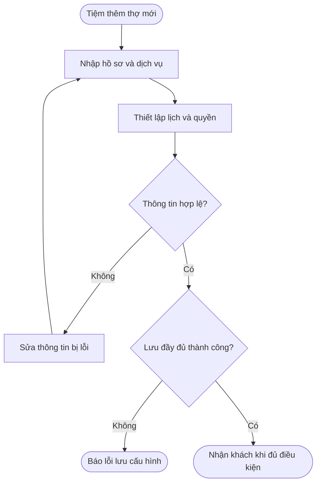
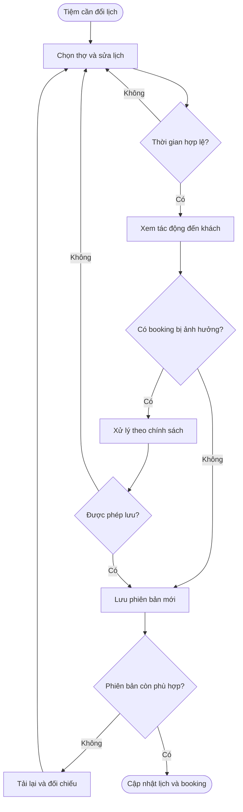
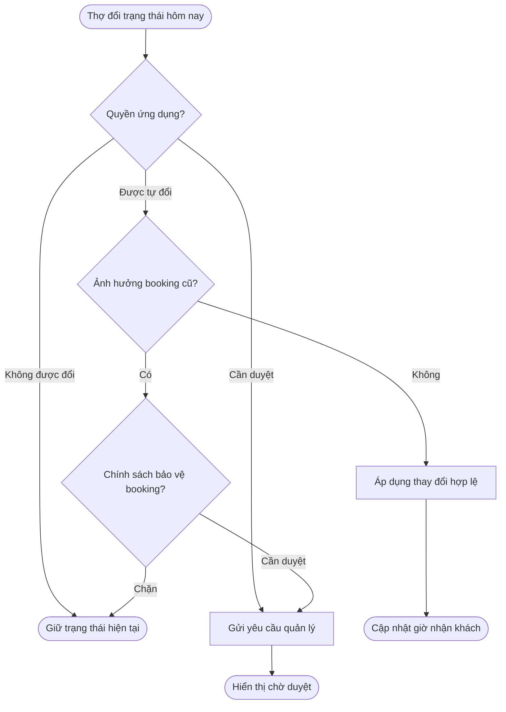
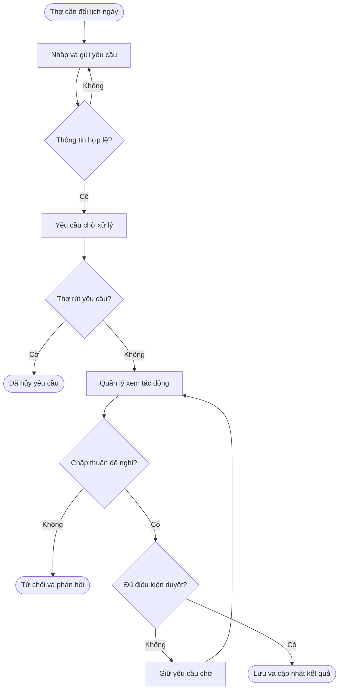
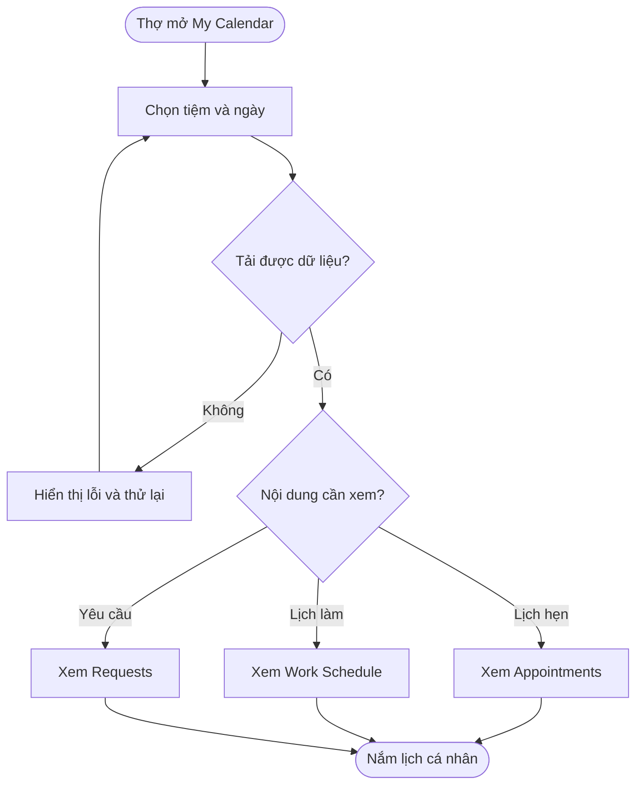
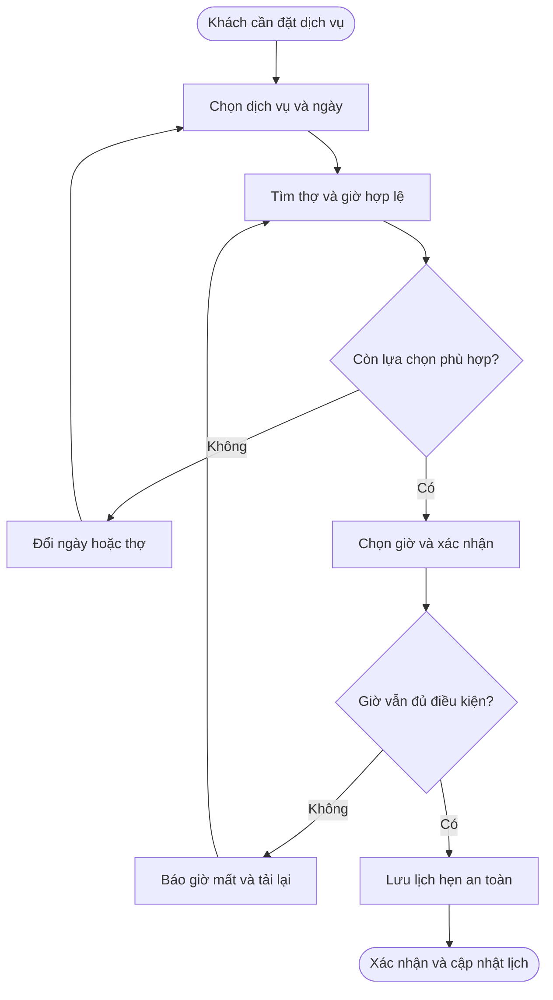
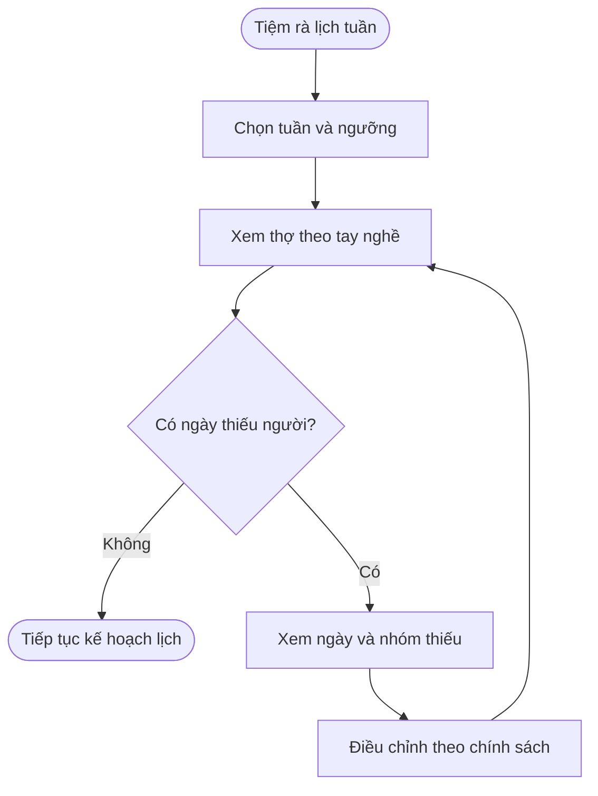
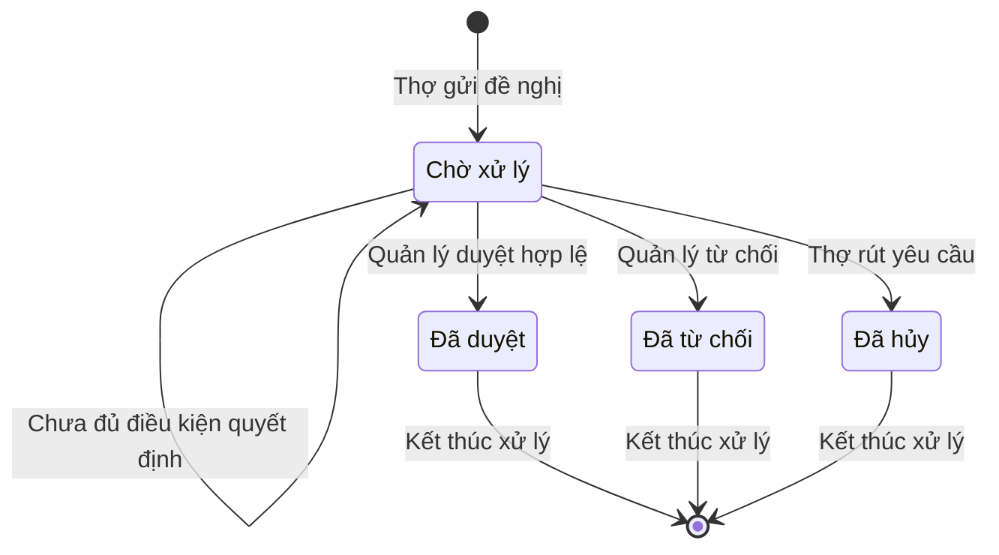
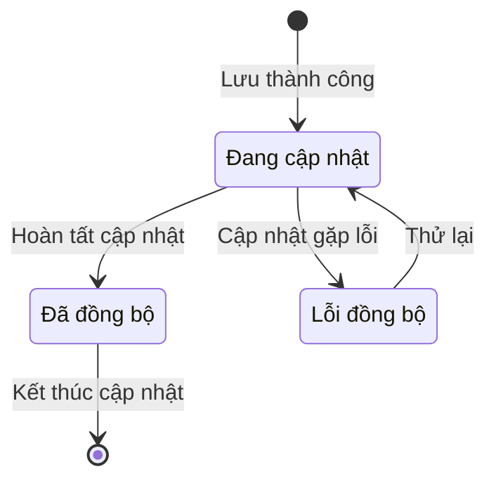
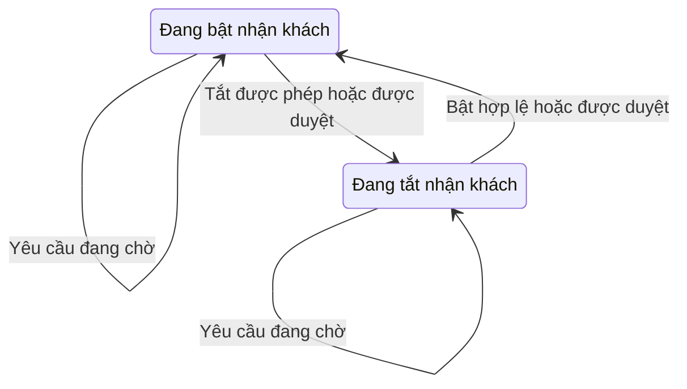

# POS — Quản lý lịch làm việc của thợ và thời gian có thể đặt lịch

**Cập nhật lần cuối:** 9 tháng 10 năm 2026  
**Đối tượng:** Product Owner, BA, chủ tiệm, quản lý, đội phát triển, QA và hỗ trợ khách hàng  
**Trạng thái:** Bản nháp — cần chốt các quyết định tại mục 6.4  
**Bản chia sẻ:** [Tài liệu trên GitHub](https://github.com/vlink-group/VlinkPay/blob/enhance/1817-staff-schedule-docs/nexora/docs/business/pos-staff-schedule-booking-frontend-upgrade.md)  
**Ticket:** [#1817](https://github.com/vlink-group/vlink-nexora/issues/1817)  
**Nguồn chính:** Bộ PO `tai-lieu-from-po/staff-schedule-dev-docs`, phiên bản 0.1 ngày 09-10-2026.

---

## 1. Tổng quan

Quản lý lịch làm việc của thợ và thời gian có thể đặt lịch giúp tiệm nhận khách đúng người, đúng dịch vụ và đúng thời gian có thể phục vụ. Tiệm thiết lập hồ sơ, dịch vụ thợ được phép làm, lịch tuần, ngoại lệ theo ngày và quyền ứng dụng. Chủ tiệm hoặc quản lý được phân quyền điều chỉnh lịch, xử lý yêu cầu và xem các lịch hẹn bị ảnh hưởng; thợ theo dõi lịch cá nhân, bật/tắt nhận khách hôm nay hoặc gửi đề nghị theo quyền được cấp; khách và lễ tân chọn những giờ đủ điều kiện đặt lịch.

### 1.1 Cách đọc và phạm vi

| Ký hiệu nguồn | Ý nghĩa |
|---|---|
| **[P] PO/prototype** | Ý định sản phẩm được mô tả trong bộ PO; không phải bằng chứng chức năng đã chạy trên production. |
| **[D] Đề xuất** | Cách xử lý nghiệp vụ/kỹ thuật được bộ PO đề nghị; cần thống nhất trước khi coi là yêu cầu cuối cùng. |
| **[Q] Cần chốt** | Chưa đủ căn cứ hoặc có khác biệt cần Product, Operations và đội phát triển quyết định. |

Các luồng dưới đây mô tả sản phẩm cần xây. Nhãn giao diện tiếng Anh được giữ theo nguồn để dễ đối chiếu. Chính sách còn là đề xuất hoặc chưa chốt được đánh dấu ngay tại nội dung liên quan.

| Giai đoạn | Phạm vi đề nghị | Ranh giới |
|---|---|---|
| **P0 — Cốt lõi** | Hồ sơ và quyền làm từng dịch vụ; lịch tuần; ngoại lệ ngày, giờ nghỉ; quyền ứng dụng; nhận khách hôm nay; yêu cầu/phê duyệt; `My Calendar`; tính giờ có thể đặt; bảo vệ booking; đồng bộ và lịch sử thay đổi. | Bao gồm dữ liệu và logic booking, không chỉ thay giao diện frontend. |
| **P1 — Tổng quan nhân sự** | `Team Overview` theo tuần/tay nghề; số thợ tối thiểu; cảnh báo thiếu người, nhiều người nghỉ; xem tác động khi duyệt nghỉ hoặc đổi ca. | Ngưỡng và quy tắc tính người cần chốt riêng. |
| **P2 — Gợi ý và Promotion Hub** | Gợi ý cải thiện nhân sự và tín hiệu khả năng nhận khách theo dịch vụ/ngày. | Chưa đủ yêu cầu để tự chỉnh ca hoặc chạy/dừng/giảm ngân sách quảng cáo. |

Ngoài phạm vi: chấm công, lương, tip, hoa hồng, tự động chuyển/hủy lịch hẹn và thuật toán AI tối ưu ca. Không dùng số người, ngày, tên thợ, số slot hoặc ngưỡng minh họa trong prototype làm chính sách của tiệm. [Nguồn: README, 01, 07]

### 1.2 Hiện trạng đã đối chiếu

Dùng `origin/staging` đang có tại máy, đọc trực tiếp commit và không đổi nhánh. Chưa fetch trong tác vụ này; không khẳng định đây là bản remote mới nhất.

| Khu vực | Hiện trạng có bằng chứng | Khác biệt cần lưu ý |
|---|---|---|
| Lịch tuần phía tiệm | Backend đọc/cập nhật ngày làm/nghỉ, một khoảng giờ mỗi ngày; kiểm tra giờ kết thúc sau bắt đầu, thợ liên kết hoạt động và ghi lịch sử cập nhật. Frontend có bộ chỉnh ngày/giờ. | Phần đã đọc chưa đủ để xác nhận ngoại lệ ngày, quyền hôm nay, hàng chờ duyệt hoặc toàn bộ điều kiện booking mới. |
| Khởi tạo lịch | Khi chưa có lịch, backend hiện tạo từ giờ tiệm; nếu thiếu giờ một ngày thì dùng giờ mặc định. | Khác đề xuất an toàn của PO: chưa cấu hình đầy đủ thì chưa mở booking. Cần chốt cách chuyển dữ liệu hiện hữu. |
| `My Calendar` | Frontend có lịch hẹn theo tiệm/ngày, dải chọn ngày, tổng thời lượng, khách, dịch vụ, mã Work Order, trạng thái và màn hình tải/lỗi/trống. | Ba tab `Appointments / Work Schedule / Requests` và quyền nhận khách hôm nay thuộc phạm vi nâng cấp. |

**Commit tham chiếu:** Backend `0f970e028770921f8cca967070fbf2719744b5c8`; frontend `551de70fd11fb8004d652f4bc1344f4c69aba407`. File cụ thể tại mục 11.

---

## 2. Khái niệm chính

| Khái niệm | Ý nghĩa |
|---|---|
| Dịch vụ được phép làm | Các dịch vụ của tiệm mà thợ được phép thực hiện; cấp độ tay nghề không thay danh sách này. |
| Cấp độ tay nghề — `Staff level` | Thông tin trình độ; cách kết hợp với điều kiện dịch vụ và quyền quản lý cho phép ngoại lệ còn cần chốt. |
| Lịch tuần — `Weekly Schedule` | Lịch thường lệ theo ngày trong tuần, gồm ngày làm/nghỉ và giờ làm. |
| Ngoại lệ theo ngày | Nghỉ hoặc đổi giờ riêng cho một ngày; khi được áp dụng, thay lịch nền ở ngày đó. |
| Giờ nghỉ — `Break` | Khoảng thợ không nhận khách trong ca; không phải booking. |
| Nhận khách hôm nay — `Available today` | Cho phép nhận booking mới trong phần thời gian hợp lệ còn lại của ngày theo múi giờ tiệm; không có nghĩa thợ trống cả ngày. |
| Giờ có thể đặt — `Slot` | Giờ bắt đầu mà toàn bộ dịch vụ và thời gian đệm đủ điều kiện phục vụ, không trùng khoảng bị chiếm. |
| Thời gian đệm — `Buffer` | Khoảng trước/sau dịch vụ theo chính sách booking, như chuẩn bị hoặc dọn dẹp; giá trị cụ thể chưa xác định. |
| Giữ chỗ tạm — `Hold` | Khoảng giữ trong luồng booking nếu hệ thống hỗ trợ; thời hạn và điều kiện cần chốt. |
| Yêu cầu thay đổi | Đề nghị cần quản lý quyết định: nghỉ ngày, đổi giờ, thêm giờ nghỉ hoặc đổi trạng thái hôm nay khi cần duyệt. |
| Xung đột lịch hẹn | Thay đổi khiến booking đã có không còn phù hợp với điều kiện phục vụ; booking vẫn được giữ để xử lý. |
| Mức đáp ứng nhân sự — `Coverage` | Số thợ đủ điều kiện theo tay nghề/ngày so với mức tối thiểu; không đồng nghĩa còn giờ trống cho dịch vụ. |

Đã tham chiếu `vlinkpay-docs/docs/glossary.md`; nguồn hiện không có mapping riêng cho lịch thợ. Tài liệu dùng tên nghiệp vụ và giải thích nhãn tiếng Anh khi cần.

---

## 3. Vai trò và trách nhiệm

Ma trận theo đề xuất của bộ PO **[D]**; quyền chi tiết giữa chủ tiệm, quản lý và lễ tân cần chốt.

| Vai trò | Trách nhiệm |
|---|---|
| Chủ tiệm — `Owner` | Cấu hình chính sách/quyền ứng dụng, lịch, dịch vụ/tay nghề; phê duyệt, xử lý xung đột và xem lịch sử trong tiệm. |
| Quản lý — `Manager` | Quản lý hồ sơ, dịch vụ và lịch; xử lý yêu cầu/xung đột trong quyền được cấp. Không mặc nhiên chỉnh quyền hoặc chính sách của chủ tiệm. |
| Thợ — `Technician` | Xem lịch và booking của mình; bật/tắt hôm nay theo quyền; gửi, theo dõi và hủy yêu cầu đang chờ. Không sửa lịch người khác. |
| Lễ tân — `Front desk` | Xem lịch/giờ hợp lệ; tạo hoặc chỉnh booking theo quyền hiện có. Không mặc nhiên sửa lịch hay chính sách. |
| Khách — `Customer` | Chọn dịch vụ, thợ và giờ hợp lệ; không xem lý do nghỉ hoặc dữ liệu riêng của thợ/khách khác. |

Mọi thao tác phải được kiểm tra đúng tiệm, đúng thợ và đúng quyền tại hệ thống; việc ẩn/khóa nút trên giao diện không thay kiểm tra quyền. [Nguồn: 01, 02]

---

## 4. Luồng sử dụng từ đầu đến cuối

### 4.1 Thêm thợ và thiết lập điều kiện nhận khách — P0

**Người thực hiện chính:** Chủ tiệm/quản lý được phân quyền.  
**Bắt đầu:** Tiệm cần thêm thợ.  
**Kết quả:** Hồ sơ, dịch vụ, lịch và quyền được lưu nhất quán; chỉ mở booking khi đủ điều kiện.

**User stories:**

- Là quản lý, tôi muốn thiết lập hồ sơ, dịch vụ được phép làm, lịch và quyền trong một luồng, để thợ có thông tin nhận khách đầy đủ.
- Là quản lý, tôi muốn thợ chưa có lịch/dịch vụ hợp lệ chưa xuất hiện trong booking, để tránh nhận khách sai điều kiện. [D]
- Là quản lý, tôi muốn biết phần cấu hình lưu thất bại, để không hiểu nhầm thợ đã sẵn sàng. [D]

| Bước | Ai | Thao tác | Phản hồi hệ thống | Lưu ý |
|---|---|---|---|---|
| 1 | Quản lý | Mở `Add Staff`; nhập tên, điện thoại, vai trò POS và cấp độ. | Hiển thị thông tin cần hoàn thiện. | Xác minh điện thoại/mời đăng nhập còn cần chốt. [Q] |
| 2 | Quản lý | Chọn từng dịch vụ thợ được phép làm. | Gắn thợ với đúng dịch vụ của tiệm. | Không suy từ tên hoặc chỉ từ cấp độ. |
| 3 | Quản lý | Chọn ngày làm/nghỉ, giờ từng ngày và quyền ứng dụng. | Hiển thị cấu hình để kiểm tra. | Chưa cấu hình thì nghỉ/chưa mở booking là đề xuất an toàn. [D] |
| 4 | Hệ thống | Kiểm tra khi chọn `Save`. | Báo lỗi tại thông tin thiếu/sai; kiểm tra giờ và dịch vụ. | Ca vượt giờ tiệm: đề nghị chặn, chưa chốt. [D/Q] |
| 5 | Hệ thống | Lưu các phần cấu hình cùng nhau. | Lưu đủ hoặc báo lỗi; không mở booking từ cấu hình lưu dở. | Cách lưu nhất quán là đề xuất. [D] |
| 6 | Hệ thống | Cập nhật lịch thợ và giờ đặt. | Thợ thấy lịch; khách chỉ thấy lựa chọn hợp lệ. | Không báo đã đồng bộ nếu còn đang xử lý. [D] |

### 4.2 Quản lý sửa lịch và xem tác động — P0

**Người thực hiện chính:** Chủ tiệm/quản lý được phân quyền.  
**Bắt đầu:** Tiệm cần đổi ca, ngày nghỉ hoặc giờ nghỉ.  
**Kết quả:** Thay đổi được lưu theo chính sách bảo vệ booking; lịch hẹn bị ảnh hưởng được nhận diện và giữ để xử lý.

**User stories:**

- Là quản lý, tôi muốn chỉnh từng ngày trong `Weekly Schedule`, để sắp lịch thường lệ của thợ.
- Là quản lý, tôi muốn đổi giờ/nghỉ riêng một ngày, để không sửa các tuần khác.
- Là quản lý, tôi muốn xem giờ đặt tăng/giảm và booking bị ảnh hưởng trước khi lưu, để xử lý việc phục vụ khách. [D]
- Là quản lý, tôi muốn được báo khi người khác vừa sửa lịch, để không ghi đè thay đổi của họ. [D]

| Bước | Ai | Thao tác | Phản hồi hệ thống | Lưu ý |
|---|---|---|---|---|
| 1 | Quản lý | Chọn thợ, mở lịch tuần/ngày. | Hiển thị lịch và ngoại lệ đang áp dụng. | Xem đủ ngày trong tuần. |
| 2 | Quản lý | Sửa ngày làm/nghỉ, giờ hoặc ngoại lệ ngày/giờ nghỉ. | Kiểm tra khoảng thời gian. | Nhiều đoạn ca và ca qua đêm cần chốt. [Q] |
| 3 | Hệ thống | Xem trước tác động. | Hiển thị thay đổi giờ đặt, booking bị ảnh hưởng; P1 thêm cảnh báo nhân sự. | Xem trước không ghi thay đổi. [D] |
| 4 | Quản lý | Xem tác động, chọn lưu. | Chặn hoặc cho xử lý kèm xung đột theo chính sách đã chốt. | Thời điểm áp dụng lịch trước/sau xử lý conflict còn chưa chốt. [Q] |
| 5 | Hệ thống | Lưu phiên bản và lịch sử. | Báo nếu dữ liệu đã bị sửa; không ghi đè âm thầm. | Không tự hủy/chuyển booking cũ. [D] |
| 6 | Hệ thống | Đồng bộ giờ đặt và lịch thợ. | Phân biệt đang xử lý, hoàn tất và lỗi. | Lưu thành công khác đồng bộ hoàn tất. [D] |

Sơ đồ không quyết định thay Product cách xử lý xung đột. Bộ PO mới chưa xác nhận luồng **Lưu nháp / Bỏ nháp / Công bố lịch** trong bản cũ; nếu giữ, cần bổ sung yêu cầu tại mục 6.

### 4.3 Thợ bật/tắt nhận khách hôm nay — P0

**Người thực hiện chính:** Thợ.  
**Bắt đầu:** Thợ cần đổi việc nhận booking mới trong ngày.  
**Kết quả:** Áp dụng hoặc chuyển thành yêu cầu theo quyền ứng dụng và chính sách bảo vệ booking.

**User stories:**

- Là thợ, tôi muốn thấy quyền của `Available today`, để biết có thể tự đổi hay cần xin duyệt.
- Là thợ, tôi muốn tắt nhận booking mới khi được phép, để tiệm không nhận thêm khách vào thời gian tôi không thể phục vụ.
- Là quản lý, tôi muốn kiểm soát việc tắt khi đã có khách đặt, để bảo vệ lịch hẹn.
- Là thợ, tôi muốn bật lại trong giới hạn ca và giờ nghỉ, để trạng thái nhận khách đúng thực tế. [D]

| Quyền | Không có booking bị ảnh hưởng | Có booking bị ảnh hưởng |
|---|---|---|
| **Allowed — Được tự đổi** | Áp dụng khi lưu hợp lệ. | Chặn hoặc gửi duyệt theo chính sách bảo vệ booking. [D/Q] |
| **Request approval — Cần duyệt** | Tạo yêu cầu; chưa đổi giờ đặt. | Tạo yêu cầu kèm tác động đến booking. [D] |
| **Not allowed — Không được đổi** | Ẩn/khóa thao tác; giữ trạng thái đang có. | Giữ trạng thái đang có. |

| Bước | Ai | Thao tác | Phản hồi hệ thống | Lưu ý |
|---|---|---|---|---|
| 1 | Thợ | Xem `Available today`. | Hiển thị trạng thái và quyền. | “Hôm nay” theo múi giờ tiệm. [D] |
| 2 | Thợ | Bật/tắt khi được phép. | Kiểm tra quyền, lịch và booking mới nhất. | Toggle không tạo ca cho ngày nghỉ. [D] |
| 3 | Hệ thống | Phân luồng theo quyền/tác động. | Áp dụng, tạo yêu cầu chờ hoặc báo bị chặn. | Chính sách booking có thể yêu cầu duyệt dù thợ có quyền tự đổi. |
| 4 | Hệ thống | Tính lại giờ đặt khi thay đổi đã áp dụng. | Tắt thì chặn booking mới ở phần ngày còn lại; bật chỉ khôi phục giờ hợp lệ. | Không bỏ qua nghỉ, đóng cửa, tay nghề hoặc booking cũ. [D] |
| 5 | Thợ | Xem kết quả. | Phân biệt đã áp dụng, chờ duyệt và thất bại. | Gửi yêu cầu chưa phải áp dụng. |

### 4.4 Thợ gửi yêu cầu và quản lý xử lý — P0

**Người thực hiện chính:** Thợ; chủ tiệm/quản lý quyết định.  
**Bắt đầu:** Thợ cần nghỉ ngày, đổi giờ, thêm giờ nghỉ hoặc xin đổi trạng thái hôm nay.  
**Kết quả:** Thợ nhận quyết định; yêu cầu duyệt tạo thay đổi hiệu lực, còn từ chối/hủy giữ lịch đang có.

**User stories:**

- Là thợ, tôi muốn chọn ngày và nhập lý do xin nghỉ, để quản lý hiểu đề nghị.
- Là thợ, tôi muốn xin đổi giờ/thêm giờ nghỉ cho ngày cụ thể, để không tự sửa lịch thường lệ.
- Là thợ, tôi muốn hủy yêu cầu còn chờ, để rút đề nghị khi kế hoạch thay đổi. [D]
- Là quản lý, tôi muốn xem booking bị ảnh hưởng và cảnh báo nhân sự ở P1, để cân nhắc trước khi quyết định.
- Là thợ, tôi muốn xem kết quả và phản hồi, để sắp xếp công việc.

| Bước | Ai | Thao tác | Phản hồi hệ thống | Lưu ý |
|---|---|---|---|---|
| 1 | Thợ | Chọn loại, ngày, lý do/nội dung và giờ nếu cần. | Kiểm tra dữ liệu và yêu cầu trùng/chéo. | Lý do tự do hay danh mục cần chốt. [Q] |
| 2 | Thợ | Gửi yêu cầu. | Hiển thị **Chờ xử lý** trong `Requests`. | Chưa thay lịch/giờ đặt. [D] |
| 3 | Thợ | Hủy nếu còn chờ và không còn cần. | Chuyển **Đã hủy**; không áp dụng. | Không hủy yêu cầu đã xử lý. [D] |
| 4 | Quản lý | Mở yêu cầu, xem tác động. | Hiển thị nội dung và booking xung đột; P1 thêm coverage. | Chỉ xử lý trong tiệm được cấp quyền. |
| 5 | Quản lý | Duyệt/từ chối; ghi phản hồi khi cần. | Từ chối thì giữ lịch; duyệt thì kiểm tra lại và áp dụng chính sách xung đột. | Không xử lý lần hai; thời điểm áp dụng khi có conflict cần chốt. [D/Q] |
| 6 | Hệ thống | Lưu quyết định, thay đổi và lịch sử. | Cập nhật lịch/giờ đặt, trạng thái cho thợ. | Kênh thông báo chưa xác định. [Q] |

Điều kiện duyệt gồm dữ liệu còn hợp lệ, quyền xử lý và cách giải quyết xung đột đã thống nhất. Không mặc định mọi xung đột đều cho phép hoặc đều cấm áp dụng.

### 4.5 Thợ theo dõi My Calendar — P0

**Người thực hiện chính:** Thợ.  
**Bắt đầu:** Cần xem công việc, lịch làm hoặc kết quả yêu cầu.  
**Kết quả:** Thợ thấy đúng lịch cá nhân theo tiệm/ngày, có trạng thái dữ liệu rõ ràng.

**User stories:**

- Là thợ, tôi muốn xem lịch hẹn, ca và giờ nghỉ cùng ngày, để biết công việc và khoảng còn nhận khách.
- Là thợ, tôi muốn xem lịch tuần do quản lý thiết lập, để chuẩn bị các ngày sắp tới.
- Là thợ, tôi muốn theo dõi đề nghị trong `Requests`, để biết thay đổi nào chưa áp dụng.
- Là thợ, tôi muốn biết dữ liệu chưa tải/chưa đồng bộ, để không nhầm lịch cũ thành lịch mới. [D]

| Bước | Ai | Thao tác | Phản hồi hệ thống | Lưu ý |
|---|---|---|---|---|
| 1 | Thợ | Mở `My Calendar`, chọn tiệm/ngày. | Tải lịch của chính thợ theo múi giờ tiệm. | Không xem lịch người khác nếu không có quyền. |
| 2 | Thợ | Chọn `Appointments`. | Hiển thị booking, thời gian và trạng thái; day view có ca, nghỉ và khoảng trống. | Dữ liệu theo quyền hiển thị. |
| 3 | Thợ | Chọn `Work Schedule`. | Hiển thị lịch tuần kết hợp ngoại lệ đã áp dụng. | **Chỉ đọc đối với thợ** theo nguồn mới. |
| 4 | Thợ | Chọn `Requests` hoặc thao tác nhanh. | Xem yêu cầu/kết quả; mở luồng gửi đề nghị. | `Message manager` chưa xác định kênh/đối tượng. [Q] |
| 5 | Hệ thống | Phản ánh thay đổi từ tiệm. | Khoảng trống dùng cùng quy tắc booking; khi chậm/lỗi, báo tình trạng và lần cập nhật cuối. | Cách đồng bộ là đề xuất. [D] |

### 4.6 Khách hoặc lễ tân đặt lịch hợp lệ — P0

**Người thực hiện chính:** Khách trên trang booking; lễ tân dùng cùng điều kiện trong luồng được cấp quyền.  
**Bắt đầu:** Khách cần đặt dịch vụ.  
**Kết quả:** Xác nhận booking khi thợ đủ điều kiện và còn đủ thời gian; không tạo đặt trùng.

**User stories:**

- Là khách, tôi muốn chỉ chọn được thợ được phép làm dịch vụ, để lịch đặt phù hợp nhu cầu.
- Là khách, tôi muốn giờ chọn đủ cho toàn bộ dịch vụ và đệm, để không đặt vào nghỉ hoặc ngoài giờ.
- Là lễ tân, tôi muốn dùng cùng giờ hợp lệ với trang booking, để hai nơi nhận khách thống nhất.
- Là khách, tôi muốn được báo khi giờ vừa bị chiếm và chọn lại, để biết booking chưa xác nhận. [D]

| Bước | Ai | Thao tác | Phản hồi hệ thống | Lưu ý |
|---|---|---|---|---|
| 1 | Khách/lễ tân | Chọn tiệm, dịch vụ, ngày và thợ nếu muốn. | Tìm thợ đang hoạt động, được phép làm dịch vụ và có giờ phù hợp. | Ngày nghỉ/đóng cửa không tạo slot. |
| 2 | Hệ thống | Tính giờ bắt đầu hợp lệ. | Kiểm tra giờ tiệm, ca, ngoại lệ, nghỉ, toggle, booking/hold và đệm. | Khoảng cách giờ chọn theo chính sách, không cố định 30 phút theo mock. |
| 3 | Khách/lễ tân | Chọn giờ; nếu hết giờ thì đổi ngày/thợ hoặc `Any staff` nếu có hỗ trợ. | Hiển thị lựa chọn mới. | Cách hiển thị thợ không có slot cần chốt. [Q] |
| 4 | Khách/lễ tân | Xác nhận. | Kiểm tra lại dữ liệu mới nhất và lưu đặt chỗ an toàn. | Hold chỉ dùng nếu booking hỗ trợ. [D/Q] |
| 5 | Hệ thống | Lưu thành công hoặc báo giờ mất. | Chỉ xác nhận sau lưu; giờ mất thì tải giờ mới và cho chọn lại. | Gửi lại cùng lần đặt không tạo hai booking. [D] |
| 6 | Hệ thống | Cập nhật booking và lịch thợ. | Khoảng đã đặt không còn được đặt trùng. | Trạng thái nào chiếm chỗ cần chốt. [Q] |

**Ví dụ minh họa [D]:** Tiệm mở 09:00–20:00; thợ làm 10:00–19:00, được phép làm dịch vụ 60 phút, đệm sau 10 phút và nghỉ 12:30–13:00. Giờ 12:00 không hợp lệ vì giao nghỉ; 18:00 không hợp lệ vì kết thúc cả đệm lúc 19:10, vượt ca. Nếu chính sách chọn giờ cách nhau 30 phút và không có giới hạn khác, 17:30 có thể hợp lệ vì kết thúc 18:40. Đây không phải mặc định của Nexora.

Đổi booking phải dùng điều kiện của luồng booking tương ứng; bộ PO chưa mô tả đầy đủ đổi dịch vụ, nhiều thợ hoặc chuyển booking, nên tài liệu không xác lập thêm quy trình riêng.

### 4.7 Quản lý xem mức đáp ứng nhân sự — P1

**Người thực hiện chính:** Chủ tiệm/quản lý được phân quyền.  
**Bắt đầu:** Chuẩn bị lịch tuần hoặc xem tác động nghỉ/đổi ca.  
**Kết quả:** Biết nhóm tay nghề/ngày thiếu người, quyết định theo chính sách đã chốt.

**User stories:**

- Là quản lý, tôi muốn xem `Team Overview` theo tuần/tay nghề, để biết nhóm dịch vụ thiếu người.
- Là quản lý, tôi muốn đặt mức tối thiểu và xem tác động trước khi duyệt nghỉ, để duy trì khả năng phục vụ. [D/Q]
- Là quản lý, tôi muốn phân biệt đủ người với còn giờ đặt, để không nhận khách chỉ dựa vào tổng số thợ. [D]

| Bước | Ai | Thao tác | Phản hồi hệ thống | Lưu ý |
|---|---|---|---|---|
| 1 | Chủ tiệm/quản lý | Thiết lập mức tối thiểu. | Lưu ngưỡng đối chiếu. | Theo ngày/tuần và số phút được tính cần chốt. [Q] |
| 2 | Quản lý | Chọn tuần trong `Team Overview`. | Hiển thị người làm/nghỉ, nhóm/ngày thiếu và số thiếu. | Dùng dữ liệu thực. |
| 3 | Quản lý | Xem trước nghỉ/đổi ca. | Tính lại coverage. | Thợ nhiều tay nghề chỉ tính ở nhóm đủ điều kiện. [D] |
| 4 | Quản lý | Điều chỉnh hoặc quyết định. | Cảnh báo/chặn theo chính sách đã chốt. | Không mặc định tự chặn mọi yêu cầu thiếu người. [Q] |

---

## 5. Thiết lập hệ thống và quản trị

**User stories cho thiết lập chung:**

- Là chủ tiệm, tôi muốn phân quyền quản lý lịch/chính sách, để đúng người thực hiện đúng trách nhiệm. [D]
- Là chủ tiệm, tôi muốn thiết lập quyền hôm nay và thay đổi tương lai, để mức chủ động của thợ phù hợp cách vận hành.
- Là quản lý, tôi muốn tra ai sửa gì, nội dung trước/sau và thời điểm, để đối chiếu vấn đề lịch/booking.
- Là người hỗ trợ, tôi muốn biết lịch còn đang cập nhật hay bị lỗi, để hướng dẫn tiệm đúng tình trạng. [D]

| Thiết lập | Nội dung |
|---|---|
| Giờ tiệm và ngày đóng cửa | Nguồn chuẩn cho giới hạn nhận khách của toàn tiệm. |
| Dịch vụ và tay nghề | Thời lượng, đệm, cấp độ yêu cầu và quyền làm từng dịch vụ. |
| Lịch | Lịch tuần, thời điểm hiệu lực, ngoại lệ ngày và giờ nghỉ; nhiều ca cần chốt. |
| Quyền hôm nay | Được tự đổi / cần duyệt / không được đổi; không phải quyền tự sửa toàn bộ lịch tuần. |
| Thay đổi tương lai | Đi qua đề nghị theo nguồn mới; các mức quyền cụ thể cần chốt. |
| Bảo vệ booking | Chặn hoặc quản lý xem xét; tự chuyển booking cần luồng riêng, chưa đưa vào P0 đề nghị. |
| Chính sách đặt lịch | Mốc chọn giờ, thời gian đặt trước, giới hạn ngày, hold, trạng thái chiếm chỗ và tài nguyên dùng chung. |
| Múi giờ tiệm | Thống nhất ngày/giờ lịch, “hôm nay” và giờ đặt giữa các màn hình. |
| Lịch sử và đồng bộ | Lưu người/nội dung/thời điểm thay đổi; phân biệt đã lưu với đã cập nhật hiển thị. |
| Coverage — P1 | Mức tối thiểu, thời lượng để được tính và chính sách cảnh báo/chặn. |

**P2 — Promotion Hub:** Nguồn nêu tín hiệu sẵn sàng, ít khả năng phục vụ hoặc không nhận được khách theo dịch vụ/ngày. Ngưỡng, cách tích hợp và quyền tác động quảng cáo chưa chốt; chưa có luồng tự chạy/dừng quảng cáo hoặc tự áp dụng gợi ý ca. [P/Q]

---

## 6. Vòng đời trạng thái và quyết định cần chốt

### 6.1 Yêu cầu thay đổi — đề xuất [D]

| Hiện tại | Thao tác | Trạng thái mới | Ý nghĩa |
|---|---|---|---|
| Chưa gửi | Gửi hợp lệ | Chờ xử lý | Chưa đổi lịch/slot. |
| Chờ xử lý | Quản lý duyệt hợp lệ | Đã duyệt | Lưu quyết định và thay đổi; đồng bộ có trạng thái riêng. |
| Chờ xử lý | Quản lý từ chối | Đã từ chối | Giữ lịch, xem phản hồi. |
| Chờ xử lý | Thợ rút | Đã hủy | Không áp dụng. |
| Chờ xử lý | Chưa đủ điều kiện | Chờ xử lý | Giải quyết dữ liệu/conflict theo chính sách. |
| Đã duyệt/từ chối/hủy | Cần thay đổi tiếp | Tạo yêu cầu mới | Không sửa quyết định cũ hoặc xử lý lặp. |

### 6.2 Đồng bộ sau khi lưu — đề xuất [D]

| Hiện tại | Sự kiện | Trạng thái mới | Ý nghĩa |
|---|---|---|---|
| Chưa lưu | Lưu thành công | Đang cập nhật | Dữ liệu chuẩn đã lưu; các màn hình đang nhận thay đổi. |
| Đang cập nhật | Hoàn tất | Đã đồng bộ | Lịch/giờ đặt phản ánh phiên bản mới. |
| Đang cập nhật | Gặp lỗi | Lỗi đồng bộ | Báo lỗi, chưa báo hoàn tất. |
| Lỗi đồng bộ | Thử lại | Đang cập nhật | Không tạo thêm thay đổi hoặc booking trùng. |

Đây là cách thể hiện được PO đề xuất, không xác nhận hệ thống hiện có các trạng thái/kênh đồng bộ này.

### 6.3 Trạng thái nhận khách hôm nay — đề xuất [D]

| Hiện tại | Thao tác | Kết quả |
|---|---|---|
| Đang bật | Tắt được phép hoặc được duyệt | Đang tắt: không nhận booking mới ở phần ngày còn lại. |
| Đang tắt | Bật hợp lệ | Đang bật: chỉ khôi phục giờ còn đủ điều kiện. |
| Bật hoặc tắt | Gửi đề nghị cần duyệt | Giữ trạng thái hiện tại đến khi quyết định. |

Sơ đồ chỉ mô tả trong một ngày. Khởi tạo/đặt lại khi sang ngày mới cần chốt; không tự mặc định giữ trạng thái tắt qua nhiều ngày.

### 6.4 Quyết định cần chốt

| Nội dung | Điểm chưa rõ và đề nghị trong nguồn | Người thống nhất |
|---|---|---|
| Nguồn dữ liệu/chuyển đổi | Dùng nguồn giờ tiệm, dịch vụ, booking, danh tính hiện hữu; xử lý lịch đang được tạo mặc định trước khi áp dụng “chưa cấu hình thì chưa mở booking”. [Q-01; staging] | Tech lead, Product |
| Booking/hold | Trạng thái chờ/xác nhận/no-show/hủy nào chiếm chỗ; có hold hay không và thời hạn. [Q-02] | Người phụ trách booking |
| Quy tắc thời gian | Mốc giờ, đặt trước, giới hạn ngày, đệm, nhiều dịch vụ và ghế/phòng; đề nghị kế thừa booking policy phù hợp. [Q-03] | Product, booking |
| Cấu trúc ca | Nhiều đoạn ca là đề xuất; ca qua đêm, ngày đầu tuần cần xác nhận. [Q-04; 05] | Operations, Product |
| Tắt khi có booking | Chặn hay gửi duyệt; nguồn đề nghị gửi duyệt nếu thợ được tự toggle nhưng ảnh hưởng booking. [Q-05] | Product, Operations |
| Lưu khi có conflict | Áp dụng lịch trước/sau xử lý? Nguồn đề nghị chỉ cho lưu kèm hàng chờ conflict khi quản lý xác nhận tác động; chưa phải quyết định cuối. [Q-06] | Product |
| Tự chuyển booking | `Allow and reassign` thiếu quy trình; đề nghị chưa làm P0. [Q-07] | Product |
| Cấp độ/dịch vụ | Điều kiện cấp độ, manager override và bằng chứng duyệt; không coi ví dụ “Level 2 or manager approval” là chính sách chắc chắn. [Q-08] | Product, Operations |
| Phân quyền | Owner/Manager/Front desk và quyền chỉnh policy; kiểm tra theo tiệm. [Q-09] | Product, người phụ trách phân quyền |
| Hiệu năng/lịch sử | ≤ 5 giây cập nhật và p95 đọc availability ≤ 500 ms là mục tiêu đề xuất cần đo; chốt thời hạn lưu lịch sử/yêu cầu. [Q-10] | Engineering, Product |
| Thông báo/lý do | Kênh thông báo, `Message manager`, lý do tự do hay danh mục; chưa mặc định xây chat mới. [Q-11; 02, 03] | Product |
| Coverage/Promotion | Ngưỡng người/phút, cảnh báo/chặn, tín hiệu và quyền tích hợp; không lấy giá trị demo làm mặc định. [Q-12; 02, 04] | Product, Operations, Marketing |
| Bản mô tả cũ | Có lưu nháp/công bố và thợ tự sửa cả tuần theo ba mức quyền. Nguồn mới mô tả `Work Schedule` chỉ đọc và ba quyền cho hôm nay. Nếu giữ yêu cầu cũ, cần xác nhận/bổ sung; chưa coi chúng đã bị quyết định loại bỏ. | Product |

---

## 7. Quy tắc nghiệp vụ

1. **Dịch vụ [P/D]:** Thợ và dịch vụ hoạt động, đúng tiệm, có quyền làm dịch vụ mới tạo lựa chọn đặt được; cấp độ không thay danh sách dịch vụ được phép làm.
2. **Thời gian [P/D]:** Toàn bộ dịch vụ + đệm phải nằm trong phần giao giờ tiệm/ca hiệu lực; không giao đóng cửa, nghỉ, booking/hold đang chiếm chỗ.
3. **Thứ tự lịch [D]:** Giờ tiệm/đóng cửa → lịch tuần hiệu lực → ngoại lệ ngày đã áp dụng → trừ nghỉ → toggle hôm nay → trừ booking/hold. Toggle bật không mở rộng ca.
4. **Múi giờ [D]:** Ngày, giờ và “hôm nay” theo tiệm, kể cả thiết bị ở nơi khác; đổi giờ mùa hè phải tránh giờ không tồn tại/nhầm giờ lặp.
5. **Chờ duyệt [D]:** Yêu cầu cần duyệt chưa tác động lịch/slot khi còn chờ; lưu trực tiếp được phép phải phân biệt với gửi yêu cầu.
6. **Booking cũ [P/D/Q]:** Không tự hủy/chuyển. Chặn hay lưu kèm conflict và thời điểm áp dụng theo quyết định tại mục 6.4.
7. **Xác nhận booking [D]:** Kiểm tra lại lúc lưu; hai khách không được cùng đặt trùng tài nguyên. Retry cùng lần đặt/quyết định không tạo kết quả lần hai.
8. **Sửa đồng thời [D]:** Dữ liệu đã thay đổi thì báo và cho đối chiếu; không âm thầm ghi đè.
9. **Dữ liệu riêng [D]:** Khách chỉ thấy thông tin công khai và lựa chọn đặt được; không thấy lý do nghỉ, điện thoại riêng, yêu cầu chờ hoặc booking người khác.
10. **Số liệu [P/D]:** Tổng thợ, slot, số thiếu và cảnh báo lấy từ dữ liệu thực; không hardcode mẫu prototype.

> **Điều kiện nhận khách:** `Available today` không thay kiểm tra dịch vụ, giờ tiệm, ca và khoảng đủ dài. Thợ đang bật vẫn có thể không còn giờ đặt phù hợp.

---

## 8. Ngoại lệ và cách xử lý

Hành vi dưới đây là đề xuất **[D]**, trừ chính sách đang cần chốt.

| Tình huống | Hành vi | Người xử lý |
|---|---|---|
| Cấu hình thợ lưu dở/chưa đủ | Không mở booking từ cấu hình dở; báo phần cần hoàn thiện; chuyển dữ liệu cũ cần chốt. | Quản lý, đội phát triển |
| Giờ sai/dịch vụ khác tiệm | Báo tại trường; không lưu một phần. | Người nhập |
| Ca vượt giờ tiệm | Booking luôn giới hạn trong giờ tiệm; form chặn hay cho lưu còn cần chốt. | Product, quản lý |
| Nghỉ/đóng cửa/break | Loại slot trong khoảng không phục vụ; giữ booking cũ. | Hệ thống, quản lý |
| Không đủ quyền dịch vụ | Không cho đặt thợ đó dù lịch bật. | Quản lý |
| Không có quyền toggle | Khóa/ẩn thao tác; hệ thống từ chối thay đổi trái quyền. | Chủ tiệm, thợ |
| Đổi lịch ảnh hưởng booking | Hiển thị tác động, chặn/chuyển xử lý theo policy; giữ booking. | Quản lý |
| Request trùng/chéo/đã xử lý | Không áp dụng kết quả mâu thuẫn/lặp; hiện trạng thái mới nhất. | Thợ, quản lý |
| Hai người cùng sửa/duyệt | Báo dữ liệu thay đổi, tải lại và đối chiếu. | Người thao tác |
| Slot mất lúc xác nhận | Chưa xác nhận; báo giờ mất, tải giờ mới và cho chọn lại. | Khách/lễ tân |
| Không có slot | Nêu ngày/dịch vụ hết giờ; cho đổi ngày/thợ. | Khách/lễ tân |
| Offline/sync chậm/lỗi | Phân biệt chưa lưu với đã lưu/chưa đồng bộ; nêu lần cập nhật cuối khi dùng dữ liệu cũ và cho thử lại. | Người dùng, vận hành |
| Thiếu nhân sự — P1 | Cảnh báo đúng nhóm/ngày và số thiếu; chặn theo chính sách đã chốt. | Quản lý |

---

## 9. Câu hỏi thường gặp

**Thợ tự sửa lịch tuần được không?**  
Nguồn mới mô tả `Work Schedule` chỉ đọc; thợ đổi trạng thái hôm nay theo quyền và gửi đề nghị theo ngày. Yêu cầu tự sửa cả tuần trong bản cũ cần Product xác nhận nếu tiếp tục giữ.

**Ba mức quyền áp dụng cho gì?**  
Cho bật/tắt nhận khách hôm nay: tự đổi, cần duyệt hoặc không được đổi; không diễn giải thành quyền sửa lịch tuần.

**Tắt hôm nay có hủy booking cũ không?**  
Không. Booking được giữ; policy quyết định chặn thao tác hay chuyển quản lý xem xét.

**Bật lại có mở ngoài ca hoặc ngày nghỉ không?**  
Không theo đề xuất PO; chỉ khôi phục giờ còn hợp lệ, không trùng nghỉ/đóng cửa/booking.

**Thấy giờ trống là đã giữ được giờ chưa?**  
Chưa. Phải kiểm tra lại khi xác nhận; hold chỉ dùng nếu booking hỗ trợ và đã chốt policy.

**Đủ người tối thiểu là còn đặt được dịch vụ không?**  
Không. Vẫn phải có thợ đủ điều kiện và khoảng trống đủ dài.

**Prototype có xác nhận chức năng đã chạy không?**  
Không. Audit nguồn PO ghi nhận chủ yếu đổi giao diện/hiện toast, chưa có API, đăng nhập hoặc dữ liệu thật. Số liệu và ngày mẫu không phải chính sách.

---

## 10. Tính năng liên quan

- **Booking & Appointment:** Cung cấp luồng đặt, trạng thái chiếm chỗ, hold và xử lý booking cũ; dùng cùng điều kiện lịch thợ. Chưa xác minh tài liệu độc lập bao phủ hợp đồng booking này.
- **Staff Profile & Service Eligibility:** Cung cấp danh tính, liên kết hoạt động, vai trò và dịch vụ được phép làm; là điều kiện trước khi nhận khách. Chưa xác minh tài liệu độc lập cho phạm vi này.
- **Business Hours & Holidays:** Cung cấp giờ mở cửa/ngày đóng cửa, giới hạn slot của toàn tiệm. Chưa xác minh tài liệu độc lập cho hợp đồng dữ liệu này.
- **Promotion Hub — P2:** Có thể dùng tín hiệu khả năng phục vụ; ngưỡng và quyền tác động quảng cáo chưa xác định, chưa có tài liệu tích hợp kèm theo.

---

## 11. Nguồn tham chiếu

### 11.1 Bộ PO

Các file là nguồn viết lại, không phải tài liệu tính năng liên quan hoặc xác nhận API production.

| File | Nội dung dùng |
|---|---|
| [README](https://github.com/user-attachments/files/33241186/README.md) | Phiên bản, ký hiệu và P0/P1/P2. |
| [01 — Product scope](https://github.com/user-attachments/files/33241184/01-product-scope.md) | Mục tiêu, vai trò, phạm vi, phụ thuộc. |
| [02 — Functional spec](https://github.com/user-attachments/files/33241181/02-functional-spec.md) | Luồng, quyền hôm nay, calendar, request và ngoại lệ. |
| [03 — Data and API](https://github.com/user-attachments/files/33241183/03-data-and-api.md) | Dịch vụ được phép làm, phiên bản, audit, sync, quyền dữ liệu; API là đề xuất. |
| [04 — Availability engine](https://github.com/user-attachments/files/33241180/04-availability-engine.md) | Điều kiện slot, thứ tự lịch, buffer, hold, bảo vệ booking. |
| [05 — QA acceptance](https://github.com/user-attachments/files/33241185/05-qa-acceptance.md) | Các tình huống dịch vụ, giờ, nghỉ, concurrency, quyền, sync, timezone. |
| [06 — Delivery and decisions](https://github.com/user-attachments/files/33241182/06-delivery-and-decisions.md) | Quyết định chưa chốt và ranh giới triển khai. |
| [07 — Prototype audit](https://github.com/user-attachments/files/33241187/07-prototype-audit.md) | Giới hạn prototype, dữ liệu mẫu và mâu thuẫn. |

### 11.2 File staging đã đọc

| Repository / commit | File | Nội dung đối chiếu |
|---|---|---|
| `vlink-nexora` / `0f970e028770921f8cca967070fbf2719744b5c8` | `backend/src/Application/Features/Pos/StaffProfiles/Queries/GetStaffWeeklySchedule/GetStaffWeeklyScheduleQuery.cs` | Đọc/khởi tạo lịch từ giờ tiệm hoặc mặc định. |
| Cùng commit backend | `backend/src/Application/Features/Pos/StaffProfiles/Commands/UpdateStaffWeeklySchedule/UpdateStaffWeeklyScheduleCommand.cs` | Quyền, liên kết hoạt động, sửa ngày/giờ và audit. |
| `vlink-nexora-fe` / `551de70fd11fb8004d652f4bc1344f4c69aba407` | `src/components/dashboard/views/pos/WeeklyScheduleEditor.tsx` | Chỉnh ngày và một khoảng giờ/ngày. |
| Cùng commit frontend | `src/components/dashboard/views/pos/PosStaffProfileView.tsx` | Danh sách/thêm/xem hồ sơ thợ. |
| Cùng commit frontend | `src/components/staff-dashboard/calendar/StaffMyCalendar.tsx` | Calendar lịch hẹn theo tiệm/ngày. |

Đối chiếu tài liệu và phần code đã đọc không thay kiểm thử trên môi trường chạy. Không coi endpoint, schema hoặc chỉ số hiệu năng đề xuất của bộ PO là chức năng đã triển khai.
