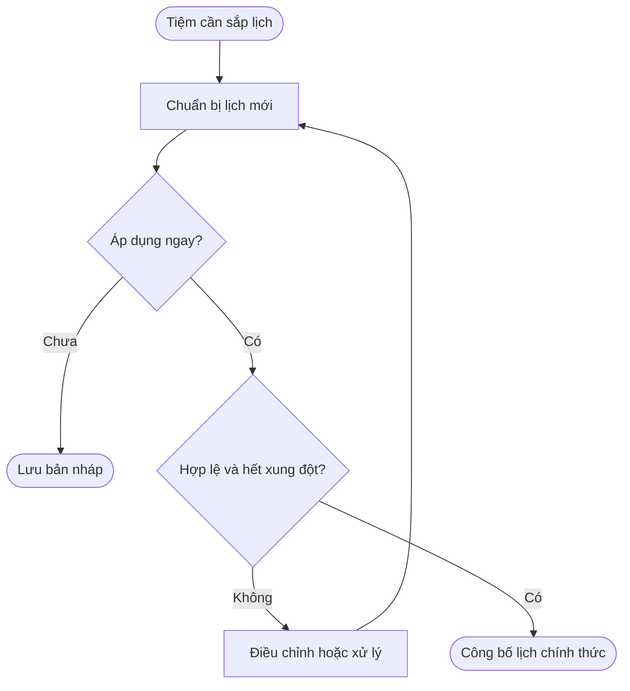
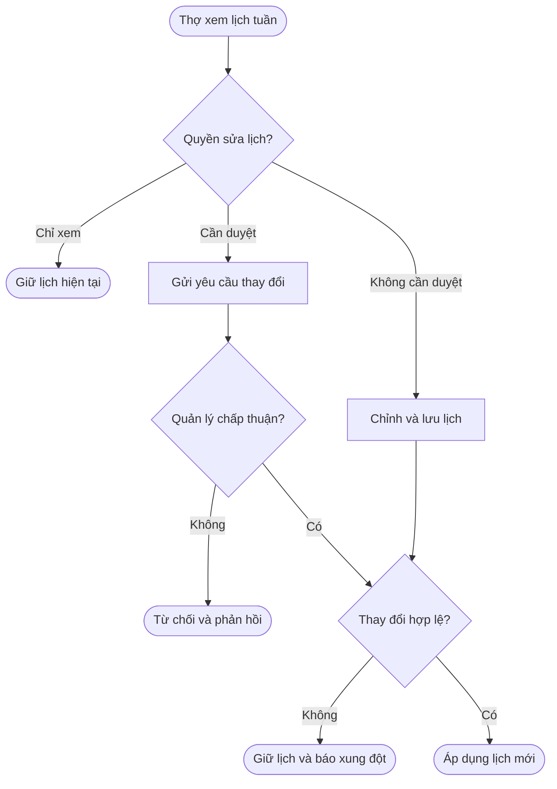
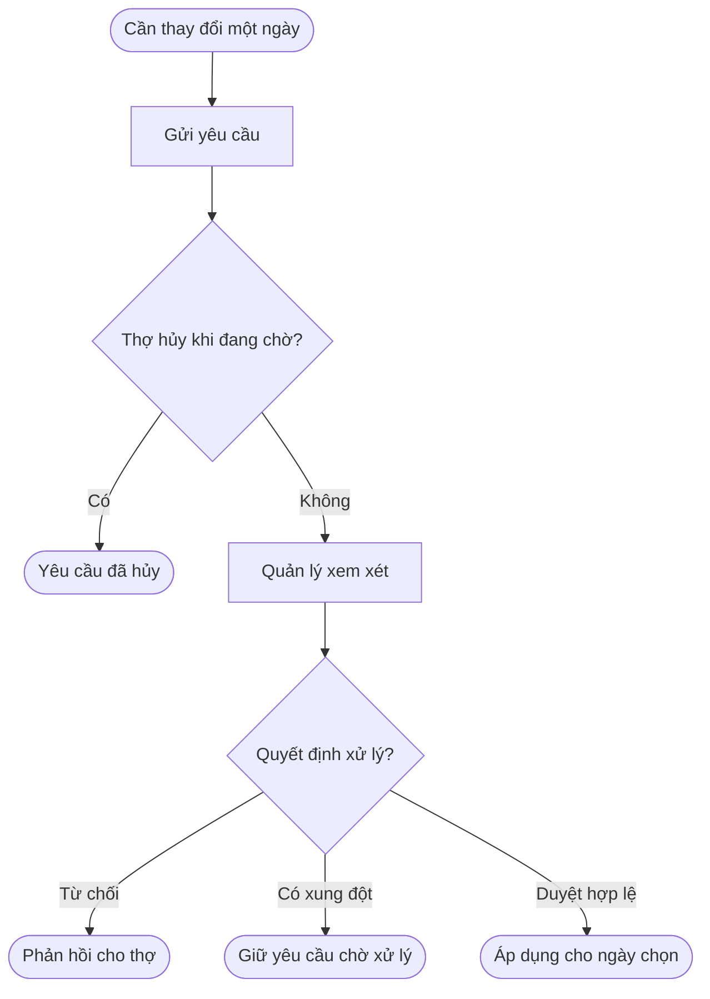
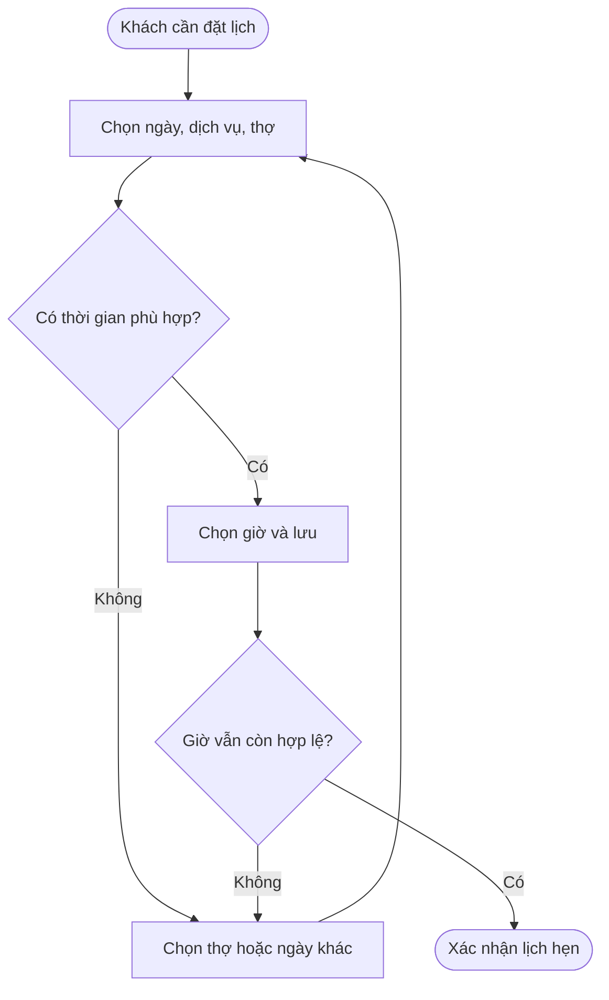
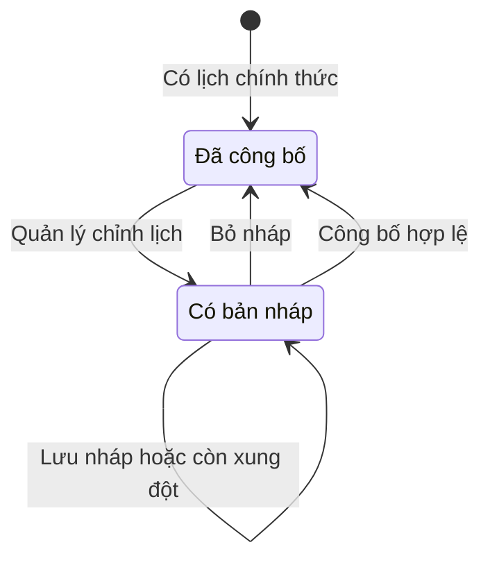
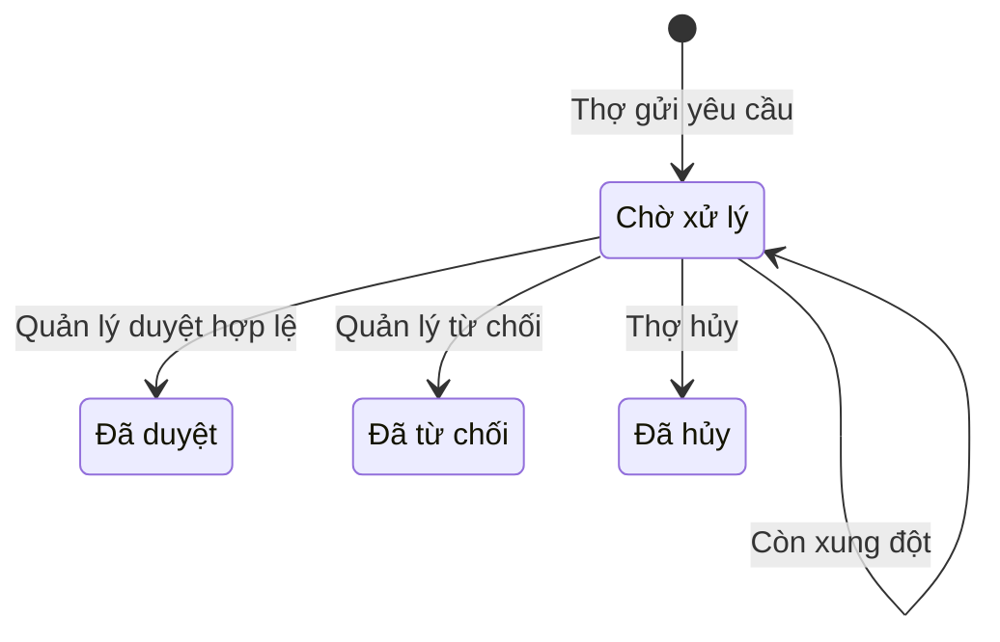

# POS — Nâng cấp quản lý lịch làm việc của thợ và đặt lịch hẹn

**Cập nhật lần cuối:** 28 tháng 9 năm 2026  
**Đối tượng:** Product Owner, BA, quản lý tiệm, đội phát triển và QA  
**Trạng thái:** Bản nháp  
**Bản chia sẻ:** [Tài liệu trên GitHub](https://github.com/vlink-group/VlinkPay/blob/enhance/1817-staff-schedule-docs/nexora/docs/business/pos-staff-schedule-booking-frontend-upgrade.md)  
**Ticket:** [#1817](https://github.com/vlink-group/vlink-nexora/issues/1817)

## 1. Tổng quan nâng cấp

Kết nối lịch làm việc của thợ với việc nhận khách tại tiệm. Quản lý thiết lập ca làm, giờ nghỉ và quyền thay đổi lịch; thợ theo dõi lịch cá nhân và chủ động điều chỉnh trong quyền được cấp; lễ tân đặt lịch dựa trên thời gian thợ thực sự có thể phục vụ.

| Nâng cấp | Giá trị nghiệp vụ |
|---|---|
| Quản lý lịch tập trung | Tiệm nắm lịch của toàn bộ thợ theo tuần, ngày làm, ngày nghỉ và xung đột |
| Lịch tuần và ngoại lệ theo ngày | Duy trì lịch làm việc thường lệ, đồng thời xử lý nghỉ ngày hoặc đổi giờ riêng |
| Quyền tự điều chỉnh của thợ | Tiệm quyết định thợ chỉ xem, sửa cần duyệt hay sửa không cần duyệt |
| Phê duyệt thay đổi | Quản lý kiểm soát yêu cầu theo ngày và thay đổi lịch tuần trước khi áp dụng |
| Liên kết với booking | Chỉ nhận lịch hẹn trong thời gian đủ điều kiện phục vụ, bảo vệ các lịch hẹn đã có |

## 2. Khái niệm chính

| Khái niệm | Ý nghĩa |
|---|---|
| Lịch tuần | Lịch làm việc lặp lại từ thứ Hai đến Chủ nhật |
| Thay đổi theo ngày | Ngoại lệ áp dụng cho một ngày cụ thể, như nghỉ cả ngày hoặc đổi giờ làm |
| Giờ nghỉ | Khoảng thời gian trong ca mà thợ không nhận khách |
| Thời gian có thể nhận khách | Thời gian làm việc còn lại sau khi tính ngoại lệ, giờ nghỉ và lịch hẹn |
| Bản nháp | Lịch quản lý đang chuẩn bị, chưa được áp dụng |
| Lịch chính thức | Lịch đã công bố hoặc thay đổi hợp lệ đã được áp dụng; dùng cho thợ và Front Desk |
| Yêu cầu thay đổi | Đề nghị của thợ cần quản lý xử lý trước khi trở thành lịch chính thức |

## 3. Vai trò và trách nhiệm

| Vai trò | Trách nhiệm |
|---|---|
| Chủ tiệm | Quyết định quyền sửa lịch của thợ và quyền quản lý lịch |
| Quản lý được phân quyền | Thiết lập, công bố lịch; xem xét yêu cầu và xử lý xung đột |
| Thợ | Xem lịch cá nhân; sửa lịch tuần trong quyền được cấp; gửi và theo dõi yêu cầu |
| Lễ tân | Tạo hoặc đổi lịch hẹn dựa trên lịch chính thức và thời gian có thể nhận khách |

## 4. Quản lý lịch làm việc của tiệm

### 4.1 Theo dõi lịch toàn bộ thợ

Tiệm có một nơi quản lý tập trung lịch làm việc theo tuần của toàn bộ thợ. Quản lý xem được ca làm, ngày nghỉ, giờ nghỉ, số ngày làm việc, thời gian còn có thể nhận khách và các xung đột cần xử lý.

Quản lý có thể xem các tuần khác nhau, mở lịch của từng thợ và thay đổi lịch trong phạm vi salon được cấp quyền.

### 4.2 Thiết lập lịch tuần và thay đổi theo ngày

Lịch tuần xác định ngày làm việc, ngày nghỉ, giờ bắt đầu, giờ kết thúc và giờ nghỉ thường lệ.

Thay đổi theo ngày cho phép nghỉ cả ngày, đổi ca hoặc bổ sung giờ nghỉ vào một ngày cụ thể. Ngoại lệ này chỉ thay thế lịch tuần ở ngày áp dụng.

Ví dụ: thợ thường làm thứ Hai từ 9:00 AM đến 6:00 PM nhưng được đổi sang 10:00 AM–4:00 PM vào ngày 28 tháng 9. Các thứ Hai khác vẫn giữ lịch thường lệ.

### 4.3 Quản lý giờ nghỉ

Quản lý được thêm, sửa và xóa giờ nghỉ lặp theo thứ hoặc áp dụng riêng theo ngày. Giờ nghỉ phải nằm trong ca, có thời điểm kết thúc sau bắt đầu và không chồng nhau.

Sau khi thay đổi được áp dụng, khoảng nghỉ không còn được tính là thời gian nhận khách. Nếu ảnh hưởng lịch hẹn đã có, quản lý phải xử lý xung đột trước.

### 4.4 Chuẩn bị và công bố lịch

| Thao tác | Kết quả nghiệp vụ |
|---|---|
| Lưu nháp | Giữ lịch đang chuẩn bị để tiếp tục chỉnh; lịch chính thức chưa đổi |
| Bỏ nháp | Hủy nội dung đang chuẩn bị; giữ lịch chính thức gần nhất |
| Công bố lịch | Áp dụng lịch mới khi hợp lệ và không còn xung đột cần xử lý |

Trong lúc có bản nháp, thợ và lễ tân vẫn sử dụng lịch chính thức. Lịch được công bố thành công phải được áp dụng thống nhất cho lịch cá nhân của thợ và việc đặt lịch hẹn.

## 5. Thợ xem và chủ động thay đổi lịch

### 5.1 Theo dõi công việc theo ngày và tuần

Thợ xem lịch hẹn và lịch làm việc theo ngày, đồng thời có thể xem đủ lịch từ thứ Hai đến Chủ nhật. Thông tin gồm ngày làm, giờ bắt đầu, giờ kết thúc, giờ nghỉ và ngày nghỉ.

Với từng lịch hẹn, thợ biết khách hàng, dịch vụ, thời gian, thời lượng, mã Work Order khi có và trạng thái. Tổng số lịch hẹn và thời gian đã được đặt giúp thợ nắm khối lượng công việc trong ngày.

### 5.2 Chỉnh lịch tuần theo quyền tiệm cấp

Tiệm chọn một trong ba mức quyền cho thợ:

| Quyền | Thợ được làm gì | Thời điểm áp dụng |
|---|---|---|
| Chỉ xem | Xem lịch tuần; không được chỉnh lịch tuần | Lịch do người có quyền quản lý quyết định |
| Sửa cần duyệt | Đề nghị đổi ngày làm, ngày nghỉ và giờ bắt đầu/kết thúc của cả 7 ngày | Sau khi quản lý duyệt |
| Sửa không cần duyệt | Tự sửa ngày làm, ngày nghỉ và giờ bắt đầu/kết thúc của cả 7 ngày | Ngay khi lưu thành công và thay đổi hợp lệ |

Thợ phải biết quyền đang áp dụng và kết quả của việc gửi hoặc lưu thay đổi. Quyền sửa không cần duyệt vẫn phải tuân thủ quy tắc giờ làm, giờ nghỉ và bảo vệ lịch hẹn đã có.

### 5.3 Xin nghỉ ngày và các yêu cầu khác

Thợ có thể gửi yêu cầu nghỉ một ngày cụ thể, đổi giờ làm hoặc thêm giờ nghỉ. Yêu cầu nghỉ ngày cho phép thợ diễn giải lý do bằng nội dung tự do.

Yêu cầu theo ngày khác với chỉnh lịch tuần: nghỉ một ngày chỉ ảnh hưởng ngày được chọn; thay đổi lịch tuần điều chỉnh lịch làm việc lặp lại. Không yêu cầu lý do riêng cho từng ngày trong đề nghị sửa lịch tuần.

Thợ theo dõi kết quả và có thể hủy yêu cầu đang chờ. Yêu cầu đã được duyệt, từ chối hoặc hủy được giữ để xem lại.

## 6. Quản lý xử lý yêu cầu thay đổi

Quản lý xử lý cả yêu cầu theo ngày và yêu cầu thay đổi lịch tuần. Với lịch tuần, quản lý cần biết đề nghị cho đủ 7 ngày, gồm ngày làm, ngày nghỉ và giờ làm tương ứng.

Quản lý có thể xem, điều chỉnh đề nghị, duyệt hoặc từ chối kèm phản hồi. Nội dung cuối cùng được chấp thuận phải rõ ràng để thợ biết lịch nào sẽ được áp dụng.

- **Duyệt:** Áp dụng thay đổi hợp lệ vào lịch chính thức.
- **Từ chối:** Giữ lịch chính thức và trả kết quả cho thợ.
- **Có xung đột:** Chặn duyệt, chỉ rõ lịch hẹn bị ảnh hưởng và giữ yêu cầu ở trạng thái chờ xử lý.

Khi xung đột phát sinh, quản lý điều chỉnh đề nghị, phối hợp xử lý lịch hẹn liên quan hoặc từ chối yêu cầu. Hệ thống không tự hủy hoặc chuyển lịch hẹn của khách để đáp ứng đề nghị.

## 7. Đặt lịch hẹn theo khả năng phục vụ

Front Desk sử dụng lịch chính thức để xác định thợ làm việc, thời gian có thể nhận khách và xung đột theo ngày đang xem.

Sau khi chọn ngày, dịch vụ và thợ, lễ tân chỉ đặt được giờ mà toàn bộ thời lượng dịch vụ nằm trong ca và không chồng giờ nghỉ hoặc lịch hẹn khác.

Ví dụ: thợ trống từ 9:30 AM đến 10:30 AM thì dịch vụ 60 phút có thể bắt đầu lúc 9:30 AM. Khoảng cách giữa các giờ có thể bắt đầu tuân theo quy tắc đặt lịch của salon; thời lượng dịch vụ quyết định thời gian cần còn trống.

Khi đổi lịch, lịch hẹn đang chỉnh không bị tính là một lịch hẹn khác chiếm chính giờ của nó. Nếu không còn thời gian phù hợp, lễ tân chọn thợ hoặc ngày khác. Nếu giờ chọn không còn hợp lệ lúc lưu, thông tin khách và dịch vụ được giữ để chọn lại.

## 8. Luồng nghiệp vụ

### 8.1 Quản lý chuẩn bị và công bố lịch

**Người thực hiện:** Quản lý.  
**Bắt đầu:** Tiệm cần sắp ca hoặc điều chỉnh lịch.  
**Kết quả:** Lịch mới chính thức được dùng để nhận khách.

**Nhu cầu người dùng:**

- Là quản lý, tôi muốn chuẩn bị lịch trước khi áp dụng để sắp xếp nhân sự chủ động.
- Là quản lý, tôi muốn biết lịch hẹn bị ảnh hưởng để xử lý trước khi công bố.

| Bước | Hành động | Kết quả |
|---|---|---|
| 1 | Chọn thợ và lịch cần chỉnh | Nắm ca làm và lịch hẹn liên quan |
| 2 | Chỉnh lịch tuần, ngoại lệ hoặc giờ nghỉ | Có nội dung lịch mới |
| 3 | Lưu nháp nếu chưa áp dụng | Lịch chính thức giữ nguyên |
| 4 | Công bố lịch | Kiểm tra tính hợp lệ và xung đột |
| 5 | Hoàn tất khi hợp lệ | Thợ và Front Desk sử dụng lịch mới |

### 8.2 Thợ thay đổi lịch tuần

**Người thực hiện:** Thợ; quản lý tham gia khi cần duyệt.  
**Bắt đầu:** Thợ cần thay đổi lịch làm việc thường lệ.  
**Kết quả:** Thay đổi được áp dụng đúng quyền hoặc có kết quả từ chối.

**Nhu cầu người dùng:**

- Là thợ, tôi muốn điều chỉnh lịch trong quyền được cấp để chủ động sắp xếp công việc.
- Là quản lý, tôi muốn duyệt thay đổi khi tiệm yêu cầu kiểm soát trước khi áp dụng.

| Bước | Người thực hiện | Hành động và kết quả |
|---|---|---|
| 1 | Thợ | Xem lịch tuần và quyền sửa lịch |
| 2 | Thợ | Nếu được sửa, đề nghị ngày làm/nghỉ và giờ làm cho 7 ngày |
| 3 | Hệ thống | Phân luồng theo quyền: gửi duyệt hoặc lưu trực tiếp |
| 4 | Quản lý | Với yêu cầu cần duyệt, xem xét và duyệt hoặc từ chối |
| 5 | Hệ thống | Áp dụng khi được duyệt hoặc lưu trực tiếp hợp lệ; chặn thay đổi gây xung đột |
| 6 | Thợ | Xem lịch mới hoặc kết quả xử lý |

### 8.3 Thợ xin thay đổi theo ngày

**Người thực hiện:** Thợ và quản lý.  
**Bắt đầu:** Thợ cần nghỉ ngày, đổi giờ hoặc thêm giờ nghỉ.  
**Kết quả:** Có quyết định xử lý cho ngày được đề nghị.

**Nhu cầu người dùng:**

- Là thợ, tôi muốn xin nghỉ một ngày và nêu lý do mà không thay đổi lịch thường lệ.
- Là thợ, tôi muốn hủy yêu cầu chưa được xử lý khi kế hoạch thay đổi.

| Bước | Người thực hiện | Hành động và kết quả |
|---|---|---|
| 1 | Thợ | Chọn loại yêu cầu và ngày; nêu nội dung, lý do |
| 2 | Thợ | Gửi yêu cầu chờ xử lý; có thể hủy khi còn chờ |
| 3 | Quản lý | Xem đề nghị và ảnh hưởng đến lịch hẹn |
| 4 | Quản lý | Duyệt khi hợp lệ hoặc từ chối kèm phản hồi |
| 5 | Thợ | Nhận kết quả; lịch cập nhật cho ngày được duyệt |

### 8.4 Lễ tân tạo hoặc đổi lịch hẹn

**Người thực hiện:** Lễ tân.  
**Bắt đầu:** Khách cần đặt mới hoặc đổi lịch.  
**Kết quả:** Lịch hẹn nằm trong thời gian thợ có thể phục vụ.

**Nhu cầu người dùng:**

- Là lễ tân, tôi muốn chọn giờ đủ thời lượng dịch vụ để tránh nhận khách ngoài khả năng phục vụ.
- Là lễ tân, tôi muốn giữ thông tin khách khi cần chọn lại giờ.

| Bước | Hành động | Kết quả |
|---|---|---|
| 1 | Chọn ngày, dịch vụ và thợ | Xác định thời gian có thể nhận khách |
| 2 | Chọn giờ phù hợp | Đủ thời gian hoàn thành dịch vụ |
| 3 | Lưu lịch hẹn | Kiểm tra lại trước khi xác nhận |
| 4 | Chọn lại nếu giờ không còn hợp lệ | Giữ thông tin khách và dịch vụ |
| 5 | Lưu thành công | Cập nhật Front Desk và lịch của thợ |

## 9. Quyền và thiết lập của tiệm

Là chủ tiệm, tôi muốn phân quyền quản lý và mức tự chủ của thợ để phù hợp với cách vận hành salon.

| Thiết lập | Ý nghĩa nghiệp vụ |
|---|---|
| Quyền quản lý lịch | Ai được chỉnh, công bố và xử lý yêu cầu |
| Quyền sửa lịch tuần của thợ | Chỉ xem, sửa cần duyệt hoặc sửa không cần duyệt |
| Salon áp dụng | Lịch và nhân sự thuộc đúng địa điểm quản lý |
| Múi giờ salon | Giờ làm và giờ hẹn thống nhất giữa tiệm, thợ và lễ tân |
| Quy tắc giờ bắt đầu booking | Xác định các mốc giờ khách có thể đặt |

Quyền tự sửa lịch tuần và quy trình gửi yêu cầu theo ngày là hai nội dung riêng. Các yêu cầu theo ngày đã gửi vẫn được quản lý xử lý theo luồng yêu cầu.

## 10. Vòng đời trạng thái

### 10.1 Lịch do quản lý chuẩn bị

| Trạng thái | Thao tác | Kết quả |
|---|---|---|
| Đã công bố | Bắt đầu chỉnh | Có bản nháp bên cạnh lịch chính thức |
| Có bản nháp | Lưu nháp | Giữ nội dung đang chuẩn bị |
| Có bản nháp | Bỏ nháp | Giữ lịch chính thức gần nhất |
| Có bản nháp | Công bố hợp lệ | Áp dụng lịch mới |
| Có bản nháp | Công bố có xung đột | Giữ nháp, chưa áp dụng |

### 10.2 Yêu cầu thay đổi của thợ

| Trạng thái | Ý nghĩa | Thao tác tiếp theo |
|---|---|---|
| Pending — Chờ xử lý | Chưa thay đổi lịch chính thức | Thợ hủy; quản lý điều chỉnh, duyệt hoặc từ chối |
| Approved — Đã duyệt | Thay đổi đã được chấp thuận và áp dụng | Xem lịch cập nhật |
| Rejected — Đã từ chối | Lịch chính thức giữ nguyên | Xem phản hồi |
| Canceled — Đã hủy | Thợ rút yêu cầu khi còn chờ | Xem lại lịch sử |

Yêu cầu gặp xung đột vẫn là Pending. Lưu trực tiếp theo quyền sửa không cần duyệt không tạo yêu cầu Pending.

## 11. Quy tắc nghiệp vụ

1. Lịch tuần gồm đủ thứ Hai đến Chủ nhật; thay đổi theo ngày được ưu tiên ở ngày tương ứng.
2. Giờ nghỉ nằm trong ca làm và không chồng nhau.
3. Bản nháp và yêu cầu chờ xử lý chưa thay đổi lịch chính thức.
4. Thay đổi lịch tuần của thợ được xử lý đúng một trong ba mức quyền tiệm cấp.
5. Công bố, phê duyệt và lưu trực tiếp đều phải bảo vệ lịch hẹn đã có.
6. Giờ đặt phải đủ toàn bộ dịch vụ, không chồng lịch hẹn khác hoặc giờ nghỉ.
7. Khi đổi lịch, không tính lịch hẹn đang sửa là xung đột với chính nó.
8. Thời gian làm việc, giờ trống và xung đột được xác định đúng salon, múi giờ và ngày hoặc tuần đang xem.

## 12. Ngoại lệ và cách xử lý

| Tình huống | Cách xử lý | Người phụ trách |
|---|---|---|
| Thợ chỉ có quyền xem lịch tuần | Giữ lịch do quản lý thiết lập; không cho tự sửa lịch tuần | Chủ tiệm, thợ |
| Thay đổi lịch ảnh hưởng booking | Chặn áp dụng, xác định lịch hẹn cần xử lý | Quản lý; thợ phối hợp nếu tự sửa |
| Giờ nghỉ ngoài ca hoặc chồng nhau | Sửa thời gian trước khi áp dụng | Người thay đổi lịch |
| Không có thời gian phù hợp để đặt | Chọn thợ hoặc ngày khác | Lễ tân |
| Yêu cầu bị từ chối | Giữ lịch chính thức, trả phản hồi cho thợ | Quản lý |
| Thợ hủy yêu cầu đang chờ | Kết thúc xử lý yêu cầu, giữ lịch chính thức | Thợ |
| Lưu thay đổi thất bại | Giữ nội dung đang chuẩn bị để thử lại; chưa coi là đã áp dụng | Người thao tác |
| Giờ đặt vừa bị chiếm | Giữ thông tin khách và dịch vụ để chọn lại | Lễ tân |

## 13. Câu hỏi thường gặp

**Thợ có luôn phải xin duyệt khi sửa lịch tuần không?**  
Không. Tiệm quyết định một trong ba mức quyền. Nếu được sửa không cần duyệt, lịch hợp lệ được áp dụng khi lưu thành công.

**Xin nghỉ một ngày có đổi toàn bộ lịch tuần không?**  
Không. Yêu cầu nghỉ ngày chỉ áp dụng cho ngày được duyệt.

**Quyền lưu trực tiếp có cho phép thay đổi làm ảnh hưởng khách đã đặt không?**  
Không. Vẫn phải xử lý xung đột với lịch hẹn trước khi áp dụng.

**Lưu nháp có ảnh hưởng việc nhận khách không?**  
Không. Front Desk tiếp tục dùng lịch chính thức đến khi lịch mới được áp dụng.

## 14. Tính năng liên quan

- **Booking & Appointment:** Dùng lịch làm việc để xác định giờ đặt và đổi lịch hẹn. Chưa có tài liệu kèm theo.
- **Staff Profile & Permissions:** Cung cấp danh sách thợ và quyền quản lý hoặc tự sửa lịch. Chưa có tài liệu kèm theo.
