## Promotion & Ads — Tạo ưu đãi, xuất bản và chạy quảng cáo

**Cập nhật lần cuối:** 24 tháng 9 năm 2026

**Đối tượng đọc:** Chủ doanh nghiệp (Business Owner), người phụ trách sản phẩm, BA, đội phát triển giao diện, đội phát triển máy chủ, QA, quản trị viên, bộ phận hỗ trợ

**Trạng thái:** Đang rà soát

### Tổng quan

Promotion Studio giúp tiệm thu hút khách và tăng lượt sử dụng ưu đãi bằng cách kết nối nội dung Promotion với các kênh phân phối và kết quả booking/POS. Hệ thống cho phép thiết lập điều kiện, lịch, banner và bộ chia sẻ; xuất bản, gửi tới nhóm khách đủ điều kiện, quảng bá qua đối tác hoặc Paid Boost, đồng thời theo dõi hiệu quả từng ưu đãi và campaign. Owner và người được phân quyền chuẩn bị, điều chỉnh nội dung; Owner xác nhận kênh, ngân sách và nguồn Ads Credit, còn Admin kiểm duyệt nội dung thuộc phạm vi phụ trách. Nhân viên POS áp dụng ưu đãi theo quyền và điều kiện đã xác nhận.

**Phạm vi và mức độ chốt:** Tài liệu bổ sung đầy đủ hành trình theo phạm vi người dùng yêu cầu; chưa phải xác nhận chức năng đã triển khai. Các lựa chọn nghiệp vụ mới và cấu hình thương mại chưa được chốt được ghi riêng.

**Nhu cầu chính:** Là Business Owner, tôi muốn tạo một ưu đãi, chọn nơi xuất bản và chạy quảng cáo có ngân sách rõ ràng, để thu hút khách và đối chiếu kết quả với chi phí.

#### Tổng quan liên kết Promotion Studio → Ads Credit → chạy quảng cáo

**Promotion Studio** là nơi tiệm chuẩn bị ưu đãi và nội dung quảng bá. **Paid Boost/Campaign** là nơi chọn cách quảng cáo, đối tượng, lịch và hạn mức chi tiêu. **Ads Credit trong Quản lý gói** là nơi Owner nạp tiền và theo dõi số dư dùng để thanh toán quảng cáo. Ba phần nối thành một hành trình; tiệm có thể nạp credit trước hoặc nạp khi thiết lập campaign mà chưa đủ số dư.

Đây là **luồng nghiệp vụ mục tiêu**, kết nối tài liệu Promotion với [tài liệu nạp và sử dụng Ads Credit](./merchant-ads-credit.md); không phải xác nhận toàn bộ luồng đã chạy trên staging.

| Chặng | Tiệm thực hiện | Kết quả và điểm nối |
| :--- | :--- | :--- |
| 1. Tạo ưu đãi | Trong Promotion Studio, chọn mẫu, nhập nội dung, mức giảm, điều kiện, lịch áp dụng và chuẩn bị banner. | Có một Promotion dùng chung cho POS, kênh của tiệm và quảng bá; không nhập lại ưu đãi ở màn hình nạp credit. |
| 2. Chọn nơi xuất bản | Chọn POS/OneQR của tiệm; nếu muốn xuất hiện trên mạng Nexora thì gửi Public để duyệt. | Dùng nội bộ không yêu cầu Ads Credit. Public không tự trở thành quảng cáo trả phí hoặc tự trừ credit. |
| 3. Thiết lập quảng cáo | Từ Promotion, Owner tạo Paid Boost, chọn mục tiêu, đối tượng/khu vực, vị trí, lịch, mô hình phí và ngân sách; chọn Ads Credit làm nguồn thanh toán. | Campaign gắn với Promotion và có hạn mức riêng. Có thể chuẩn bị nháp, nhưng chỉ chạy khi Public và campaign được duyệt, quyền advertiser hợp lệ và đủ điều kiện. |
| 4. Nạp khi cần | Nếu số dư khả dụng chưa đủ, mở Quản lý gói → Ads Credit, chọn số tiền và thanh toán thẻ theo luồng đã có tài liệu. | Sau khi thanh toán và cấp credit được xác nhận, số dư cập nhật. Quay lại đúng campaign, giữ cấu hình đang làm; không phải tạo lại từ đầu. |
| 5. Chạy quảng cáo | Owner hoàn tất xác nhận campaign; hệ thống kiểm tra duyệt, lịch, quyền, ngân sách và số dư khả dụng. | Quảng cáo được phân phối khi đủ điều kiện. Nạp thành công không tự bật một campaign nháp, bị từ chối hoặc do Owner tạm dừng. |
| 6. Sử dụng credit | Khách thấy quảng cáo và tương tác; hệ thống xác nhận hoạt động/phân phối đủ điều kiện theo CPC, CPL, CPA hoặc Sponsored Placement đã chấp thuận. | 💰 Ghi chi phí vào Ads Credit và gắn với campaign để đối soát. Ngân sách là hạn mức, không phải khoản bị trừ toàn bộ ngay khi tạo campaign. |
| 7. Theo dõi và tiếp tục | Owner xem hiệu quả tại báo cáo campaign; xem số dư, lịch sử nạp, chi phí và biên nhận tại Ads Credit. | Nếu thiếu credit, campaign dừng phân phối cần credit và mời nạp. Sau khi cấp credit, chỉ tự chạy lại campaign dừng do thiếu credit nếu các điều kiện khác vẫn hợp lệ; không tự charge thẻ. |

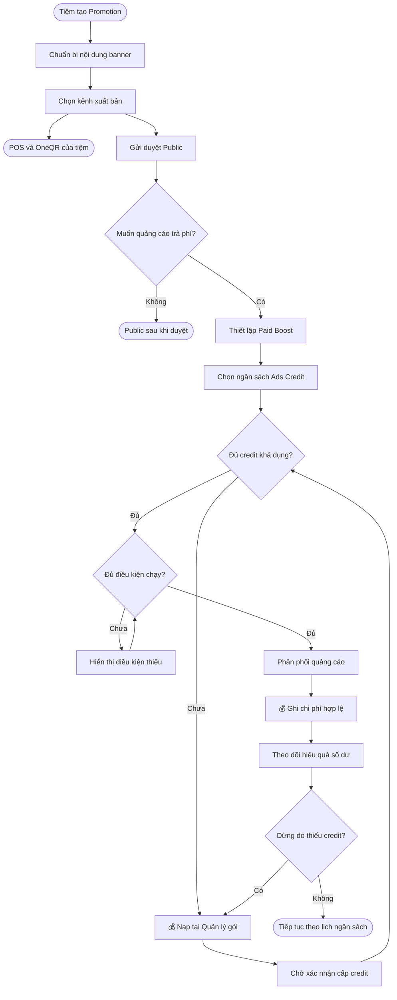

**Điểm bàn giao giữa hai phần:** Campaign chuyển Owner sang màn hình nạp kèm ngữ cảnh quay lại; Ads Credit trả kết quả cấp credit và số dư khả dụng; Campaign quyết định đủ điều kiện chạy hay chưa. Chi phí phải tra được về đúng campaign, còn lịch sử nạp và biên nhận vẫn được quản lý tại Ads Credit. Chi tiết thanh toán, giao dịch đang xử lý và cấp credit xem tài liệu Ads Credit; không lặp lại luồng nạp trong Promotion Studio.

#### Hiện trạng và phạm vi bổ sung

Theo ghi nhận kiểm tra trong bản tài liệu trước, giao diện **staging ngày 23 tháng 9 năm 2026** đã được xem, tại `staging-web.nexoratouch.com`, bằng phiên Business đang mở của **Quân Salonn**. Lần chuẩn hóa tài liệu ngày 24 tháng 9 chỉ đối chiếu mã nguồn nhánh `staging`, không thao tác lại ứng dụng; bảng quan sát giao diện dưới đây giữ nguyên mốc kiểm tra cũ. Staging có Promotion Studio; nhận định ban đầu “chỉ có một ảnh, chưa có template/kênh Public” không còn đúng với giao diện đã quan sát hoặc mã nguồn tham chiếu hiện tại.

Phân biệt ba mức: **đã thao tác được trên UI**, **đã thấy control/dữ liệu nhưng chưa kiểm chứng lưu và xử lý phía sau**, và **chưa thấy trong phạm vi kiểm tra**. Không suy ra backend thiếu từ việc không thấy menu. Chỉ kiểm tra không lưu thay đổi: chưa tạo/sửa/xuất bản Promotion, gửi duyệt, upload, in, tạo booking hoặc chạy quảng cáo.

| Phần | Hiện trạng đã quan sát | Phần còn thiếu trên form hoặc cần xác minh |
| :--- | :--- | :--- |
| Promotion Studio | Có 6 mẫu; đã thử Weekday Glow điền sẵn tên, badge, mô tả, 15%, thứ Ba–thứ Năm 10–14h. Có giảm %/số tiền, thứ và giờ. Danh sách sau tải lại hiện 3 Promotion đang bật. | Chưa thấy trường chọn dịch vụ/gói, đối tượng khách, quy tắc cộng dồn, ngày bắt đầu–kết thúc. Mô tả mẫu không chứng minh hệ thống tự kiểm tra các điều kiện này. |
| Banner và poster | Có 8 theme; đã thêm banner thứ hai, đổi thứ tự/cover trong form chưa lưu, mở preview poster. Có upload và nút In poster. | Kiểm chứng lưu, tải lại, upload, in thực tế, CTA/QR và trang đích; không xây lại phần chọn mẫu/sắp xếp/preview đã có. |
| Kênh xuất bản | Có 3 lựa chọn độc lập trên form: POS checkout, OneQR hero, Gửi public lên Search Deals. Promotion 01 mở sửa có cả 3 lựa chọn được chọn. UI nói Public chờ duyệt và không tự bật quảng cáo/thưởng giới thiệu. | Chưa xác minh gửi duyệt → quyết định → hiển thị khách. Chưa thấy trạng thái duyệt/lý do từ chối/lịch sử phiên bản trên màn hình đã xem. Checkbox được chọn không phải bằng chứng đã duyệt. |
| OneQR khách và booking | OneQR của business có Check-in, Booking, Services, Tip/Pay, Review. Trang booking hiển thị dịch vụ và ba bước đặt lịch. Sau tải lại chưa thấy banner Promotion trên hai trang này. | Cần kiểm tra điều kiện lịch, trạng thái, liên kết business/chi nhánh và phân phối trước khi kết luận lỗi hoặc chưa triển khai. Chưa xác minh CTA → booking giữ ưu đãi/nguồn campaign. |
| Campaign và báo cáo | Chưa thấy Paid Boost/Campaign Manager ở Promotion Studio, menu Business, OneQR và Package Management đã xem. Analytics hiện tại trình bày tip/staff/station. | Chưa tìm thấy giao diện eligibility advertiser, mục tiêu/targeting/budget, vòng đời campaign, chi phí và hiệu quả Ads trong phiên này. Chưa xác minh quyền khác, feature flag hoặc backend. |
| POS và KYB | Checkout local có áp dụng Promotion tại POS và tích hợp KYB. | Chưa chạy giao dịch POS hoặc xác minh quyền quảng cáo trên staging; giữ đây là điểm tích hợp cần kiểm chứng riêng. |

#### Đối chiếu 10 đầu mục sau kiểm tra staging

| # | Đầu mục | Kết luận staging và phạm vi bổ sung | Nơi mô tả chính |
| :--- | :--- | :--- | :--- |
| 1 | Điều kiện áp dụng Promotion | Có giảm %, số tiền, thứ/giờ; chưa thấy điều kiện có cấu trúc về dịch vụ, khách, cộng dồn và khoảng ngày hiệu lực. | Luồng 1; Quy tắc nghiệp vụ |
| 2 | Mẫu, banner, poster và xem trước | **Đã có phần lớn UI**. Kế thừa mẫu, nhiều banner, cover và preview; xác minh lưu/upload/in/CTA trước khi mở thêm. | Luồng 1 |
| 3 | Internal / Public / Paid Boost | **Đã có chọn POS, OneQR hero, Public**. Paid Boost chưa thấy; kết quả phân phối còn cần xác minh. | Luồng 2 |
| 4 | Nháp, xuất bản và kiểm duyệt | Có thông báo chương trình mới tắt cho đến khi bật; không đồng nhất “tắt” với đầy đủ trạng thái nháp. Chưa xác minh vòng duyệt và quản lý phiên bản. | Luồng 2; Vòng đời trạng thái |
| 5 | Điều kiện advertiser và phân quyền | Chưa thấy UI quyền chạy Ads trong phạm vi kiểm tra; chưa thử vai trò khác. | Vai trò người dùng; Luồng 3 |
| 6 | Thiết lập Paid Boost | Chưa thấy UI tạo campaign, chọn mục tiêu, đối tượng, placement, lịch và mô hình phí. | Luồng 3 |
| 7 | Vòng đời và ngân sách campaign | Chưa thấy UI ngân sách, chạy/dừng, lý do dừng, hết hạn; không trùng bật/tắt Promotion. | Luồng 3; Vòng đời trạng thái |
| 8 | Khách từ quảng cáo đến booking | Có OneQR và booking; chưa xác minh phân phối Promotion, CTA và bảo toàn ưu đãi/nguồn. | Luồng 4 |
| 9 | Tracking, tính phí và điều chỉnh | Chưa có bằng chứng staging về attribution, sự kiện đủ điều kiện tính phí và điều chỉnh. Không suy ra từ tracking click module. | Luồng 5 |
| 10 | Hiệu quả Promotion và campaign | Chưa thấy màn hình hiệu quả từng Promotion hoặc dashboard quảng cáo; Analytics đã xem là tip/staff/station. | Luồng 6 |

**Cách dùng tài liệu:** bảng 10 đầu mục phản ánh phạm vi đối chiếu ban đầu; phần PO bổ sung ngày 24 tháng 9 được ghi riêng bên dưới. Các luồng nghiệp vụ bên dưới mô tả hành trình mục tiêu đầy đủ, bao gồm cả bước đã có để giữ mạch nghiệp vụ. Bảng trên mới là căn cứ phân biệt phần kế thừa, phần cần bổ sung và phần cần kiểm chứng; không dùng toàn bộ 10 mục như danh sách “chưa làm”. Bằng chứng kiểm tra ngày 23 tháng 9 năm 2026 được lưu nội bộ, không đính kèm bộ tài liệu chia sẻ.

#### Phần PO bổ sung ngày 24 tháng 9 năm 2026

Nguồn: Promotion Studio — Share, Channels & Ads tích hợp (nguồn `promotion-studio-share-channels-ads-integrated.html` được bản trước viện dẫn; chưa tìm thấy file trong workspace). Đây là prototype phạm vi sản phẩm: các nút chủ yếu hiển thị thông báo mô phỏng và dữ liệu mẫu, không chứng minh lưu, gửi, đăng bài, phân phối hoặc thanh toán thật. Kết quả staging ở trên vẫn là lần kiểm tra ngày 23 tháng 9; chưa kiểm chứng triển khai các phần mới này.

| Bổ sung từ PO | Cách đưa vào tài liệu |
| :--- | :--- |
| Trang Promotions có Overview, Templates, Manage, Strategy, Analytics, Settings; Studio mở từ Add/Edit | Bổ sung tổ chức màn hình bên dưới; phân biệt quản lý Promotion với campaign trả phí. |
| Hướng dẫn theo mục tiêu, tìm mẫu theo ngành/dịch vụ, AI tạo banner và bộ nội dung | Mở rộng Luồng 1; AI tạo bản đề xuất để Owner xem lại. |
| Trang deal, CTA, social kit, QR và link tracking theo kênh; bàn giao Meta/Google/agency | Luồng 7; bản đầu copy/export/handoff, kết nối tự đăng là giai đoạn sau. |
| Audience gợi ý; khách CRM; SMS/email/push theo lịch và consent | Mở rộng Luồng 3 và Luồng 8; tận dụng module SMS hiện có, không mặc định dùng Ads Credit để gửi tin. |
| Merchant ATM app, Mobile ATM app, CryptoMap360, ChatGPT/AI search | Danh mục đích phân phối trong Luồng 2; từng đích cần tích hợp và duyệt phù hợp. AI search là chuẩn bị metadata để được hiểu/tìm thấy, không cam kết mua vị trí. |
| Đối tác không cạnh tranh, quảng cáo trên receipt/OneQR, token dùng ưu đãi và đối soát | Luồng 9; nối sự kiện sang Earnings/Sponsor, không tạo cơ chế chi trả thứ hai. |
| Lịch mùa vụ, giờ vắng, tạo hàng loạt và chạy lại ưu đãi tốt | Luồng 10; quy tắc tự động phải được Owner thiết lập và không bỏ qua duyệt/ngân sách. |
| KPI ngay danh sách, báo cáo theo kênh/audience/partner/search term và gợi ý tối ưu | Mở rộng Luồng 6; đồng bộ định nghĩa chỉ số, không dùng số mẫu làm dữ liệu thật. |

**Cần giữ rõ phạm vi thương mại:** các ví dụ 30%/70%, $2/lượt dùng, $0.75/$1.25 và 7–14 ngày đối soát trong HTML chưa thay thế chính sách Earnings/Sponsor hiện có. Monthly add-on, Credit exchange, Pay per click, Pay per redemption là các phương án PO đưa ra cho Partner Network, chưa phải giá hoặc cơ chế được chốt. Không suy ra quyền đổi/chuyển Ads Credit từ lựa chọn Credit exchange.

#### Tổ chức trải nghiệm Promotions theo bản PO

| Màn hình | Vai trò |
| :--- | :--- |
| Overview | Tổng quan ưu đãi đang chạy, doanh thu có căn cứ và kênh hiệu quả trong kỳ; phân biệt Promotion đang bật và campaign Ads đang chạy. |
| Templates | Tìm theo ngành, dịch vụ, mục tiêu; lọc giờ vắng, khách mới, loyalty, cross-promo, receipt, nearby, gift card. Mẫu chỉ điền nội dung, không tự tạo quyền lợi hoặc kích hoạt kênh. |
| Manage | Tìm tên/badge; lọc nháp, chờ duyệt, bật/tắt; sắp xếp mới nhất, lượt xem, lượt dùng, doanh thu. Mỗi Promotion có KPI cùng kỳ, Edit, Share, Analytics, nhân bản, chạy lại và tạm dừng theo quyền. |
| Strategy | Lịch mùa vụ, quy tắc giờ vắng, gợi ý ưu đãi tốt và tạo hàng loạt; xem Luồng 10. |
| Analytics | Hiệu quả Promotion và campaign theo Luồng 6; dùng chung dữ liệu với KPI ở Overview/Manage. |
| Settings | Consent, hạn mức, duyệt theo kênh, partner, kết nối và cảnh báo gian lận. Thiết lập không tự gửi tin, bật Ads hoặc cấp quyền cho agency. |

**Lối vào Studio:** từ Templates hoặc Add promotion/Edit; dẫn qua ⓪ mục tiêu → ① thông tin → ② giảm giá/lịch → ③ nơi hiển thị → ④ banner → ⑤ chia sẻ/kênh/Ads → ⑥ tracking. Lưu mới mặc định chưa bật. Save draft, Save promotion và Submit for approval có ý nghĩa riêng; lưu không đồng nghĩa xuất bản. Quick Actions có thể chuẩn bị khi có banner, nhưng link/QR dùng chính thức chỉ trỏ đến Promotion đã lưu và đủ điều kiện xuất bản; preview không nhận lượt báo cáo thật.

#### Ranh giới với các tài liệu đã có

- **Kênh bên ngoài và gửi tin:** social kit/Meta/Google là bộ nội dung bàn giao; SMS/email/push dùng nguồn thanh toán và dịch vụ của module tương ứng khi được hỗ trợ. Chưa có quyết định dùng Ads Credit trả phí các kênh này.
- **Ads Credit:** dùng lại nguồn tiền, số dư, nạp, lịch sử và biên nhận theo [Merchant Ads Credit](./merchant-ads-credit.md). Tài liệu này sở hữu thiết lập campaign, điều kiện chạy/dừng và căn cứ phát sinh chi phí; không xây ví hoặc luồng nạp thứ hai.
- **Business OneQR Earnings:** chuyển sự kiện và điều chỉnh đã được xác nhận sang [Business OneQR Earnings](./business-oneqr-earnings.md); không mô tả lại dự phòng, chia thu nhập và nhận tiền.
- **Sponsor:** tích hợp theo [OneQR Sponsor Override](./oneqr-sponsor-override.md). Không cố định tỷ lệ, cấp hoặc quan hệ hưởng từ mẫu HTML vào campaign.
- **Discovery:** nhóm Discovery sở hữu tìm kiếm, Nearby/Explore, bản đồ và bộ lọc ngành. Campaign cung cấp nội dung đủ điều kiện; bộ lọc vẫn áp dụng với quảng cáo trả phí.
- **Trang doanh nghiệp:** nhóm Template Studio sở hữu bố cục trang. Trang đó sử dụng cùng Promotion đã xuất bản, không tạo danh mục ưu đãi độc lập.
- **KYB, booking và POS:** kế thừa chức năng hiện có và bổ sung điểm tích hợp. Viết tài liệu không đồng nghĩa phê duyệt sửa backend hoặc xây lại các module này.

**Nguồn và mức độ chốt:** kế thừa các quyết định được ghi trong tài liệu Ads Credit, Earnings và Sponsor. Bản `ONEQR-ADS-REF-REV-2026-09-21-v1` cung cấp nền Internal/Public/Paid Boost và sự kiện quảng cáo. Những quy tắc mới dưới đây là **đề xuất cho bản Draft**, trừ nội dung đã được xác nhận trong tài liệu liên quan. Không tự coi giá mẫu, ngưỡng, giới hạn upload hay tỷ lệ trong prototype là cấu hình production.

### Khái niệm chính

| Thuật ngữ | Ý nghĩa |
| :--- | :--- |
| Promotion / Ưu đãi | Nội dung doanh nghiệp cam kết cung cấp cùng điều kiện sử dụng. Có thể được áp dụng tại POS và được quảng bá qua nhiều kênh. |
| Quyền áp dụng tại POS | Cho phép nhân viên áp dụng mức giảm cho lượt ghé đủ điều kiện. Khác với quyền hiển thị quảng bá. |
| Phiên bản Promotion | Nội dung, điều kiện và lịch hiệu lực tại một lần xuất bản; dùng để xác định khách đã thấy và được xác nhận điều gì. |
| Creative / Mẫu quảng cáo | Banner, ảnh, headline, mô tả, CTA gắn một Promotion và đích đến cụ thể. Poster là bản xuất dùng bên ngoài. |
| Internal | Hiển thị trên kênh của chính doanh nghiệp; không phát sinh phí quảng cáo mạng hoặc thưởng nguồn chỉ từ nội dung này. |
| Public | Được duyệt vào danh sách tự nhiên trên Nexora. Click organic miễn phí theo chính sách hiện tại; không tự trở thành Paid Boost. |
| Paid Boost | Campaign trả phí để quảng bá Promotion Public tại các vị trí tài trợ đủ điều kiện. |
| Placement | Nơi xuất hiện: banner, card trên Explore/Nearby hoặc Search Deals. Khác mô hình tính phí. |
| Campaign | Mục tiêu, lịch, đối tượng, ngân sách và mô hình tính phí được Owner chấp thuận. |
| Nhóm quảng cáo | Nhóm đối tượng/placement và creative trong campaign; cấu trúc nghiệp vụ cần hỗ trợ, cách hiển thị bản đầu có thể đơn giản hóa. |
| CPC / CPL / CPA | Tính phí theo click hợp lệ / lead đủ điều kiện / hành động chuyển đổi đủ điều kiện. Phải định nghĩa rõ sự kiện, đơn giá và cách xác minh. |
| Sponsored Placement | Mô hình trả phí cho vị trí/gói phân phối. Đơn vị mua, tiêu chuẩn hoàn thành và xử lý thiếu phân phối cần được chốt riêng. |
| Attribution / Ghi nhận nguồn | Nối lượt tương tác với campaign, creative, placement, nguồn QR và booking/order khi có. Không đồng nghĩa mọi tương tác đều tính phí. |
| Share kit | Bộ banner theo kích thước, caption, nội dung SMS/email, link theo kênh và QR dùng để chia sẻ một Promotion. |
| Đích phân phối | Nơi nội dung xuất hiện; độc lập với chế độ Internal/Public/Paid và mô hình tính phí. |
| Audience | Nhóm khách CRM hoặc nhóm tiếp cận trên mạng được đề xuất theo mục tiêu; chỉ dùng dữ liệu đúng quyền và consent. |
| Partner / Host | Doanh nghiệp giới thiệu ưu đãi của advertiser trên kênh của mình theo quy tắc không cạnh tranh. |
| Mã sử dụng ưu đãi / Redemption token | Mã liên kết ưu đãi, advertiser, nguồn host, placement và khách/phiên khi được phép; chỉ hợp lệ sau kiểm tra tại nơi cung cấp ưu đãi. |
| Chi phí đã ghi nhận | Khoản được xác nhận và ghi vào lịch sử Ads Credit. Khác ngân sách đã đặt và tiền đang giữ cho nghĩa vụ chờ xử lý. |

### Vai trò người dùng

| Vai trò | Trách nhiệm và giới hạn |
| :--- | :--- |
| Chủ doanh nghiệp (Business Owner) | Quản lý nội dung của doanh nghiệp, chọn kênh, gửi duyệt, chấp thuận phí, chọn Ads Credit, quản lý campaign và xem báo cáo đúng quyền. |
| Nhân viên có quyền POS | Tiếp tục dùng Promotion theo quyền POS hiện có. Không mặc nhiên có quyền xuất bản Public, chấp thuận phí, chọn nguồn tiền hoặc chạy quảng cáo. |
| Khách hàng | Xem nội dung, điều kiện, thực hiện CTA, đặt lịch/để lại thông tin và sử dụng ưu đãi đủ điều kiện. |
| Quản trị viên kiểm duyệt | Duyệt hoặc từ chối đúng phạm vi, ghi lý do, gỡ nội dung vi phạm. Không để advertiser tự duyệt nội dung của mình. |
| Quản trị viên vận hành quảng cáo | Cấu hình mô hình, giá, placement, giới hạn và chính sách có hiệu lực; xử lý phân phối hoặc tính phí bất thường theo quyền. |
| Bộ phận hỗ trợ (Support) | Tra cứu và giải thích trạng thái. Không tự chỉnh ngân sách, duyệt hoặc sửa chi phí nếu chưa được cấp quyền. |
| Hệ thống liên quan | KYB xác nhận điều kiện hồ sơ; Discovery lọc/phân phối; booking/POS xác nhận hành động; Ads Credit ghi tiền; Earnings/Sponsor xử lý phần thu nhập tương ứng. |

**Agency/Manager trong bản PO:** có thể chuẩn bị hàng loạt bản nháp trong business được cấp quyền. Quyền biên tập, bật/tắt, gửi khách và chi tiền cần tách riêng; agency/manager không mặc nhiên được chọn nguồn Ads Credit.

**Đề xuất bản đầu:** Owner sở hữu hành động xuất bản mạng và quảng cáo. Nếu mở quyền biên tập cho Staff, phải tách quyền tạo nháp, gửi duyệt, xuất bản, chạy/dừng và xem chi phí; không suy diễn quyền quảng cáo từ quyền POS.

### Luồng nghiệp vụ đầu cuối

#### Luồng 1: Tạo và chuẩn bị ưu đãi

**Kế thừa staging:** mẫu điền sẵn, form thông tin/mức giảm/thứ/giờ, nhiều banner, đổi cover và preview poster đã có UI. Phần bổ sung tập trung vào điều kiện có cấu trúc, ngày hiệu lực, CTA và tính nhất quán xuyên suốt; lưu/upload/in cần kiểm chứng trước khi kết luận thiếu.

**Người thực hiện chính:** Business Owner.  
**Điểm bắt đầu:** Tạo Promotion hoặc mở Promotion POS hiện có để bổ sung nội dung.  
**Kết quả:** Có bản nháp với điều kiện áp dụng, nội dung và creative nhất quán, sẵn sàng chọn kênh xuất bản.

**Nhu cầu người dùng:**

- **Là** Owner, **tôi muốn** dùng ưu đãi POS hiện có hoặc tạo từ mẫu **để** không nhập lại cùng một chương trình ở nhiều nơi.
- **Là** Owner, **tôi muốn** chọn dịch vụ và điều kiện rõ ràng **để** nội dung quảng cáo đúng với mức giảm được áp dụng.
- **Là** Owner, **tôi muốn** lưu nháp khi chưa đủ thông tin hoặc upload lỗi **để** không vô tình xuất bản nội dung chưa hoàn thiện.

| Bước | Người thực hiện | Hành động | Phản hồi hệ thống | Ghi chú |
| :--- | :--- | :--- | :--- | :--- |
| 1 | Owner | Chọn doanh nghiệp/chi nhánh và tạo mới hoặc mở ưu đãi có sẵn. | Chỉ hiển thị dữ liệu đúng quyền. Giữ liên kết Promotion gốc để tránh bản sao giữa POS và quảng cáo. | — |
| 2 | Owner | Chọn form trống hoặc template theo mục tiêu. | Điền gợi ý như khách mới, giờ vắng, quay lại; đánh dấu điều kiện cần kiểm tra. Template không tự bật điều kiện chưa được hệ thống hỗ trợ. | — |
| 3 | Owner | Nhập tên, mô tả, đối tượng, dịch vụ/gói và mức giảm. | Thể hiện giá gốc/giá ưu đãi khi có đủ dữ liệu. Phân biệt giảm toàn bộ dịch vụ với giảm cho dịch vụ cụ thể. | — |
| 4 | Owner | Chọn ngày bắt đầu–kết thúc, thứ và giờ địa phương. | Kiểm tra lịch hợp lệ; tách lịch ưu đãi với lịch campaign. Bản đầu kế thừa một khung giờ trong ngày; qua đêm/nhiều khung giờ là mở rộng cần chốt. | — |
| 5 | Owner | Chọn áp dụng tại POS và ghi điều kiện, loại trừ, cộng dồn. | Chỉ cho xuất bản điều kiện có thể xác minh. Mô tả tự do không thay cho quy tắc kiểm tra khách mới, dịch vụ hay mức giảm. | — |
| 6 | Owner | Tạo/upload creative, sắp xếp banner, chọn CTA. | Mọi banner cùng Promotion mở đúng đích và chi nhánh. Báo định dạng/dung lượng không hợp lệ; không làm mất nội dung đã nhập. | — |
| 7 | Owner | Xem trước card, banner, chi tiết và poster. | Dùng cùng giá, thời hạn, điều kiện; xem được mobile/desktop. Poster có link/QR của đích đã xuất bản khi dùng chính thức. | — |
| 8 | Owner | Lưu nháp hoặc chuyển sang xuất bản. | Nháp không tự hiển thị cho khách, không kích hoạt campaign hoặc phát sinh chi phí. | — |

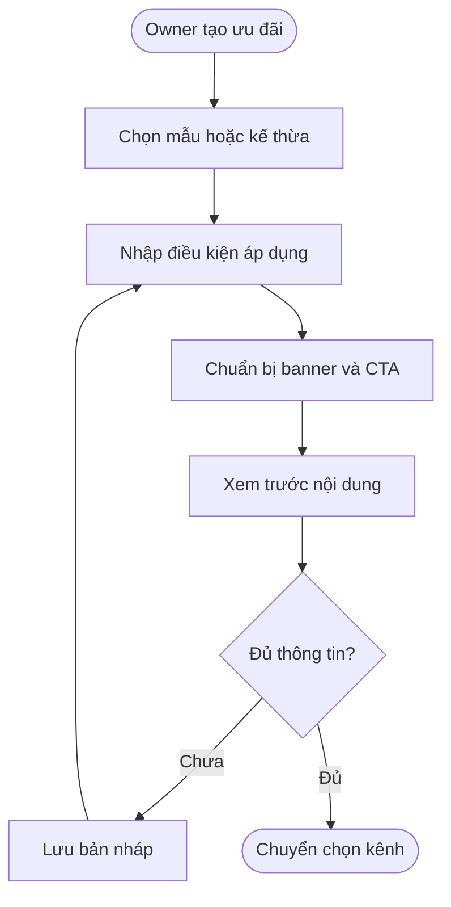

**Quy tắc chuyển tiếp từ POS:** không tự đổi phạm vi giảm toàn bộ dịch vụ của Promotion cũ, tự thêm ngày hết hạn hoặc tự bật Public khi nâng cấp. Ưu đãi cũ tiếp tục vận hành theo cấu hình hiện có đến khi Owner chủ động cập nhật. Đơn hàng đã dùng giữ nội dung/mức giảm được ghi nhận tại thời điểm áp dụng.

**Creative:** staging đang công bố PNG/JPG/WebP, tối đa 8 MB và 8 banner; 8 theme, mỗi theme chỉ dùng một lần. Đã quan sát vô hiệu hóa theme đã dùng và thử đổi thứ tự banner; chưa thử upload hoặc giới hạn thực tế. Giới hạn production, kích thước ảnh và khả năng video cần xác nhận theo cấu hình triển khai. Upload xong không đồng nghĩa creative đã được duyệt. Bản in/link tồn tại ngoài hệ thống phải mở trang báo hết hạn/gỡ khi nội dung không còn dùng được.

**Hướng dẫn và AI Creative Kit theo PO:**

- Bắt đầu bằng mục tiêu: lấp giờ vắng, thu hút khách mới, quảng bá dịch vụ, rebook, gift card hoặc mùa vụ. Gợi ý lịch, mức ưu đãi, kênh và audience phải thể hiện là đề xuất; Owner sửa và xác nhận.
- Tìm template theo ngành/dịch vụ/mục tiêu; điền điều kiện, lịch, prompt AI và thiết lập tracking gợi ý. Gift card campaign dẫn tới luồng gift card hiện có, không bổ sung bán voucher trả trước trong tài liệu này.
- AI Banner Generator kế thừa hướng trải nghiệm AI Ads của VLinkPay: chọn mục tiêu, style, format, prompt và chữ trên ảnh; Improve prompt, Generate options, dùng làm cover, thêm banner, export và quản lý ảnh đã tạo. “3 options” là thiết kế mẫu, hạn mức/chi phí và khả năng tích hợp cần chốt.
- Owner kiểm tra giá, điều kiện, chữ trên ảnh và crop từng format trước khi dùng. AI không tự sửa mức giảm đã lưu hoặc tự gửi duyệt/đăng bài. Lỗi tạo ảnh giữ lại bản đang chỉnh và cho dùng upload/template.
- Bộ xuất gồm promotion banner, square social, story, landscape ad, poster, QR, caption, SMS và email. Format Story/Reel không tự khẳng định hỗ trợ tạo video. Thay cover/nội dung phải làm rõ tài sản nào cần xuất lại.

#### Luồng 2: Chọn kênh, kiểm duyệt và xuất bản

**Kế thừa staging:** đã có lựa chọn POS checkout, OneQR hero và gửi Public lên Search Deals. Cần xác minh lưu, vòng duyệt và hiển thị thực tế; bổ sung quản lý trạng thái/phiên bản và kết nối Paid Boost nếu chưa có.

**Người thực hiện chính:** Business Owner; Admin kiểm duyệt.  
**Điểm bắt đầu:** Owner chuẩn bị công bố một phiên bản Promotion.  
**Kết quả:** Nội dung xuất hiện đúng kênh, đúng thời điểm và đúng trạng thái phê duyệt.

**Nhu cầu người dùng:**

- **Là** Owner, **tôi muốn** chọn riêng kênh nội bộ và mạng Nexora **để** biết khách sẽ thấy chương trình ở đâu.
- **Là** Owner, **tôi muốn** biết lý do bị từ chối và gửi lại bản sửa **để** hoàn thành xuất bản.
- **Là** Admin, **tôi muốn** duyệt đúng phiên bản và ghi lý do xử lý **để** nội dung thay đổi sau đó không kế thừa nhầm phê duyệt.

| Bước | Người thực hiện | Hành động | Phản hồi hệ thống | Ghi chú |
| :--- | :--- | :--- | :--- | :--- |
| 1 | Owner | Chọn Internal và/hoặc Public. | Các lựa chọn có thể cùng tồn tại. Áp dụng giảm tại POS là lựa chọn riêng; bật Public không tự áp dụng giảm tại quầy. | — |
| 2 | Hệ thống | Hiển thị vị trí và hệ quả phí. | Internal không có phí mạng; Public không đảm bảo lượt tiếp cận và click organic không tính CPC. Performance fee chỉ có khi được chấp thuận riêng. | — |
| 3 | Owner | Xác nhận nội dung, điều kiện, lịch và đích đến. | Lưu phiên bản gửi duyệt; báo lỗi nếu thiếu dữ liệu hoặc đích không hợp lệ. | — |
| 4 | Hệ thống/Admin | Xét quyền và kiểm duyệt Public. | Pending, approved hoặc rejected có lý do. Kiểm tra tự động có thể hỗ trợ; cơ chế duyệt cụ thể cần cấu hình, không mặc định đã có AI duyệt. | — |
| 5 | Hệ thống | Kiểm tra lịch và trạng thái trước khi hiển thị. | Duyệt sớm thì chờ ngày hiệu lực; đã hết hạn không tự hiển thị dù vừa được duyệt. Internal được xuất bản theo điều kiện kênh nội bộ, không phụ thuộc việc Public đang chờ duyệt. | — |
| 6 | Owner | Sửa nội dung đã xuất bản hoặc tắt một kênh. | Bản sửa Public cần phê duyệt phù hợp. Tắt Public ngừng phân phối Paid Boost liên quan; không tự tắt Internal/POS. | — |
| 7 | Admin/Hệ thống | Gỡ vi phạm hoặc xử lý hết hiệu lực. | Ngừng phân phối nội dung không còn hợp lệ, báo lý do và tác động lên campaign. Giữ lịch sử và xử lý booking đã xác nhận theo quy tắc riêng. | — |

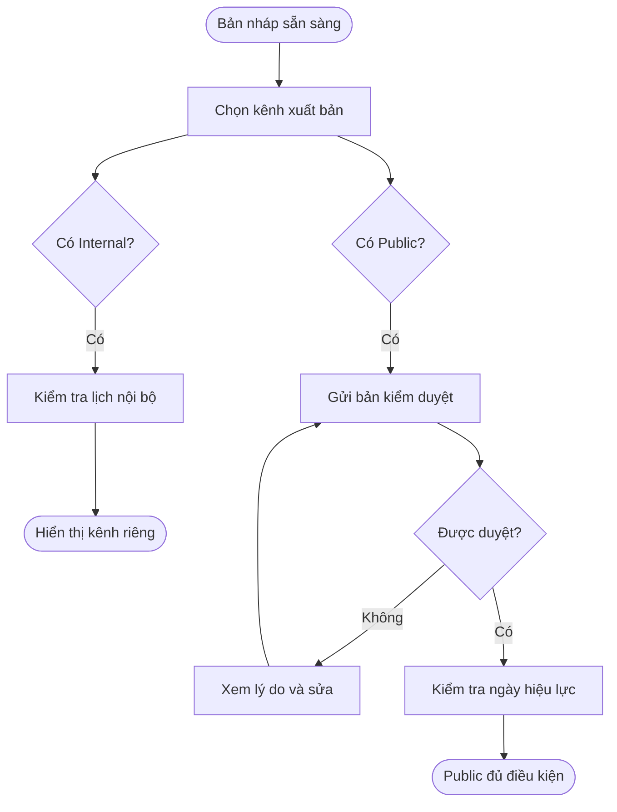

**Đề xuất xử lý phiên bản:** khi sửa nội dung Public đã chạy, giữ bản đã duyệt nếu vẫn hợp lệ và Owner chưa gỡ; bản mới chỉ thay thế sau duyệt. Thay đổi làm bản cũ không còn đúng — giá, dịch vụ không còn cung cấp, điều kiện áp dụng — phải dừng phân phối bản cũ cho khách mới. Chính sách quyền lợi booking đã xác nhận được chốt tại mục Quy tắc nghiệp vụ, không âm thầm đổi theo nội dung mới.

**Danh mục nơi hiển thị theo PO:**

| Nhóm | Kênh / vị trí | Điều kiện và ranh giới |
| :--- | :--- | :--- |
| Kênh của tiệm | OneQR hero/Promotion module, booking page theo dịch vụ phù hợp, QR self check-in, POS checkout | POS là nơi áp dụng; các vị trí khác là hiển thị. Không tự suy ra lượt xem/nhấp có phí. |
| Discovery | Discover Deals Nearby, Search Deals, public deal detail page | Duyệt Public theo phiên bản; lọc ngành, vị trí, từ khóa và đối thủ. Deal page có banner, điều kiện, thông tin tiệm và CTA Book Now/Call/Show Coupon; Directions là hành động phụ khi có địa chỉ hợp lệ. |
| Hệ sinh thái mở rộng | Merchant ATM app, Mobile ATM app, CryptoMap360 | Chỉ mở khi có tích hợp phân phối/tracking và chính sách tương ứng; trạng thái chưa kết nối không được hiển thị như đã chạy. |
| Chia sẻ bên ngoài | Facebook/Instagram, Google Business Profile, Meta/Google Ads, agency | Bản đầu chuẩn bị asset, caption và tracked URL theo Luồng 7. Nexora duyệt nội dung không thay việc nền tảng bên ngoài duyệt tài khoản/quảng cáo. |
| Tìm kiếm AI | ChatGPT / AI search | Chuẩn bị metadata có cấu trúc cho deal public; không coi là placement quảng cáo đã mua, không bảo đảm index hoặc thứ hạng. |
| Partner/receipt | OneQR đối tác, SMS receipt, printed receipt coupon, checkout thank-you, digital receipt, Discover Nearby exchange | Theo Luồng 9, duyệt đối tác/placement và tách rõ người cung cấp ưu đãi. |

Select all / Select Nexora channels / Select social/ads chỉ chọn đích khả dụng, không bỏ qua trạng thái chưa tích hợp, quyền hoặc phí. Auto-create chuẩn bị nội dung/đích gợi ý; Owner review trước Submit for approval. Theo dõi kết quả riêng từng đích: một đích bị từ chối/lỗi không được báo toàn bộ đã xuất bản; đích được duyệt chỉ chạy khi đủ điều kiện riêng. Gỡ nội dung không còn hợp lệ phải áp dụng cho mọi đích đang phân phối và public link; bản xuất bên ngoài không thể tự thu hồi.

#### Luồng 3: Thiết lập, chạy và quản lý Paid Boost

**Người thực hiện chính:** Business Owner.  
**Điểm bắt đầu:** Chọn quảng bá trả phí cho Promotion Public.  
**Kết quả:** Campaign chỉ phân phối khi được duyệt, đúng lịch, đúng quyền và đủ ngân sách.

**Nhu cầu người dùng:**

- **Là** Owner, **tôi muốn** chọn mục tiêu, vị trí, đối tượng và hạn mức trước khi đồng ý chi phí **để** kiểm soát chiến dịch.
- **Là** Owner, **tôi muốn** được hướng dẫn hoàn thiện hồ sơ hoặc nạp credit rồi quay lại bản đang làm, **để** tiếp tục thiết lập mà không mất cấu hình.
- **Là** Owner, **tôi muốn** tự dừng quảng cáo và biết nguyên nhân hệ thống dừng **để** tránh phát sinh phân phối ngoài ý muốn.

| Bước | Người thực hiện | Hành động | Phản hồi hệ thống | Ghi chú |
| :--- | :--- | :--- | :--- | :--- |
| 1 | Owner | Chọn Promotion và tạo campaign. | Cho chuẩn bị nháp; nêu rõ Public phải được duyệt trước khi chạy Paid Boost. Chưa có Public thì hướng dẫn gửi duyệt, không tự bật. | — |
| 2 | Hệ thống | Kiểm tra quyền, KYB và điều kiện advertiser. | Hiển thị điều kiện còn thiếu và liên kết KYB hiện có. Không tạo quy trình xác minh thứ hai. KYB được duyệt không tự đồng nghĩa được chạy mọi ngành/quảng cáo. | — |
| 3 | Owner | Chọn mục tiêu traffic, lead hoặc booking/dịch vụ hoàn tất. | Mục tiêu chỉ khả dụng khi có cách đo và xác minh. Chưa có ghi nhận giao dịch thì không quảng cáo khả năng đo doanh thu thật. | — |
| 4 | Owner | Chọn khu vực, ngành/đối tượng và placement. | Chỉ cho chọn khả năng đang hỗ trợ; báo phạm vi phân phối, bộ lọc đối thủ và nhãn Sponsored. Không cho truy cập/xuất danh sách khách mạng thô. | — |
| 5 | Owner | Chọn creative và CTA cho nhóm quảng cáo. | Preview theo placement; kiểm tra đích còn hoạt động, cùng Promotion/chi nhánh và phù hợp nội dung. | — |
| 6 | Owner | Chọn lịch, mô hình, ngân sách ngày/tổng và giới hạn giá nếu có. | Lịch campaign nằm trong khoảng ưu đãi hợp lệ. Ngân sách và đơn giá là thông tin riêng; không nhầm mức giảm cho khách với phí quảng cáo. | — |
| 7 | Owner | Chọn Ads Credit, xem điều kiện và xác nhận. | Dùng phần chọn nguồn của ticket Ads Credit. Hiển thị hoạt động bị tính phí, căn cứ/giá, tổng hạn mức, quy tắc điều chỉnh và thông tin phân bổ áp dụng; lưu chấp thuận theo phiên bản. Không tự thu toàn bộ ngân sách. | — |
| 8 | Admin/Hệ thống | Duyệt campaign và creative. | Public được duyệt chưa có nghĩa Paid Boost đã được duyệt. Thiếu điều kiện thì giữ trạng thái phù hợp, không chạy sớm. | — |
| 9 | Hệ thống | Kiểm tra điều kiện khi tới lịch và trước phân phối. | Chỉ chạy khi mọi điều kiện đồng thời đạt. Nhiều campaign dùng cùng credit phải được kiểm soát tập trung. | — |
| 10 | Owner/Hệ thống | Tạm dừng, thay cấu hình hoặc kết thúc. | Nêu tác động trước xác nhận. Đổi creative, đối tượng hoặc điều kiện phí có thể cần duyệt/chấp thuận lại; không tính lại lịch sử theo cấu hình mới. | — |
| 11 | Hệ thống | Đánh giá chạy lại sau khi có credit. | Chỉ tự chạy lại campaign dừng vì thiếu credit, còn lịch, còn ngân sách và còn phê duyệt. Không tự bật campaign Owner đã dừng, đã kết thúc hoặc bị hạn chế. | — |

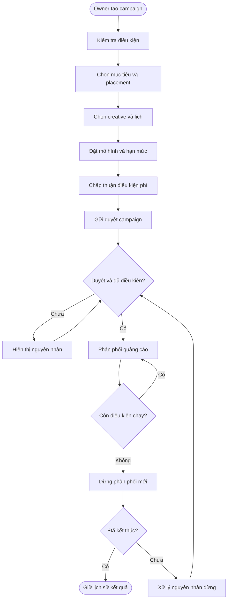

**Chính sách ngân sách:** dừng phân phối trả phí và tạo nghĩa vụ mới khi hết hạn mức hoặc credit khả dụng. Phần đã giữ hợp lệ vẫn được quyết toán/giải phóng theo chính sách tại thời điểm phát sinh. Dừng campaign không tự hoàn toàn bộ chi phí đã ghi nhận; tiền chưa dùng tiếp tục là Ads Credit. Không có auto top-up theo tài liệu Ads Credit.

**Nhóm khách gợi ý theo PO:** hỗ trợ “Let Nexora choose” dựa trên dịch vụ, lịch sử ghé theo quyền, vị trí và nhu cầu tìm kiếm; ví dụ khách chưa quay lại hoặc quan tâm một dịch vụ. Hiển thị căn cứ gợi ý, reach ước tính, nguồn dữ liệu và thời điểm cập nhật; các số ngày, bán kính, reach trong HTML chỉ là mẫu. Owner kiểm tra trước khi áp dụng. CRM outreach theo Luồng 8; audience mạng không biến thành danh sách liên hệ của tiệm.

**Cấu trúc đề xuất:** Campaign → nhóm theo đối tượng/placement → creative. Bản đầu có thể tạo sẵn một nhóm để Owner thao tác đơn giản; phải chốt quan hệ một/nhiều Promotion và cách phân bổ ngân sách nhóm trước triển khai. Không mặc định phải có đấu giá, tối ưu tự động hoặc A/B testing ngay từ đầu.

#### Luồng 4: Khách xem quảng cáo và sử dụng ưu đãi

**Người thực hiện chính:** Khách hàng.  
**Điểm bắt đầu:** Mở Promotion từ OneQR, trang doanh nghiệp, Discovery, tracked link/QR chia sẻ, CRM hoặc kênh đối tác.  
**Kết quả:** Khách biết điều kiện, thực hiện CTA đúng đích và nhận xác nhận quyền lợi trước khi sử dụng.

**Nhu cầu người dùng:**

- **Là** khách, **tôi muốn** xem giá, dịch vụ và điều kiện đầy đủ trước khi đặt lịch **để** biết mình có được hưởng ưu đãi không.
- **Là** khách, **tôi muốn** giữ lựa chọn khi đăng nhập hoặc cung cấp thông tin **để** không phải tìm lại chương trình.
- **Là** khách, **tôi muốn** được báo rõ khi ưu đãi hết hạn hoặc không còn chỗ **để** không xác nhận với kỳ vọng sai.

| Bước | Người thực hiện | Hành động | Phản hồi hệ thống | Ghi chú |
| :--- | :--- | :--- | :--- | :--- |
| 1 | Hệ thống | Nhận nguồn truy cập và chọn nội dung. | Discovery áp dụng bộ lọc ngành/đối thủ cho phiên OneQR. Không có nội dung phù hợp thì không chèn đối thủ để lấp chỗ. | — |
| 2 | Khách | Xem card/banner hoặc mở chi tiết. | Có nhãn Sponsored khi trả phí. Hiển thị đúng doanh nghiệp/chi nhánh, điều kiện, thời hạn và giá; impression không tự là click tính phí. | — |
| 3 | Khách | Bấm CTA đặt lịch/để lại thông tin. | Giữ Promotion, phiên bản, campaign, placement và nguồn hợp lệ; khách chỉ xem không bắt đăng nhập không cần thiết. | — |
| 4 | Khách | Chọn dịch vụ, thợ, ngày giờ hoặc nhập thông tin lead. | Kiểm tra lịch trống và điều kiện ưu đãi bằng dữ liệu hệ thống; không tự coi việc bấm quảng cáo là quyền được giảm giá. | — |
| 5 | Hệ thống | Hiển thị tóm tắt trước xác nhận. | Nêu giá/quyền lợi xác nhận được và phần chưa gồm. Nếu cần báo giá tại tiệm, phải nói rõ; không hiển thị giá cuối giả định. | — |
| 6 | Khách/Hệ thống | Xác nhận booking hoặc gửi lead. | Ghi nguồn đúng một lần; booking giữ thông tin ưu đãi đã được xác nhận. Lưu consent liên hệ theo mục đích, không tự đăng ký marketing từ một click. | — |
| 7 | POS/Hệ thống | Khách đến sử dụng và thanh toán. | Kiểm tra điều kiện cuối cùng, mức giảm và kết quả thực tế; chuyển bằng chứng đủ điều kiện sang xử lý chi phí nếu campaign có mô hình tương ứng. | — |

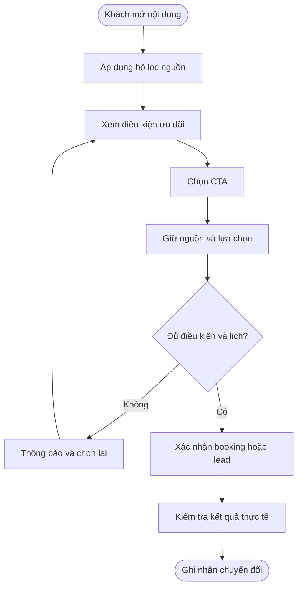

**Điểm tích hợp bắt buộc:** quay lại OneQR không mất nguồn; đăng nhập/đăng xuất không làm mất chính sách bảo vệ; quét QR khác sau khi booking đã khóa nguồn không thay nguồn giao dịch cũ. Quy tắc chọn nguồn trước lúc khóa và thời hạn ghi nhận phải được chốt chung với tracking, không để mỗi màn hình tự quyết định.

#### Luồng 5: Xác minh hoạt động, ghi chi phí và điều chỉnh

**Người thực hiện chính:** Hệ thống quảng cáo và các hệ thống xác nhận hoạt động.  
**Điểm bắt đầu:** Có click, lead, chuyển đổi hoặc kết quả phân phối theo campaign.  
**Kết quả:** Chi phí có căn cứ, không trùng, không vượt nghĩa vụ được cho phép và truy được lịch sử điều chỉnh.

**Nhu cầu người dùng:**

- **Là** Owner, **tôi muốn** mỗi khoản phí có loại hoạt động, campaign và căn cứ tính **để** kiểm tra chi phí.
- **Là** Owner, **tôi muốn** hoạt động trùng, bot hoặc không đủ điều kiện bị loại **để** không trả tiền sai.
- **Là** vận hành, **tôi muốn** điều chỉnh bằng bản ghi liên kết khoản gốc **để** xử lý sai sót mà không mất lịch sử.

| Bước | Người thực hiện | Hành động | Phản hồi hệ thống | Ghi chú |
| :--- | :--- | :--- | :--- | :--- |
| 1 | Tracking | Ghi nhận tương tác và ngữ cảnh. | Nối campaign, creative, placement, nguồn QR/khách nếu được phép và thời điểm. Một lần mở menu Discovery không trở thành click quảng cáo. | — |
| 2 | Hệ thống | Xét mô hình, tính hợp lệ, trùng lặp và quyền phân phối. | Phân loại đủ điều kiện, chờ xác minh hoặc bị loại; lưu lý do. Click tự tạo, bot, refresh và thao tác lặp không được tự cộng phí. | — |
| 3 | Hệ thống | 💰 Với nghĩa vụ cần chờ booking/order, giữ ngân sách theo chính sách. | Giữ phần nghĩa vụ trong giới hạn; chưa gọi là chi phí đã tiêu. Hủy/no-show/hết hạn giải phóng phần giữ nếu không còn nghĩa vụ hợp lệ. | — |
| 4 | Ads Credit | 💰 Ghi chi phí sau khi điều kiện được xác nhận. | Ghi một lần, trả trạng thái xác nhận; không phát sinh ghi nợ lần hai do retry hoặc phản hồi chậm. | — |
| 5 | Hệ thống | Chuyển sự kiện đã xác nhận sang Earnings/Sponsor. | Hai module nhận cùng tham chiếu và chính sách liên quan; quyền hưởng được xét riêng, không để FE campaign tự chia tiền. | — |
| 6 | Vận hành/Hệ thống | Xử lý refund, hoạt động không hợp lệ hoặc tranh chấp. | 💰 Ghi điều chỉnh liên kết khoản gốc khi có căn cứ; chuyển điều chỉnh sang module liên quan. Không sửa/xóa khoản gốc hoặc tự hoàn tiền mặt. | — |
| 7 | Dashboard | Cập nhật chi phí và trạng thái. | Owner xem số gốc, phần điều chỉnh và chi phí ròng; phản ánh độ trễ hoặc chờ xác minh khi chưa có kết quả. | — |

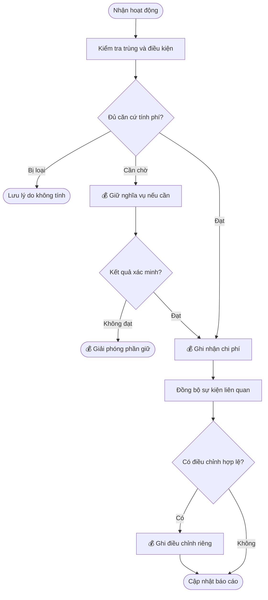

| Mô hình | Căn cứ phải công bố | Ranh giới cần giữ |
| :--- | :--- | :--- |
| CPC | Click thực vào creative/CTA hợp lệ, đơn giá, cửa sổ chống trùng và điều kiện loại. | Không thu cho mở menu, impression, organic hoặc refresh. |
| CPL | Lead hợp lệ là gì, trường bắt buộc, consent, cách loại trùng/giả và thời điểm xác minh. | Nhập form chưa gửi hoặc booking bị lỗi không tự trở thành lead có phí. Chi tiết chuẩn lead chưa được chốt. |
| CPA | Hành động cụ thể, bằng chứng, kỳ xác minh, giá/công thức và ảnh hưởng của hủy/hoàn. | Với dịch vụ: cần hoàn tất và thanh toán được xác nhận; không coi booking tạo thành công là dịch vụ đã hoàn tất. |
| Sponsored Placement | Vị trí/gói, thời gian hoặc lượng phân phối cam kết, giá và điều kiện nghiệm thu. | Không tự áp dụng CPC/CPM; chưa chốt đơn vị mua và quy tắc thiếu phân phối thì chưa đủ căn cứ bán gói đó. |

**Điều chỉnh theo loại phí:** hoàn tiền dịch vụ không mặc nhiên đảo mọi click trước đó. Đảo phí dịch vụ theo phần giá trị đủ điều kiện bị hoàn; đảo CPC khi click không hợp lệ hoặc chính sách đã chấp thuận quy định. Nếu hành trình có nhiều loại phí, chỉ thu những loại Owner đã đồng ý; không tự cộng CPC và CPA. Khi xử lý nhiều mô hình, mỗi nghĩa vụ có căn cứ riêng để tránh thu hai lần cho cùng nghĩa vụ.

#### Luồng 6: Theo dõi hiệu quả Promotion và campaign

**Người thực hiện chính:** Business Owner.  
**Điểm bắt đầu:** Mở mục **Hiệu quả** trong chi tiết Promotion tại Promotion Studio, hoặc mở Campaign Manager/chi tiết campaign.  
**Kết quả:** Owner biết ưu đãi được xem, dẫn đến booking và sử dụng tại POS như thế nào; khi có Paid Boost, đối chiếu được kết quả với chi phí để quyết định tiếp tục, sửa hoặc dừng.

**Phạm vi bổ sung:** đây là yêu cầu cho luồng mục tiêu; chưa xác nhận màn hình hiệu quả Promotion hoặc dashboard Ads đã triển khai trên staging. Promotion không chạy quảng cáo vẫn xem được hiệu quả nếu có dữ liệu ghi nhận.

**Nhu cầu người dùng:**

- **Là** Owner, **tôi muốn** xem hiệu quả từng Promotion ngay trong Promotion Studio, kể cả không chạy Ads, **để** biết ưu đãi nào được khách quan tâm và sử dụng.
- **Là** Owner, **tôi muốn** phân biệt kết quả từ OneQR của tiệm, Public tự nhiên và Paid Boost **để** biết nguồn nào mang lại khách.
- **Là** Owner, **tôi muốn** xem campaign liên quan cùng chi phí, booking và dịch vụ hoàn tất **để** đánh giá hiệu quả quảng cáo.
- **Là** Owner, **tôi muốn** phân biệt chưa có dữ liệu với số không và xem tình trạng hủy/hoàn **để** không quyết định dựa trên số liệu thiếu.
- **Là** Owner, **tôi muốn** từ báo cáo chuyển đến đúng ưu đãi hoặc campaign **để** điều chỉnh mà vẫn giữ lịch sử kết quả.

**Hai góc nhìn dùng chung dữ liệu:**

| Góc nhìn | Nội dung | Điểm liên kết |
| :--- | :--- | :--- |
| Hiệu quả Promotion | Tổng hợp một ưu đãi theo kỳ: lượt xem, lượt nhấp, booking, sử dụng tại POS, tiền giảm và doanh thu liên quan; tách nguồn Internal, Public organic và Paid. | Có danh sách campaign gắn Promotion, kết quả Paid và chi phí tương ứng; mở campaign để xem sâu hơn. Không yêu cầu tạo campaign để xem hiệu quả ưu đãi. |
| Hiệu quả campaign | Mục tiêu, trạng thái/lý do, lịch, ngân sách, chi phí, kết quả và chỉ số quảng cáo; phân tích theo placement, banner, khu vực/nguồn trong khả năng thu thập. | Mở Promotion gốc để xem hiệu quả chung; mở lịch sử Ads Credit để đối chiếu chi phí. |

| Bước | Người thực hiện | Hành động | Phản hồi hệ thống | Ghi chú |
| :--- | :--- | :--- | :--- | :--- |
| 1 | Owner | Từ Promotion Studio mở một ưu đãi → Hiệu quả; hoặc mở danh sách/chi tiết campaign. | Hiển thị đúng Promotion/campaign và business được phép xem. Promotion chưa chạy Ads vẫn có báo cáo hoạt động; phần Paid thể hiện chưa có campaign. | — |
| 2 | Owner | Chọn khoảng thời gian và nguồn. | Dùng múi giờ business; hiển thị thời điểm cập nhật và phạm vi dữ liệu. Tách Internal, Public organic, Paid và chưa xác định nguồn. Giữ kỳ lọc khi chuyển giữa Promotion và campaign. | — |
| 3 | Owner | Xem tổng quan và diễn biến của Promotion. | Hiển thị lượt xem/nhấp, booking, sử dụng tại POS, tiền giảm và doanh thu liên quan theo định nghĩa bên dưới. Booking hủy/no-show, giao dịch hoàn và dữ liệu chờ xác nhận có trạng thái riêng. | — |
| 4 | Owner | Mở kết quả theo nguồn hoặc campaign liên quan. | Chi tiết theo ngày, placement, creative và khu vực khi có dữ liệu. Phần Paid chỉ lấy kết quả được quy nguồn cho campaign, không nhận toàn bộ kết quả của Promotion làm hiệu quả Ads. | — |
| 5 | Owner | Kiểm tra booking/order hoặc hoạt động tính phí. | Hiển thị tham chiếu, thời gian, loại, trạng thái, căn cứ và lý do loại/điều chỉnh; liên kết lịch sử credit. Chỉ cho xem dữ liệu khách/giao dịch đúng quyền. | — |
| 6 | Owner | Điều chỉnh ưu đãi hoặc quảng cáo dựa trên kết quả. | Sửa nội dung/kênh Promotion theo Luồng 1–2; thay ngân sách/creative hoặc dừng campaign theo Luồng 3. Áp dụng quy tắc duyệt lại; không viết lại báo cáo lịch sử theo cấu hình mới. | — |
| 7 | Owner | Xuất báo cáo nếu chức năng được triển khai. | Giữ cùng bộ lọc, múi giờ, thời điểm cập nhật và quyền dữ liệu với màn hình. Báo cáo không thay biên nhận Ads Credit. | — |

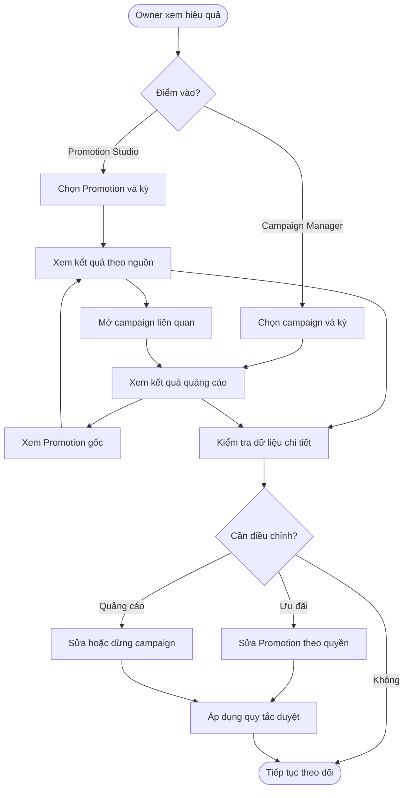

**Chỉ số và cách hiểu:**

| Nhóm | Chỉ số | Nguyên tắc ghi nhận |
| :--- | :--- | :--- |
| Tiếp cận | Lượt xem, lượt nhấp | Ghi nhận hiển thị/tương tác thực với Promotion hoặc banner/CTA theo định nghĩa tracking. Không coi mở menu OneQR là xem ưu đãi; loại preview và hoạt động thử trong Studio. Đây là lượt hoạt động, không mặc định số khách duy nhất. |
| Booking | Booking phát sinh từ Promotion | Có liên kết nguồn/Promotion đủ căn cứ; phân biệt booking đã tạo, hủy, no-show và dịch vụ hoàn tất. Khách xem quảng cáo hoặc tạo booking chưa đồng nghĩa đã sử dụng ưu đãi. |
| Sử dụng tại POS | Số lượt áp dụng ưu đãi | Mỗi hóa đơn đã thanh toán có áp dụng Promotion tính một lượt cho Promotion đó; không tăng theo số dòng dịch vụ. Hóa đơn chưa thanh toán không tính là đã sử dụng; giao dịch hủy/hoàn thể hiện riêng và giữ liên kết gốc. |
| Giá trị ưu đãi | Tổng tiền giảm | Phần giảm thực tế do Promotion tạo ra trên giao dịch đã thanh toán; tách giá trị gốc, điều chỉnh và giá trị ròng. Không cộng giảm thủ công hoặc ưu đãi khác vào Promotion đang xem. |
| Doanh thu liên quan | Doanh thu giao dịch có sử dụng Promotion | Phân biệt rõ tổng hóa đơn với phần dịch vụ áp dụng ưu đãi. Bản đầu đề xuất dùng phần dịch vụ đủ điều kiện sau giảm, loại thuế/tip và phản ánh hoàn tiền; cách phân bổ khi nhiều ưu đãi cùng áp dụng phải chốt trước triển khai. Không đồng nhất doanh thu này với doanh thu do quảng cáo mang lại. |
| Paid Boost | Chi phí, CTR, CPC bình quân, ROAS | Chi phí nối với Ads Credit, tách đã ghi nhận/đang giữ/điều chỉnh. CTR = click/hiển thị cùng phạm vi; CPC bình quân = chi phí click/click có phí. ROAS = doanh thu được quy nguồn Paid/chi phí cùng mô hình attribution; không dùng toàn bộ doanh thu Promotion làm tử số. |

**Quy tắc đối chiếu và dữ liệu thiếu:**

- Promotion và campaign dùng chung định nghĩa, dữ liệu gốc và thời điểm cập nhật. Một chuyển đổi chỉ được tính một lần trong cùng chỉ số/phạm vi, dù khách đã tương tác nhiều banner hoặc campaign. Phân bổ nguồn tuân theo chính sách attribution chung; không cộng các bảng có phạm vi chồng lặp để tạo tổng.
- POS là nơi sử dụng ưu đãi; Internal/Public/Paid là nguồn tiếp cận. Không coi đây là các kênh ngang hàng để cộng hai lần. Giao dịch tại POS không có nguồn xác định vẫn ghi nhận sử dụng Promotion nhưng xếp nguồn **Chưa xác định**, không tự gán cho Paid.
- Lượt xem/nhấp theo ngày tương tác, booking theo ngày tạo, sử dụng/doanh thu theo ngày giao dịch đã thanh toán; hiển thị rõ căn cứ thời gian. Các tổng trong một kỳ không mặc nhiên tạo thành phễu của cùng nhóm khách. ROAS cần phạm vi attribution đã thống nhất.
- Dữ liệu chưa tích hợp/chưa thu thập ghi **Chưa có dữ liệu**; đang tải hoặc lỗi có trạng thái riêng. Chỉ hiển thị **0** khi đã đo được và xác nhận không có hoạt động trong kỳ. Tỷ lệ không có mẫu số hợp lệ hiển thị **Chưa đủ dữ liệu**; không chia cho 0.
- Promotion không có campaign hiển thị **Chưa chạy quảng cáo** ở phần Paid. Không yêu cầu nạp credit để xem kết quả Internal/Public/POS đã có.
- Doanh thu có nguồn giới thiệu không đồng nghĩa doanh thu tăng thêm hoặc lợi nhuận. ROAS không phải ROI; chỉ hiển thị ROI khi đủ dữ liệu chi phí/lợi nhuận. Lead, booking và dịch vụ hoàn tất là các chỉ số riêng.

**Mở rộng báo cáo theo bản PO:**

| Góc phân tích | Nội dung bổ sung |
| :--- | :--- |
| Danh sách và Overview | KPI Views, Clicks/Scans, Redeems, Revenue theo cùng kỳ; so sánh ưu đãi, sắp xếp theo kết quả. Click và scan có loại sự kiện riêng để không cộng hai lần một lần mở QR. |
| Theo kênh | OneQR, Discover Nearby, Search Deals, booking, self check-in, social, SMS/email/push, QR poster, ATM apps/CryptoMap360, receipt và partner. Mỗi kênh có lượt xem/nhấp/booking/sử dụng/doanh thu khi có bằng chứng. Kênh xuất/copy chưa tích hợp không có số impressions giả. |
| Theo audience | Phân biệt reach ước tính, người đủ điều kiện nhận, gửi thành công, tương tác và chuyển đổi. Segment chồng lặp không được cộng thành tổng khách duy nhất. |
| Search Deals | Từ khóa tìm kiếm, vị trí trung bình, CTR và doanh thu được quy nguồn theo từ khóa khi hệ thống Search cung cấp dữ liệu. Vị trí này là trong Search Deals, không phải thứ hạng Google/AI search. |
| Hành động trên deal | Detail view, Book Now, Call, Directions, Show Coupon và xác nhận dùng ưu đãi. Bấm Call không xác nhận đã có cuộc gọi; mở coupon không xác nhận đã sử dụng. |
| POS redemption log | Promotion/campaign, kênh/host, mã sử dụng, khách trong quyền truy cập, hóa đơn, giá trị hóa đơn, tiền giảm, doanh thu đủ điều kiện và trạng thái hoàn/đảo. |
| Partner và settlement | Host impressions, partner clicks, cross-business redemptions, referral fee, phí Nexora, trạng thái đối soát/chi trả và vi phạm quy tắc đối thủ. Đọc trạng thái từ Earnings/Sponsor; không tự tính tỷ lệ trong màn hình Ads. |
| Coach insights | Gợi ý giữ kênh tốt, cải thiện từ khóa hoặc chạy lại ưu đãi dựa trên dữ liệu thật và kỳ rõ ràng. Ít dữ liệu thì báo chưa đủ căn cứ; gợi ý không tự tăng ngân sách hoặc bật kênh. |

Nguồn kênh (social/CRM/partner/ATM) và chế độ phân phối (Internal/Public/Paid) là hai chiều riêng. Không mặc định mọi click Facebook là paid hoặc mọi SMS là organic. Chi phí Nexora Ads, phí gửi tin và chi phí quảng cáo bên ngoài phải tách nguồn; ROAS tổng hợp chỉ có khi đủ chi phí và quy tắc attribution nhất quán. Các số KPI mẫu trong HTML không dùng làm chuẩn đối soát hoặc tiêu chí hiệu quả.

#### Luồng 7: Chuẩn bị và chia sẻ nội dung theo kênh

**Người thực hiện chính:** Owner hoặc người biên tập được cấp quyền.  
**Điểm bắt đầu:** Chọn Share trên Promotion hoặc bước Share, channels & ads trong Studio.  
**Kết quả:** Có bộ nội dung nhất quán và link/QR theo nguồn để chia sẻ, không nhầm trạng thái đã chuẩn bị với đã đăng.

**Nhu cầu người dùng:**

- **Là** Owner, **tôi muốn** xuất một bộ ảnh, caption, link và QR từ Promotion **để** chia sẻ mà không nhập lại điều kiện ở từng kênh.
- **Là** Owner, **tôi muốn** biết bộ nào đã xuất và link nào còn dùng được khi sửa/gỡ ưu đãi **để** tránh quảng bá thông tin cũ.

| Bước | Người thực hiện | Hành động | Phản hồi hệ thống | Ghi chú |
| :--- | :--- | :--- | :--- | :--- |
| 1 | Owner | Mở Share sau khi có banner; chọn Promotion/phiên bản. | Quick Actions: Download Banner, Social Sizes, QR Code, Copy Caption, Copy Link, Booking Link. Chưa lưu thì chỉ preview/tải bản nháp có cảnh báo, không tạo link live giả. | — |
| 2 | Owner | Kiểm tra public deal page, CTA, tên chiến dịch và caption. | Trang đích dùng đúng thông tin tiệm, điều kiện, thời hạn; CTA Book Now/Call Salon/Show Coupon đúng chức năng được hỗ trợ. Link booking giữ nguồn Promotion khi tích hợp cho phép. | — |
| 3 | Hệ thống | Chuẩn bị tracked link riêng cho từng kênh và QR. | Facebook, Instagram, Google Business, SMS, email, paid ads, poster có nguồn nhận diện riêng. Giữ cả Promotion, campaign khi có, placement và phiên bản; không đưa thông tin cá nhân vào URL. | — |
| 4 | Owner | Xem trước, copy từng nội dung hoặc export kit. | Xuất square/story/landscape/poster đúng banner đã chọn; SMS có nội dung ngắn, email có subject/ảnh/button URL. Báo lỗi từng tài sản, cho xuất lại mà không làm mất Promotion. | — |
| 5 | Owner/Agency | Nhận bộ nội dung để đăng hoặc thiết lập quảng cáo ngoài Nexora. | Bản đầu bàn giao/copy/export; không báo “đã đăng”, “đã chạy Ads” từ thao tác copy. Tự đăng qua kết nối Meta/Google/GBP là tích hợp sau. | — |
| 6 | Hệ thống | Nhận khách mở tracked link/QR. | Kiểm tra hiệu lực trang đích, ghi nguồn hợp lệ cho Luồng 4/6. Hết hạn/gỡ thì báo rõ; thay link không được ghi đè nguồn giao dịch đã khóa. | — |

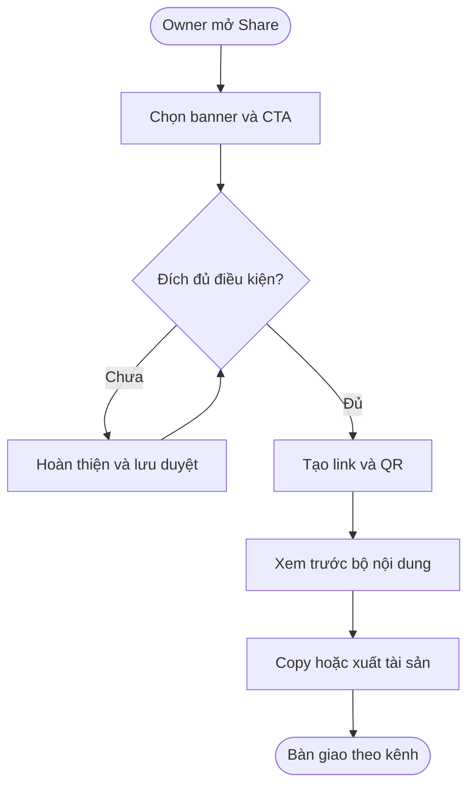

**Ranh giới Ads Credit:** chuẩn bị Meta/Google Ads không mua quảng cáo trên nền tảng đó. Chưa có quyết định Nexora thu và trả ngân sách bên ngoài qua Ads Credit; không tự gom các chi phí này vào số dư Ads Credit. Metadata cho ChatGPT/AI search chỉ mô tả nội dung public được phép, không phải lời hứa phân phối.

#### Luồng 8: Gửi ưu đãi đến nhóm khách của tiệm

**Người thực hiện chính:** Owner hoặc người có quyền gửi marketing.  
**Điểm bắt đầu:** Mở Customer outreach từ Promotion.  
**Kết quả:** Chỉ gửi phiên bản đã duyệt đến người đủ điều kiện trên từng kênh, có lịch và kết quả gửi rõ ràng.

**Nhu cầu người dùng:**

- **Là** Owner, **tôi muốn** chọn nhóm khách theo dịch vụ, lần ghé gần nhất, sinh nhật, VIP hoặc gift card **để** gửi ưu đãi phù hợp.
- **Là** Owner, **tôi muốn** kiểm tra người nhận hợp lệ, chi phí, lịch và bản gửi thử trước khi gửi hàng loạt, **để** kiểm soát nội dung gửi và loại người đã hủy nhận marketing.

| Bước | Người thực hiện | Hành động | Phản hồi hệ thống | Ghi chú |
| :--- | :--- | :--- | :--- | :--- |
| 1 | Owner | Chọn segment CRM của business hoặc gợi ý audience. | Các nhóm theo dịch vụ, chưa quay lại, sinh nhật, VIP, opt-in, gift card; hiển thị tổng khách và số đủ điều kiện riêng SMS/email/push. Không biến số khách CRM thành số đã consent. | — |
| 2 | Owner | Chọn SMS, email, SMS + email hoặc push nếu đã tích hợp. | Kiểm tra kết nối, quyền và consent theo từng kênh; loại trùng trong kênh. Audience mạng/partner không được dùng làm danh sách liên hệ tiệm. | — |
| 3 | Owner | Sửa nội dung, preview và Send test tới người nhận thử được chỉ định. | Điền biến có giá trị dự phòng, link tracking đúng nguồn, thông tin hủy nhận theo kênh. Test tách khỏi lượt gửi thật và chỉ số hiệu quả. | — |
| 4 | Owner | Refresh audience, xem ước tính chi phí/hạn mức; chọn gửi sau duyệt hoặc lịch cụ thể. | Hiển thị múi giờ tiệm, số người đủ điều kiện và nguồn thanh toán của kênh. SMS dùng luồng SMS hiện có khi đáp ứng tích hợp; không mặc định dùng Ads Credit. | — |
| 5 | Owner/Người duyệt | Submit for approval rồi duyệt đúng nội dung/audience/lịch. | Nếu từ chối thì có lý do và gửi lại bản sửa. Lịch đã trôi trong lúc chờ duyệt phải chọn lại, không gửi bù bất ngờ. | — |
| 6 | Hệ thống | Đến giờ gửi, kiểm tra lại ưu đãi, consent, hạn mức và trạng thái. | Loại khách đã hủy nhận, dừng đợt bị hủy hoặc Promotion không còn hợp lệ; gửi và ghi kết quả từng người/kênh. | — |
| 7 | Owner | Theo dõi kết quả và lỗi. | Tách accepted/sent/delivered khi kênh cung cấp, thất bại và bị loại; retry phần lỗi đủ điều kiện, không gửi lại người đã nhận. Nối tương tác/booking/sử dụng sang Luồng 6. | — |

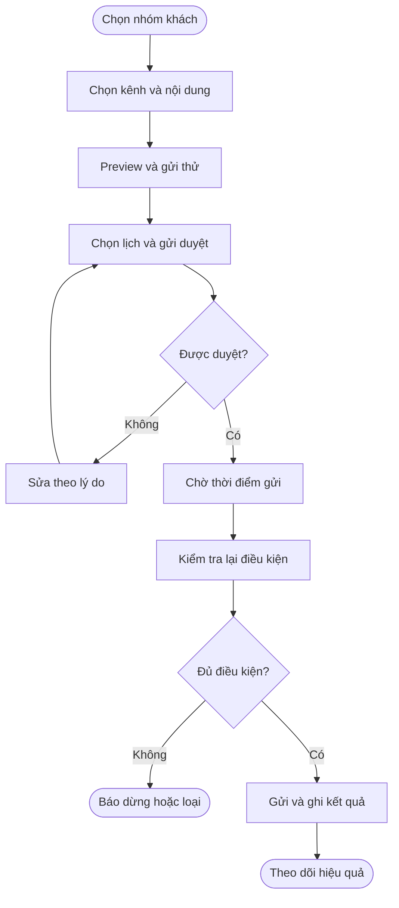

Consent center lưu lựa chọn, thời điểm và việc rút consent; hỗ trợ STOP cho SMS và hủy nhận theo từng kênh. SMS receipt có thông tin giao dịch không mặc nhiên cho phép chèn quảng cáo partner; phải xét quyền gửi marketing tương ứng. Cấu hình cụ thể và nhà cung cấp email/push cần chốt trước triển khai.

#### Luồng 9: Quảng bá chéo qua Local Partner Network

**Người thực hiện chính:** Owner của advertiser, Owner của host, khách và hệ thống xác nhận sử dụng.  
**Điểm bắt đầu:** Tiệm bật đề xuất cross-promotion và chọn đối tác/placement.  
**Kết quả:** Ưu đãi của đối tác đủ điều kiện được giới thiệu, sử dụng đúng nơi, có bằng chứng để đối soát.

**Nhu cầu người dùng:**

- **Là** Owner host, **tôi muốn** chọn ngành, bán kính, đối tác và vị trí được phép **để** chỉ giới thiệu nội dung phù hợp với tiệm.
- **Là** khách, **tôi muốn** biết nơi cung cấp ưu đãi và điều kiện sử dụng trước khi nhận mã **để** không hiểu nhầm ưu đãi dùng tại tiệm giới thiệu.
- **Là** advertiser, **tôi muốn** chỉ ghi phí/thu nhập giới thiệu từ lượt sử dụng đã xác minh **để** tránh mã trùng hoặc gian lận.

- **Là** khách, **tôi muốn** được giải thích khi mã ưu đãi không hợp lệ hoặc đã dùng, **để** không kỳ vọng nhận lại quyền lợi không còn hiệu lực.

| Bước | Người thực hiện | Hành động | Phản hồi hệ thống | Ghi chú |
| :--- | :--- | :--- | :--- | :--- |
| 1 | Owner | Chọn tắt, bật đối tác phù hợp hoặc xét từng đối tác; cấu hình ngành/bán kính/blocklist và chế độ duyệt. | Danh mục theo ngành tiệm: phù hợp, cần xem xét, đối thủ bị chặn. Các ví dụ nail salon trong HTML là cấu hình mẫu, không áp dụng cứng cho mọi ngành. | — |
| 2 | Owner | Xem đối tác tương thích, mời hoặc chấp thuận. | Invite chưa phải được phép phân phối; cần quyền/chấp thuận liên quan. Auto-approve chỉ áp dụng quan hệ đủ điều kiện, không vượt blocklist, duyệt nội dung hoặc phí. | — |
| 3 | Owner | Chọn placement và mô hình thương mại được mở. | OneQR dưới module của tiệm, SMS receipt, printed receipt coupon, thank-you screen, digital receipt, Nearby exchange. Hiển thị giới hạn, điều kiện phí và quyền trước xác nhận. | — |
| 4 | Hệ thống | Duyệt và phân phối nội dung còn hiệu lực. | Giữ bộ lọc không cạnh tranh, hạn mức chi và lượt dùng; trên receipt tách coupon quay lại của tiệm với coupon đối tác. Không sửa thông tin thanh toán gốc. | — |
| 5 | Khách | Mở/scan ưu đãi và xem điều kiện. | Nêu advertiser là nơi cung cấp và nơi sử dụng; host chỉ giới thiệu. Cấp/tra token gắn Promotion, advertiser, host, placement, khách/phiên khi được phép; token không tự là bằng chứng đã dùng. | — |
| 6 | Advertiser/Hệ thống | Xác thực token tại Nexora POS hoặc redeem portal được hỗ trợ. | Kiểm tra doanh nghiệp, hạn, điều kiện, giới hạn và đã dùng; xác nhận một lần, xử lý đồng thời không dùng trùng. Không chấp nhận chỉ dựa vào UTM do khách sửa. | — |
| 7 | Hệ thống | Ghi nhận sử dụng và giao dịch đủ điều kiện. | Lưu bằng chứng và nối Luồng 5 để 💰 ghi phí hợp lệ, chuyển sự kiện sang Earnings/Sponsor; lưu doanh thu, tiền giảm, phí giới thiệu, phí Nexora và trạng thái đối soát. | — |
| 8 | Owner/Vận hành | Xem kết quả hoặc hoàn/hủy giao dịch. | Dùng Luồng 6 và quy tắc điều chỉnh; không xóa lịch sử gốc hoặc tự trả lại quyền dùng token nếu chưa có chính sách. | — |

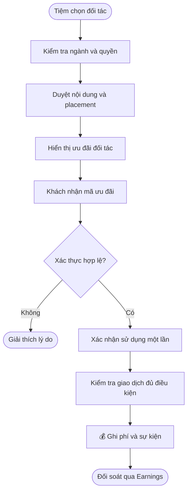

**Điểm thương mại chưa chốt:** Monthly add-on, Credit exchange, Pay per click và Pay per redemption là các phương án riêng; không cộng chồng mặc định. Credit exchange cần định nghĩa loại credit/quyền trao đổi; Ads Credit hiện tại không chuyển nhượng hoặc rút. Mẫu $100, 30%/70%, $2/lượt dùng, $0.75/$1.25 và 7–14 ngày chỉ để minh họa; tỷ lệ và kỳ đối soát thực tế theo Earnings/Sponsor được duyệt. Ngân sách đặt không phải số đã thu để chia ngay.

#### Luồng 10: Lập lịch, tự động hóa và chạy lại ưu đãi

**Người thực hiện chính:** Owner; Agency/Manager được phân quyền chuẩn bị.  
**Điểm bắt đầu:** Mở Strategy để lên kế hoạch mùa vụ, giờ vắng hoặc chạy lại chương trình hiệu quả.  
**Kết quả:** Có kế hoạch/bản nháp có thể duyệt và vận hành trong lịch, quyền và ngân sách đã xác nhận.

**Nhu cầu người dùng:**

- **Là** Owner, **tôi muốn** chuẩn bị nhiều ưu đãi theo mùa hoặc năm, xem lại rồi bật đúng lúc **để** giảm thao tác lặp.
- **Là** Owner, **tôi muốn** đặt quy tắc giờ vắng và giới hạn rõ ràng **để** hệ thống chỉ chạy trong phạm vi tôi chấp thuận.

- **Là** Owner, **tôi muốn** quy tắc không kích hoạt khi thiếu điều kiện hoặc khi tôi đã tắt, **để** tránh chạy ưu đãi ngoài phạm vi được chấp thuận.

| Bước | Người thực hiện | Hành động | Phản hồi hệ thống | Ghi chú |
| :--- | :--- | :--- | :--- | :--- |
| 1 | Owner/Agency | Chọn lịch mùa vụ, slow-hour playbook hoặc ưu đãi có kết quả tốt. | Gợi ý dựa trên dữ liệu thật; AI/Auto-create tạo đề xuất/bản nháp, không tự xuất bản hàng loạt. | — |
| 2 | Owner/Agency | Tạo batch và chỉnh ngày, ưu đãi, banner, audience, kênh. | Mỗi Promotion/campaign có định danh/trạng thái riêng; lỗi một bản không báo cả batch thành công. Tạo mới mặc định chưa bật. | — |
| 3 | Owner | Thiết lập quy tắc giờ vắng nếu cần. | Chọn tiêu chí thiếu booking/slot, thời gian đánh giá, ngưỡng, lịch, giới hạn tần suất, ngân sách/ngày, SMS cap, redemption cap và partner spend cap liên quan. Ngưỡng và nguồn dữ liệu phải chốt. | — |
| 4 | Owner/Người duyệt | Xem lại và duyệt/kích hoạt từng bản hoặc quy tắc. | Agency/Staff không tự được quyền chi tiền. Nội dung Public, Paid, partner và receipt giữ điều kiện duyệt riêng. | — |
| 5 | Hệ thống | Đến lịch hoặc thỏa điều kiện tự động. | Kiểm tra dữ liệu còn mới, phiên bản duyệt, quyền, consent, nguồn tiền và hạn mức; không đủ thì báo lý do, không tạo nhiều lượt chạy trùng. | — |
| 6 | Owner | Xem kết quả, tắt quy tắc hoặc chọn Run again. | Tắt quy tắc chặn lần kích hoạt mới; việc dừng campaign đang chạy là thao tác rõ ràng riêng. Run again tạo bản/lần chạy mới với ngày, banner, ngân sách và phê duyệt được kiểm tra lại; giữ lịch sử cũ. | — |

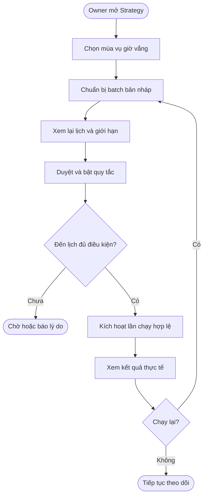

Chạy theo quy tắc do Owner xác nhận khác với tự nạp tiền, tự tăng ngân sách hoặc tự đấu giá. Các hành vi sau chưa nằm trong quyết định hiện tại. Trạng thái Promotion/campaign tiếp tục dùng vòng đời bên dưới, không tạo trạng thái tài chính riêng cho Strategy.

### Cấu hình và quản trị

- **Là** Admin, **tôi muốn** quản lý mô hình tính phí, giá và thời điểm hiệu lực **để** giải thích được từng khoản phát sinh.
- **Là** Admin, **tôi muốn** duyệt nội dung và xử lý khiếu nại với lịch sử thao tác **để** kiểm tra được người thực hiện và lý do.
- **Là** Admin, **tôi muốn** ngừng phân phối một campaign vi phạm mà vẫn giữ dữ liệu quyết toán **để** không mất nghĩa vụ đã phát sinh.

| Nhóm cấu hình | Nội dung cần quản lý |
| :--- | :--- |
| Nội dung và template | Mẫu theo mục tiêu, trường bắt buộc, điều kiện hỗ trợ, định dạng/kích thước banner, giới hạn upload, CTA/đích cho phép. |
| Placement và đối tượng | Vị trí được mở, phạm vi khu vực/ngành, giới hạn tần suất và khả năng audience; tích hợp bộ lọc Discovery. |
| Advertiser và quyền | Điều kiện hồ sơ, ngành hạn chế, quyền biên tập/duyệt/chạy/xem dữ liệu, thời điểm yêu cầu xác minh lại. |
| Kiểm duyệt | Tiêu chí, lý do từ chối, quyền duyệt, thay đổi cần duyệt lại và xử lý nội dung đang chạy. Thời gian duyệt không tự cam kết từ prototype. |
| Giá và ngân sách | Mô hình, đơn vị giá, trần/ngưỡng, ngày hiệu lực, phạm vi campaign, làm tròn và xử lý nghĩa vụ giữ chỗ. |
| Tracking và chất lượng | Định nghĩa click/lead/conversion, cửa sổ chống trùng, nguồn thắng, thời hạn attribution, tiêu chí fraud và trạng thái chờ xác minh. |
| Chia sẻ và kết nối | Format ảnh, public deal/QR/tracked URL, CTA, metadata, trạng thái kết nối và quyền agency; không lưu trạng thái copy thành đã đăng. |
| Outreach và consent | Segment theo business, consent từng kênh, STOP/hủy nhận, lịch/múi giờ, gửi thử, hạn mức, nguồn thanh toán và kết quả từng người nhận. |
| Partner Network | Ngành được phép/cần duyệt/bị chặn, bán kính, blocklist, duyệt đối tác/placement, xác thực token, hạn dùng/lượt dùng và mô hình phí đã chốt. |
| Strategy | Mẫu mùa vụ, ngưỡng giờ vắng, độ mới dữ liệu booking, điều kiện kích hoạt, giới hạn tần suất và quyền duyệt batch. |
| Vận hành | Tạm dừng bắt buộc, hỗ trợ khiếu nại, điều chỉnh phí, lịch sử thay đổi và liên kết sự kiện sang các module liên quan. |

**Các điểm cần chốt trước triển khai:**

1. Ưu đãi cho dịch vụ/gói nào được hỗ trợ bản đầu; cách xác minh khách mới/quay lại, cộng dồn và giới hạn sử dụng nếu có. Không biến nội dung template thành chức năng tự động chưa tồn tại.
2. Một campaign gắn một hay nhiều Promotion; nhóm quảng cáo có ngân sách riêng hay dùng chung; quyền Staff ngoài POS.
3. Giá, ngưỡng và thời điểm xác nhận CPL/CPA/Sponsored Placement; tiêu chuẩn hoàn thành gói vị trí; có cho kết hợp các loại phí trên cùng hành trình hay không.
4. Chi tiết review, thay đổi nào phải dừng bản cũ, quyền lợi booking đã xác nhận khi chương trình bị sửa/gỡ.
5. Cách khóa/chọn nguồn, cửa sổ attribution, nhận diện xuyên guest/login và đồng bộ bằng chứng booking/POS.
6. Hạn mức media, múi giờ báo cáo theo business, độ trễ dữ liệu và phạm vi báo cáo/xuất file bản đầu; định nghĩa lượt xem/nhấp, phân bổ tiền giảm/doanh thu khi nhiều Promotion cùng áp dụng và cách phản ánh giao dịch hoàn trong kỳ.
7. Phạm vi tích hợp từng đích ATM/CryptoMap360, quyền và dữ liệu Search Deals, metadata public; copy/export bản đầu và lịch mở direct publishing.
8. Chi phí/hạn mức AI, nguồn tiền SMS/email/push và nhà cung cấp; không gộp với Ads Credit khi chưa có quyết định.
9. Phân quyền Owner/Manager/Agency, duyệt theo đích và đối tác; phạm vi auto-approve không vượt quy tắc đối thủ.
10. Thương mại Partner Network, định nghĩa Credit exchange, thời hạn/giới hạn token, redeem portal, xử lý offline, refund và phân bổ phí; đối chiếu Earnings/Sponsor trước chốt.
11. Slow-hour rule, độ mới dữ liệu, tần suất đánh giá, chống kích hoạt lặp và tác động khi Owner tắt quy tắc.

**Mở rộng cần xác nhận giai đoạn:** A/B testing, đấu giá/tối ưu tự động, saved views, các phân tích ngoài báo cáo PO bổ sung, video và Sponsored Pin trên bản đồ. Bán voucher trả trước nằm ngoài phạm vi hiện tại. Các khả năng này không được quảng cáo là có sẵn chỉ vì prototype có mô tả.

### Vòng đời trạng thái

Trạng thái dưới đây là tên nghiệp vụ đề xuất, không phải enum/API hiện có. Tách nội dung, quyền Public và phân phối campaign; không dùng một nút Active để đại diện tất cả.

#### Phiên bản nội dung Promotion

| Trạng thái hiện tại | Sự kiện chuyển trạng thái | Trạng thái mới | Ghi chú |
| :--- | :--- | :--- | :--- |
| Nháp | Xuất bản cho ngày sau | Chờ lịch | Không phân phối trước lịch; đến lịch vẫn kiểm tra điều kiện. |
| Nháp | Xuất bản có hiệu lực | Đang hiệu lực | Chỉ có hiệu lực trên kênh được phép. |
| Chờ lịch | Đến lịch và đủ điều kiện | Đang hiệu lực | Chỉ có hiệu lực trên kênh được phép. |
| Đang hiệu lực | Owner tạm ngưng | Tạm ngưng | Giữ lịch sử và mọi lý do chặn; nạp credit không xóa các lý do khác. |
| Tạm ngưng | Bật lại còn hiệu lực | Đang hiệu lực | Chỉ có hiệu lực trên kênh được phép. |
| Tạm ngưng | Chưa đến lịch mới | Chờ lịch | Không phân phối trước lịch; đến lịch vẫn kiểm tra điều kiện. |
| Chờ lịch | Qua ngày kết thúc | Hết hạn | Không tự gia hạn khi nạp thêm credit. |
| Đang hiệu lực | Qua ngày kết thúc | Hết hạn | Không tự gia hạn khi nạp thêm credit. |
| Tạm ngưng | Qua ngày kết thúc | Hết hạn | Không tự gia hạn khi nạp thêm credit. |
| Chờ lịch | Gỡ chương trình | Đã gỡ | Xử lý quyền lợi cũ và nghĩa vụ còn lại riêng. |
| Đang hiệu lực | Gỡ chương trình | Đã gỡ | Xử lý quyền lợi cũ và nghĩa vụ còn lại riêng. |
| Tạm ngưng | Gỡ chương trình | Đã gỡ | Xử lý quyền lợi cũ và nghĩa vụ còn lại riêng. |

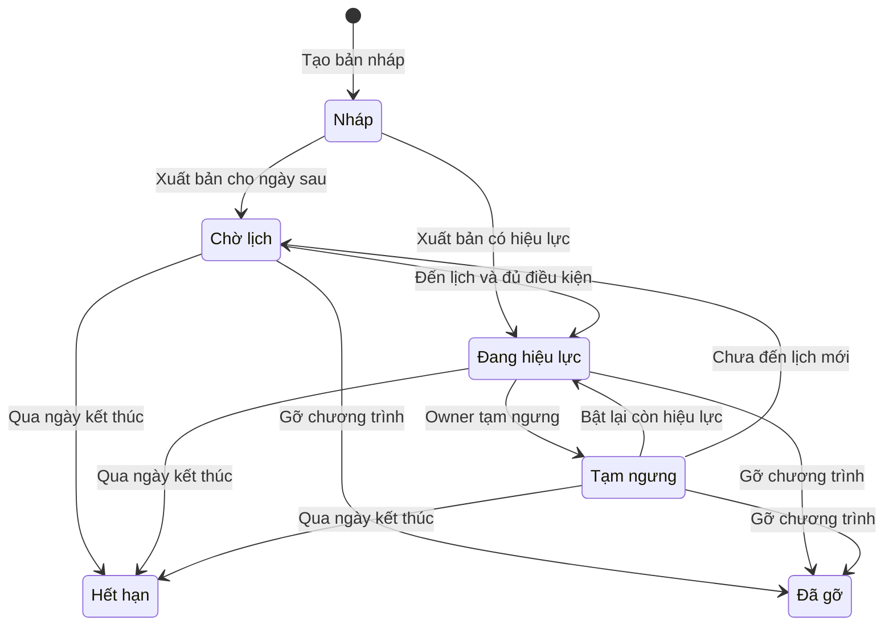

#### Phê duyệt Public theo phiên bản

| Trạng thái hiện tại | Sự kiện chuyển trạng thái | Trạng thái mới | Ghi chú |
| :--- | :--- | :--- | :--- |
| Chưa gửi | Owner gửi | Chờ duyệt | Duyệt đúng phiên bản được gửi. |
| Chờ duyệt | Admin duyệt | Được duyệt | Thay đổi cần duyệt lại có bản riêng; không âm thầm thay bản đã duyệt. |
| Chờ duyệt | Admin từ chối | Từ chối | Hiển thị lý do để Owner sửa và gửi lại. |
| Từ chối | Sửa và gửi lại | Chờ duyệt | Duyệt đúng phiên bản được gửi. |
| Được duyệt | Thu hồi quyền Public | Thu hồi | Ngừng Public và Paid Boost liên quan. |
| Thu hồi | Gửi lại nếu được phép | Chờ duyệt | Duyệt đúng phiên bản được gửi. |

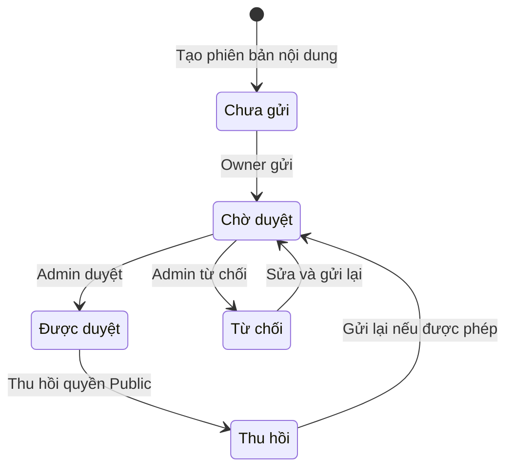

#### Campaign và khả năng phân phối

| Trạng thái hiện tại | Sự kiện chuyển trạng thái | Trạng thái mới | Ghi chú |
| :--- | :--- | :--- | :--- |
| Nháp | Gửi duyệt | Chờ duyệt | Duyệt đúng phiên bản được gửi. |
| Chờ duyệt | Không được duyệt | Bị từ chối | Hiển thị lý do để Owner sửa và gửi lại. |
| Bị từ chối | Owner sửa | Nháp | Lưu nháp không tự xuất bản hoặc chạy quảng cáo. |
| Chờ duyệt | Duyệt trước lịch | Chờ lịch | Không phân phối trước lịch; đến lịch vẫn kiểm tra điều kiện. |
| Chờ duyệt | Duyệt và đủ điều kiện | Đang chạy | Kiểm tra đồng thời quyền, nội dung, lịch, ngân sách và credit. |
| Chờ duyệt | Duyệt nhưng còn điều kiện chặn | Tạm dừng | Giữ lịch sử và mọi lý do chặn; nạp credit không xóa các lý do khác. |
| Chờ lịch | Đến lịch và đủ điều kiện | Đang chạy | Kiểm tra đồng thời quyền, nội dung, lịch, ngân sách và credit. |
| Chờ lịch | Có điều kiện chặn | Tạm dừng | Giữ lịch sử và mọi lý do chặn; nạp credit không xóa các lý do khác. |
| Đang chạy | Owner dừng hoặc bị chặn | Tạm dừng | Giữ lịch sử và mọi lý do chặn; nạp credit không xóa các lý do khác. |
| Tạm dừng | Gỡ chặn nhưng chưa đến lịch | Chờ lịch | Không phân phối trước lịch; đến lịch vẫn kiểm tra điều kiện. |
| Tạm dừng | Cho phép tiếp tục và đủ điều kiện | Đang chạy | Kiểm tra đồng thời quyền, nội dung, lịch, ngân sách và credit. |
| Tạm dừng | Thay đổi cần duyệt lại | Chờ duyệt | Duyệt đúng phiên bản được gửi. |
| Đang chạy | Hết lịch hoặc kết thúc | Kết thúc | Không phân phối mới; nghĩa vụ hợp lệ đã phát sinh tiếp tục được xử lý. |
| Chờ lịch | Hủy hoặc hết lịch | Kết thúc | Không phân phối mới; nghĩa vụ hợp lệ đã phát sinh tiếp tục được xử lý. |
| Tạm dừng | Hết lịch hoặc kết thúc | Kết thúc | Không phân phối mới; nghĩa vụ hợp lệ đã phát sinh tiếp tục được xử lý. |
| Chờ duyệt | Hủy hoặc đã hết lịch | Kết thúc | Không phân phối mới; nghĩa vụ hợp lệ đã phát sinh tiếp tục được xử lý. |

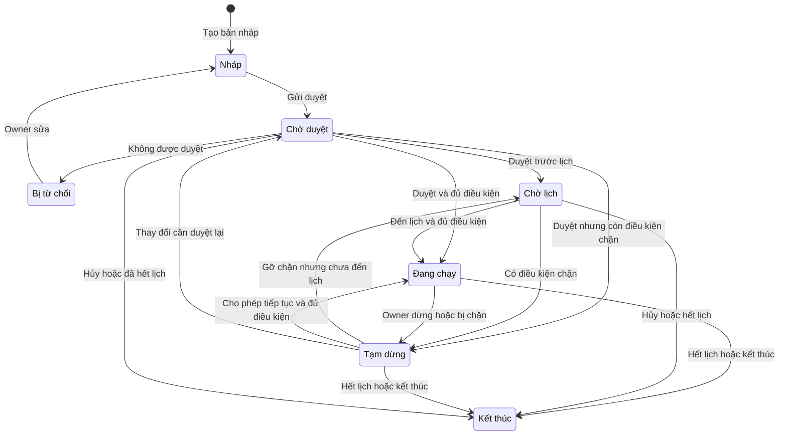

Lý do tạm dừng gồm thiếu credit, hết ngân sách ngày/tổng, mất Public, Promotion không còn hiệu lực, advertiser bị hạn chế hoặc Owner chủ động dừng. Ngân sách ngày có thể mở lại vào kỳ ngày kế tiếp nếu đủ điều kiện; hết tổng ngân sách cần Owner chấp thuận tăng, không tự tăng. Campaign đã kết thúc không tự khởi động lại; đợt quảng bá mới cần cấu hình và chấp thuận phù hợp.

Trạng thái giữ tiền/chi phí/điều chỉnh sử dụng vòng đời của Ads Credit; trạng thái thu nhập sử dụng Earnings/Sponsor. Không tạo thêm vòng đời tài chính độc lập trong Campaign Manager.

#### Đợt gửi ưu đãi cho khách

Trạng thái đề xuất cho luồng điều phối gửi ưu đãi; ánh xạ với trạng thái module gửi tin khi tích hợp, không coi đây là contract đã có. Consent và kết quả từng người nhận được quản lý riêng.

| Trạng thái hiện tại | Sự kiện chuyển trạng thái | Trạng thái mới | Ghi chú |
| :--- | :--- | :--- | :--- |
| Nháp | Gửi duyệt | Chờ duyệt | Chưa được gửi thật; nội dung, người nhận và lịch phải được xác nhận. |
| Chờ duyệt | Từ chối có lý do | Cần sửa | Hiển thị lý do từ chối. |
| Cần sửa | Sửa và gửi lại | Chờ duyệt | Chưa được gửi thật; nội dung, người nhận và lịch phải được xác nhận. |
| Chờ duyệt | Duyệt đúng phiên bản | Đã lên lịch | Bản được duyệt có nội dung, nhóm khách và lịch xác định. |
| Đã lên lịch | Không còn đủ điều kiện | Bị chặn | Báo lý do không còn đủ điều kiện. |
| Bị chặn | Chỉnh sửa và gửi lại | Chờ duyệt | Chưa được gửi thật; nội dung, người nhận và lịch phải được xác nhận. |
| Đã lên lịch | Đến lịch và đủ điều kiện | Đang gửi | Kiểm tra lại consent và hiệu lực trước gửi. |
| Đang gửi | Có kết quả đầy đủ | Hoàn tất | Lưu kết quả theo từng kênh và người nhận. |
| Đang gửi | Còn lỗi hoặc bị loại | Hoàn tất một phần | Chỉ xử lý lại phần lỗi còn đủ điều kiện; không gửi lại phần thành công. |
| Nháp | Owner hủy | Đã hủy | Ngừng gửi mới; không thu hồi được tin đã gửi. |
| Chờ duyệt | Owner hủy | Đã hủy | Ngừng gửi mới; không thu hồi được tin đã gửi. |
| Đã lên lịch | Owner hủy | Đã hủy | Ngừng gửi mới; không thu hồi được tin đã gửi. |
| Cần sửa | Owner hủy | Đã hủy | Ngừng gửi mới; không thu hồi được tin đã gửi. |
| Bị chặn | Owner hủy | Đã hủy | Ngừng gửi mới; không thu hồi được tin đã gửi. |

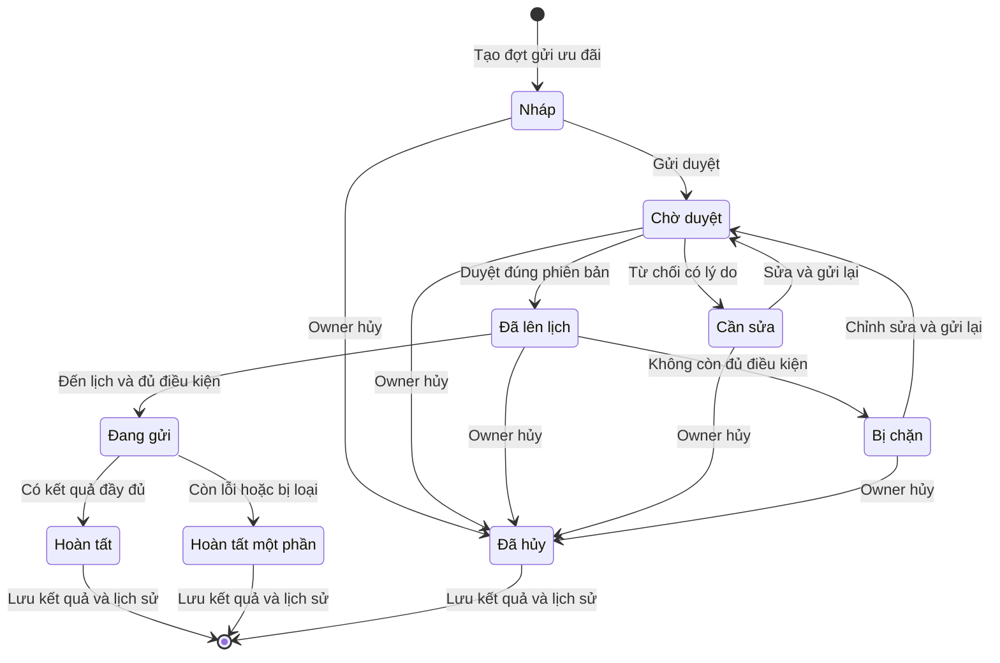

Sau khi một đợt gửi hoàn tất một phần, lần retry là đợt xử lý liên kết đợt gốc, chỉ gồm các bản lỗi còn đủ điều kiện; không xóa kết quả cũ. Khi yêu cầu dừng lúc đang gửi, chặn phần chưa gửi và lưu kết quả đã phát sinh, không báo đã thu hồi các tin đã gửi.

#### Mã sử dụng ưu đãi đối tác

| Trạng thái hiện tại | Sự kiện chuyển trạng thái | Trạng thái mới | Ghi chú |
| :--- | :--- | :--- | :--- |
| Đã cấp | Xác nhận sử dụng một lần | Đã dùng | Một mã không tạo hai lượt sử dụng; hủy/hoàn không tự đưa mã về chưa dùng. |
| Đã cấp | Đến hạn | Hết hạn | Từ chối lượt dùng mới và giải thích lý do. |
| Đã cấp | Thu hồi theo chính sách | Vô hiệu | Từ chối lượt dùng mới và giải thích lý do. |
| Đã dùng | Gắn điều chỉnh hủy hoàn | Đã dùng | Một mã không tạo hai lượt sử dụng; hủy/hoàn không tự đưa mã về chưa dùng. |

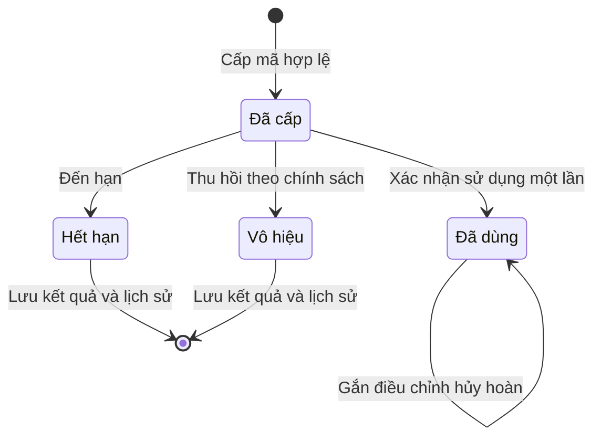

Token đã dùng không đồng nghĩa phí hoặc payout đã được xác nhận; tài chính tiếp tục tuân theo Luồng 5 và Earnings/Sponsor.

### Quy tắc nghiệp vụ

1. **Một nguồn ưu đãi:** nội dung trên POS, booking, trang doanh nghiệp và quảng cáo phải tham chiếu cùng Promotion/phiên bản phù hợp. Không nhập hai mức giảm khác nhau cho cùng cam kết.
2. **Điều kiện có thể thực hiện:** chỉ xuất bản điều kiện mà hệ thống/nhân sự có quy trình xác minh được. Các câu “khách mới”, “mua kèm”, “lần ghé tiếp theo” không tự có hiệu lực chỉ nhờ nhập mô tả.
3. **Hiệu lực theo tiệm:** ngày/giờ theo múi giờ doanh nghiệp, không phụ thuộc múi giờ thiết bị. Khi chưa có cấu hình, dùng quy ước dự phòng America/Chicago của sản phẩm và hiển thị rõ. Giữ nguyên hành vi giờ POS cũ cho dữ liệu chưa chuyển đổi.
4. **Tách quyền giảm và hiển thị:** tắt quảng cáo không tự tắt giảm tại POS. Tắt Public phải ngừng Paid Boost phụ thuộc; Internal còn hợp lệ có thể tiếp tục.
5. **Paid Boost cần Public:** có credit hoặc được KYB duyệt không thay cho duyệt Public/campaign, không bỏ qua bộ lọc đối thủ.
6. **Minh bạch giá:** tách giá dịch vụ/mức giảm cho khách với phí quảng cáo Owner trả. Hiển thị phần không bao gồm, điều kiện giá và phạm vi dịch vụ trước xác nhận.
7. **Bảo toàn booking:** đề xuất lưu nội dung, giá/quyền lợi đã xác nhận khi booking. Đổi/hủy lịch cần xét điều kiện mới và khách xác nhận thay đổi; không tự áp dụng giá hiện tại lên cam kết cũ. Trường hợp gỡ vì vi phạm cần vận hành xử lý, thông báo và quyết định quyền lợi theo chính sách đã chốt.
8. **💰 Không thu do thao tác cấu hình:** tạo nháp, bật Public, chọn ngân sách, preview hoặc mở menu không tự phát sinh phí. Chỉ ghi chi phí cho nghĩa vụ được chấp thuận và có bằng chứng hợp lệ.
9. **💰 Không vượt hạn mức:** tính cả nghĩa vụ đã giữ khi nhận thêm nghĩa vụ; kiểm tra tập trung khi nhiều campaign cùng tiêu credit. Hạ ngân sách dưới số đã tiêu/giữ phải được giải thích và xử lý trước, không xóa khoản đã phát sinh.
10. **💰 Không thu trùng:** một nghĩa vụ được ghi nhận một lần dù double-click, nhiều tab, retry hoặc callback lặp. Không thu chồng các mô hình nếu Owner chưa đồng ý rõ ràng.
11. **💰 Giải phóng không phải hoàn tiền mặt:** bỏ giữ chỗ làm tăng phần credit khả dụng theo sổ; đảo phí là điều chỉnh có căn cứ. Không suy ra quyền rút credit hoặc refund thẻ từ việc dừng campaign.
12. **Phiên bản chính sách:** lưu nội dung, đơn giá, điều kiện và chấp thuận gắn nghĩa vụ. Giá/cấu hình mới không tự tính lại hoạt động cũ. Tỷ lệ chia thu nhập theo module Earnings/Sponsor và cấu hình hiệu lực, không hardcode trong FE.
13. **Chống gian lận:** loại bot, preload, tự click, traffic lặp, hoạt động cùng chủ sở hữu không hợp lệ theo chính sách. Cửa sổ tham khảo bản 21/09 là 24 giờ cho click theo advertiser/deal; cần contract xác nhận danh tính, phạm vi và ngoại lệ trước áp dụng.
14. **Riêng tư:** advertiser chỉ xem dữ liệu khách thuộc quyền và đủ cho mục đích hợp lệ. Audience mạng không được xuất thành danh sách khách thô; xem quảng cáo không tự là consent marketing.
15. **Báo cáo đúng bản chất:** tách organic/paid, số chưa xác minh/đã xác minh, chi phí gốc/điều chỉnh/ròng. Không dùng dữ liệu mẫu khi API chưa có, không coi thiếu dữ liệu là số 0.
16. **Tương thích hiện tại:** không tự public hóa Promotion cũ; không thay đổi hóa đơn đã áp dụng; giữ chức năng POS/booking hiện có khi module Ads chưa được thiết lập.
17. **Ngôn ngữ:** UI en-US và bản dịch VI đồng nghĩa; số ít/số nhiều đúng ngữ cảnh. Ngày tháng tiếng Việt viết đầy đủ “tháng”; số tiền và lịch dùng quy ước sản phẩm.
18. **Phân phối theo đích:** duyệt từng đích/phiên bản, hiển thị trạng thái từng kênh. Chọn tất cả hoặc tạo tự động không vượt quyền, duyệt, blocklist và hạn mức.
19. **Chia sẻ có căn cứ:** chuẩn bị/xuất/copy không đồng nghĩa đăng thành công. QR/link có nguồn nhận diện nhưng không thay bằng chứng sử dụng, không chứa thông tin khách nhạy cảm.
20. **Consent và gửi tin:** quyền nhận tin theo từng kênh, kiểm tra lại khi gửi; marketing trong receipt cũng phải đủ điều kiện. Nguồn tiền gửi tin/quảng cáo ngoài Nexora không tự là Ads Credit.
21. **Đối tác:** phân biệt advertiser cung cấp ưu đãi và host giới thiệu; danh sách đối thủ chặn cả khi auto-approve. Dùng token phải xác thực hạn, doanh nghiệp, điều kiện và chống dùng trùng.
22. **Tự động hóa có giới hạn:** AI/Strategy chuẩn bị nội dung hoặc kích hoạt theo quy tắc đã xác nhận; không tự tạo consent, tăng ngân sách, nạp tiền hay bỏ qua duyệt. Run again không ghi đè lịch sử cũ.

#### Tiêu chí nghiệm thu

| # | Điều kiện nghiệm thu |
| :--- | :--- |
| 1 | Promotion POS hiện có vẫn tạo/sửa, bật/tắt và áp dụng đúng hành vi cũ; không tự thành Public hoặc Paid Boost sau nâng cấp. |
| 2 | Tạo nháp từ mẫu hoặc dữ liệu hiện có; lưu lại không mất trường/banner. Không xuất bản điều kiện áp dụng chưa được hỗ trợ. |
| 3 | Phạm vi dịch vụ, nhóm khách, khoảng ngày/thứ/giờ, mức giảm và loại trừ được kiểm tra nhất quán giữa preview, chi tiết, booking và POS. |
| 4 | Nhiều banner cùng Promotion mở đúng đích; upload lỗi có hướng xử lý; bản nháp và preview không tạo lượt tính phí. |
| 5 | Internal/Public/Paid Boost có quyền và trạng thái riêng; organic không bị gắn nhãn tài trợ hoặc thu CPC. |
| 6 | Public/campaign có gửi duyệt, từ chối có lý do, sửa/gửi lại và thu hồi; không dùng phê duyệt cũ cho nội dung mới chưa đủ điều kiện. |
| 7 | Owner thấy điều kiện advertiser còn thiếu; Staff không tự có quyền chấp thuận phí/chạy ads; quyền và dữ liệu được kiểm tra ở hệ thống. |
| 8 | Owner chọn được mô hình được hỗ trợ và thấy sự kiện, đơn giá/căn cứ, lịch, hạn mức, nguồn tiền trước xác nhận; không âm thầm đổi mô hình. |
| 9 | Campaign chỉ chạy khi đủ đồng thời Public, duyệt, hồ sơ, lịch, ngân sách và credit. Hết một nguyên nhân dừng không bỏ qua nguyên nhân khác. |
| 10 | Nạp credit chỉ tự mở lại campaign thiếu credit còn đủ điều kiện; không mở campaign Owner dừng, hết lịch hoặc hết tổng ngân sách. |
| 11 | Khách xem đầy đủ điều kiện và CTA; chuyển qua xác thực/booking giữ nguồn và lựa chọn. Booking đã khóa nguồn không bị QR khác ghi đè. |
| 12 | Discovery tiếp tục chặn đối thủ theo nguồn QR với cả quảng cáo trả phí; không có kết quả thì hiển thị trạng thái phù hợp. |
| 13 | Click/lead/conversion không hợp lệ không ghi phí; retry không tạo khoản trùng; nghĩa vụ chờ có giữ/giải phóng rõ ràng. |
| 14 | Hủy/no-show/refund toàn bộ hoặc một phần xử lý đúng mô hình; có lịch sử điều chỉnh liên kết khoản gốc và đồng bộ module liên quan. |
| 15 | Báo cáo đối chiếu được chi phí campaign với Ads Credit cùng thời điểm/phạm vi; tách chi phí đã tiêu, đang giữ và điều chỉnh. |
| 16 | Không hiển thị ROAS/ROI hoặc doanh thu giả khi thiếu bằng chứng; số liệu có kỳ, múi giờ và thời điểm cập nhật. |
| 17 | Thao tác và nội dung quan trọng dùng được trên mobile/desktop, EN/VI; thông báo lỗi, trạng thái chờ, mất mạng và không có dữ liệu rõ ràng. |
| 18 | Mở Hiệu quả từ từng Promotion trong Studio dù chưa có campaign; xem lượt xem/nhấp, booking, sử dụng tại POS, tiền giảm và doanh thu liên quan khi có dữ liệu. Không yêu cầu nạp Ads Credit để xem kết quả. |
| 19 | Tách Internal/Public organic/Paid/chưa xác định nguồn; booking và giao dịch không bị cộng trùng qua nhiều banner/campaign. POS là nơi sử dụng, không phải nguồn để cộng thêm vào tổng kênh. |
| 20 | Chuyển giữa Promotion và campaign giữ kỳ lọc và business; số liệu cùng phạm vi/thời điểm đối chiếu được, chi phí liên kết lịch sử Ads Credit. ROAS chỉ dùng doanh thu có attribution Paid. |
| 21 | Phân biệt chưa có dữ liệu, lỗi tải, số 0 và chưa chạy Ads; hủy/no-show/hoàn không bị tính như kết quả hoàn tất chưa điều chỉnh. Tỷ lệ thiếu mẫu số không hiển thị số giả. |
| 22 | Add/Edit mở Studio theo các bước PO; lưu mới chưa bật. Mẫu ngành/mục tiêu và AI chỉ điền đề xuất; Owner kiểm tra trước gửi duyệt. |
| 23 | Share kit có banner, kích thước social, caption, QR và tracked link đúng Promotion/kênh; draft/preview không tạo lượt thật, copy/export không báo đã đăng. |
| 24 | Public deal page dùng đúng phiên bản/CTA và báo hết hạn/gỡ; từng đích có trạng thái riêng, lỗi một đích không báo cả danh sách đã chạy. |
| 25 | CRM outreach tách tổng khách và số đủ consent từng kênh, có gửi thử/lịch/duyệt; kiểm tra lại opt-out khi gửi, xử lý một phần không gửi trùng người đã thành công. |
| 26 | Partner Network chặn đối thủ, xác nhận đối tác và placement, hiển thị nơi sử dụng; token được xác thực đúng advertiser và chỉ ghi một lần sử dụng dù quét đồng thời. |
| 27 | Phí/thu nhập đối tác dùng chính sách đã duyệt và nối Earnings/Sponsor; không áp tỷ lệ mẫu hoặc coi Credit exchange là quyền chuyển Ads Credit. |
| 28 | Strategy tạo batch có trạng thái từng bản, quy tắc giờ vắng có giới hạn và dữ liệu hợp lệ; Run again tạo lần chạy mới, không tự duyệt hoặc vượt ngân sách. |
| 29 | Analytics tách nguồn kênh với Internal/Public/Paid, hiển thị scan/CTA/search/audience/partner khi đo được; KPI danh sách và báo cáo cùng phạm vi khớp nhau. |
| 30 | Meta/Google handoff, SMS/email/push và AI có phạm vi tích hợp/nguồn phí rõ; không tự trừ Ads Credit hoặc cam kết đã đăng/chạy ở kênh chưa tích hợp. |

### Tình huống ngoại lệ và cách xử lý

| Tình huống | Cách xử lý đề xuất | Trách nhiệm |
| :--- | :--- | :--- |
| Promotion chỉ có ảnh, thiếu điều kiện/giá cần thiết | Cho lưu nháp; chỉ rõ trường thiếu trước xuất bản. | Owner |
| Upload lỗi hoặc rời màn hình đang sửa | Giữ bản đã lưu, báo thay đổi chưa lưu; không thay ảnh đang chạy bằng dữ liệu chưa upload xong. | FE/Owner |
| Public bị từ chối, Internal đang chạy | Giữ Internal nếu vẫn hợp lệ; báo lý do từ chối Public; Paid Boost chưa chạy. | Admin/Owner |
| Duyệt xong nhưng ưu đãi đã hết hạn | Không phân phối; Owner lập lịch/phiên bản hợp lệ và gửi lại khi cần. | Hệ thống/Owner |
| Dịch vụ bị xóa/ngừng cung cấp hoặc giá thay đổi | Dừng nội dung không còn đúng cho khách mới; xử lý booking cũ theo quyền lợi đã xác nhận. | Owner/Booking/POS |
| Khách đổi ngày/thợ/dịch vụ không còn đủ điều kiện | Tính lại quyền lợi, giải thích và yêu cầu xác nhận; không âm thầm mất giảm giá. | Booking/POS |
| Campaign chờ duyệt nhưng Owner đã sửa creative | Quyết định review gắn đúng phiên bản; phản hồi cho bản cũ không tự duyệt bản mới. | Hệ thống/Admin |
| Nhiều campaign dùng số credit cuối cùng | Kiểm soát tập trung; không để mỗi màn hình tự cho tiêu vượt. | Ads Credit/Campaign |
| Hạ ngân sách dưới khoản đã tiêu/giữ | Hiển thị nghĩa vụ hiện có; ngừng nhận nghĩa vụ mới, không xóa hoặc tự hoàn khoản cũ. | Campaign/Owner |
| Thiếu credit đồng thời Owner tạm dừng | Nạp xong vẫn giữ dừng chủ động. | Campaign |
| Campaign hết lịch còn booking đã giữ nghĩa vụ | Không chạy mới; tiếp tục xác minh booking cũ theo chính sách được lưu. | Campaign/Booking |
| Click lặp, bot hoặc callback gửi nhiều lần | Ghi lý do loại hoặc trả kết quả xử lý cũ; không phát sinh ghi nợ lần nữa. | Tracking/Ads Credit |
| Timeout khi ghi phí | Hiển thị chờ xác nhận, tra kết quả nghĩa vụ cũ; không tạo yêu cầu thu mới chỉ vì chưa thấy phản hồi. | Ads Credit/Campaign |
| Hoàn tiền một phần dịch vụ | Điều chỉnh phần phí phù hợp căn cứ và loại trừ; không tự đảo toàn bộ hành trình. | POS/Ads Credit |
| Không xác minh được nguồn hoặc chuyển đổi | Không tự gán QR Host/campaign hoặc tạo doanh thu; lưu chờ/không đủ căn cứ theo mô hình. | Tracking/Vận hành |
| Không có quảng cáo phù hợp bộ lọc | Hiển thị nội dung hợp lệ khác hoặc trạng thái trống; không vượt bộ lọc để đạt ngân sách. | Discovery |
| API báo cáo chưa sẵn sàng hoặc dữ liệu chậm | Báo chưa tải/chưa cập nhật, cho thử lại; không thay bằng số liệu mẫu. | FE/Support |
| Poster cũ hoặc link hết hạn vẫn được mở | Hiển thị chương trình đã hết/gỡ và đường về doanh nghiệp; không báo còn ưu đãi hoặc tự chuyển sang deal khác có phí. | Public page |
| Advertiser bị hạn chế trong khi chạy | Dừng phân phối mới, giữ lịch sử và nghĩa vụ cần quyết toán; hướng dẫn xử lý điều kiện. | Admin/Campaign |
| Link/QR hoặc file chia sẻ cũ sau khi sửa/gỡ | Trang đích xét hiệu lực; báo file cần xuất lại, không hứa tự thu hồi bài đăng bên ngoài. | Owner/Publishing |
| Một đích chưa kết nối hoặc bị từ chối | Giữ trạng thái riêng, cho sửa/gửi lại; không tự chuyển sang kênh có phí khác. | Owner/Admin |
| AI tạo ảnh lỗi hoặc chữ/giá sai | Giữ bản đã lưu, dùng template/upload, yêu cầu Owner sửa trước duyệt. | Owner |
| Khách rút consent sau khi lên lịch | Loại khỏi lần gửi trên kênh liên quan, cập nhật số người hợp lệ. | Outreach |
| Gửi thành công một phần | Ghi kết quả từng người/kênh; chỉ retry phần lỗi phù hợp, không gửi lại phần đã thành công. | Outreach |
| Hai quầy quét cùng token | Chỉ một lần xác nhận được chấp nhận; lần còn lại báo đã dùng, không ghi phí hai lần. | POS/Redeem |
| Đối tác đổi ngành/thành đối thủ hoặc bị thu hồi quyền | Ngừng phân phối mới trên vị trí liên quan; xử lý token/booking đã cấp theo chính sách, giữ lịch sử. | Partner/Admin |
| Quy tắc giờ vắng dùng dữ liệu cũ hoặc trigger lặp | Không tự chạy khi không xác minh được điều kiện; chống kích hoạt trùng và báo Owner. | Strategy |
| Số liệu social/ATM/search chưa được kết nối | Ghi chưa có dữ liệu; không suy ra lượt xem từ việc copy hoặc dùng dữ liệu mẫu. | Analytics |

### Câu hỏi thường gặp

**Có phải tạo lại toàn bộ Promotion POS không?**  
Không. Kế thừa dữ liệu và hành vi đã có; bổ sung nội dung, điều kiện và kênh xuất bản. Cách chuyển đổi dữ liệu phải được thiết kế trước khi triển khai.

**Bật Public có mất tiền ngay không?**  
Không. Public là xuất hiện tự nhiên sau duyệt. Performance fee chỉ áp dụng theo mô hình đã được chấp thuận và giao dịch đủ điều kiện; không tự trừ credit chỉ vì bật Public.

**Tắt Paid Boost có mất ưu đãi tại tiệm không?**  
Không tự mất. Phân phối Paid, Public, Internal và quyền áp dụng POS được quản lý rõ ràng; phụ thuộc Public của Paid Boost vẫn phải tuân thủ.

**Có tiền trong Ads Credit là quảng cáo chạy được chưa?**  
Chưa. Cần quyền advertiser, nội dung và campaign được duyệt, còn lịch, còn ngân sách và phù hợp điều kiện phân phối.

**Vì sao đã đặt ngân sách nhưng chưa có chi phí?**  
Ngân sách là hạn mức. Chỉ nghĩa vụ đủ điều kiện theo mô hình đã chấp thuận mới được ghi chi phí; khoản đang giữ chưa phải chi phí đã tiêu.

**Click quảng cáo có bảo đảm khách được giảm giá không?**  
Không. Khách còn phải đáp ứng dịch vụ, lịch và điều kiện ưu đãi; hệ thống phải giải thích quyền lợi trước xác nhận.

**Campaign này có bao gồm trả tiền cho QR Host/Sponsor không?**  
Campaign cung cấp sự kiện và điều chỉnh làm căn cứ. Thu nhập, đối soát, dự phòng và chi trả do các tài liệu Earnings/Sponsor quản lý.

**Share lên Facebook có tự chạy Ads và trừ Ads Credit không?**  
Không. Bản đầu xuất/copy bộ nội dung và link theo kênh. Đăng bài, duyệt quảng cáo và ngân sách bên ngoài theo nền tảng/tích hợp tương ứng; chưa có quyết định dùng Ads Credit thanh toán Meta/Google.

**Gửi SMS ưu đãi có dùng Ads Credit không?**  
Chưa có quyết định đó. Kế thừa module SMS với nguồn tiền/hạn mức riêng; email/push cần tích hợp và cấu hình tương ứng.

**Tỷ lệ chia tiền và thời gian đối soát trong HTML đã được chốt chưa?**  
Chưa. Đây là ví dụ; dùng chính sách Earnings/Sponsor và mô hình đối tác đã được xác nhận trước khi thu hoặc chia tiền.

### Tính năng liên quan

| Tính năng | Mối liên hệ với tài liệu này |
| :--- | :--- |
| [Ads Credit](./merchant-ads-credit.md) | Quản lý nguồn tiền, nạp thẻ, số dư, lịch sử và biên nhận. Campaign kiểm tra số dư để phân phối và ghi chi phí hợp lệ vào nguồn này. |
| [Business OneQR Earnings](./business-oneqr-earnings.md) | Nhận sự kiện và điều chỉnh đã xác nhận để xử lý thu nhập trực tiếp, đối soát, dự phòng và chi trả cho doanh nghiệp giới thiệu. |
| [Sponsor Override](./oneqr-sponsor-override.md) | Xử lý phần thu nhập theo quan hệ giới thiệu và cấu hình chương trình; màn hình campaign không tự đặt tỷ lệ chia tiền Sponsor. |
| Discovery — tìm kiếm và khám phá | Sở hữu tìm kiếm, Nearby/Explore, bản đồ và bộ lọc ngành. Quảng cáo trả phí vẫn phải tuân thủ các bộ lọc phân phối. |
| Booking và POS | Xác nhận đặt lịch, điều kiện dùng ưu đãi, giao dịch thanh toán và hoàn/hủy; cung cấp căn cứ chuyển đổi và báo cáo hiệu quả. |
| Xác minh doanh nghiệp (KYB) | Cung cấp kết quả xác minh để xét điều kiện quảng cáo; được KYB duyệt không thay thế phê duyệt nội dung hoặc campaign. |
| CRM và gửi tin SMS/email/push | Cung cấp nhóm khách, quyền nhận tin và kết quả gửi theo từng kênh. Nguồn thanh toán gửi tin không mặc định là Ads Credit. |
| Template Studio — trang doanh nghiệp | Quản lý bố cục trang và sử dụng cùng Promotion đã xuất bản; không tạo danh mục ưu đãi riêng. |

#### Tài liệu nguồn đi kèm

Các file HTML nguồn có nhắc đến `NEXORA-Promotion-Owner-Guide.html`, `NEXORA-Salon-Research-and-Template-Brief.md` hoặc `OneQR-2.2-Prototype.html`, nhưng các file này chưa có trong bộ nguồn được cung cấp. Không coi các liên kết đó là tài liệu đã xuất bản.

Các tài liệu nguồn có liên kết dưới đây được đính kèm trong thư mục references để đối chiếu. Đây là các bản mẫu, không phải bằng chứng chức năng đã triển khai. Nội dung nghiệp vụ và các quyết định áp dụng được trình bày trong tài liệu này; những nguồn chưa tìm thấy được ghi rõ riêng.

- PO bổ sung ngày 24 tháng 9 — Promotion Studio, Share, Channels & Ads (nguồn `promotion-studio-share-channels-ads-integrated.html` được bản trước viện dẫn; chưa tìm thấy file trong workspace).
- [Promotion Studio — prototype nội dung và kênh xuất bản](./references/NEXORA-Promotion-Studio.html).
- [Advertiser Ads Dashboard — prototype campaign và báo cáo](./references/NEXORA-OneQR-Advertiser-Ads-Dashboard.html).
- [Chính sách Ads/Referral ngày 21/09](./references/NEXORA-OneQR-Ads-Referral-Revenue-Policy.html).
- [Pilot — phạm vi mẫu và phần mở rộng](./references/NEXORA-OneQR-Five-Part-Pilot.html).

#### Căn cứ mã nguồn nhánh tham chiếu và phụ thuộc tích hợp — tham chiếu nội bộ

Các tệp dưới đây được đối chiếu chỉ đọc trên nhánh `staging`, mã phiên bản `58c41d9352b604209d375ab8dfab7c24763b8def`, ngày 24 tháng 9 năm 2026. Mã nguồn đã có nhiều banner và lựa chọn OneQR hero/gửi Search Deals; thay thế mô tả mã cũ chỉ có một ảnh trong bản tài liệu trước. Tên tệp dùng để định vị mã nguồn nội bộ, không chứng minh lưu, kiểm duyệt, phân phối hoặc thanh toán đã hoạt động trên môi trường triển khai.

| Nguồn hiện có | Nội dung đối chiếu |
| :--- | :--- |
| Danh sách Promotion POS (tệp `src/components/dashboard/views/pos/PosPromotionsView.tsx`, tham chiếu nội bộ) | Tạo/sửa, bật/tắt, giới hạn xóa. |
| Biểu mẫu Promotion (tệp `src/components/dashboard/views/pos/modals/CreateEditPosPromotionModal.tsx`, tham chiếu nội bộ) | Đã có nhiều banner, chọn ảnh bìa, thay thứ tự, lịch thứ/giờ, OneQR hero và gửi Search Deals; chưa kiểm thử lưu hoặc vòng duyệt trong lần rà soát này. |
| Tích hợp Promotion POS (tệp `src/data/repositories/posPromotions.ts`, tham chiếu nội bộ) | Đọc/ghi Promotion theo doanh nghiệp; phần gửi dữ liệu gồm nhiều banner và lựa chọn kênh. Chưa có ngân sách campaign hoặc nguồn Ads Credit trong phần đã đọc; chưa kiểm chứng API đang chạy. |
| Thẻ ưu đãi trên booking (tệp `src/components/public/booking/BookingPromotions.jsx`, tham chiếu nội bộ) | Hiển thị ưu đãi, chưa có CTA chọn chương trình trong component. |
| OneQR khách (tệp `src/components/public/oneqr/OneQrLandingPage.tsx`, tham chiếu nội bộ) | Menu và tracking bấm module; không tương đương tracking quảng cáo/chuyển đổi. |
| SMS campaign hiện có (tệp `src/components/dashboard/views/smsCampaigns/SmsCreateCampaignModal.tsx`, tham chiếu nội bộ) | Tham chiếu composer/lịch gửi; tích hợp Promotion/audience/consent cần xác minh riêng. |
| Dữ liệu và credit SMS (tệp `src/data/repositories/merchantVoiceSmsCampaigns.ts`, tham chiếu nội bộ) | Tham chiếu tích hợp gửi tin hiện có; cần xác nhận khả năng dùng với Promotion và nguồn thanh toán riêng, không suy ra dùng chung Ads Credit. |
| KYB hiện tại (tệp `src/components/settings/tabs/KybTab.tsx`, tham chiếu nội bộ) | Xác minh được kế thừa. |

Trước triển khai cần xác nhận contract cho điều kiện/phiên bản Promotion, xuất bản/kiểm duyệt, advertiser eligibility, campaign/creative, phân phối, tracking, báo cáo, chia sẻ theo kênh, outreach, partner token và Strategy. Các tên trạng thái và dữ liệu trong tài liệu là mô tả nghiệp vụ cần đáp ứng, không phải khẳng định backend đã có endpoint tương ứng. Không đoán URL API hoặc sửa generated contract để biến đề xuất thành hiện trạng.
