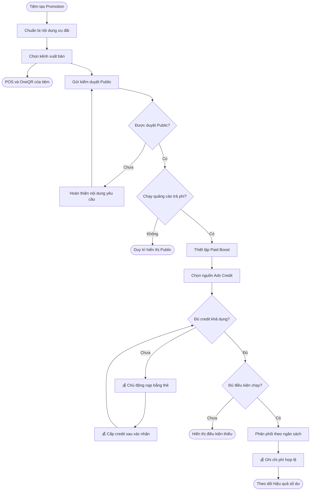
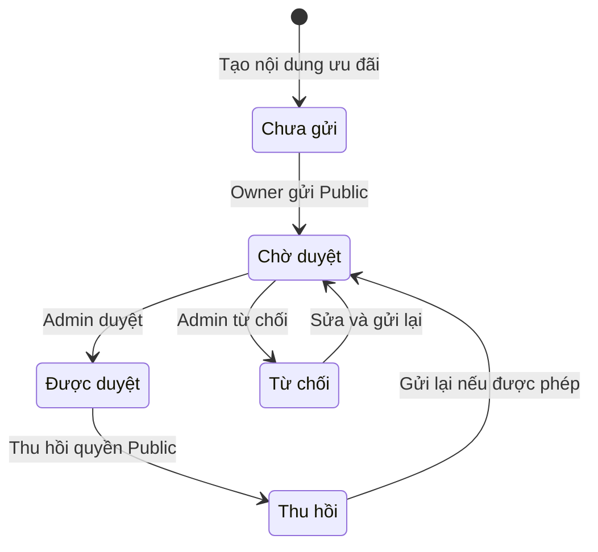
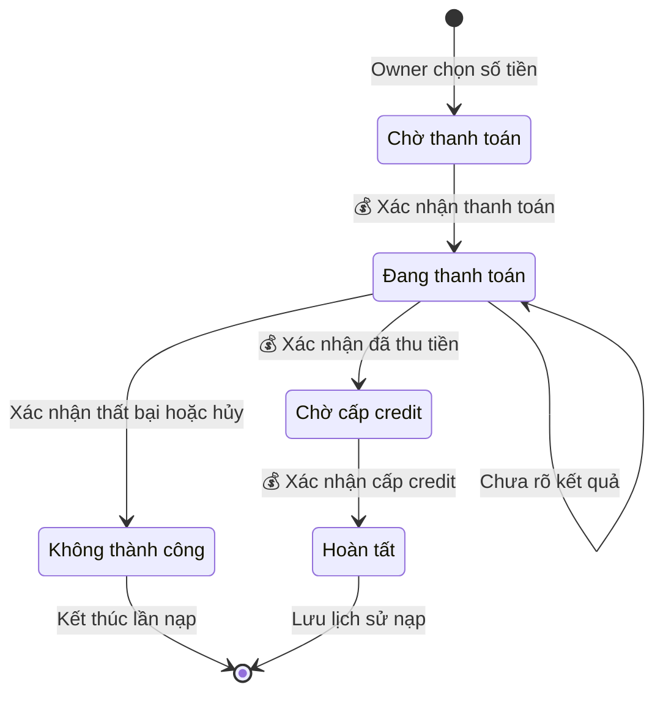
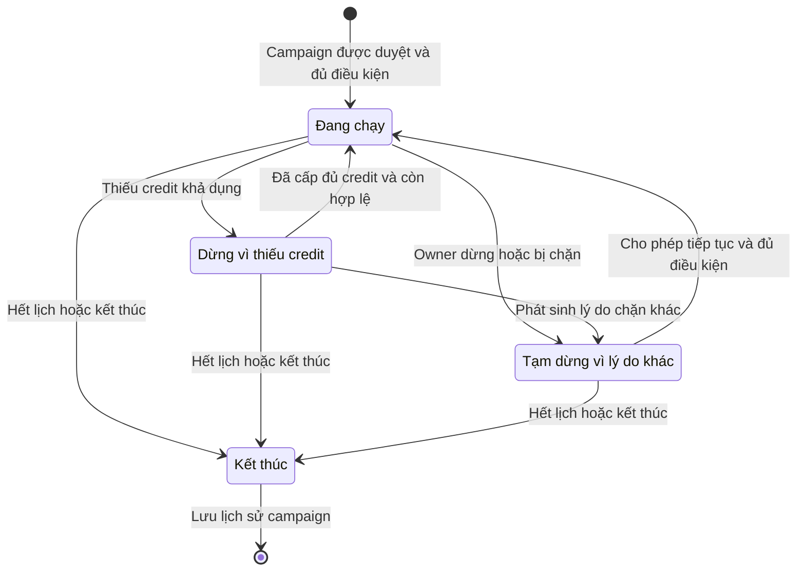

## Promotion Studio & Ads Credit — Tổng quan kết nối

**Cập nhật lần cuối:** 24 tháng 9 năm 2026

**Đối tượng đọc:** Chủ doanh nghiệp (Business Owner), người phụ trách sản phẩm, BA, QA, bộ phận hỗ trợ

**Trạng thái:** Đang rà soát

### Tổng quan

Promotion Studio và Ads Credit giúp tiệm đưa ưu đãi đến khách và kiểm soát chi phí quảng bá bằng cách kết nối nội dung Promotion với nguồn tiền chạy quảng cáo. Promotion Studio cho phép tạo ưu đãi, chọn kênh chia sẻ và theo dõi hiệu quả; Ads Credit cung cấp số dư trả trước để thanh toán Paid Boost trên mạng Nexora. Owner hoặc người được phân quyền chuẩn bị nội dung; Owner xác nhận xuất bản, ngân sách, nạp và chọn credit, còn Admin duyệt nội dung thuộc phạm vi phụ trách.

**Phạm vi:** bản tổng quan hành trình dự kiến, có phần kênh chia sẻ theo bản PO ngày 24 tháng 9 năm 2026. Không phải xác nhận toàn bộ chức năng đã triển khai trên staging; chi tiết từng nghiệp vụ được liên kết cuối tài liệu.

### Khái niệm chính

| Thuật ngữ | Ý nghĩa |
| :--- | :--- |
| Promotion | Nội dung ưu đãi gồm mức giảm, điều kiện, thời gian và nội dung giới thiệu; dùng xuyên suốt các kênh. |
| Promotion Studio | Nơi chuẩn bị ưu đãi, nội dung quảng bá, kênh phân phối và theo dõi hiệu quả. |
| Internal | Áp dụng tại POS hoặc hiển thị trên kênh của chính tiệm, không tính phí quảng cáo network. |
| Public | Xuất bản trên mạng Nexora sau phê duyệt; không đồng nghĩa đã bật quảng cáo trả phí. |
| Paid Boost / Campaign | Chiến dịch trả phí có đối tượng, vị trí, lịch, ngân sách và mô hình tính phí được chấp thuận. |
| Ads Credit | Số dư trả trước dùng thanh toán quảng cáo Nexora; không phải ngân sách cam kết tiêu hết của campaign. |
| Social kit | Bộ ảnh, caption, link theo dõi nguồn và QR để chia sẻ hoặc bàn giao cho agency. |

### Vai trò người dùng

| Vai trò | Trách nhiệm trong tính năng |
| :--- | :--- |
| Chủ doanh nghiệp (Owner) | Xác nhận nội dung, kênh, ngân sách, nguồn thanh toán; nạp credit và theo dõi hiệu quả. |
| Người được phân quyền | Chuẩn bị nội dung trong phạm vi quyền; không mặc nhiên được nạp hoặc xác nhận chi quảng cáo. |
| Quản trị viên (Admin) | Duyệt nội dung và xử lý hạn chế theo quyền; quản lý chính sách thuộc phạm vi phụ trách. |
| Khách | Xem ưu đãi, tương tác và sử dụng theo điều kiện. |
| Bộ phận hỗ trợ (Support) | Hỗ trợ trạng thái xuất bản, nạp credit và tra cứu chi phí. |

### Luồng nghiệp vụ đầu cuối

#### Luồng: Từ ưu đãi đến quảng bá và theo dõi kết quả

**Người thực hiện chính:** Business Owner.  
**Điểm bắt đầu:** Tiệm muốn giới thiệu một ưu đãi tới khách.  
**Kết quả:** Promotion xuất hiện ở kênh hợp lệ; nếu có Paid Boost, chi phí được ghi đúng nguồn và kết quả được theo dõi.

**Nhu cầu người dùng:**

- **Là** Owner, **tôi muốn** tạo một Promotion dùng cho các kênh, **để** không nhập lại cùng ưu đãi trong phần Ads Credit.
- **Là** Owner, **tôi muốn** phân biệt Internal, Public và Paid Boost, **để** biết lựa chọn nào có thể phát sinh phí quảng cáo.
- **Là** Owner, **tôi muốn** nạp khi thiếu credit rồi trở lại campaign đang chuẩn bị, **để** tiếp tục công việc mà không mất cấu hình.
- **Là** Owner, **tôi muốn** biết lý do campaign chưa chạy sau khi nạp, **để** hoàn thiện điều kiện còn thiếu mà không thanh toán lại.
- **Là** Owner, **tôi muốn** xem hiệu quả ưu đãi kể cả khi không chạy Ads, **để** đánh giá từng kênh mang lại khách và doanh thu ra sao.

| Bước | Người thực hiện | Hành động | Phản hồi hệ thống | Ghi chú |
| :--- | :--- | :--- | :--- | :--- |
| 1 | Owner / người được phân quyền | Tạo Promotion: tên, mức giảm, điều kiện, lịch và banner. | Lưu nội dung dùng chung cho các kênh. | Có thể bắt đầu từ mẫu hoặc gợi ý AI; Owner kiểm tra trước xuất bản. |
| 2 | Owner | Chọn POS/OneQR của tiệm hoặc gửi Public. | Áp dụng nội bộ theo điều kiện; Public qua phê duyệt. | Không tự bật Paid Boost hoặc trừ credit. |
| 3 | Owner | Nếu cần tiếp cận thêm khách, thiết lập Paid Boost. | Gắn campaign với Promotion, đối tượng/khu vực, vị trí, lịch và ngân sách. | Promotion Public và campaign cần được duyệt. |
| 4 | Owner | Chọn Ads Credit; 💰 chủ động nạp bằng thẻ tại Quản lý gói nếu thiếu. | Xác nhận thanh toán, 💰 cấp credit và cập nhật số dư. | Có thể nạp trước; nếu nạp từ campaign thì giữ ngữ cảnh quay lại. |
| 5 | Hệ thống | Kiểm tra điều kiện chạy. | Phân phối quảng cáo khi đủ phê duyệt, lịch, ngân sách, quyền và credit. | Nạp thành công không tự bật bản nháp hoặc bỏ hạn chế. |
| 6 | Hệ thống | Xác minh hoạt động hoặc phân phối đủ điều kiện tính phí. | 💰 Ghi chi phí vào Ads Credit theo mô hình đã chọn. | CPC, CPL, CPA hoặc Sponsored Placement; không trừ cả ngân sách lúc tạo. |
| 7 | Owner | Xem hiệu quả trong Studio, chi tiết campaign và lịch sử Ads Credit. | Phân biệt kết quả theo kênh, lượt dùng, doanh thu và chi phí có căn cứ. | Xem được hiệu quả Promotion cả khi không chạy Ads. |
| 8 | Hệ thống / Owner | Thiếu credit: dừng phân phối cần credit; Owner chủ động nạp thêm. | Chỉ tự chạy lại campaign dừng vì thiếu credit khi các điều kiện khác vẫn hợp lệ. | Không tự thu thêm tiền từ thẻ; Owner tự dừng thì không tự bật lại. |

### Cấu hình và quản trị

- **Là** Owner, **tôi muốn** chọn kênh, ngân sách và lịch, **để** hoạt động quảng bá nằm trong phạm vi đã chấp thuận.
- **Là** Admin, **tôi muốn** quản lý quyền duyệt và điều kiện phân phối, **để** nội dung và chi phí tuân theo chính sách áp dụng.

| Nội dung | Ranh giới cấu hình |
| :--- | :--- |
| Mẫu và AI | Gợi ý mục tiêu/mẫu ngành, banner, caption, QR hoặc bộ ảnh social; kết quả cần Owner xem lại. |
| Chia sẻ bên ngoài | Social kit và bàn giao Meta/Google/agency ở bản đầu; không khẳng định đã có tự đăng trực tiếp. |
| CRM và đối tác | Chỉ gửi SMS/email/push hoặc phân phối qua đối tác khi tích hợp, có consent và phê duyệt cần thiết. |
| Lịch và tự động hóa | Lịch mùa vụ, quy tắc giờ vắng, chạy lại ưu đãi hiệu quả chỉ trong điều kiện Owner xác nhận. |
| Giá và nguồn tiền | Ads Credit trả phí quảng cáo Nexora; phí AI, gửi tin, quảng cáo bên ngoài và trao đổi credit đối tác phải chốt riêng. |

Các kênh mở rộng được mô tả chi tiết trong tài liệu Promotion; bản tổng quan này không tạo thêm quy trình gửi tin hoặc đối soát đối tác độc lập.

### Vòng đời trạng thái

Các sơ đồ sau là phần tóm tắt nghiệp vụ mục tiêu, không phải xác nhận trạng thái kỹ thuật đã tồn tại. Vòng đời chi tiết nằm trong tài liệu sở hữu từng chức năng.

#### Quyền Public của Promotion

| Trạng thái hiện tại | Sự kiện chuyển trạng thái | Trạng thái mới | Ghi chú |
| :--- | :--- | :--- | :--- |
| Chưa gửi | Owner gửi Public | Chờ duyệt | Lưu không đồng nghĩa được duyệt. |
| Chờ duyệt | Admin chấp thuận | Được duyệt | Chỉ phân phối khi còn hiệu lực và đủ điều kiện. |
| Chờ duyệt | Admin từ chối | Từ chối | Hiển thị lý do để sửa. |
| Từ chối | Owner sửa và gửi lại | Chờ duyệt | Duyệt đúng phiên bản. |
| Được duyệt | Thu hồi quyền Public | Thu hồi | Chặn Public/Paid Boost liên quan. |
| Thu hồi | Gửi lại nếu được phép | Chờ duyệt | Xét lại đúng phiên bản theo quyền và chính sách kiểm duyệt. |

#### Nạp Ads Credit

| Trạng thái hiện tại | Sự kiện chuyển trạng thái | Trạng thái mới | Ghi chú |
| :--- | :--- | :--- | :--- |
| Chờ thanh toán | Owner xác nhận | Đang thanh toán | 💰 Bắt đầu thanh toán thẻ. |
| Đang thanh toán | 💰 Xác nhận đã thu tiền | Chờ cấp credit | Chưa báo số dư đã tăng. |
| Đang thanh toán | Xác nhận thất bại hoặc hủy trước thu tiền | Không thành công | Không cấp credit. |
| Đang thanh toán | Chưa rõ kết quả | Đang thanh toán | Tra cứu giao dịch cũ; không tạo lần thu mới chỉ vì phản hồi chậm. |
| Chờ cấp credit | 💰 Xác nhận cấp credit | Hoàn tất | Có thể đánh giá khôi phục campaign. |

#### Campaign ở giai đoạn phân phối

| Trạng thái hiện tại | Sự kiện chuyển trạng thái | Trạng thái mới | Ghi chú |
| :--- | :--- | :--- | :--- |
| Đang chạy | Thiếu credit | Dừng vì thiếu credit | Dừng phân phối cần credit. |
| Dừng vì thiếu credit | Credit đã cấp và đủ mọi điều kiện | Đang chạy | Giữ lịch và ngân sách đã xác nhận. |
| Đang chạy / dừng vì thiếu credit | Owner dừng hoặc có hạn chế khác | Tạm dừng vì lý do khác | Nạp tiền không bỏ qua lý do này. |
| Tạm dừng vì lý do khác | Cho phép tiếp tục và đủ điều kiện | Đang chạy | Xử lý đúng lý do dừng và quyền tiếp tục; không tự chạy lại chỉ vì vừa nạp credit. |
| Bất kỳ trạng thái phân phối | Hết lịch hoặc kết thúc | Kết thúc | Không phân phối mới; đối soát nghĩa vụ cũ riêng. |

### Quy tắc nghiệp vụ

- **Rule 1:** Một Promotion được dùng xuyên suốt; không nhập lại nội dung ưu đãi trong Ads Credit.
- **Rule 2:** Internal không yêu cầu credit cho quảng cáo network. Public không tự bật Paid Boost hoặc trừ credit.
- **Rule 3 — 💰:** Chỉ ghi chi phí theo hoạt động hoặc phân phối đủ điều kiện của mô hình đã chấp thuận; ngân sách không phải khoản trừ toàn bộ lúc tạo campaign.
- **Rule 4:** Credit không hết hạn và không tự nạp. Khôi phục campaign sau nạp vẫn phải giữ lịch, ngân sách và phê duyệt.
- **Rule 5:** Tự động hóa không bỏ qua xác nhận Owner, kiểm duyệt hoặc hạn mức chi.
- **Rule 6:** Phí gửi tin và quảng cáo bên ngoài không mặc định dùng Ads Credit.

> 💡 **Important:** Nạp tiền chỉ bổ sung số dư sau xác nhận; không tự xuất bản Promotion, duyệt nội dung hoặc bật campaign chưa đủ điều kiện.

### Tình huống ngoại lệ và cách xử lý

| Tình huống | Cách xử lý | Người giải quyết |
| :--- | :--- | :--- |
| Public bị từ chối | Giữ lý do; Owner sửa và gửi lại đúng phiên bản. | Owner / Admin. |
| Thiếu credit lúc chuẩn bị campaign | Owner nạp rồi quay lại cấu hình đang làm. | Owner. |
| Đã trả tiền nhưng credit chưa được cấp | Hiển thị chờ cấp, kiểm tra giao dịch cũ; không tự thanh toán lại. | Hệ thống / Support. |
| Nạp đủ nhưng campaign hết lịch hoặc Owner đã dừng | Không tự bật lại. | Owner / hệ thống campaign. |
| Kênh CRM/đối tác chưa tích hợp hoặc thiếu consent | Không coi bộ nội dung đã chuẩn bị là đã gửi/phân phối. | Owner / vận hành. |
| Chưa có dữ liệu hiệu quả | Phân biệt chưa có dữ liệu với kết quả bằng không. | Hệ thống / Support. |

### Câu hỏi thường gặp

**Có cần nạp Ads Credit để áp dụng ưu đãi tại POS hoặc OneQR của tiệm không?**  
Không tính phí quảng cáo network cho hiển thị nội bộ; dịch vụ khác có chính sách riêng.

**Có thể nạp trước khi tạo campaign không?**  
Có. Owner có thể nạp trước hoặc nạp khi chuẩn bị campaign mà số dư chưa đủ.

**Xem hiệu quả ở đâu?**  
Trong Studio xem hiệu quả Promotion; trong campaign xem sâu chi phí và chuyển đổi; tại Ads Credit xem số dư, lịch sử và biên nhận.

### Tính năng liên quan

| Tính năng | Mối liên hệ với tài liệu này |
| :--- | :--- |
| [Promotion Studio và quảng cáo](./promotion-publishing-ads.md) | Mô tả chi tiết tạo ưu đãi, chọn kênh, chia sẻ, kiểm duyệt, phân phối và theo dõi hiệu quả của nội dung/campaign. |
| [Ads Credit — nghiệp vụ chi tiết](./merchant-ads-credit.md) | Mô tả điều khoản, nạp thẻ, cấp credit, số dư và đối soát chi phí; là nguồn thanh toán cho campaign đủ điều kiện. |
| [Ads Credit — phạm vi triển khai rút gọn](./merchant-ads-credit-ticket.md) | Tóm tắt luồng nạp và sử dụng credit cùng các điều kiện nghiệm thu, phục vụ thống nhất phạm vi thực hiện. |
| [Business OneQR Earnings](./business-oneqr-earnings.md) và [Sponsor Override](./oneqr-sponsor-override.md) | Quản lý các phần thu nhập, đối soát và chi trả phát sinh từ sự kiện được xác nhận; không tạo một cơ chế chi trả riêng trong bản tổng quan này. |
