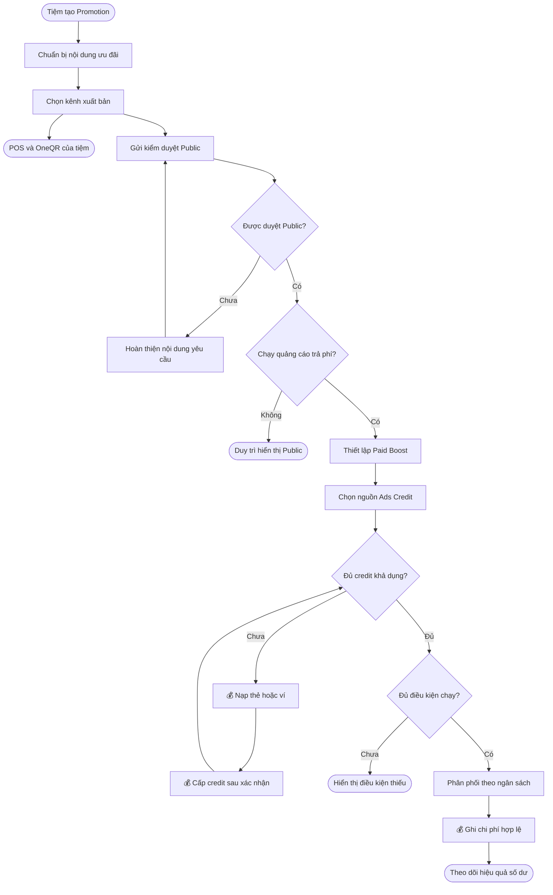
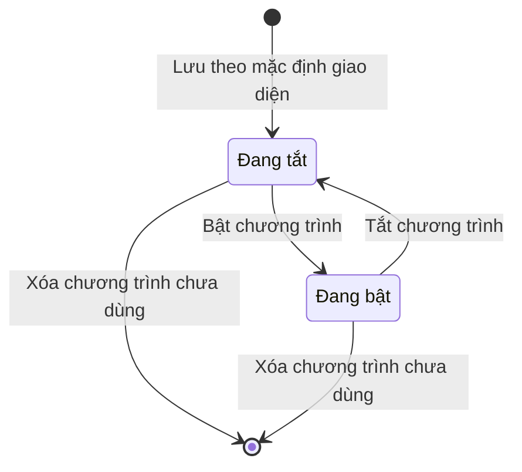
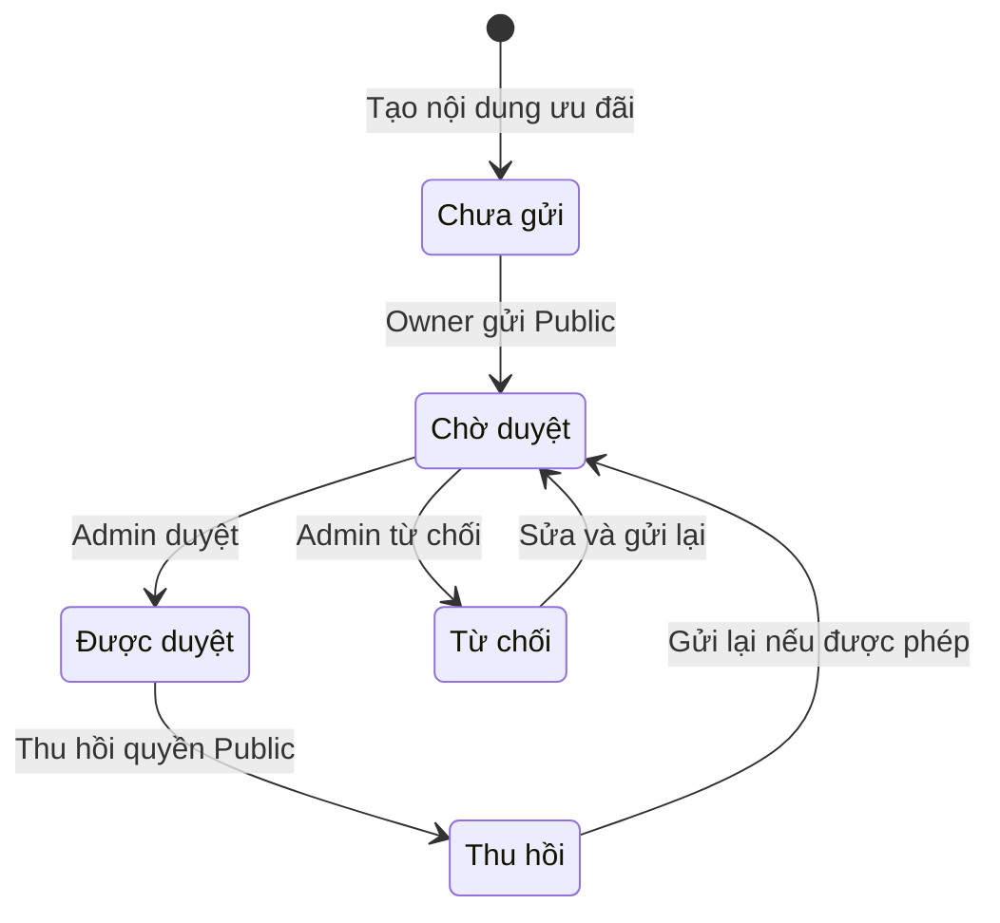
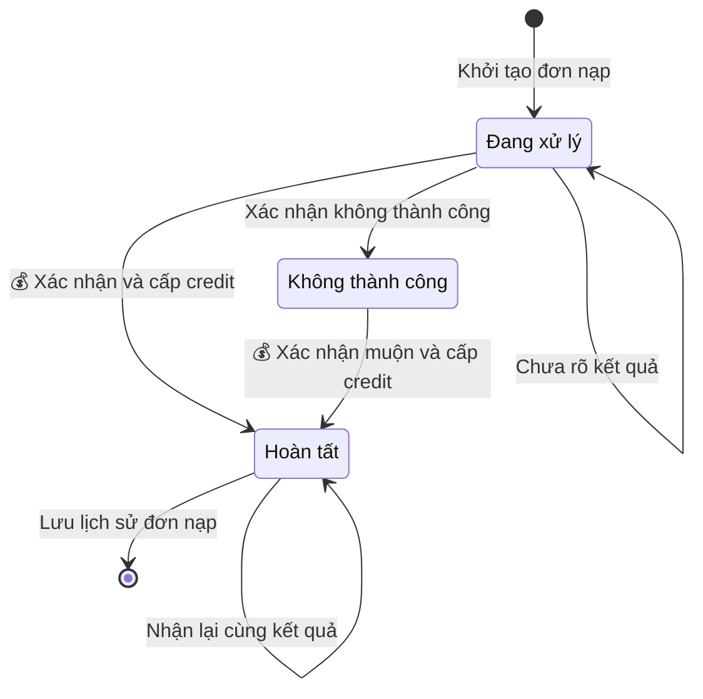
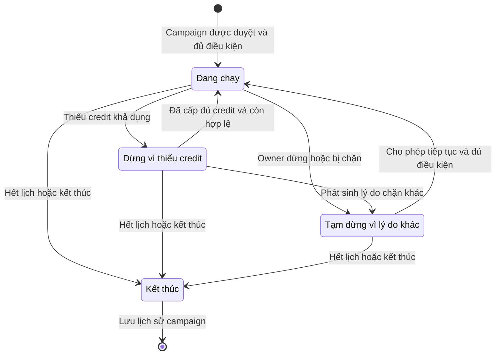

## Promotion Studio & Ads Credit — Tổng quan kết nối

**Cập nhật lần cuối:** 5 tháng 10 năm 2026

**Đối tượng đọc:** Chủ doanh nghiệp (Business Owner), người phụ trách sản phẩm, BA, QA, bộ phận hỗ trợ

**Trạng thái:** Đang rà soát

**Bản chia sẻ:** [Tài liệu trên GitHub](https://github.com/vlink-group/VlinkPay/blob/docs/promotion-code-skill-audit/nexora/docs/business/promotion-studio-ads-credit-overview.md)

**Ticket:** [#1778](https://github.com/vlink-group/vlink-nexora/issues/1778) — Confirmed tại thời điểm rà soát; chưa bắt đầu xử lý.

### Tổng quan

Promotion Studio và Ads Credit giúp tiệm đưa ưu đãi đến khách và kiểm soát chi phí quảng bá bằng cách kết nối nội dung Promotion với nguồn tiền chạy quảng cáo. Hành trình mục tiêu cho phép tạo ưu đãi, chọn kênh chia sẻ và theo dõi hiệu quả; Ads Credit cung cấp số dư trả trước để thanh toán Paid Boost trên mạng Nexora. Owner hoặc người được phân quyền chuẩn bị nội dung; Owner xác nhận xuất bản, ngân sách, nạp và chọn credit, còn Admin duyệt nội dung thuộc phạm vi phụ trách.

**Phạm vi:** bản tổng quan hành trình dự kiến, có phần kênh chia sẻ theo bản PO ngày 24 tháng 9 năm 2026. Không phải xác nhận toàn bộ chức năng đã triển khai trên staging; chi tiết từng nghiệp vụ được liên kết cuối tài liệu.

#### Hiện trạng đối chiếu mã nguồn

Rà soát ngày **5 tháng 10 năm 2026**, chỉ đọc mã nguồn `staging` của cả frontend và backend. Đã xác minh đầu nhánh trên GitHub: frontend [`27c5ebc`](https://github.com/vlink-group/vlink-nexora-fe/commit/27c5ebcaa4d86b30bc2e965e7c3df8cfee06fc8e); backend [`a7a46d3`](https://github.com/vlink-group/vlink-nexora/commit/a7a46d314036f9d83c910aead411182480249bea). Không thử giao dịch, kiểm duyệt hoặc phân phối trên môi trường triển khai.

| Phần nghiệp vụ | Đã có trong code tham chiếu | Điểm nối còn cần triển khai hoặc xác minh |
| :--- | :--- | :--- |
| Promotion tại POS | Danh sách, mẫu, tạo/sửa, nhân bản ở trạng thái tắt, nhiều banner, bật/tắt và xóa có điều kiện. Có lựa chọn OneQR và gửi Search Deals. | Cờ gửi Search Deals chưa chứng minh đã được duyệt hoặc phân phối. Contract quản lý Promotion chưa có campaign, ngân sách hoặc nguồn Ads Credit. |
| Khách xem và dùng ưu đãi | Có banner booking và check-in. POS xét chương trình đang bật, thứ/giờ theo thời điểm check-in tại múi giờ tiệm; thời điểm kết thúc khung giờ không được tính. | Banner check-in hiện chỉ lọc chương trình đang bật; thấy banner chưa chứng minh đủ điều kiện giảm giá. Chưa xác minh giữ nguồn quảng cáo tới booking/POS. |
| Ads Credit | Tab riêng trong Quản lý gói; nạp thẻ hoặc ví VlinkPay được hỗ trợ; mức nhanh/Custom, đồng ý điều khoản, tra cứu trạng thái, số dư, lịch sử và biên nhận. BE đã có cơ chế giữ, giải phóng, ghi phí và hoàn credit. | Chưa thấy campaign Paid Boost gọi các cơ chế này trong hai repository đã đọc. Có số dư/phần giữ/tổng chi không chứng minh đã có phân phối quảng cáo. |
| Paid Boost và báo cáo | Chưa tìm thấy luồng campaign quảng cáo Promotion hoàn chỉnh trong FE hoặc API contract BE đã đọc. | Quyền quảng cáo, duyệt theo phiên bản, ngân sách, phân phối, tính phí theo mô hình, báo cáo và tự chạy lại sau nạp vẫn là yêu cầu tích hợp. SMS campaign là nghiệp vụ riêng. |

**Ranh giới cập nhật:** Chỉ sửa tài liệu tổng quan của #1778. Tài liệu #1747 đang In Progress và #1749 đang Testing được giữ nguyên; mô tả hiện trạng ở bảng này lấy trực tiếp từ code, không dùng mô tả cũ trong tài liệu liên quan để kết luận chức năng chưa tồn tại.

### Khái niệm chính

| Thuật ngữ | Ý nghĩa |
| :--- | :--- |
| Promotion | Nội dung ưu đãi gồm mức giảm, điều kiện, thời gian và nội dung giới thiệu; dùng xuyên suốt các kênh. |
| Promotion Studio | Nơi chuẩn bị ưu đãi, nội dung quảng bá, kênh phân phối và theo dõi hiệu quả. |
| Internal | Áp dụng tại POS hoặc hiển thị trên kênh của chính tiệm, không tính phí quảng cáo network. |
| Public | Xuất bản trên mạng Nexora sau phê duyệt; không đồng nghĩa đã bật quảng cáo trả phí. |
| Paid Boost / Campaign | Chiến dịch trả phí có đối tượng, vị trí, lịch, ngân sách và mô hình tính phí được chấp thuận. |
| Ads Credit | Số dư trả trước dùng thanh toán quảng cáo Nexora; không phải ngân sách cam kết tiêu hết của campaign. |
| Social kit | Bộ ảnh, caption, link theo dõi nguồn và QR để chia sẻ hoặc bàn giao cho agency. |

### Vai trò người dùng

| Vai trò | Trách nhiệm trong tính năng |
| :--- | :--- |
| Chủ doanh nghiệp (Owner) | Xác nhận nội dung, kênh, ngân sách, nguồn thanh toán; nạp credit và theo dõi hiệu quả. |
| Người được phân quyền | Chuẩn bị nội dung trong phạm vi quyền; không mặc nhiên được nạp hoặc xác nhận chi quảng cáo. |
| Quản trị viên (Admin) | Duyệt nội dung và xử lý hạn chế theo quyền; quản lý chính sách thuộc phạm vi phụ trách. |
| Khách | Xem ưu đãi, tương tác và sử dụng theo điều kiện. |
| Bộ phận hỗ trợ (Support) | Hỗ trợ trạng thái xuất bản, nạp credit và tra cứu chi phí. |

### Luồng nghiệp vụ đầu cuối

#### Luồng: Từ ưu đãi đến quảng bá và theo dõi kết quả

**Người thực hiện chính:** Business Owner.  
**Điểm bắt đầu:** Tiệm muốn giới thiệu một ưu đãi tới khách.  
**Kết quả mục tiêu sau tích hợp:** Promotion xuất hiện ở kênh hợp lệ; nếu có Paid Boost, chi phí được ghi đúng nguồn và kết quả được theo dõi.

**Mức độ triển khai:** Bảng bước và sơ đồ dưới đây mô tả hành trình mục tiêu. Bảng hiện trạng phía trên xác định những bước đã có trong code; các bước Paid Boost, giữ ngữ cảnh campaign, báo cáo và tự chạy lại chưa được xác minh triển khai.

**Nhu cầu người dùng:**

- **Là** Owner, **tôi muốn** tạo một Promotion dùng cho các kênh, **để** không nhập lại cùng ưu đãi trong phần Ads Credit.
- **Là** Owner, **tôi muốn** phân biệt Internal, Public và Paid Boost, **để** biết lựa chọn nào có thể phát sinh phí quảng cáo.
- **Là** Owner, **tôi muốn** nạp khi thiếu credit rồi trở lại campaign đang chuẩn bị, **để** tiếp tục công việc mà không mất cấu hình.
- **Là** Owner, **tôi muốn** biết lý do campaign chưa chạy sau khi nạp, **để** hoàn thiện điều kiện còn thiếu mà không thanh toán lại.
- **Là** Owner, **tôi muốn** xem hiệu quả ưu đãi kể cả khi không chạy Ads, **để** đánh giá từng kênh mang lại khách và doanh thu ra sao.

| Bước | Người thực hiện | Hành động | Phản hồi hệ thống | Ghi chú |
| :--- | :--- | :--- | :--- | :--- |
| 1 | Owner / người được phân quyền | Tạo Promotion: tên, mức giảm, điều kiện, lịch và banner. | Lưu nội dung dùng chung cho các kênh. | Có thể bắt đầu từ mẫu hoặc gợi ý AI; Owner kiểm tra trước xuất bản. |
| 2 | Owner | Chọn POS/OneQR của tiệm hoặc gửi Public. | Áp dụng nội bộ theo điều kiện; Public qua phê duyệt. | Không tự bật Paid Boost hoặc trừ credit. |
| 3 | Owner | Nếu cần tiếp cận thêm khách, thiết lập Paid Boost. | Gắn campaign với Promotion, đối tượng/khu vực, vị trí, lịch và ngân sách. | Promotion Public và campaign cần được duyệt. |
| 4 | Owner | Chọn Ads Credit; 💰 chủ động nạp bằng thẻ hoặc ví được hỗ trợ tại Quản lý gói nếu thiếu. | Xác nhận thanh toán, 💰 cấp credit và cập nhật số dư. | Có thể nạp trước; nếu nạp từ campaign thì giữ ngữ cảnh quay lại. |
| 5 | Hệ thống | Kiểm tra điều kiện chạy. | Phân phối quảng cáo khi đủ phê duyệt, lịch, ngân sách, quyền và credit. | Nạp thành công không tự bật bản nháp hoặc bỏ hạn chế. |
| 6 | Hệ thống | Xác minh hoạt động hoặc phân phối đủ điều kiện tính phí. | 💰 Ghi chi phí vào Ads Credit theo mô hình đã chọn. | CPC, CPL, CPA hoặc Sponsored Placement; không trừ cả ngân sách lúc tạo. |
| 7 | Owner | Xem hiệu quả trong Studio, chi tiết campaign và lịch sử Ads Credit. | Phân biệt kết quả theo kênh, lượt dùng, doanh thu và chi phí có căn cứ. | Xem được hiệu quả Promotion cả khi không chạy Ads. |
| 8 | Hệ thống / Owner | Thiếu credit: dừng phân phối cần credit; Owner chủ động nạp thêm. | Chỉ tự chạy lại campaign dừng vì thiếu credit khi các điều kiện khác vẫn hợp lệ. | Không tự thu thêm tiền từ thẻ; Owner tự dừng thì không tự bật lại. |

```mermaid
flowchart TD
    A([Tiệm tạo Promotion]) --> B[Chuẩn bị nội dung ưu đãi]
    B --> C[Chọn kênh xuất bản]
    C --> D([POS và OneQR của tiệm])
    C --> E[Gửi kiểm duyệt Public]
    E --> F{Được duyệt Public?}
    F -- Chưa --> G[Hoàn thiện nội dung yêu cầu]
    G --> E
    F -- Có --> H{Chạy quảng cáo trả phí?}
    H -- Không --> I([Duy trì hiển thị Public])
    H -- Có --> J[Thiết lập Paid Boost]
    J --> K[Chọn nguồn Ads Credit]
    K --> L{Đủ credit khả dụng?}
    L -- Chưa --> M[💰 Nạp thẻ hoặc ví]
    M --> N[💰 Cấp credit sau xác nhận]
    N --> L
    L -- Đủ --> O{Đủ điều kiện chạy?}
    O -- Chưa --> P([Hiển thị điều kiện thiếu])
    O -- Có --> Q[Phân phối theo ngân sách]
    Q --> R[💰 Ghi chi phí hợp lệ]
    R --> S([Theo dõi hiệu quả số dư])
```

### Cấu hình và quản trị

- **Là** Owner, **tôi muốn** chọn kênh, ngân sách và lịch, **để** hoạt động quảng bá nằm trong phạm vi đã chấp thuận.
- **Là** Admin, **tôi muốn** quản lý quyền duyệt và điều kiện phân phối, **để** nội dung và chi phí tuân theo chính sách áp dụng.

| Nội dung | Ranh giới cấu hình |
| :--- | :--- |
| Mẫu và AI | Gợi ý mục tiêu/mẫu ngành, banner, caption, QR hoặc bộ ảnh social; kết quả cần Owner xem lại. |
| Chia sẻ bên ngoài | Social kit và bàn giao Meta/Google/agency ở bản đầu; không khẳng định đã có tự đăng trực tiếp. |
| CRM và đối tác | Chỉ gửi SMS/email/push hoặc phân phối qua đối tác khi tích hợp, có consent và phê duyệt cần thiết. |
| Lịch và tự động hóa | Lịch mùa vụ, quy tắc giờ vắng, chạy lại ưu đãi hiệu quả chỉ trong điều kiện Owner xác nhận. |
| Giá và nguồn tiền | Ads Credit trả phí quảng cáo Nexora; phí AI, gửi tin, quảng cáo bên ngoài và trao đổi credit đối tác phải chốt riêng. |

Các kênh mở rộng được mô tả chi tiết trong tài liệu Promotion; bản tổng quan này không tạo thêm quy trình gửi tin hoặc đối soát đối tác độc lập.

### Vòng đời trạng thái

Vòng đời bật/tắt Promotion và giao dịch nạp dưới đây dựa trên code. Vòng duyệt Public và campaign là nghiệp vụ mục tiêu cần tích hợp, chưa phải trạng thái đã được xác minh triển khai.

#### Bật/tắt Promotion hiện có

| Trạng thái hiện tại | Sự kiện chuyển trạng thái | Trạng thái mới | Ghi chú |
| :--- | :--- | :--- | :--- |
| Chưa tạo | Lưu mới hoặc nhân bản theo mặc định giao diện | Đang tắt | Lưu chưa phải phê duyệt Public. |
| Đang tắt | Người có quyền bật chương trình | Đang bật | POS còn xét thứ/giờ theo check-in. |
| Đang bật | Người có quyền tắt chương trình | Đang tắt | Giữ lịch sử giao dịch đã áp dụng. |
| Đang bật / đang tắt | Xóa chương trình chưa được sử dụng | Đã xóa | BE chặn xóa khi đã được sử dụng. |

```mermaid
stateDiagram-v2
    state "Đang tắt" as Disabled
    state "Đang bật" as Enabled
    [*] --> Disabled : Lưu theo mặc định giao diện
    Disabled --> Enabled : Bật chương trình
    Enabled --> Disabled : Tắt chương trình
    Disabled --> [*] : Xóa chương trình chưa dùng
    Enabled --> [*] : Xóa chương trình chưa dùng
```

#### Quyền Public của Promotion — mục tiêu

| Trạng thái hiện tại | Sự kiện chuyển trạng thái | Trạng thái mới | Ghi chú |
| :--- | :--- | :--- | :--- |
| Chưa gửi | Owner gửi Public | Chờ duyệt | Lưu không đồng nghĩa được duyệt. |
| Chờ duyệt | Admin chấp thuận | Được duyệt | Chỉ phân phối khi còn hiệu lực và đủ điều kiện. |
| Chờ duyệt | Admin từ chối | Từ chối | Hiển thị lý do để sửa. |
| Từ chối | Owner sửa và gửi lại | Chờ duyệt | Duyệt đúng phiên bản. |
| Được duyệt | Thu hồi quyền Public | Thu hồi | Chặn Public/Paid Boost liên quan. |
| Thu hồi | Gửi lại nếu được phép | Chờ duyệt | Xét lại đúng phiên bản theo quyền và chính sách kiểm duyệt. |

```mermaid
stateDiagram-v2
    state "Chưa gửi" as Unsubmitted
    state "Chờ duyệt" as Review
    state "Được duyệt" as Approved
    state "Từ chối" as Rejected
    state "Thu hồi" as Revoked
    [*] --> Unsubmitted : Tạo nội dung ưu đãi
    Unsubmitted --> Review : Owner gửi Public
    Review --> Approved : Admin duyệt
    Review --> Rejected : Admin từ chối
    Rejected --> Review : Sửa và gửi lại
    Approved --> Revoked : Thu hồi quyền Public
    Revoked --> Review : Gửi lại nếu được phép
```

#### Nạp Ads Credit — trạng thái hiện có

Đơn nạp trong API có ba trạng thái: **Đang xử lý** (`Pending`), **Hoàn tất** (`Completed`) và **Không thành công** (`Failed`). Chọn số tiền, nhập thẻ và chờ xác nhận là các bước trải nghiệm; API chưa tách chúng thành trạng thái đơn riêng.

| Trạng thái hiện tại | Sự kiện chuyển trạng thái | Trạng thái mới | Ghi chú |
| :--- | :--- | :--- | :--- |
| Chưa có đơn | Owner khởi tạo lần nạp hợp lệ và đồng ý điều khoản | Đang xử lý | Thẻ hoặc ví được hỗ trợ; chưa cộng số dư. |
| Đang xử lý | Chưa xác định được kết quả thanh toán | Đang xử lý | Không coi timeout là chắc chắn thất bại; tra cứu đơn cũ. |
| Đang xử lý | Hệ thống xác nhận thanh toán hợp lệ và 💰 cấp credit | Hoàn tất | Ghi tăng số dư một lần; biên nhận chỉ có cho đơn hoàn tất. |
| Đang xử lý | Nhận kết quả không thành công | Không thành công | Không cấp credit. |
| Không thành công | Nhận xác nhận thanh toán thành công đến muộn | Hoàn tất | Cơ chế ghi nhận BE cho phép xác nhận lại; phải tránh cộng trùng. |
| Hoàn tất | Nhận lại cùng kết quả thanh toán | Hoàn tất | Không cộng thêm credit. |

```mermaid
stateDiagram-v2
    state "Đang xử lý" as Processing
    state "Hoàn tất" as Completed
    state "Không thành công" as Failed
    [*] --> Processing : Khởi tạo đơn nạp
    Processing --> Processing : Chưa rõ kết quả
    Processing --> Completed : 💰 Xác nhận và cấp credit
    Processing --> Failed : Xác nhận không thành công
    Failed --> Completed : 💰 Xác nhận muộn và cấp credit
    Completed --> Completed : Nhận lại cùng kết quả
    Completed --> [*] : Lưu lịch sử đơn nạp
```

**Điểm cần xác minh khi tích hợp:** Tra cứu trạng thái hiện đọc kết quả đã lưu; không tự xác minh lại thanh toán ví chỉ vì Owner tải lại. Việc khôi phục giao dịch chưa rõ kết quả cần được đối chiếu với bên thanh toán. Nạp hoàn tất hiện cập nhật dữ liệu Ads Credit ở FE; chưa thấy tín hiệu nối với Paid Boost để tự chạy lại.

#### Campaign ở giai đoạn phân phối — mục tiêu

| Trạng thái hiện tại | Sự kiện chuyển trạng thái | Trạng thái mới | Ghi chú |
| :--- | :--- | :--- | :--- |
| Đang chạy | Thiếu credit | Dừng vì thiếu credit | Dừng phân phối cần credit. |
| Dừng vì thiếu credit | Credit đã cấp và đủ mọi điều kiện | Đang chạy | Giữ lịch và ngân sách đã xác nhận. |
| Đang chạy / dừng vì thiếu credit | Owner dừng hoặc có hạn chế khác | Tạm dừng vì lý do khác | Nạp tiền không bỏ qua lý do này. |
| Tạm dừng vì lý do khác | Cho phép tiếp tục và đủ điều kiện | Đang chạy | Xử lý đúng lý do dừng và quyền tiếp tục; không tự chạy lại chỉ vì vừa nạp credit. |
| Bất kỳ trạng thái phân phối | Hết lịch hoặc kết thúc | Kết thúc | Không phân phối mới; đối soát nghĩa vụ cũ riêng. |

```mermaid
stateDiagram-v2
    state "Đang chạy" as Running
    state "Dừng vì thiếu credit" as NoCredit
    state "Tạm dừng vì lý do khác" as OtherPause
    state "Kết thúc" as Ended
    [*] --> Running : Campaign được duyệt và đủ điều kiện
    Running --> NoCredit : Thiếu credit khả dụng
    NoCredit --> Running : Đã cấp đủ credit và còn hợp lệ
    Running --> OtherPause : Owner dừng hoặc bị chặn
    NoCredit --> OtherPause : Phát sinh lý do chặn khác
    OtherPause --> Running : Cho phép tiếp tục và đủ điều kiện
    Running --> Ended : Hết lịch hoặc kết thúc
    NoCredit --> Ended : Hết lịch hoặc kết thúc
    OtherPause --> Ended : Hết lịch hoặc kết thúc
    Ended --> [*] : Lưu lịch sử campaign
```

### Quy tắc nghiệp vụ

- **Rule 1:** Một Promotion được dùng xuyên suốt; không nhập lại nội dung ưu đãi trong Ads Credit.
- **Rule 2:** Internal không yêu cầu credit cho quảng cáo network. Public không tự bật Paid Boost hoặc trừ credit.
- **Rule 3 — 💰:** Chỉ ghi chi phí theo hoạt động hoặc phân phối đủ điều kiện của mô hình đã chấp thuận; ngân sách không phải khoản trừ toàn bộ lúc tạo campaign.
- **Rule 4:** Credit không hết hạn và không tự nạp. Khôi phục campaign sau nạp vẫn phải giữ lịch, ngân sách và phê duyệt.
- **Rule 5:** Tự động hóa không bỏ qua xác nhận Owner, kiểm duyệt hoặc hạn mức chi.
- **Rule 6:** Phí gửi tin và quảng cáo bên ngoài không mặc định dùng Ads Credit.

> 💡 **Important:** Nạp tiền chỉ bổ sung số dư sau xác nhận; không tự xuất bản Promotion, duyệt nội dung hoặc bật campaign chưa đủ điều kiện.

### Tình huống ngoại lệ và cách xử lý

| Tình huống | Cách xử lý | Người giải quyết |
| :--- | :--- | :--- |
| Public bị từ chối | Giữ lý do; Owner sửa và gửi lại đúng phiên bản. | Owner / Admin. |
| Thiếu credit lúc chuẩn bị campaign | Owner nạp rồi quay lại cấu hình đang làm. | Owner. |
| Đã trả tiền nhưng credit chưa được cấp | Hiển thị chờ cấp, kiểm tra giao dịch cũ; không tự thanh toán lại. | Hệ thống / Support. |
| Nạp đủ nhưng campaign hết lịch hoặc Owner đã dừng | Không tự bật lại. | Owner / hệ thống campaign. |
| Kênh CRM/đối tác chưa tích hợp hoặc thiếu consent | Không coi bộ nội dung đã chuẩn bị là đã gửi/phân phối. | Owner / vận hành. |
| Chưa có dữ liệu hiệu quả | Phân biệt chưa có dữ liệu với kết quả bằng không. | Hệ thống / Support. |

### Câu hỏi thường gặp

**Có cần nạp Ads Credit để áp dụng ưu đãi tại POS hoặc OneQR của tiệm không?**  
Không tính phí quảng cáo network cho hiển thị nội bộ; dịch vụ khác có chính sách riêng.

**Nạp xong thì campaign đã tự chạy lại chưa?**

Chưa có bằng chứng từ code đã đọc. FE tải lại dữ liệu Ads Credit sau kết quả nạp; tự chạy lại campaign là yêu cầu tích hợp riêng, còn phụ thuộc duyệt, lịch, ngân sách và quyền.

**Có thể nạp trước khi tạo campaign không?**  
Có. Owner có thể nạp trước hoặc nạp khi chuẩn bị campaign mà số dư chưa đủ.

**Xem hiệu quả ở đâu?**  
Theo thiết kế mục tiêu: Studio xem hiệu quả Promotion, campaign xem chi phí và chuyển đổi. Code hiện có Ads Credit để xem số dư, lịch sử và biên nhận; chưa thấy đầy đủ hai phần báo cáo quảng cáo trong phạm vi đối chiếu.

### Tính năng liên quan

| Tính năng | Mối liên hệ với tài liệu này |
| :--- | :--- |
| [Promotion Studio và quảng cáo](https://raw.githubusercontent.com/vlink-group/VlinkPay/main/nexora/docs/business/promotion-publishing-ads.md) | Mô tả chi tiết tạo ưu đãi, chọn kênh, chia sẻ, kiểm duyệt, phân phối và theo dõi hiệu quả của nội dung/campaign. |
| [Ads Credit — nghiệp vụ chi tiết](https://raw.githubusercontent.com/vlink-group/VlinkPay/main/nexora/docs/business/merchant-ads-credit.md) | Mô tả điều khoản, nạp thẻ, cấp credit, số dư và đối soát chi phí; là nguồn thanh toán cho campaign đủ điều kiện. |
| [Ads Credit — phạm vi triển khai rút gọn](https://raw.githubusercontent.com/vlink-group/VlinkPay/main/nexora/docs/business/merchant-ads-credit-ticket.md) | Tóm tắt luồng nạp và sử dụng credit cùng các điều kiện nghiệm thu, phục vụ thống nhất phạm vi thực hiện. |
| [Business OneQR Earnings](https://github.com/vlink-group/VlinkPay/blob/docs/promotion-code-skill-audit/nexora/docs/business/business-oneqr-earnings.md) và [Sponsor Override](https://raw.githubusercontent.com/vlink-group/VlinkPay/main/nexora/docs/business/oneqr-sponsor-override.md) | Quản lý các phần thu nhập, đối soát và chi trả phát sinh từ sự kiện được xác nhận; không tạo một cơ chế chi trả riêng trong bản tổng quan này. |

#### Căn cứ mã nguồn — tham chiếu nội bộ

Các liên kết cố định theo hai revision đã xác minh ở trên. Đây là căn cứ đọc code, không phải bằng chứng API live hoặc giao dịch thanh toán đã được kiểm thử.

| Nguồn | Nội dung được xác minh |
| :--- | :--- |
| [Contract Promotion](https://github.com/vlink-group/vlink-nexora-fe/blob/27c5ebcaa4d86b30bc2e965e7c3df8cfee06fc8e/src/data/repositories/posPromotions.ts) | Danh sách/chi tiết, mẫu, tạo/sửa/xóa; nhiều banner, lịch tuần/giờ và lựa chọn hiển thị. |
| [Điều kiện POS](https://github.com/vlink-group/vlink-nexora/blob/a7a46d314036f9d83c910aead411182480249bea/backend/src/Application/Features/Pos/Orders/Queries/GetEligiblePromotions/GetEligiblePromotionsQuery.cs) | Dùng giờ check-in tại múi giờ tiệm; xét trạng thái, thứ và khung giờ. |
| [Banner check-in](https://github.com/vlink-group/vlink-nexora-fe/blob/27c5ebcaa4d86b30bc2e965e7c3df8cfee06fc8e/src/components/checkin/parts/CheckInActivePromotionsSection.tsx) | Lọc chương trình đang bật; không thay kiểm tra điều kiện ở POS. |
| [Tích hợp Ads Credit](https://github.com/vlink-group/vlink-nexora-fe/blob/27c5ebcaa4d86b30bc2e965e7c3df8cfee06fc8e/src/data/repositories/adsCredit.ts) | Đã gọi API số dư, lựa chọn nạp, lịch sử, nạp thẻ/ví, trạng thái và biên nhận. |
| [API Ads Credit](https://github.com/vlink-group/vlink-nexora/blob/a7a46d314036f9d83c910aead411182480249bea/backend/src/Web/Controllers/Merchant/MerchantAdsCreditController.cs) | Các chức năng nạp/đọc đã có endpoint riêng; không phụ thuộc API subscription phải thêm loại Ads Credit. |
| [Ghi nhận nạp](https://github.com/vlink-group/vlink-nexora/blob/a7a46d314036f9d83c910aead411182480249bea/backend/src/Application/Features/AdsCredit/Services/AdsCreditTopUpSettler.cs) | Xác nhận kết quả, cấp credit, khóa số dư và chống ghi nhận trùng; không gọi luồng tự chạy Paid Boost. |
| [Giữ và sử dụng credit](https://github.com/vlink-group/vlink-nexora/blob/a7a46d314036f9d83c910aead411182480249bea/backend/src/Application/Features/AdsCredit/Services/AdsCreditTransactionService.cs) | Có nền giữ/giải phóng/ghi phí/hoàn credit; chưa thấy luồng campaign Promotion gọi nền này. |
| [API contract](https://github.com/vlink-group/vlink-nexora/blob/a7a46d314036f9d83c910aead411182480249bea/backend/src/Web/wwwroot/api/specification.json) | Đối chiếu API quảng cáo trong contract hiện có; SMS campaign không phải Paid Boost của Promotion. |
