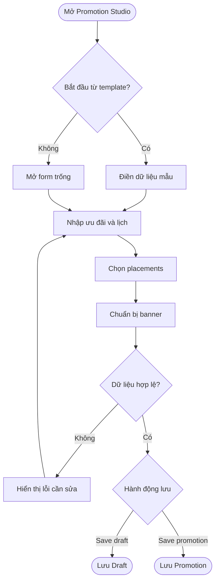
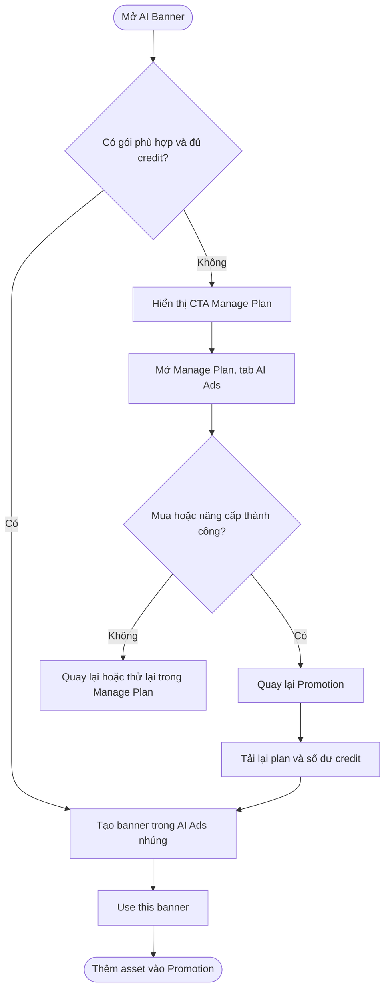
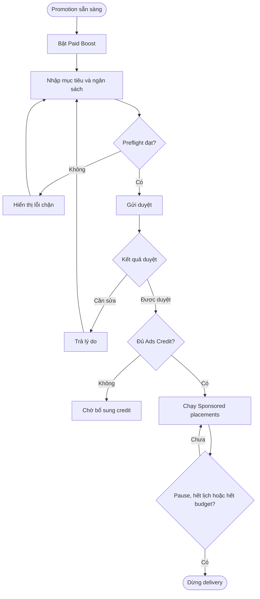
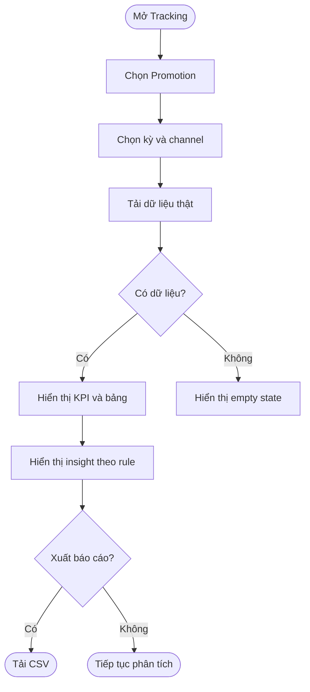
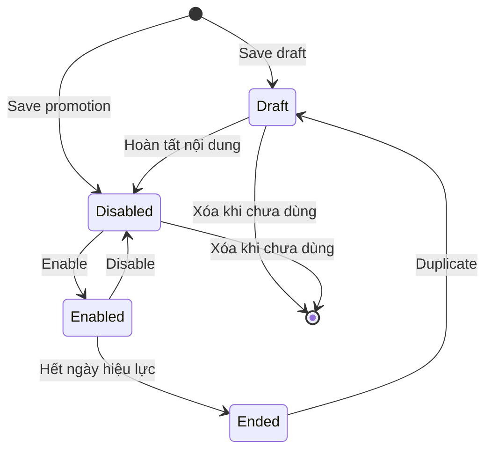
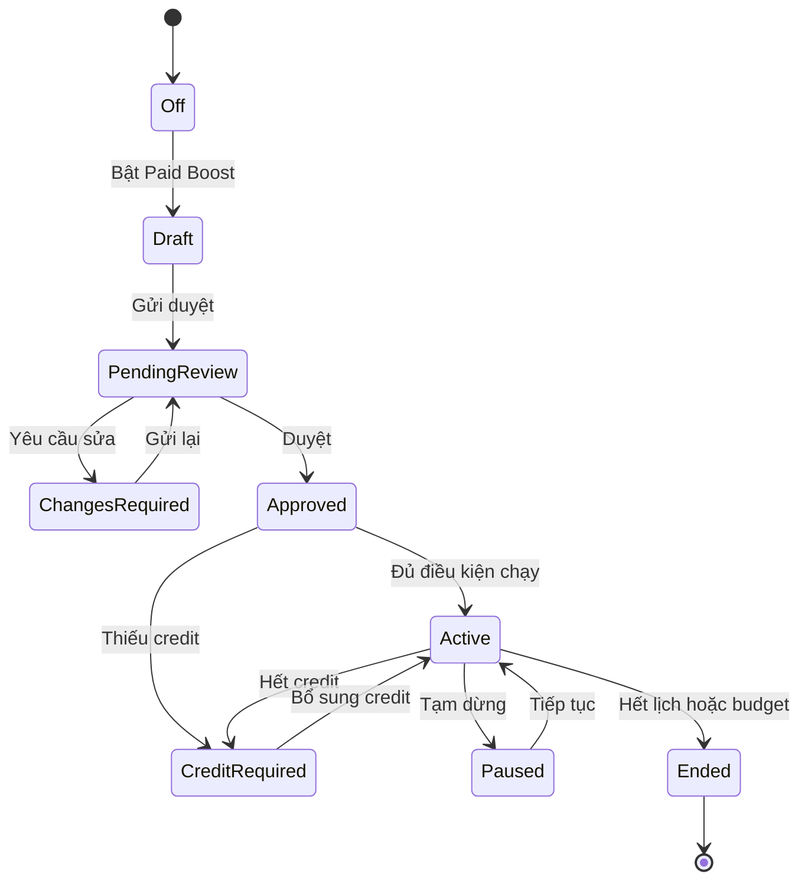

## Promotion Studio — Phân tích nâng cấp

**Cập nhật lần cuối:** 25 tháng 9 năm 2026  
**Đối tượng đọc:** Product Owner, Business Owner, BA, Product Designer, Frontend, Backend, QA, Support  
**Trạng thái:** Bản nháp để thống nhất phạm vi

---

### Tổng quan

Promotion Studio nâng cấp nhằm giúp doanh nghiệp tạo, phát hành và đo hiệu quả Promotion trong một luồng thống nhất bằng cách kế thừa nền Promotion hiện có trên `staging` và phát triển theo giao diện mục tiêu. Hệ thống mục tiêu cho phép chọn mẫu theo ngành, cấu hình ưu đãi và lịch, chọn vị trí hiển thị miễn phí, chuẩn bị banner, tạo banner bằng AI, gửi chiến dịch trả phí để duyệt và theo dõi hiệu quả theo Promotion, kỳ báo cáo và kênh. Business Owner quyết định nội dung, trạng thái và ngân sách; Manager hoặc Front Desk chuẩn bị Promotion theo quyền; hệ thống và Admin kiểm soát điều kiện phân phối, phê duyệt và số liệu.

Tài liệu này phân biệt rõ ba lớp: khả năng đã có trên `staging`, định hướng trong mẫu PO cung cấp và yêu cầu cần bổ sung để đưa thiết kế mục tiêu vào production. Dữ liệu Tracking, AI Banner và Paid Boost trong prototype là dữ liệu minh họa phía trình duyệt; không được xem là contract production.

#### Nguồn đối chiếu

| Nguồn | File/phiên bản đã kiểm tra | Mục đích |
| :--- | :--- | :--- |
| Mẫu PO cung cấp | [promotion-current-flow-quick-tools-advanced.html](https://github.com/vlink-group/VlinkPay/blob/docs/promotion-studio-analysis/nexora/docs/business/references/promotion-current-flow-quick-tools-advanced.html), cập nhật lúc 10:21:13 ngày 24 tháng 9 năm 2026; SHA-256 bản xuất bản `6a7d4b5d...f345d78` | Nguồn giao diện dùng để xác định định hướng nâng cấp. |
| Frontend hiện tại | Nhánh `staging` của `vlink-nexora-fe`, commit `97791dc28732335a6677a7adc58188ca0a1e694c` | Xác định khả năng đã có và contract frontend đang sử dụng. |
| Phạm vi xác minh | Mã nguồn và prototype | Chưa tạo hoặc sửa dữ liệu trên môi trường staging trong lần phân tích này. |

---

### Khái niệm chính

| Thuật ngữ | Định nghĩa |
| :--- | :--- |
| Promotion | Ưu đãi của doanh nghiệp, gồm nội dung, mức giảm, lịch, vị trí hiển thị và banner. |
| Promotion Template | Mẫu điền sẵn để bắt đầu nhanh; chọn mẫu không tự lưu, bật hoặc gửi duyệt. |
| Placement miễn phí | Nơi Promotion có thể hiển thị mà không phát sinh chi phí quảng cáo, gồm POS checkout, Check-in screen, OneQR Hero và Search Deals organic theo chính sách duyệt. |
| Paid Boost | Cấu hình quảng cáo trả phí gắn với một Promotion, gồm khu vực, mục tiêu, ngân sách và vị trí Sponsored. |
| Sponsored Placement | Vị trí quảng cáo trả phí, được gắn nhãn Sponsored và chỉ chạy sau khi đủ điều kiện. |
| Cover Banner | Banner đầu tiên, dùng làm ảnh đại diện và creative mặc định cho Promotion hoặc Paid Boost. |
| AI Banner | Phần tạo banner của AI Ads được nhúng vào Promotion Studio; plan và credit sử dụng chung với gói AI Ads hiện tại. |
| Manage Plan | Màn quản lý gói hiện có của Nexora tại `/dashboard/subscriptions`; được bổ sung tab **AI Ads** để mua, nâng cấp và theo dõi gói/credit dùng chung với Promotion Studio. |
| Tracking & Performance | Báo cáo view, click/scan, booking tap, redemption, revenue, cost và khách mới theo bộ lọc. |
| Draft | Promotion đã lưu để tiếp tục chỉnh sửa, chưa bật và chưa phân phối. |
| Approval | Quá trình kiểm tra nội dung/cấu hình trước khi Search Deals hoặc Paid Boost được phân phối. |

---

### Vai trò người dùng

| Vai trò | Trách nhiệm trong tính năng |
| :--- | :--- |
| Business Owner | Quyết định nội dung, mức giảm, lịch, placements, ngân sách, gửi duyệt, bật/tắt và theo dõi hiệu quả. |
| Manager / Front Desk | Tạo, chỉnh sửa, nhân bản, xem trước và chuẩn bị Promotion trong phạm vi quyền được cấp. |
| Admin / Reviewer | Duyệt hoặc từ chối nội dung công khai và Paid Boost; cung cấp lý do khi cần chỉnh sửa. |
| Customer | Xem Promotion trên các placements và sử dụng ưu đãi khi đáp ứng điều kiện. |
| Support | Tra cứu trạng thái Promotion, trạng thái chiến dịch, lỗi phân phối và dữ liệu liên quan để hỗ trợ. |

---

### Hiện trạng trên staging

#### Khả năng đã có

| Khu vực | Hiện trạng đã xác minh |
| :--- | :--- |
| Trang quản lý | Có tiêu đề, đổi ngôn ngữ Anh/Việt, thư viện template, ba thẻ thống kê cấu hình, tìm kiếm, lọc trạng thái và danh sách Promotion. |
| Template | Lấy từ API metadata; có danh sách fallback phía frontend. Chọn template mở form và điền sẵn dữ liệu. |
| Tạo và sửa | Có tên, badge, mô tả, kiểu giảm phần trăm/số tiền, giá trị giảm, ngày trong tuần, một khung giờ và trạng thái bật tại POS. |
| Placement | Có POS checkout thông qua `isActive`, OneQR Hero và yêu cầu Search Deals. |
| Check-in | Màn Check-in đã hiển thị carousel của Promotion đang bật và đúng ngày/giờ, nhưng Promotion Studio chưa có cờ chọn Check-in riêng. |
| Banner | Tối đa 8 banner; hỗ trợ theme màu hoặc upload PNG/JPG/WebP; đổi cover, sắp xếp, xóa, preview và in poster. |
| Quản lý | Có Edit, Enable/Disable, Duplicate, Preview và Delete. Bản sao bắt đầu ở trạng thái tắt. |
| Xóa | Chỉ xóa khi Promotion chưa được sử dụng; Promotion đã dùng phải được tắt để giữ lịch sử. |
| API frontend đang dùng | Danh sách, chi tiết, template, tạo, cập nhật và xóa Promotion. Contract hiện chỉ có nội dung cơ bản, lịch tuần/giờ, bật/tắt, OneQR, Search Deals và banner. |
| Manage Plan | Đã có màn `/dashboard/subscriptions` để hiển thị và checkout gói Nexora hiện tại; chưa có tab AI Ads hoặc lịch sử credit/gói AI Ads. |

#### Giới hạn so với giao diện mục tiêu

| Khoảng cách | Ảnh hưởng |
| :--- | :--- |
| Chưa lọc template theo ngành | Thư viện dài sẽ khó tìm khi số template tăng. |
| Chưa có ngày bắt đầu/kết thúc | Không tự chạy hoặc kết thúc Promotion theo chiến dịch. |
| Check-in chưa là placement độc lập | Mọi Promotion đang bật có thể xuất hiện ở Check-in; Owner chưa kiểm soát riêng kênh này. |
| Chỉ có Enabled/Disabled | Không biểu diễn Draft, Pending review, Changes required, Approved, Paused, Credit required hoặc Ended. |
| Chưa có Tracking action và báo cáo | Không đo được hiệu quả theo Promotion/kênh/kỳ và không thể xuất báo cáo thật. |
| Chưa có Paid Boost | Không có khu vực, mục tiêu, ngân sách, daily limit, sponsored placement, approval và Ads Credit. |
| Chưa nhúng AI Banner của AI Ads | Người dùng phải tự tạo/upload banner; Promotion chưa mở trực tiếp phần tạo banner của AI Ads và chưa nhận lại ảnh được chọn. |
| Manage Plan chưa có tab AI Ads | Chưa có catalog gói AI Ads, số dư credit, Credit Usage History hoặc Package Usage History để người dùng tự mua và đối soát. |
| Footer chỉ có Cancel và Save | Chưa phân biệt Save draft, Save promotion và Submit for approval. |
| Search Deals chỉ là boolean request | Không có trạng thái duyệt, lý do từ chối hoặc phiên bản nội dung được duyệt. |
| Template có nội dung ngoài contract | Các mẫu BOGO, free trial, gift card bonus, dịch vụ/add-on hoặc khách lần đầu chưa được mô hình giảm giá hiện tại cưỡng chế. |

---

### Định hướng trải nghiệm mục tiêu

#### Cấu trúc trang

| Thứ tự | Khu vực | Yêu cầu mục tiêu |
| :--- | :--- | :--- |
| 1 | Header | Tiêu đề, mô tả, chọn ngôn ngữ và nút Add promotion. |
| 2 | Promotion Templates | Filter chip theo ngành; card có visual, offer, mục đích, category, mô tả và Use template/Create drafts. |
| 3 | Manage Promotions | Search theo tên/badge, filter trạng thái, thẻ thống kê và card Promotion có action chính. |
| 4 | Tracking & Performance | Bộ lọc Promotion, kỳ và channel; KPI tổng, bảng theo kênh, insight và Export report. |
| 5 | Create/Edit Promotion | Modal bốn phần: Details, Discount & Schedule, Placements/Paid Advertising, Banners & Posters. |

#### Ma trận áp dụng giao diện mục tiêu

| Thành phần giao diện | Quyết định đề xuất | Lý do |
| :--- | :--- | :--- |
| Bố cục, hierarchy, card và responsive | Áp dụng | Có thể kế thừa design system hiện tại và cải thiện khả năng quét thông tin. |
| Filter template theo ngành | Áp dụng | Cần khi catalog mở rộng; category phải đến từ metadata hoặc cấu hình chuẩn. |
| Template catalog mở rộng | Áp dụng có điều kiện | Chỉ phát hành template phù hợp kiểu ưu đãi và điều kiện hệ thống thật sự hỗ trợ. |
| Tracking mẫu | Áp dụng sau khi có event thật | Không đưa số mẫu hoặc phép nhân giả lập vào production. |
| Start date / End date | Áp dụng | Cần cho Promotion theo mùa và trạng thái Ended. |
| Check-in placement | Áp dụng | Tách quyền hiển thị Check-in khỏi trạng thái POS chung. |
| Paid Boost tích hợp trong Promotion | Áp dụng theo giai đoạn riêng | Có phụ thuộc Ads Credit, approval, delivery và reporting. |
| AI Banner Generator | Nhúng từ AI Ads | Dùng chung giao diện tạo banner, plan và credit của AI Ads; mua hoặc nâng cấp gói tại Manage Plan, Promotion chỉ nhận lại ảnh người dùng chọn. |
| Save draft / Save / Submit for approval | Áp dụng | Cần lifecycle rõ ràng và tránh hiểu nhầm lưu là đã chạy. |
| Dữ liệu `localStorage` của prototype | Không dùng trong production | Không đáp ứng đồng bộ đa thiết bị, audit, quyền và độ tin cậy. |

---

### Phạm vi triển khai đề xuất

| Giai đoạn | Phạm vi | Kết quả |
| :--- | :--- | :--- |
| Giai đoạn 1 — UI và Promotion core | Cập nhật layout; filter template; Start/End date; Check-in placement; trạng thái Draft/Disabled/Enabled/Ended; Save draft/Save; Tracking action ở trạng thái chưa có dữ liệu khi API chưa sẵn sàng. | Promotion core bám sát giao diện mục tiêu, không tạo dữ liệu hoặc trạng thái giả. |
| Giai đoạn 2 — Tracking thật | Event view/click/scan/booking tap/redemption; attribution; KPI; bảng channel; insight theo rule; export CSV. | Owner đo được hiệu quả theo dữ liệu production. |
| Giai đoạn 3 — Approval và Paid Boost | Search Deals approval; Paid Boost; mục tiêu; khu vực; total budget; daily limit; Sponsored placements; Ads Credit; trạng thái chiến dịch. | Promotion có thể gửi duyệt và phân phối trả phí an toàn. |
| Giai đoạn 4 — AI Banner và gói AI Ads | Nhúng phần tạo banner của AI Ads; bổ sung tab AI Ads trong Manage Plan với gói hiện tại, danh sách gói, checkout, số dư credit, Credit Usage History và Package Usage History; hỗ trợ Use this banner và quay lại Promotion. | Người dùng mua/quản lý gói tại một nơi, tạo banner trong trải nghiệm AI Ads và đưa ảnh được chọn về Promotion. |

Giai đoạn có thể điều chỉnh theo ưu tiên, nhưng không nên đưa Tracking, approval, chi phí hoặc credit lên production trước khi contract và nguồn dữ liệu tương ứng tồn tại.

---

### Yêu cầu chức năng chi tiết

#### 1. Promotion Templates

- Hiển thị filter ngành theo dạng chip, gồm All và các category backend hỗ trợ.
- Một template có tối thiểu: mã, tên, visual title, offer label, mô tả, category, dữ liệu điền sẵn và loại hành động.
- Chọn **Use template** chỉ mở modal với dữ liệu điền sẵn.
- Template **Build My Year** chỉ được phát hành khi hệ thống hỗ trợ tạo nhiều Draft trong một thao tác; nếu chưa hỗ trợ, ẩn template này.
- Các mẫu BOGO, free trial, gift card bonus, add-on only, first visit hoặc product bundle phải chờ loại ưu đãi/eligibility tương ứng; không ánh xạ sai sang Percent hoặc Amount toàn hóa đơn.
- Filter giữ trạng thái trong phiên đang mở; khi không có kết quả, hiển thị empty state và cho phép về All.

#### 2. Manage Promotions

- Search theo tên hoặc badge; filter tối thiểu theo Draft, Enabled, Disabled, Pending review, Changes required và Ended khi các trạng thái được hỗ trợ.
- Mỗi card hiển thị cover, tên, lịch, trạng thái Promotion, placements đang bật và số banner.
- Action: Edit, Enable/Disable, Duplicate, Preview, Tracking và Delete.
- **Tracking** chọn đúng Promotion trong section báo cáo và cuộn đến section đó.
- Duplicate sao chép cấu hình Promotion và banner nhưng tạo bản mới ở Draft/Disabled; không sao chép approval, spend hoặc tracking.
- Delete tiếp tục tuân thủ quy tắc không xóa Promotion đã được sử dụng.

#### 3. Discount & Schedule

- Giữ Percent và Amount cho phạm vi đầu; Percent lớn nhất 100%, Amount theo giới hạn tiền tệ của hệ thống.
- Bắt buộc chọn ít nhất một ngày và nhập giờ bắt đầu/kết thúc hợp lệ.
- Start date và End date là tùy chọn; End date không được trước Start date.
- Ngày và giờ được hiểu theo múi giờ của doanh nghiệp.
- Promotion chỉ đủ điều kiện khi ngày thực tế, thứ trong tuần và khung giờ đều hợp lệ.
- Cần quyết định riêng nếu hỗ trợ khung giờ qua đêm; frontend staging hiện yêu cầu End time lớn hơn Start time.

#### 4. Placements miễn phí

| Placement | Hành vi mục tiêu |
| :--- | :--- |
| POS checkout | Promotion xuất hiện trong danh sách đủ điều kiện của lượt khách. |
| Check-in screen | Promotion xuất hiện ở carousel Check-in khi cờ này bật và Promotion đang trong lịch. |
| OneQR Hero | Cover/banner được hiển thị ở OneQR theo contract hiện có hoặc contract mở rộng. |
| Search Deals organic | Gửi yêu cầu hiển thị miễn phí; trạng thái duyệt phải độc lập với trạng thái POS. |

- Tắt một placement không tự tắt các placement khác.
- Card và modal phải mô tả rõ “đã chọn”, “đang hoạt động”, “chờ duyệt” và “bị chặn”.
- Search Deals được gắn nhãn Free/Organic; không trộn với Search Deals Sponsored của Paid Boost.

#### 5. Paid Advertising

- Paid Boost mặc định Off và không cản việc lưu Promotion miễn phí.
- Khi bật, hiển thị Target area, Campaign goal, Total campaign budget, Daily spending limit và Sponsored placements.
- Daily spending limit phải lớn hơn 0 và không lớn hơn Total campaign budget.
- Sponsored placements gồm Search Deals Sponsored, Explore & Nearby Sponsored và Network banner khi hệ thống hỗ trợ.
- Nút Preview placements giải thích vị trí creative và nhãn Sponsored.
- Cover banner là creative mặc định; thay cover sau khi đã gửi duyệt phải đánh dấu phiên bản cần duyệt lại theo chính sách.
- Lưu cấu hình không trừ Ads Credit. Chi phí chỉ phát sinh sau khi chiến dịch được duyệt và delivery thực sự bắt đầu.
- Trước khi submit, hiển thị số dư/nguồn Ads Credit, ước tính hoặc giới hạn chi tiêu và các lỗi chặn.

#### 6. AI Banner

- Mở từ nút **Generate banner with AI** trong khu vực Banners & Posters.
- Promotion Studio nhúng phần tạo banner hiện có của AI Ads; không xây một AI Banner Generator hoặc luồng billing riêng trong Promotion.
- Giao diện nhúng sử dụng cùng tài khoản, plan, số dư credit, mức tiêu hao và lịch sử generation của AI Ads.
- Việc mua, nâng cấp, gia hạn và thanh toán gói AI Ads được thực hiện trong tab **AI Ads** của **Manage Plan** hiện có tại `/dashboard/subscriptions`.
- Khi chưa có gói phù hợp hoặc không đủ credit, phần nhúng hiển thị CTA **Manage Plan** và mở thẳng tab AI Ads; Promotion không mở checkout riêng.
- Hệ thống giữ dữ liệu Promotion đang nhập và truyền điểm quay lại. Sau khi mua/nâng cấp thành công, người dùng quay về Promotion, hệ thống tải lại trạng thái gói và số dư credit để tiếp tục tạo banner.
- Các tùy chọn prompt, ảnh tham chiếu, chất lượng và suggestion dùng đúng khả năng AI Ads đang cung cấp.
- Trạng thái Loading, Success, Insufficient credit, Generation failed và Retry được xử lý trong phần AI Ads nhúng.
- **Use this banner** trả asset đã chọn về Promotion và thêm vào danh sách banner hiện tại mà không làm mất dữ liệu form.
- Ảnh trả về tuân thủ cùng giới hạn tối đa 8 banner, thứ tự, cover và lifecycle lưu trữ như ảnh upload.

#### 6.1. Manage Plan — tab AI Ads

Manage Plan được bổ sung tab cấp một **AI Ads**. CTA từ Promotion mở trực tiếp tab này, ưu tiên deep link `/dashboard/subscriptions?tab=ai-ads`; nếu ứng dụng chuẩn hóa route khác khi triển khai, route phải vẫn mở đúng tab AI Ads và giữ tham số quay lại Promotion.

Tab AI Ads gồm ba khu vực:

| Khu vực | Nội dung bắt buộc | Hành động chính |
| :--- | :--- | :--- |
| Gói hiện tại và credit | Tên gói, trạng thái, chu kỳ, ngày gia hạn/hết hạn, tổng credit, credit đã dùng và credit còn lại. | Quản lý gói hoặc mua thêm/nâng cấp theo chính sách. |
| Danh sách gói AI Ads | Tên gói, giá, chu kỳ thanh toán, số credit được cấp, quyền lợi/giới hạn và nhãn gói hiện tại/đề xuất. | Buy, Upgrade hoặc Current plan; mở checkout chung của Nexora. |
| Usage History | Nhóm tab con dạng pill gồm **Credit Usage History** và **Package Usage History** như mẫu PO cung cấp. | Chuyển loại lịch sử, lọc và xem chi tiết giao dịch. |

**Credit Usage History** hiển thị lịch sử cộng/trừ credit của AI Ads:

| Trường | Ý nghĩa |
| :--- | :--- |
| Date & time | Thời điểm giao dịch theo múi giờ doanh nghiệp. |
| Activity / Source | Hành động sử dụng, ví dụ tạo banner từ AI Ads hoặc Promotion Studio. |
| Credit change | Số credit cộng hoặc trừ, thể hiện rõ dấu và đơn vị. |
| Balance after | Số dư sau giao dịch. |
| Status | Completed, Pending, Refunded hoặc Failed theo contract. |
| Reference | Mã job/giao dịch để Support có thể tra cứu. |

**Package Usage History** hiển thị vòng đời và giao dịch của gói AI Ads:

| Trường | Ý nghĩa |
| :--- | :--- |
| Package | Tên gói và phiên bản/quyền lợi áp dụng tại thời điểm giao dịch. |
| Transaction type | Purchase, Upgrade, Renewal, Credit allocation, Expiration hoặc Refund. |
| Period | Ngày bắt đầu và kết thúc chu kỳ. |
| Credits | Số credit được cấp, điều chỉnh hoặc hết hạn. |
| Amount | Số tiền và tiền tệ thực trả; không hiển thị khi giao dịch không phát sinh tiền. |
| Status / Reference | Trạng thái thanh toán/gói và mã giao dịch để đối soát. |

- Hai tab lịch sử dùng cùng chiều rộng, kiểu pill và trạng thái active rõ ràng; mặc định mở **Credit Usage History**.
- Bộ lọc tối thiểu gồm khoảng thời gian và trạng thái; dữ liệu phân trang, sắp xếp mới nhất trước và phân biệt rõ empty/loading/error.
- Mọi số dư hiển thị trong Promotion, AI Ads và Manage Plan phải lấy từ cùng một nguồn dữ liệu, không tính riêng ở frontend.
- Chỉ người có quyền quản lý subscription mới thấy hành động Buy/Upgrade; người chỉ có quyền xem vẫn xem được gói hiện tại và lịch sử theo phạm vi được cấp.

#### 7. Footer actions

| Action | Hành vi |
| :--- | :--- |
| Cancel | Đóng modal; nếu có thay đổi chưa lưu, cảnh báo mất dữ liệu. |
| Save draft | Lưu bản nháp; không bật placements, không gửi duyệt và không phát sinh chi phí. |
| Save promotion / Save changes | Validate dữ liệu Promotion core và lưu; trạng thái hoạt động theo quyết định nghiệp vụ đã chọn. |
| Submit for approval | Validate Promotion, banner và cấu hình cần duyệt; tạo một approval request idempotent cho đúng phiên bản. |

#### 8. Tracking & Performance

| KPI | Định nghĩa mục tiêu |
| :--- | :--- |
| Total views | Số impression hợp lệ của Promotion trên placement có tracking. |
| Clicks / QR scans | Số click hoặc scan hợp lệ, loại trừ retry/trùng theo quy tắc event. |
| Booking taps | Số lần bấm CTA booking; không đồng nghĩa booking hoàn tất. |
| POS redemptions | Số order áp dụng Promotion thành công và hoàn tất theo quy tắc POS. |
| Promo revenue | Doanh thu order hoàn tất có Promotion theo quy tắc attribution đã chốt. |
| New customers | Số khách được xác định là mới tại thời điểm chuyển đổi theo định nghĩa chung. |

- Bộ lọc gồm Promotion, kỳ 7/30/90 ngày và Channel; mặc định All promotions, Last 30 days, All channels.
- Bảng channel gồm Channel, Views, Clicks, CTR, Redeems, Revenue và Cost.
- Phân biệt rõ `0`, chưa có dữ liệu và dữ liệu không khả dụng.
- Insight dùng rule xác định từ dữ liệu thật; không tạo nhận định khi dữ liệu thiếu.
- Export CSV phải phản ánh đúng bộ lọc, múi giờ, tiền tệ và thời điểm xuất.

---

### Luồng nghiệp vụ đầu cuối

#### Luồng: Tạo và lưu Promotion

**Người thực hiện chính:** Business Owner hoặc Manager  
**Điểm bắt đầu:** Người dùng chọn Add promotion hoặc Use template.  
**Kết quả:** Promotion được lưu ở Draft/Disabled/Enabled phù hợp, không tự phát sinh chi phí.

**Nhu cầu người dùng:**

- **Là** Owner, **tôi muốn** bắt đầu từ form trống hoặc template, **để** tạo Promotion nhanh.
- **Là** Manager, **tôi muốn** xem trước banner và lịch trong khi nhập, **để** phát hiện sai nội dung trước khi lưu.
- **Là** Owner, **tôi muốn** lưu Draft, **để** hoàn thiện sau mà chưa phân phối.

| Bước | Ai | Hành động | Phản hồi hệ thống | Ghi chú |
| :--- | :--- | :--- | :--- | :--- |
| 1 | Owner / Manager | Chọn form trống hoặc template. | Mở modal với dữ liệu phù hợp. | Chưa tạo bản ghi nếu người dùng chưa lưu. |
| 2 | Owner / Manager | Nhập thông tin, mức giảm và lịch. | Validate trường bắt buộc và hiển thị preview. | Copy phải khớp eligibility thật. |
| 3 | Owner / Manager | Chọn placements miễn phí. | Hiển thị trạng thái/điều kiện của từng placement. | Các placement độc lập. |
| 4 | Owner / Manager | Chọn hoặc upload/generate banner. | Cập nhật cover, danh sách banner và poster preview. | Tối đa 8 banner. |
| 5 | Owner / Manager | Chọn Save draft hoặc Save promotion. | Lưu Promotion và trả trạng thái mới. | Không tự bật Paid Boost. |

---

#### Luồng: Mua hoặc nâng cấp gói AI Ads từ Promotion

**Người thực hiện chính:** Business Owner

**Điểm bắt đầu:** Người dùng mở AI Banner nhưng chưa có gói AI Ads phù hợp hoặc không đủ credit.

**Kết quả:** Gói được mua/nâng cấp trong Manage Plan và người dùng quay lại Promotion để tiếp tục tạo banner.

**Nhu cầu người dùng:**

- **Là** Owner, **tôi muốn** biết nơi mua gói khi không thể tạo banner, **để** tiếp tục công việc mà không phải tự tìm trong hệ thống.
- **Là** Owner, **tôi muốn** mua hoặc nâng cấp gói AI Ads trong Manage Plan hiện có, **để** quản lý subscription và thanh toán tại một nơi.
- **Là** Owner, **tôi muốn** quay lại Promotion mà không mất dữ liệu đã nhập, **để** tiếp tục tạo banner ngay sau khi thanh toán.

| Bước | Ai | Hành động | Phản hồi hệ thống | Ghi chú |
| :--- | :--- | :--- | :--- | :--- |
| 1 | Owner | Chọn **Generate banner with AI**. | Phần AI Ads nhúng kiểm tra gói và số dư credit hiện tại. | Dùng chung trạng thái với AI Ads. |
| 2 | Hệ thống | Phát hiện chưa có gói phù hợp hoặc không đủ credit. | Hiển thị trạng thái chặn và CTA **Manage Plan**. | Không xóa dữ liệu Promotion. |
| 3 | Owner | Chọn **Manage Plan**. | Mở thẳng tab **AI Ads** trong Manage Plan và giữ điểm quay lại Promotion. | Deep link mục tiêu: `/dashboard/subscriptions?tab=ai-ads`; không mở checkout trong Promotion. |
| 4 | Owner | Chọn gói trong danh sách AI Ads hoặc nâng cấp gói hiện tại và hoàn tất thanh toán. | Manage Plan xử lý subscription, billing và ghi Package Usage History. | Dùng luồng thanh toán chung của Nexora. |
| 5 | Owner | Quay lại Promotion. | Hệ thống tải lại plan/credit và mở lại ngữ cảnh AI Banner. | Giữ form và danh sách banner trước đó. |
| 6 | Owner | Tạo banner và chọn **Use this banner**. | Asset được thêm vào Promotion. | Áp dụng giới hạn tối đa 8 banner. |

---

#### Luồng: Gửi duyệt và chạy Paid Boost

**Người thực hiện chính:** Business Owner  
**Điểm bắt đầu:** Promotion đã có nội dung, lịch và cover hợp lệ.  
**Kết quả:** Paid Boost được duyệt và chạy trong giới hạn hoặc trả về lý do cần sửa.

**Nhu cầu người dùng:**

- **Là** Owner, **tôi muốn** biết chi phí và placements trước khi gửi, **để** kiểm soát ngân sách.
- **Là** Reviewer, **tôi muốn** duyệt đúng phiên bản, **để** creative chạy đúng nội dung đã kiểm tra.
- **Là** Owner, **tôi muốn** biết lý do bị từ chối hoặc thiếu credit, **để** sửa đúng vấn đề.

| Bước | Ai | Hành động | Phản hồi hệ thống | Ghi chú |
| :--- | :--- | :--- | :--- | :--- |
| 1 | Owner | Bật Paid Boost và nhập khu vực, mục tiêu, ngân sách, placements. | Validate cấu hình và hiển thị trạng thái Draft. | Chưa phát sinh spend. |
| 2 | Owner | Chọn Submit for approval. | Kiểm tra Promotion, cover, quyền và nguồn credit. | Request idempotent theo phiên bản. |
| 3 | Reviewer | Duyệt hoặc yêu cầu chỉnh sửa. | Cập nhật Approved hoặc Changes required cùng lý do. | Lưu audit. |
| 4 | Hệ thống | Bắt đầu delivery khi được duyệt và đủ credit. | Chuyển Active; ghi spend và performance. | Không vượt daily/total budget. |
| 5 | Owner / Hệ thống | Pause, hết budget hoặc hết lịch. | Dừng delivery và giữ số liệu. | Promotion miễn phí có thể tiếp tục nếu vẫn hợp lệ. |

---

#### Luồng: Theo dõi và xuất báo cáo

**Người thực hiện chính:** Business Owner hoặc Manager  
**Điểm bắt đầu:** Có ít nhất một Promotion hoặc dữ liệu tracking.  
**Kết quả:** Người dùng đánh giá kết quả theo bộ lọc và xuất báo cáo tương ứng.

**Nhu cầu người dùng:**

- **Là** Owner, **tôi muốn** xem kết quả theo Promotion và channel, **để** biết kênh nào hiệu quả.
- **Là** Manager, **tôi muốn** mở Tracking từ card, **để** xem nhanh Promotion đang quan tâm.
- **Là** Owner, **tôi muốn** xuất đúng dữ liệu đang lọc, **để** tiếp tục phân tích bên ngoài hệ thống.

| Bước | Ai | Hành động | Phản hồi hệ thống | Ghi chú |
| :--- | :--- | :--- | :--- | :--- |
| 1 | Owner / Manager | Mở Tracking hoặc bấm action trên card. | Chọn Promotion tương ứng và tải dữ liệu. | Không dùng số mẫu. |
| 2 | Owner / Manager | Chọn kỳ và channel. | Cập nhật KPI, bảng và insight. | Giữ cùng múi giờ/tiền tệ. |
| 3 | Hệ thống | Tổng hợp dữ liệu. | Phân biệt 0, empty và unavailable. | Có chống trùng event. |
| 4 | Owner / Manager | Chọn Export report. | Tải CSV đúng bộ lọc. | Ghi thời điểm xuất. |

---

### Cấu hình và quản trị hệ thống

- **Là** Owner, **tôi muốn** phân quyền tạo/sửa, bật/tắt, gửi duyệt và chi ngân sách, **để** kiểm soát trách nhiệm.
- **Là** Admin, **tôi muốn** quản lý template/category, **để** chỉ phát hành mẫu phù hợp contract đang hỗ trợ.
- **Là** Reviewer, **tôi muốn** xem phiên bản nội dung và lịch sử thay đổi, **để** duyệt đúng creative.
- **Là** Support, **tôi muốn** tra cứu lỗi, trạng thái, approval và spend, **để** hỗ trợ chính xác.

| Nhóm cấu hình | Yêu cầu |
| :--- | :--- |
| Template catalog | Category, thứ tự, trạng thái hoạt động, loại ưu đãi hỗ trợ và nội dung đa ngôn ngữ. |
| Quyền | Tách quyền chỉnh sửa Promotion, bật placement miễn phí, gửi duyệt và quản lý ngân sách. |
| Approval | SLA, reviewer, lý do từ chối, phiên bản, thời điểm và audit. |
| Ads Credit | Nguồn số dư, giữ/trừ/hoàn credit, giới hạn và lịch sử giao dịch. |
| Tracking | Event definition, attribution window, chống trùng, timezone, currency và retention. |
| AI Ads | Promotion dùng lại plan, credit, model/quality, lịch sử job và chính sách nội dung của AI Ads; không tạo cấu hình credit riêng. |
| Manage Plan | Bổ sung tab AI Ads vào màn `/dashboard/subscriptions`; quản lý gói/credit, danh sách gói, checkout, Credit Usage History, Package Usage History và điểm quay lại Promotion. |

---

### Vòng đời trạng thái

#### Promotion

| Trạng thái hiện tại | Tác nhân | Trạng thái mới | Ghi chú |
| :--- | :--- | :--- | :--- |
| Chưa có | Save draft | Draft | Chưa phân phối. |
| Chưa có / Draft | Save promotion | Disabled | Đã đủ dữ liệu core, chưa bật. |
| Disabled | Enable | Enabled | Chỉ placements đủ điều kiện hoạt động. |
| Enabled | Disable | Disabled | Giữ lịch sử và tracking. |
| Enabled | Hết End date | Ended | Hệ thống tự kết thúc theo múi giờ doanh nghiệp. |
| Draft / Disabled / Ended | Duplicate | Draft | Bản sao không kế thừa tracking/approval/spend. |

#### Paid Boost

| Trạng thái hiện tại | Tác nhân | Trạng thái mới | Ghi chú |
| :--- | :--- | :--- | :--- |
| Off | Bật Paid Boost | Draft | Chưa gửi duyệt. |
| Draft / Changes required | Submit for approval | Pending review | Gửi đúng phiên bản. |
| Pending review | Approve | Approved | Chưa chạy nếu thiếu credit hoặc ngoài lịch. |
| Pending review | Reject | Changes required | Bắt buộc có lý do. |
| Approved | Đủ điều kiện delivery | Active | Bắt đầu ghi spend. |
| Approved / Active | Thiếu credit | Credit required | Không tiếp tục delivery. |
| Active | Owner pause | Paused | Có thể resume nếu còn đủ điều kiện. |
| Active | Hết lịch hoặc budget | Ended | Không phát sinh spend mới. |

---

### Quy tắc nghiệp vụ

- **Quy tắc 1:** Save draft, Save promotion và Submit for approval là ba hành động khác nhau; giao diện phải mô tả đúng kết quả của từng hành động.
- **Quy tắc 2:** Promotion core và Paid Boost có trạng thái độc lập; dừng quảng cáo không tự tắt Promotion tại POS/Check-in/OneQR.
- **Quy tắc 3:** Search Deals organic và Search Deals Sponsored là hai placement khác nhau về chi phí và approval.
- **Quy tắc 4:** Cover banner là banner đầu tiên; thay cover có thể làm Paid Boost cần duyệt lại.
- **Quy tắc 5:** Không hiển thị template có điều kiện hoặc kiểu ưu đãi mà hệ thống không thể kiểm tra và áp dụng đúng.
- **Quy tắc 6:** Promotion đã được sử dụng không bị xóa; người dùng tắt Promotion để giữ lịch sử.
- **Quy tắc 7:** Mọi ngày/giờ và báo cáo dùng múi giờ doanh nghiệp; tiền tệ dùng cấu hình doanh nghiệp/chiến dịch.
- **Quy tắc 8:** Tracking chỉ hiển thị dữ liệu thật có nguồn; số liệu prototype không được dùng làm fallback production.
- **Quy tắc 9:** Export phản ánh đúng bộ lọc tại thời điểm xuất và không bao gồm dữ liệu người dùng không có quyền xem.
- **Quy tắc 10:** AI generation thất bại không làm mất dữ liệu Promotion đang nhập.
- **Quy tắc 11:** 💰 Lưu Promotion hoặc gửi duyệt không tự trừ Ads Credit; chỉ delivery hợp lệ mới tạo spend theo contract billing.
- **Quy tắc 12:** 💰 Tổng spend không vượt Total campaign budget và spend trong ngày không vượt Daily spending limit.
- **Quy tắc 13:** Gói và credit dùng để tạo AI Banner thuộc AI Ads; mọi thao tác mua, nâng cấp, gia hạn và thanh toán được thực hiện trong tab AI Ads của Manage Plan.
- **Quy tắc 14:** Promotion không có checkout riêng; điều hướng sang Manage Plan phải giữ dữ liệu form và cho phép quay lại đúng ngữ cảnh AI Banner.
- **Quy tắc 15:** Mỗi lần cộng/trừ/hoàn credit phải xuất hiện trong Credit Usage History; mỗi thay đổi vòng đời hoặc giao dịch gói phải xuất hiện trong Package Usage History.
- **Quy tắc 16:** Số dư credit sau giao dịch phải nhất quán giữa Promotion, AI Ads và Manage Plan; trạng thái Pending/Failed không được ghi nhận như credit đã sử dụng thành công.

---

### Phụ thuộc API và dữ liệu

#### Contract hiện có đã xác minh

| Method | Endpoint frontend đang gọi | Mục đích |
| :--- | :--- | :--- |
| GET | `/api/v1/merchant/pos/{businessId}/promotions` | Lấy danh sách Promotion. |
| GET | `/api/v1/merchant/pos/{businessId}/promotions/{promotionId}` | Lấy chi tiết và toàn bộ banner. |
| GET | `/api/v1/merchant/pos/promotion-templates` | Lấy template metadata. |
| POST | `/api/v1/merchant/pos/{businessId}/promotions` | Tạo Promotion. |
| PUT | `/api/v1/merchant/pos/{businessId}/promotions/{promotionId}` | Cập nhật toàn bộ Promotion. |
| DELETE | `/api/v1/merchant/pos/{businessId}/promotions/{promotionId}` | Xóa Promotion chưa được sử dụng. |

Contract hiện tại chưa có trường/nguồn dữ liệu production cho category template, Start/End date, Check-in placement, Draft/approval lifecycle, Paid Boost, Ads Credit, tích hợp AI Ads, catalog/số dư/lịch sử gói AI Ads và Tracking & Performance.

#### Năng lực backend cần bổ sung

| Nhóm | Năng lực cần có |
| :--- | :--- |
| Promotion core | Lưu ngày hiệu lực, Check-in placement, Draft/status và version; trả trạng thái tổng cùng trạng thái từng placement. |
| Templates | Category, visual metadata, kiểu ưu đãi hỗ trợ và khả năng tạo nhiều Draft nếu dùng Build My Year. |
| Approval | Submit, approve/reject, reason, version và audit. |
| Tracking | Ingestion event, aggregation theo Promotion/kênh/kỳ, attribution và export. |
| Paid Boost | Campaign config/status, budget enforcement, delivery, spend và Sponsored placements. |
| Ads Credit | Balance, authorization/charge/refund hoặc cơ chế billing được chốt. |
| AI Banner | Cơ chế nhúng phần tạo banner của AI Ads và callback trả asset đã chọn về Promotion; plan và credit tiếp tục do AI Ads quản lý. |
| Manage Plan | Tab AI Ads trong luồng subscription hiện có: catalog gói, gói hiện tại, checkout, số dư credit, Credit Usage History, Package Usage History, trạng thái giao dịch và điểm quay lại Promotion. Không tạo checkout riêng cho Promotion. |

Các endpoint mới cần được Backend thiết kế và đưa vào API contract trước khi frontend triển khai các phần phụ thuộc; tài liệu này không tự đặt tên endpoint chưa tồn tại.

---

### Trường hợp biên và xử lý ngoại lệ

| Tình huống | Hành vi mong đợi | Ai xử lý |
| :--- | :--- | :--- |
| Không có template trong category | Hiển thị empty state và nút quay về All. | Người dùng |
| End date trước Start date | Chặn lưu/submit và chỉ rõ trường cần sửa. | Hệ thống |
| Không chọn ngày hoặc banner | Chặn Save promotion/Submit; Draft có thể lưu theo rule đã chốt. | Hệ thống |
| Promotion ngoài lịch | Không hiển thị ở placement hoạt động; giữ cấu hình. | Hệ thống |
| Search Deals bị từ chối | POS/Check-in/OneQR vẫn giữ trạng thái riêng; hiển thị lý do Search Deals. | Owner / Admin |
| Thiếu Ads Credit | Không chạy quảng cáo; chuyển Credit required; không tắt Promotion miễn phí. | Owner |
| Daily limit lớn hơn total budget | Chặn submit và hiển thị lỗi cạnh trường. | Hệ thống |
| Chưa có gói AI Ads phù hợp | Phần AI Ads nhúng hiển thị CTA **Manage Plan**; mở thẳng tab AI Ads để chọn gói và giữ nguyên dữ liệu Promotion. | Owner |
| Credit AI Ads không đủ | Hiển thị số dư và CTA **Manage Plan** để mở tab AI Ads, nâng cấp/mua thêm theo chính sách gói; Promotion giữ nguyên dữ liệu đang nhập. | Owner |
| Thanh toán bị hủy hoặc thất bại | Giữ người dùng trong Manage Plan với trạng thái rõ ràng; khi quay lại Promotion vẫn giữ form và tiếp tục ở trạng thái thiếu gói/credit. | Hệ thống / Owner |
| Đã mua gói nhưng số dư chưa cập nhật | Tải lại trạng thái subscription/credit; cho Retry và không trừ credit hai lần. | Hệ thống |
| Lịch sử credit/gói chưa có dữ liệu | Hiển thị empty state đúng tab, không tạo giao dịch mẫu. | Hệ thống |
| Giao dịch Pending hoặc Refunded | Hiển thị đúng trạng thái và số dư thực tế theo ledger; không cộng/trừ lặp khi người dùng tải lại. | Hệ thống |
| AI generation lỗi/timeout | Cho Retry; không thêm banner rỗng và không mất form. | Hệ thống / Owner |
| Đã có 8 banner | Vô hiệu hóa Add/Upload/Use this banner và hướng dẫn xóa một banner. | Owner |
| Tracking chưa có dữ liệu | Hiển thị “Chưa có dữ liệu”, không hiển thị số mẫu. | Hệ thống |
| Event bị gửi lặp | Chống trùng theo event/order id và quy tắc idempotency. | Hệ thống |
| Export lỗi | Giữ bộ lọc và cho phép thử lại; không báo đã tải thành công. | Hệ thống / Owner |

---

### Tiêu chí chấp nhận cấp tính năng

1. Người dùng phân biệt được template, Promotion miễn phí và Paid Boost ngay trên UI.
2. Mọi trường hiển thị trên form có nguồn lưu/đọc production hoặc được ẩn cho đến khi contract sẵn sàng.
3. Check-in là placement độc lập và không còn phụ thuộc ngầm vào `isActive` của POS.
4. Draft, Save và Submit for approval tạo đúng trạng thái, không kích hoạt nhầm và không phát sinh chi phí ngoài ý muốn.
5. Card Promotion hiển thị đúng trạng thái tổng, trạng thái placement và action phù hợp quyền.
6. Tracking chỉ dùng dữ liệu thật, phản ánh đúng bộ lọc và phân biệt 0 với chưa có dữ liệu.
7. Paid Boost không vượt daily/total budget; thiếu credit hoặc chưa duyệt thì không delivery.
8. AI Banner trả asset ổn định về Promotion, tuân thủ giới hạn 8 banner và không làm mất dữ liệu form.
9. Manage Plan có tab cấp một **AI Ads** gồm trạng thái gói/credit hiện tại, danh sách gói có Buy/Upgrade và checkout chung của Nexora.
10. Tab AI Ads có hai tab con **Credit Usage History** và **Package Usage History** đúng mục đích, mặc định mở Credit Usage History và hiển thị dữ liệu thật.
11. Khi chưa có gói AI Ads phù hợp hoặc không đủ credit, CTA **Manage Plan** mở thẳng tab AI Ads; việc mua/nâng cấp dùng luồng subscription hiện có và không tạo checkout trong Promotion.
12. Sau khi mua/nâng cấp, người dùng quay lại đúng Promotion, plan/credit được tải lại và dữ liệu form trước đó vẫn còn.
13. Giao dịch credit và gói xuất hiện đúng lịch sử, có trạng thái/reference và không bị ghi lặp khi retry hoặc reload.
14. Các select/dropdown mới có một chevron 16px, cách biên phải 12px và có ít nhất 36px khoảng trống cho text.
15. Desktop và mobile giữ được thứ tự nội dung, label, focus, keyboard, error state và không che khuất action footer.

---

### Câu hỏi cần Product Owner chốt

1. Giai đoạn đầu cần đạt UI parity phần Promotion core hay triển khai đồng thời Tracking, Paid Boost và AI Banner?
2. Save promotion tạo trạng thái Disabled hay có thể Enabled ngay khi checkbox POS được chọn?
3. Search Deals organic dùng cùng approval với Paid Boost hay hai quy trình độc lập?
4. “Promo revenue” tính toàn bộ order có Promotion hay chỉ phần doanh thu được attribution cho Promotion?
5. Cost gồm Ads Credit đã tiêu, chi phí quy đổi USD hay cả hai?
6. Template BOGO, free trial, gift card bonus và add-on only sẽ chờ contract mới hay tạm ẩn?
7. Khi thay cover/banner sau duyệt, chỉ Paid Boost cần duyệt lại hay cả Search Deals organic?
8. Catalog AI Ads có những gói nào, giá/chu kỳ, số credit, thời hạn credit và quyền lợi cụ thể của từng gói?
9. Credit AI Ads được mua thêm độc lập hay chỉ tăng thông qua Upgrade/Renewal?
10. Package Usage History có cần hiển thị invoice/receipt và cho tải chứng từ thanh toán không?

---

### Câu hỏi thường gặp

**Hỏi: Có thể chỉ đổi theo giao diện mục tiêu mà giữ nguyên API không?**  
Đáp: Có thể áp dụng phần bố cục và một số cải tiến quản lý, nhưng Start/End date, Check-in riêng, lifecycle, Tracking, Paid Boost, approval và AI Banner sẽ không hoạt động đúng nếu không mở rộng contract.

**Hỏi: Có thể dùng số Tracking trong prototype để demo production không?**  
Đáp: Không. Các số đó được tạo từ mảng dữ liệu cố định và phép tính phía trình duyệt, chỉ phù hợp cho prototype.

**Hỏi: Paid Boost bật lên có làm Promotion miễn phí dừng không?**  
Đáp: Không. Hai phần có lifecycle riêng; Promotion miễn phí tiếp tục nếu vẫn đủ điều kiện.

**Hỏi: Mua hoặc nâng cấp gói để tạo AI Banner ở đâu?**

Đáp: Thực hiện trong tab **AI Ads** của **Manage Plan**. Tab này hiển thị gói hiện tại, danh sách gói để Buy/Upgrade, Credit Usage History và Package Usage History. Nếu chưa có gói phù hợp hoặc không đủ credit, Promotion mở thẳng tab này, giữ dữ liệu đang nhập và cho phép quay lại tiếp tục sau khi mua hoặc nâng cấp.

**Hỏi: Check-in hiện đã hiển thị Promotion, vì sao vẫn cần trường mới?**  
Đáp: Hiện Check-in lấy mọi Promotion đang bật và đúng lịch. Trường riêng giúp Owner chọn Promotion nào được xuất hiện tại Check-in.

---

### Tính năng liên quan

- **POS Checkout:** Nơi Promotion đủ điều kiện được áp dụng vào lượt khách và tạo redemption.
- **Check-in:** Nơi khách xem Promotion đang chạy trước hoặc trong quá trình check-in.
- **OneQR Hero:** Vị trí hiển thị banner Promotion trong trải nghiệm OneQR.
- **Search Deals:** Kênh organic và Sponsored cần trạng thái phân phối riêng.
- **Ads Credit:** Nguồn kiểm soát chi phí cho Paid Boost khi mô hình billing được chốt.
- **AI Ads:** Cung cấp phần tạo banner được nhúng vào Promotion Studio; plan và credit dùng chung với gói AI Ads hiện tại.
- **Manage Plan:** Màn `/dashboard/subscriptions` hiện có của Nexora, được bổ sung tab AI Ads để mua/nâng cấp gói, theo dõi credit và xem Credit Usage History/Package Usage History dùng cho AI Banner.

Không gắn tài liệu liên kết trong lần phân tích này; các mô tả trên đủ để xác định mối quan hệ trong phạm vi tài liệu.
